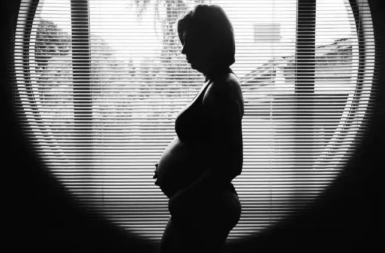

# 3800万大龄未婚女性，未婚生子是选择？

目前中国大龄未婚女性达3800万，大龄单身男性近3900万。代表委员建议，适度放开未婚女性冻卵等辅助生殖技术，未婚女性超过一定年龄，没能生育但有生育愿望的，可考虑先予生育力保存，待生育条件满足后再按程序完成辅助生殖技术。

**文｜《财经》记者 孙颖妮 邹碧颖**

**编辑｜王延春**

今年的全国两会上，完善生育支持政策体系成为热议话题。全国政协委员、民进中央原副主席姚爱兴指出，随着养育成本增加、教育焦虑蔓延、经济环境和劳动就业压力大、女性工作与家庭冲突加剧、子女养老需求降低等，90后、00后一代推迟婚育、不婚不育现象越来越多，“不想生、不敢生、不能生”问题日益突出。

对此，代表委员们从完善生育津贴、加强税收补贴、增设普惠制托儿机构、免除学费、保障单身女性生育权等多个方面，建言献策。

**2022年末全国人口比上年末减少85万人，出现61年来首次负增长。今年1月，国家统计局公布的这项数据再次引起社会各界对生育问题的热议。**

全国政协委员、湖北省首义律师事务所主任谢文敏告诉《财经》记者，为保障单身女性生育权，今年她带来了一份《关于生育登记取消结婚限制的提案》。在谢文敏看来，一方面，当前中国人口形势正面临严峻挑战，释放生育潜能，满足群众多元化的生育需求是人口工作的必要举措。另一方面，随着当代环境变化，女性的婚恋和生育观发生了一些改变。未婚生子也是未来有更多独立女性主动选择的结果，法律主动照顾这部分少数人群，是中国法治温度的体现。

**一体化的生育支持政策体系尚待完善**

生育成本和养育成本无疑是影响年轻人生育意愿的重要因素之一。现金和税收补贴能否减轻育儿负担？

全国政协委员、上海市政协常委、华东师范大学校长助理吴瑞君认为，生育问题要分“不想生”和“想生不敢生”两类来探讨，现阶段生育政策引导重点应放在解决“想生不敢生”的中低收入家庭，为其减负赋能，提振生育水平。

对此，吴瑞君建议，按照递进式差异化的补贴思路，实施生育二孩、三孩津补贴，同时，提高个人所得税教育专项扣税比例和返还强度。允许丈夫参保的全职太太或灵活就业女性享受部分生育津贴。在配置公租房、经济适用房等保障性住房时，适当向有困难的多孩家庭倾斜，给予有住房改善需求的2-3孩家庭一定的贷款利率优惠。

谢文敏在提案中提出三点建议：一是生育登记取消结婚限制；二是切实完善非婚生子女的落户、托幼、上学、就业等相关权益保护，逐步向未婚女性生育开放生育保障公共服务体系；三是基层组织社区、街道、学校应该积极地介入非婚生子女家庭，给予帮扶保护，做好引导教育，不让非婚生子女感受到歧视与伤害。

全国政协委员、民进中央原副主席姚爱兴也带来了一份《关于进一步优化生育支持政策体系建设的提案》。姚爱兴建议，从国家层面制定完善生育津贴发放政策规定，对生育一孩、二孩、三孩的家庭分别给予一次性生育奖励，并对0个-36个月龄的婴幼儿家庭每月按照当地最低工资标准给予定额的育儿补贴。

全国政协委员、中国人口与发展研究中心主任贺丹建议，应促进生育支持政策配套衔接，家庭育儿阶段可给予税收减免，在家庭购房、购车方面，给予优先优惠。此外，发挥社会保险的协同作用，经济压力较大家庭可以提前支取住房公积金和养老金的个人账户部分。多方降低家庭生育养育的经济成本、时间成本、机会成本。

**在分担生育成本方面，也有很多代表委员从税收补贴方面提出建议。**

全国人大代表、万事利集团董事长屠红燕建议，出台政府财政税收政策，解决生育成本分担问题。落实企业税收减免政策。在计算企业所得税应纳税所得额时，按照企业在产期女性职工休假期间支付的工资、生育津贴、岗位空缺填补支出等相关费用给予一定扣除。

农工党中央今年递交了《关于构建生育支持税费政策体系
促进我国人口长期均衡发展的提案》，提案建议，一是尽快出台将3岁以下婴幼儿照护费用纳入个人所得税专项附加扣除，进一步降低家庭抚养孩子的养育成本。二是试行“负所得税”制度。在部分省市进行试点，对达不到专项附加扣除中的学前教育、学历教育扣除标准的低收入家庭，计算其“负所得税”金额，由政府予以一定的补助，以提高家庭的可支配收入，以缓解抚养压力，提升生育意愿。三是对现有子女教育专项附加扣除标准上按照150%加计扣除，进一步减轻家庭育养子女的负担，鼓励适龄育养家庭多生多育。

在养育孩子的成本中，教育是一项大开支。根据育娲人口专家团队发布的《中国生育成本报告2022版》，全国家庭0岁-17岁孩子的养育成本平均为48.5万元；0岁至大学本科毕业的养育成本平均为62.7万元。其中，上海生育成本全国第一，一个孩子养到18岁前需要102.6万元。另据2021年《中国经济生活大调查》数据，中国家庭的教育支出甚至超过了住房支出，成为家庭中较大的开销。

为了减轻教育压力，此次两会中，全国人大代表、编剧赵冬苓提出，建议对2024年以后出生的孩子免除学费、课本费，直至大学毕业。

全国政协委员、四川大学华西医院老年医学中心主任医师甘华田则建议，为生育二孩、三孩的家庭发放教育专项补贴，为第三孩提供从幼儿园到高中毕业阶段的免费教育。

事实上，近年来，从中央到地方推出了系列生育支持政策及配套措施。但从国家统计局公布的人口数据来看，家庭生育意愿依然不高。

在吴瑞君看来，目前各地生育支持政策和措施正在逐步落实和展开，但从效果来看，相关政策在制定和实施过程中存在顶层设计整体性和体系性不足、家庭和性别视角缺失等问题，婚嫁、生育、养育、教育一体化的政策体系尚未有效形成。

姚爱兴表示，要优化和支持生育，不仅要关注生育政策本身，还要做好经济社会相关政策的配套衔接，并坚持以人为本的政策导向。比如加强生育政策与育幼、教育、就业、医疗卫生、养老、户籍管理、住房、土地等制度政策的协调联动，增加农村家庭和农村人口抵御风险能力。

**营造对女性友好的生育环境**

年轻人不愿生不仅仅是成本的问题，营造对青年尤其对女性友好的生育环境也至关重要。

在贺丹看来，随着中国生育政策的不断调整，特别是放开生育政策以后，对性别歧视的担忧一直存在。尽管中国妇女的发展取得了很大成就，但一些长期的社会习俗、女性在职业发展中必然面临的婚育问题，都让性别歧视难以解决。

虽然男女平等观念早已深入人心，但职场中的性别歧视并未消失，由于生育和抚育孩子需要消耗大量的时间和精力，一些女性因为担心职场“性别歧视”而不敢生育。

从性别平等和生育水平的关系来看，贺丹梳理国际经验后发现，性别平等做得越好，性别平等进步到更成熟的阶段，生育水平反而会提升。贺丹在接受媒体采访时表示，对于消除职场性别歧视，不能光喊口号，基础制度的构建尤为重要，比如扩大生育保险覆盖面，加强对生育群体的保障。

全国政协委员、中华全国总工会副主席马璐表示，2012年出台的《女职工劳动保护特别规定》与当前社会关切和女职工实际需求存在不适应的地方。例如，近年来，女职工劳动保护执行不到位、工作场所性别歧视、女职工禁忌从事劳动范围有待调整等问题有所凸显，女职工对加强生育保护、享有平等就业和职业发展机会等方面的诉求强烈。因此，《特别规定》应对女职工劳动保护制度机制作出全面系统的规定。

今年，马璐带了“关于修订《女职工劳动保护特别规定》的提案”。马璐建议，提升立法层级和效力，全面准确界定女职工劳动保护的概念、范围，并适应灵活就业女性劳动者规模不断扩大的现实，扩大适用范围。同时，依据新修订的妇女权益保障法，回应社会关切问题，适度完善保护内容和程度。如，明确细化产假前工资标准、孕期哺乳期调岗、产后返岗、用人单位预防和制止性骚扰等相关规定。

赵冬苓则从减轻用人单位负担角度提出建议。赵冬苓认为，按照目前的法律法规，用人单位需要承担大部分产育假的用人成本，客观上造成了企业不愿意吸纳孕期、产期、哺乳期的女性，也造成了育龄女性的就业困难，影响女性生育意愿。她建议，将国家政策规定的、由企业负担的经济成本，纳入企业减免税收或退税的核算范围。推行全民普惠性的生育保险制度，改变主要依赖企业缴费的机制和路径，减轻用人单位负担。

**此外，也有不少女性代表委员从关爱女性心理健康等角度为女性发声。**

全国政协委员、中国工程院院士、北京大学第三医院院长乔杰表示，在减轻女性的经济和家庭负担、鼓励女性生育的同时，希望家庭及社会重视并理解女性不同时期的心理变化，宣扬生育关怀，从个人、家庭、社会对女性进行全方位呵护，构建生育友好型社会。她同时呼吁，在生育问题上，要尊重每位女性、每个家庭的自主选择。

全国政协委员、编剧蒋胜男则从劳动者权益保障的角度出发，指出近年来的超时工作问题，已造成年轻人没时间恋爱、没时间育儿、没有家庭时间，从而使得整个社会结婚率、生育率降低等情况出现，提升生育率的其他办法都只能是治标不治本。

对此，蒋胜男建议，加强劳动法对劳动者的休息权保护，对企事业单位八小时工作制执行情况加强监管。

蒋胜男这一建议也冲上了互联网热搜。《财经》记者在该话题下看到不同网友的评论称：“这倒是，连谈恋爱的时间都没有，哪有时间去生育养育孩子”，“加班造成很多人一人做两个人的事，没时间生孩子。”

**保障单身女性生育权是文明进步体现**

前不久，四川省发布《四川省生育登记服务管理办法》（下称《办法》），称将取消

登记对象是否结婚的限制条件，将“夫妻应当在生育前进行生育登记”更改为“凡生育子女的公民，均应办理生育登记”。这一举措也迅速成为了网络热点，引起网民对未婚女性生育权保障的讨论。

《财经》 记者梳理发现，今年两会上，多个代表委员也就保障单身女性生育权提出了建议。

谢文敏告诉《财经》记者，她提交的上述《关于生育登记取消结婚限制的提案》建议生育登记取消结婚限制，切实完善非婚生子女的落户、托幼、上学、就业等相关权益保护。

谢文敏认为，这并不意味着鼓励未婚生育，而是回归到生育事实本身，让未婚生育女性和非婚生子女的相关权益得到更有力的保障，使其更好地享受相应的公共服务。

民政部2020年公布的统计数据显示，在2019年时中国的单身成年人口数量已达2.6亿人，超过英法德三国人口总数，其中8000万人处于独居状态。

民政部2022年公布的数据显示，2021年全年结婚登记人数是764.3万对，对比上年下降了6.1%，办理离婚手续是283.9万对，比上年下降34.6%。这是从1986年以来，有数据记载中国结婚人数首次低于800万对大关。

另据2020年国家统计局数据，中国目前大龄未婚女性人数达3800万人，大龄单身男性接近3900万人。

在谢文敏看来，随着当代环境变化，女性的婚恋和生育观也随之产生了改变。“在经济、身体等条件许可的情况下，确实有女性希望不受婚姻的捆绑，通过生殖辅助技术来实现成为母亲的心愿。法律主动照顾这部分少数人群，是我国法治温度的体现。”

谢文敏认为，将生育与婚姻捆绑，这样的限制缺乏必要的正当性。如果单身女性有能力和意愿生育，进而组建单亲家庭，法律并无理由对其予以歧视或禁止。“每个想要生育的女性，都应该享有平等的待遇。”

全国人大代表黄细花建议，要保障单身女性生育权以及非婚生子女的平等权利。随着女性教育和职业发展水平的提高，我国城市里的大龄未婚女性也越来越多，其中不乏有能力和意愿去独立抚养孩子的未婚女性，为此，国家卫健委、妇联应出台政策允许单身女性享有与已婚女性一样的生育权利和福利。

**除了放开生育的结婚限制，也有代表委员为支持未婚女性生育提出具体的建议。**

全国政协委员、复旦大学附属妇产科医院院长徐丛剑带来了一份《关于特定条件下应支持未婚女性冻卵的提案》，建议适度放开未婚女性进行冻卵等辅助生殖技术，未婚女性在某些特定条件下，超过一定年龄没能生育，但有强烈生育愿望的，可以考虑先予生育力保存，待生育的其他条件满足后，再按程序完成辅助生殖技术。

当前，中国《人类辅助生殖技术规范》规定，禁止给不符合国家人口和计划生育法规和条例的夫妇和单身妇女实施人类辅助生殖技术。

徐丛剑认为，关于辅助生殖技术的规定需要与时俱进地修订，“过去我们倾向于控制人口增长，现在倾向于鼓励生育，这种情况下，关于生育技术的规定可能要适当修改。”

对此，全国政协委员、南方科技大学副校长兼商学院代理院长金李也认为，对于单身大龄女性或暂时找不到适合结婚对象而主观愿意生育力保存的女性，应放开生育保存机会。

中国政法大学医药法律与伦理研究中心主任刘鑫在接受红星新闻采访时也表示，当前中国很多女性面临着职场压力及寻找合适配偶较为困难的情况，但是她们未来可能不会拒绝结婚生子，“所以如果是因为社会因素想要冻卵，只要我们有资源，女性又同意，那我觉得就可以做。”

2021年中国富裕家庭数量增加10万户，其中增加最多的是上海、北京、广东和浙江，占全国增加总数的六成。富裕家庭最集中的前30名城市，占全国富裕家庭总数的68%

今年的全国两会上，完善生育支持政策体系成为热议话题。全国政协委员、民进中央原副主席姚爱兴指出，随着养育成本增加、教育焦虑蔓延、经济环境和劳动就业压力大、女性工作与家庭冲突加剧、子女养老需求降低等，90后、00后一代推迟婚育、不婚不育现象越来越多，“不想生、不敢生、不能生”问题日益突出。

对此，代表委员们从完善生育津贴、加强税收补贴、增设普惠制托儿机构、免除学费、保障单身女性生育权等多个方面，建言献策。

2022年末全国人口比上年末减少85万人，出现61年来首次负增长。今年1月，国家统计局公布的这项数据再次引起社会各界对生育问题的热议。

全国政协委员、湖北省首义律师事务所主任谢文敏告诉《财经》记者，为保障单身女性生育权，今年她带来了一份《关于生育登记取消结婚限制的提案》。

在谢文敏看来，一方面，当前中国人口形势正面临严峻挑战，释放生育潜能，满足群众多元化的生育需求是人口工作的必要举措。另一方面，随着当代环境变化，女性的婚恋和生育观发生了一些改变。未婚生子也是未来有更多独立女性主动选择的结果，法律主动照顾这部分少数人群，是中国法治温度的体现。

谢文敏在提案中提出三点建议：一是生育登记取消结婚限制；二是切实完善非婚生子女的落户、托幼、上学、就业等相关权益保护，逐步向未婚女性生育开放生育保障公共服务体系；三是基层组织社区、街道、学校应该积极地介入非婚生子女家庭，给予帮扶保护，做好引导教育，不让非婚生子女感受到歧视与伤害。

**一体化的生育支持政策体系尚待完善**

生育成本和养育成本无疑是影响年轻人生育意愿的重要因素之一。现金和税收补贴能否减轻育儿负担？

全国政协委员、上海市政协常委、华东师范大学校长助理吴瑞君认为，生育问题要分“不想生”和“想生不敢生”两类来探讨，现阶段生育政策引导重点应放在解决“想生不敢生”的中低收入家庭，为其减负赋能，提振生育水平。

对此，吴瑞君建议，按照递进式差异化的补贴思路，实施生育二孩、三孩津补贴，同时，提高个人所得税教育专项扣税比例和返还强度。允许丈夫参保的全职太太或灵活就业女性享受部分生育津贴。在配置公租房、经济适用房等保障性住房时，适当向有困难的多孩家庭倾斜，给予有住房改善需求的2-3孩家庭一定的贷款利率优惠。

全国政协委员、民进中央原副主席姚爱兴也带来了一份《关于进一步优化生育支持政策体系建设的提案》。姚爱兴建议，从国家层面制定完善生育津贴发放政策规定，对生育一孩、二孩、三孩的家庭分别给予一次性生育奖励，并对0个-36个月龄的婴幼儿家庭每月按照当地最低工资标准给予定额的育儿补贴。

全国政协委员、中国人口与发展研究中心主任贺丹建议，应促进生育支持政策配套衔接，家庭育儿阶段可给予税收减免，在家庭购房、购车方面，给予优先优惠。此外，发挥社会保险的协同作用，经济压力较大家庭可以提前支取住房公积金和养老金的个人账户部分。多方降低家庭生育养育的经济成本、时间成本、机会成本。

**在分担生育成本方面，也有很多代表委员从税收补贴方面提出建议。**

全国人大代表、万事利集团董事长屠红燕建议，出台政府财政税收政策，解决生育成本分担问题。落实企业税收减免政策。在计算企业所得税应纳税所得额时，按照企业在产期女性职工休假期间支付的工资、生育津贴、岗位空缺填补支出等相关费用给予一定扣除。

农工党中央今年递交了《关于构建生育支持税费政策体系
促进我国人口长期均衡发展的提案》，提案建议，一是尽快出台将3岁以下婴幼儿照护费用纳入个人所得税专项附加扣除，进一步降低家庭抚养孩子的养育成本。二是试行“负所得税”制度。在部分省市进行试点，对达不到专项附加扣除中的学前教育、学历教育扣除标准的低收入家庭，计算其“负所得税”金额，由政府予以一定的补助，以提高家庭的可支配收入，以缓解抚养压力，提升生育意愿。三是对现有子女教育专项附加扣除标准上按照150%加计扣除，进一步减轻家庭育养子女的负担，鼓励适龄育养家庭多生多育。

在养育孩子的成本中，教育是一项大开支。根据育娲人口专家团队发布的《中国生育成本报告2022版》，全国家庭0岁-17岁孩子的养育成本平均为48.5万元；0岁至大学本科毕业的养育成本平均为62.7万元。其中，上海生育成本全国第一，一个孩子养到18岁前需要102.6万元。另据2021年《中国经济生活大调查》数据，中国家庭的教育支出甚至超过了住房支出，成为家庭中较大的开销。

为了减轻教育压力，此次两会中，全国人大代表、编剧赵冬苓提出，建议对2024年以后出生的孩子免除学费、课本费，直至大学毕业。

全国政协委员、四川大学华西医院老年医学中心主任医师甘华田则建议，为生育二孩、三孩的家庭发放教育专项补贴，为第三孩提供从幼儿园到高中毕业阶段的免费教育。

事实上，近年来，从中央到地方推出了系列生育支持政策及配套措施。但从国家统计局公布的人口数据来看，家庭生育意愿依然不高。

在吴瑞君看来，目前各地生育支持政策和措施正在逐步落实和展开，但从效果来看，相关政策在制定和实施过程中存在顶层设计整体性和体系性不足、家庭和性别视角缺失等问题，婚嫁、生育、养育、教育一体化的政策体系尚未有效形成。

姚爱兴表示，要优化和支持生育，不仅要关注生育政策本身，还要做好经济社会相关政策的配套衔接，并坚持以人为本的政策导向。比如加强生育政策与育幼、教育、就业、医疗卫生、养老、户籍管理、住房、土地等制度政策的协调联动，增加农村家庭和农村人口抵御风险能力。

**营造对女性友好的生育环境**

**年轻人不愿生不仅仅是成本的问题，营造对青年尤其对女性友好的生育环境也至关重要。**

在贺丹看来，随着中国生育政策的不断调整，特别是放开生育政策以后，对性别歧视的担忧一直存在。尽管中国妇女的发展取得了很大成就，但一些长期的社会习俗、女性在职业发展中必然面临的婚育问题，都让性别歧视难以解决。

虽然男女平等观念早已深入人心，但职场中的性别歧视并未消失，由于生育和抚育孩子需要消耗大量的时间和精力，一些女性因为担心职场“性别歧视”而不敢生育。

从性别平等和生育水平的关系来看，贺丹梳理国际经验后发现，性别平等做得越好，性别平等进步到更成熟的阶段，生育水平反而会提升。贺丹在接受媒体采访时表示，对于消除职场性别歧视，不能光喊口号，基础制度的构建尤为重要，比如扩大生育保险覆盖面，加强对生育群体的保障。

全国政协委员、中华全国总工会副主席马璐表示，2012年出台的《女职工劳动保护特别规定》与当前社会关切和女职工实际需求存在不适应的地方。例如，近年来，女职工劳动保护执行不到位、工作场所性别歧视、女职工禁忌从事劳动范围有待调整等问题有所凸显，女职工对加强生育保护、享有平等就业和职业发展机会等方面的诉求强烈。因此，《特别规定》应对女职工劳动保护制度机制作出全面系统的规定。

今年，马璐带了“关于修订《女职工劳动保护特别规定》的提案”。马璐建议，提升立法层级和效力，全面准确界定女职工劳动保护的概念、范围，并适应灵活就业女性劳动者规模不断扩大的现实，扩大适用范围。同时，依据新修订的妇女权益保障法，回应社会关切问题，适度完善保护内容和程度。如，明确细化产假前工资标准、孕期哺乳期调岗、产后返岗、用人单位预防和制止性骚扰等相关规定。

赵冬苓则从减轻用人单位负担角度提出建议。赵冬苓认为，按照目前的法律法规，用人单位需要承担大部分产育假的用人成本，客观上造成了企业不愿意吸纳孕期、产期、哺乳期的女性，也造成了育龄女性的就业困难，影响女性生育意愿。她建议，将国家政策规定的、由企业负担的经济成本，纳入企业减免税收或退税的核算范围。推行全民普惠性的生育保险制度，改变主要依赖企业缴费的机制和路径，减轻用人单位负担。

**此外，也有不少女性代表委员从关爱女性心理健康等角度为女性发声。**

全国政协委员、中国工程院院士、北京大学第三医院院长乔杰表示，在减轻女性的经济和家庭负担、鼓励女性生育的同时，希望家庭及社会重视并理解女性不同时期的心理变化，宣扬生育关怀，从个人、家庭、社会对女性进行全方位呵护，构建生育友好型社会。她同时呼吁，在生育问题上，要尊重每位女性、每个家庭的自主选择。

全国政协委员、编剧蒋胜男则从劳动者权益保障的角度出发，指出近年来的超时工作问题，已造成年轻人没时间恋爱、没时间育儿、没有家庭时间，从而使得整个社会结婚率、生育率降低等情况出现，提升生育率的其他办法都只能是治标不治本。

对此，蒋胜男建议，加强劳动法对劳动者的休息权保护，对企事业单位八小时工作制执行情况加强监管。

蒋胜男这一建议也冲上了互联网热搜。《财经》记者在该话题下看到不同网友的评论称：“这倒是，连谈恋爱的时间都没有，哪有时间去生育养育孩子”，“加班造成很多人一人做两个人的事，没时间生孩子。”

**保障单身女性生育权是文明进步体现**

前不久，四川省发布《四川省生育登记服务管理办法》（下称《办法》），称将取消登记对象是否结婚的限制条件，将“夫妻应当在生育前进行生育登记”更改为“凡生育子女的公民，均应办理生育登记”。这一举措也迅速成为了网络热点，引起网民对未婚女性生育权保障的讨论。

《财经》 记者梳理发现，今年两会上，多个代表委员也就保障单身女性生育权提出了建议。

谢文敏告诉《财经》记者，她提交的上述《关于生育登记取消结婚限制的提案》建议生育登记取消结婚限制，切实完善非婚生子女的落户、托幼、上学、就业等相关权益保护。

谢文敏认为，这并不意味着鼓励未婚生育，而是回归到生育事实本身，让未婚生育女性和非婚生子女的相关权益得到更有力的保障，使其更好地享受相应的公共服务。

民政部2020年公布的统计数据显示，在2019年时中国的单身成年人口数量已达2.6亿人，超过英法德三国人口总数，其中8000万人处于独居状态。

民政部2022年公布的数据显示，2021年全年结婚登记人数是764.3万对，对比上年下降了6.1%，办理离婚手续是283.9万对，比上年下降34.6%。这是从1986年以来，有数据记载中国结婚人数首次低于800万对大关。

另据2020年国家统计局数据，中国目前大龄未婚女性人数达3800万人，大龄单身男性接近3900万人。

在谢文敏看来，随着当代环境变化，女性的婚恋和生育观也随之产生了改变。“在经济、身体等条件许可的情况下，确实有女性希望不受婚姻的捆绑，通过生殖辅助技术来实现成为母亲的心愿。法律主动照顾这部分少数人群，是我国法治温度的体现。”

谢文敏认为，将生育与婚姻捆绑，这样的限制缺乏必要的正当性。如果单身女性有能力和意愿生育，进而组建单亲家庭，法律并无理由对其予以歧视或禁止。“每个想要生育的女性，都应该享有平等的待遇。”

全国人大代表黄细花建议，要保障单身女性生育权以及非婚生子女的平等权利。随着女性教育和职业发展水平的提高，我国城市里的大龄未婚女性也越来越多，其中不乏有能力和意愿去独立抚养孩子的未婚女性，为此，国家卫健委、妇联应出台政策允许单身女性享有与已婚女性一样的生育权利和福利。

**除了放开生育的结婚限制，也有代表委员为支持未婚女性生育提出具体的建议。**

全国政协委员、复旦大学附属妇产科医院院长徐丛剑带来了一份《关于特定条件下应支持未婚女性冻卵的提案》，建议适度放开未婚女性进行冻卵等辅助生殖技术，未婚女性在某些特定条件下，超过一定年龄没能生育，但有强烈生育愿望的，可以考虑先予生育力保存，待生育的其他条件满足后，再按程序完成辅助生殖技术。

当前，中国《人类辅助生殖技术规范》规定，禁止给不符合国家人口和计划生育法规和条例的夫妇和单身妇女实施人类辅助生殖技术。

徐丛剑认为，关于辅助生殖技术的规定需要与时俱进地修订，“过去我们倾向于控制人口增长，现在倾向于鼓励生育，这种情况下，关于生育技术的规定可能要适当修改。”

对此，全国政协委员、南方科技大学副校长兼商学院代理院长金李也认为，对于单身大龄女性或暂时找不到适合结婚对象而主观愿意生育力保存的女性，应放开生育保存机会。

中国政法大学医药法律与伦理研究中心主任刘鑫在接受红星新闻采访时也表示，当前中国很多女性面临着职场压力及寻找合适配偶较为困难的情况，但是她们未来可能不会拒绝结婚生子，“所以如果是因为社会因素想要冻卵，只要我们有资源，女性又同意，那我觉得就可以做。”

