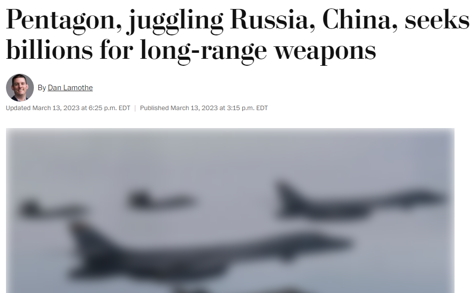
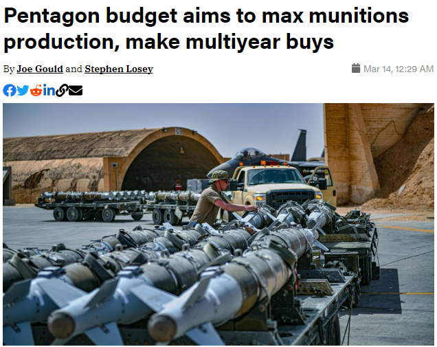

# 军费加速逼近1万亿美元，五角大楼：为了应对中国和俄罗斯的“威胁”

五角大楼周一宣布了有史以来最大的年度国防预算申请：8420亿美元。五角大楼的官员声称，这是为了应对来自中国和俄罗斯的“威胁”。

这份2024财年的国防预算申请比2023财年增长3.2%，比2022财年增长13.4%。美国国防部副部长希克斯周一在新闻发布会上宣布了这一预算请求，给出的理由是俄罗斯和中国构成了“严重威胁”。

“我们衡量预算成功的最大标准，也是我们在这里使用的标准。就是确保（中华人民共和国）领导层每天醒来，评估侵略的风险，并得出结论，今天不是时候。让他们从今天、现在到2027年、到2035年、到2049年以及以后的每一天都这样想。”

_《华盛顿邮报》：五角大楼在俄罗斯和中国之间周旋，寻求数十亿美元的远程武器_

大约一周前，中国公布的2023年国防预算约为2300亿美元，如果按军费总量，差不多是美国的1/4，按占GDP的比重，我们的军费不到GDP的1.3%，而美国的军费占到GDP的3%左右，如果按人口平均，那中国的军费水平就更低了。无论从什么角度比，中国都不会对美国形成军事“威胁”，反过来才是。

所以，确实非常不理解，这个全世界军费最高国家的副防长，她的受害妄想症是从何而来？

还是看看五角大楼要这么多钱准备干什么吧，还真是好多项都针对中国。

美联社是这样说的，五角大楼打算在这项几十年来最大的国防预算中增加先进导弹、太空防御系统和现代战机，“以应对它认为的来自中国的威胁”。

美国国防部长奥斯汀周一在一份声明中表示，新预算案中的许多项目旨在“维持我们对中国的军事优势”，他称中国为五角大楼的“节奏性挑战”。他说，拜登政府最近几个月宣布了扩大或更新美国在关岛、马里亚纳群岛、菲律宾、日本和澳大利亚等地军事存在的计划，新的国防预算将支持所有这些计划，预计其中一些任务的重点是部署远程武器。

美国参谋长联席会议高级军官乔伊纳中将称，中俄能从远处威胁美国常规武器和高超音速武器“凸显了额外投资的必要性”。

这份预算要求国会拨款300亿美元生产更多导弹。但五角大楼澄清说，这些导弹“不是乌克兰战争的关键”，而是“印太地区威慑的关键”，包括先进的空空导弹、反舰导弹和远程对峙导弹。

五角大楼还寻求对其空中、太空和核武器进行快速现代化。预算要求包括近380亿美元用于购买新的核潜艇、部署新的B-21隐形轰炸机和制造新的陆基洲际弹道导弹。

新预算还将为代表“下一代空中优势”的新型战机的研究和测试提供资金，将配备一种有人驾驶的现代战斗机，如F-35，指挥无人驾驶飞机陪同执行任务。美国空军对这种被他们称为“协同作战飞机”的无人机没有透露太多，只是说他们计划部署1000架这样的无人机。

五角大楼还寻求330亿美元的资金，使其卫星通信更能抵御干扰或攻击，并将迅速部署新的导弹预警系统，以协助探测、跟踪和防御中国和俄罗斯的新一代高超音速导弹。

尽管这份预算申请在中国“流浪气球”之前已基本成型，但预算案到末了还是追加了应对中国的“流浪气球”的项目——五角大楼为此寻求约9000万美元的资金，以增强美军探测大气层中类似物体的能力。

令人稍感意外的是，这份预算提案几乎没有为乌克兰提供资金。据称，五角大楼将在另一份请求中另外要求国会对乌克兰进行更多军事支持。

五角大楼的审计长麦考德周一在新闻发布会上说，考虑到通货膨胀，很可能在未来5年内，美国的国防预算“会达到1万亿美元”，“这将是一个心理上的重大分水岭。”
这位审计长还说，虽然这个数字听起来像天文数字，但它“只占美国GDP值的3%左右”，他说，作为对比，在第二次世界大战期间，美国的国防开支曾占到其GDP的1/3。

看看，这都把自己跟二战比了。

_14日美国《防务新闻》报道：五角大楼预算的目标是最大限度地生产军火，满足多年的采购需要。_

当中国政府用和平的智慧让伊朗和沙特放下武器、握手言和之际，美国却仍陷在冷战思维的怪圈中沿着穷兵黩武、挑动军备竞赛的目标一路狂飙。

请问拜登政府，谁才是这个星球上最大的威胁？

