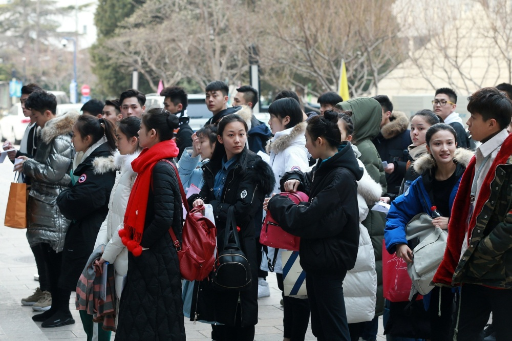
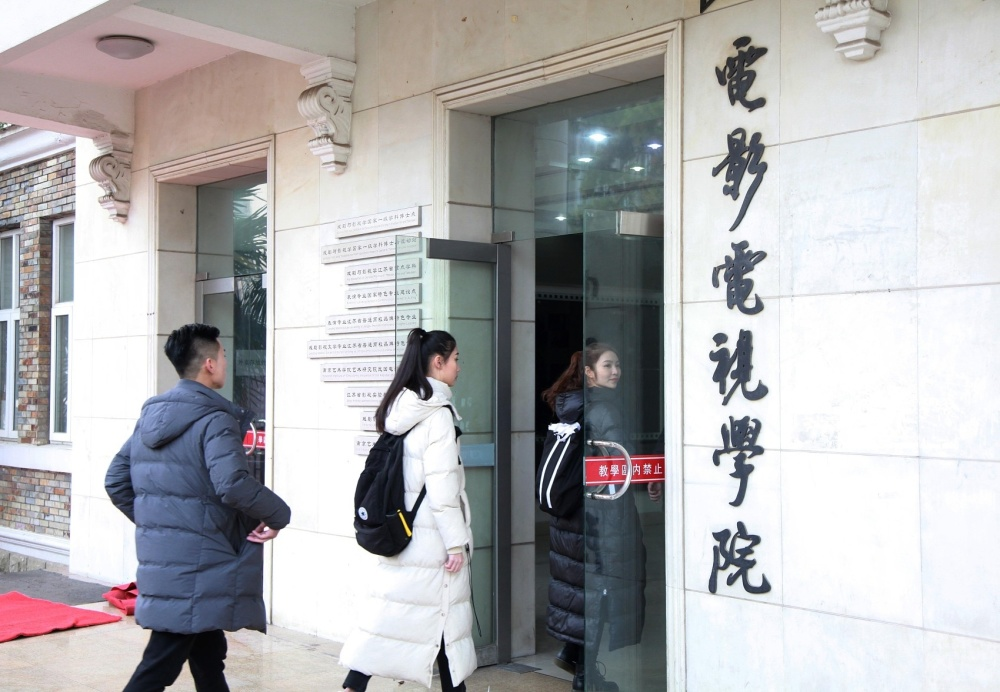

# 北京提高艺考生文化课分数线，不少省份已有同样动作

3月14日，北京教育考试院发布《关于进一步加强和改进普通高等学校艺术类专业考试招生工作的通知》。

通知强调，要逐步提高文化成绩要求，根据不同艺术专业人才选拔培养要求，分类划定、逐步提高艺术类各专业高考文化课成绩录取最低控制分数线，逐步扭转部分高校艺术专业人才选拔“重专业轻文化”倾向。

_艺考现场图源：视觉中国_

北京市提高艺考生文化课录取分数线的提法，让人想到最近的一个热词“绝望的文盲”。

2023春节档，某位明星路演接受采访时，被问到对作品和角色的感悟，结果一问三不知，被网友戏称为“绝望的文盲”。后来，这个词被用来泛指没有任何希望，并且非常缺乏文化知识的一类人，尤其是明星艺人。

面对“绝望的文盲”，虽然也有些人觉得“术业有专攻”，但大部分网友都认为提高文化门槛是必要举措。

实际上，从高考阶段就要提高艺术人才的文化水平，在政策层面早有明确的步骤。

2021年，教育部印发《关于进一步加强和改进普通高等学校艺术类专业考试招生工作的指导意见》。意见要求，各省（区、市）在现有要求基础上要逐步提高艺术类各专业高考文化课成绩录取最低控制分数线，艺术类专业招生录取时“高考文化课成绩所占比例原则上不低于50%”。

在这一政策指导下，各地都有所行动。

2022年12月，上海市教育委员会发布“新艺考”改革方案，明确校考高校应结合专业培养要求，加强考生文化综合素质考查，进一步提高考生文化课成绩录取要求。

今年以来，山西、新疆、广东、浙江、湖南等多地先后发布艺考改革方案，对文化课成绩的要求进一步提高。

_艺考现场图源：视觉中国_

浙江省教育厅2月份发布《进一步完善和加强普通高等学校艺术类专业考试招生工作实施方案》。按照这一方案，2024年起，艺术类专业考生高考文化课成绩，原则上要达到该省普通类一段线。根据录取生源情况，学校可申请适当降低文化课成绩要求，但不得低于普通类一段线的75%。

3月，辽宁省发布《关于进一步加强和改进普通高等学校艺术类专业考试招生工作实施方案（试行）》，对艺术类平行志愿投档综合分进行了重新划分。其中，文化课成绩按照不同类别分别以50%、60%和70%的比例计入综合分。

广东省教育考试院也提到，2024年适当提高了音乐类、舞蹈类、表(导)演类、美术与设计类、书法类专业合成总分的考生文化课总成绩占比。

在这样的大趋势之下，未来的高考生需要作出更加理智的判断。真正喜爱艺术的孩子，文化与艺术并重，不影响他们的追梦之旅。而那些视艺考为捷径的家长和考生，就需要三思而后行了。

**来源：九派新闻**

**实习记者：钟秋香**

【来源：九派新闻】

版权归原作者所有，向原创致敬

