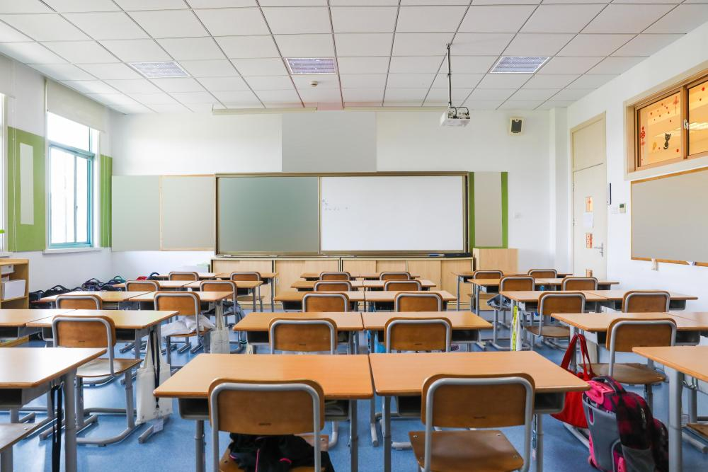

# 十二年义务教育，是时候了？

关于义务教育是否该延长的讨论，越来越激烈。

全国两会期间，全国政协委员、上海交通大学中国发展研究院执行院长陆铭建议，逐步扩大12年教育的普及率，要适时修改相关法律，实施12年义务教育。

全国人大代表、中国社会科学院学部委员陈众议认为，目前的九年制义务教育，已经不适应我国可持续发展的需要。实行十二年义务教育不仅可以缓解小学和初中教学内卷问题，还可消释“普职分流”政策带来的冲击。

据了解，我国推广九年义务教育，还是在1986年，距今已经27年。而近三十年，我国经济社会发展发生了翻天覆地的变化。

那么，实行十二年义务教育，是时候了吗？

延长义务教育背后

“目前的九年制义务教育自1986年起已有近四十年历史，而我国的GDP从当时的1万亿元增加到了2022年的120万亿元，不仅完全有条件将义务教育延长至十二年，而且时不我待，因为这事关提高全民素质”。陈众议在接受媒体采访时表示。

延长义务教育年限背后，是延长国民受教育年限，提高国民素质，进而推动经济社会发展的期待。

“当今世界，比较有持久发展能力的国家，能在经历灾难后重整旗鼓的国家，都是国民受教育时间比较长、国民素质比较高的国家。”华东师范大学教育学部主任袁振国告诉中国新闻周刊。

美国国家经济研究署对146个国家1950～2010年的相关数据分析发现，人均受教育年限每增加1年，由此转化而来的经济总量至少增加2%。世界银行相关研究也表明，劳动力人均受教育时间每增加1年，国内生产总值就会增加9%。

中国社科院副院长蔡昉及其团队的研究同样显示，对制造业企业的计量模型分析表明，如果企业职工全部由初中以下学历改变为高中学历，企业的劳动生产率将提高24%；如果全部改变为大专学历，企业的劳动生产率可以再提高75%；由大专到本科，劳动生产率可以再提高66%
。

国际上一般把15～64岁列为劳动年龄人口，我国的规定则是16～60岁的男子和16～55岁的女子，为劳动年龄人口。今年的政府工作报告中也明确指出，“十四五”时期，要把劳动年龄人口平均受教育年限提高到11.3年。

“改革开放之初，我国劳动力的平均受教育年限只有3.5年，改革开放40多年来我国举全国之力努力办好义务教育，教育水平迅速上升，目前我国人均受教育年限提高到了10.9年。”袁振国说。

但在他看来，延长国民的受教育年限并不容易。袁振国表示，通常一个国家国民受教育年限每提高一年，需要8～10年时间，不是靠一届政府、一时教育投入的增加就可以做到的，需要靠基础教育的长期积累。

在专家看来，将义务教育延长至12年，当前还存在“普职分流”的问题。

21世纪教育研究院院长熊丙奇对中国新闻周刊表示，“在高中阶段实行‘普职分流’的办学模式下，是不可能把高中教育纳入义务教育的，因为需要通过中考确定是进普高还是中职，普高、中职之间也存在办学质量和特色的明显差异。”

在他看来，由于义务教育具有均衡、强制、免费、义务等基本特点，我国要把高中教育纳入义务教育，首先要解决普职分流的问题，即要把所有高中建设为综合高中，并实现综合高中的均衡发展。

此外，也有业内专家担忧，如果将高中纳入义务教育，是否会造成职业技术类院校的凋敝。

_山西，晋城，一所高中毕业班教室，同学们正在备战高考。图/图虫创意_

压缩学制是出路？

除了“普职分流”这一难点，也有学者提出，因为义务教育具有强制性，牵涉到个人权利选择的问题，义务教育延长至12年，年限可能会太长。

相关资料显示，目前世界义务教育平均年限为9.24年，其中，中高收入国家为9.5年。日本、新加坡、芬兰、丹麦、瑞典、爱尔兰、匈牙利等国家目前普遍实行十年制义务教育。

因此，不少人建议压缩学制、取消中考和“普职分流”，然后将高中纳入义务教育。

今年两会期间，全国人大代表徐晓提出，适当缩短义务教育学制，实施“5+3+2”十年制义务教育模式，把小学六年制改为五年制，保留初中三年制，普通高中三年制改为二年制。

全国政协委员阮诗玮也建议，将“633”学制改为“523”，也就是小学五年，初中两年，高中三年，并且将义务教育改成十年制，取消中考分流，大多数初中生毕业后可以直接进入普高。

但在教育界专家看来，压缩学制并非好的选择。

中国教育研究院研究员储朝晖表示，现行的“633”学制，与儿童发展阶段性非常契合，这一学制是国际上通行的，也是经过众多教育专家、儿童心理学家验证的。

“有人说将学制缩短到10年，早点毕业，更能适应现在经济社会发展的需要。但我不认同这样的观点，学制设计的主要依据一定是儿童认知和心理发展的状况。”储朝晖说。

熊丙奇则认为，缩短学制的建议，是基于当前基础教育存在应试倾向，很多高中在高二时就上完高三的课，初中在初二上完初三的课，照此逻辑，很容易得出“5+3+2”或者“5+2+3”这种总共10年的学制。

“高二上完高三的课、初二上完初三的课，本来就不合理，属于违规办学，且不论赶进度进行提前教学，还存在只重视知识教育，边缘化其他教育的倾向。”熊丙奇说，把国际通行的12年基础教育学制，压缩为10年，会严重影响我国基础教育质量，而且受应试倾向影响，会出现更严重的超前教育。

袁振国则认为，义务教育应该向学前一年延长。他说，“义务教育向学前延伸一年，收益较大，投入较少。学前一年义务教育的普及可利用现有幼儿园的办学资源，或者采取在小学开设学前班，这样可以有效利用幼儿园和小学学校的闲置资源，节省办学成本、提高办学效率。”

先从免费开始

事实上，提升公民的受教育年限，不止延长义务教育年限一种手段，相比具有强制性的义务教育，不少业内人士建议先从免费开始。

义务教育又称强迫教育和免费义务教育，具有强制性、公益性、普及性等特点。袁振国说，义务教育既有免费还有强制的含义。高中阶段实施义务教育除了成本高、资源投入大外，还存在高中阶段实施强迫教育的法律问题。

他说，初中毕业后是否可以不急于接受高中教育，上了高中可不可以退学，应该是可以有多种选择的，如果确定为义务教育，就必须完成，就成为政府和家庭的法律责任。因此，现在很多发达国家只讲九年义务教育，尽管高中是免费的，但并不是强迫的。

储朝晖则表示，世界上有很多国家曾经延长过义务教育的时间，但是后来又都缩短了。他说，“不是因为这些国家没钱了，而是因为延长义务教育的时间，与儿童的天性不相适合。”

“新加坡2000年才实施义务教育，且只有6年，但并不妨碍新加坡教育水平世界一流，国民教育程度超过大多数九年制义务教育的国家。”储朝晖补充说，提高国民教育程度，不能只依靠法律来解决问题。

熊丙奇认为，现阶段不把高中教育纳入义务教育，不等于不可以实行免费教育。

据了解，陕西省从2016年秋季起全面实施13年免费教育，包括学前1年、小学初中9年和高中3年。2012年，内蒙古对高中阶段的所有学生全面实施“两免”政策（免学费和免费提供教科书），实现小学、初中和高中阶段12年免费教育。西藏则从2012年秋季学期开始，全面实现15年免费教育，即学前3年、小学6年、初中3年和高中3年全免费。

“对于高中教育，有条件的地区可以免费，但不一定要延长义务教育年限。”熊丙奇说。

作者：赵越

