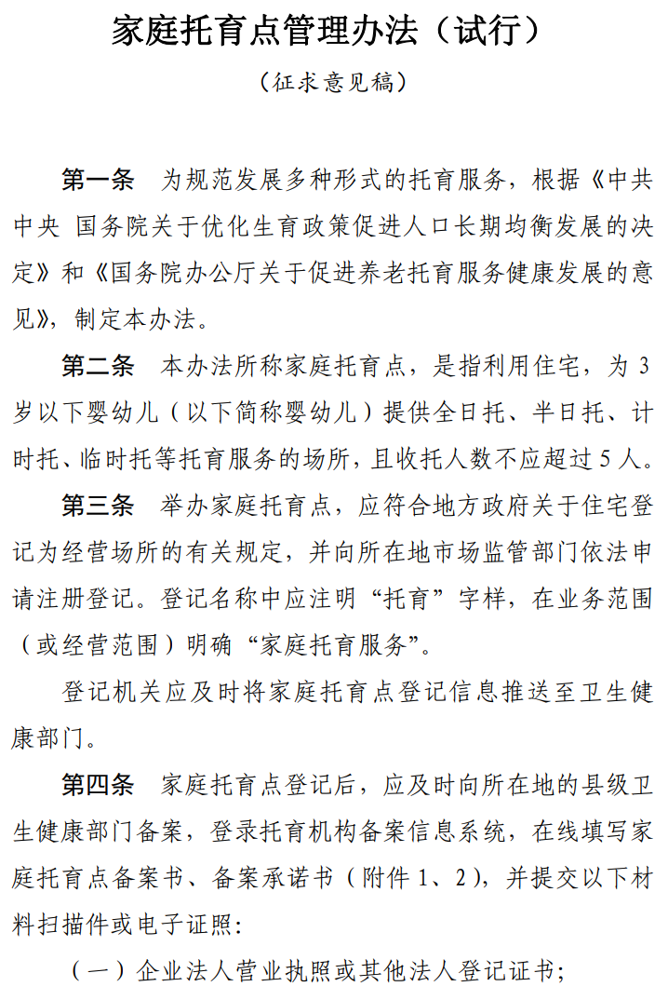
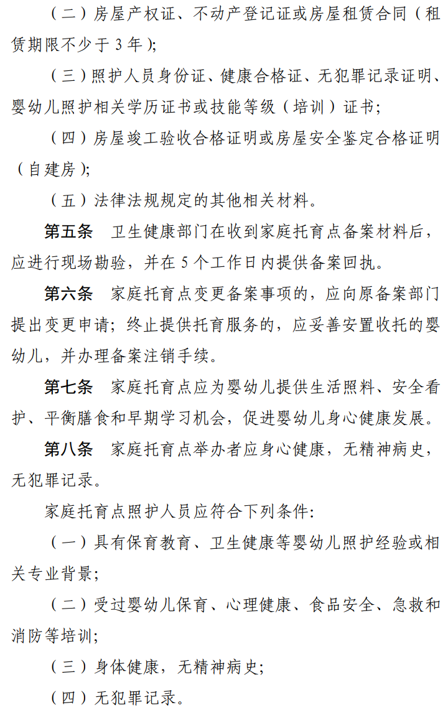
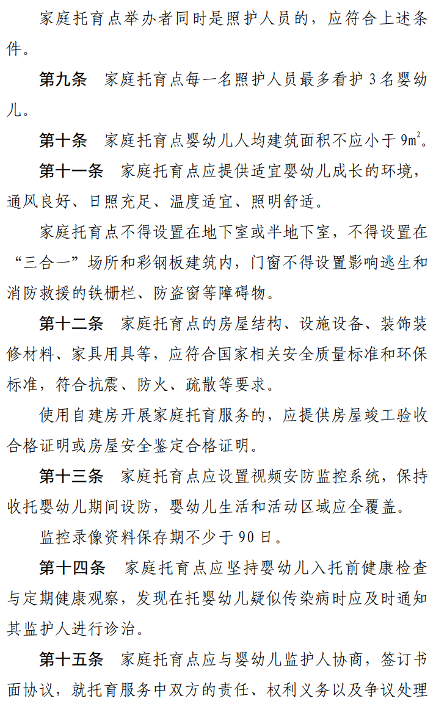
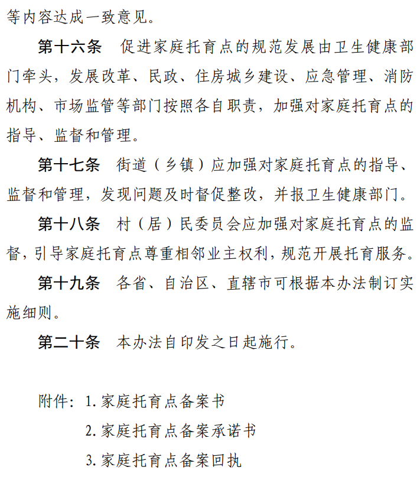
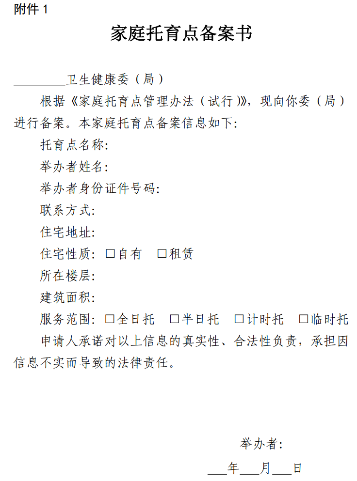
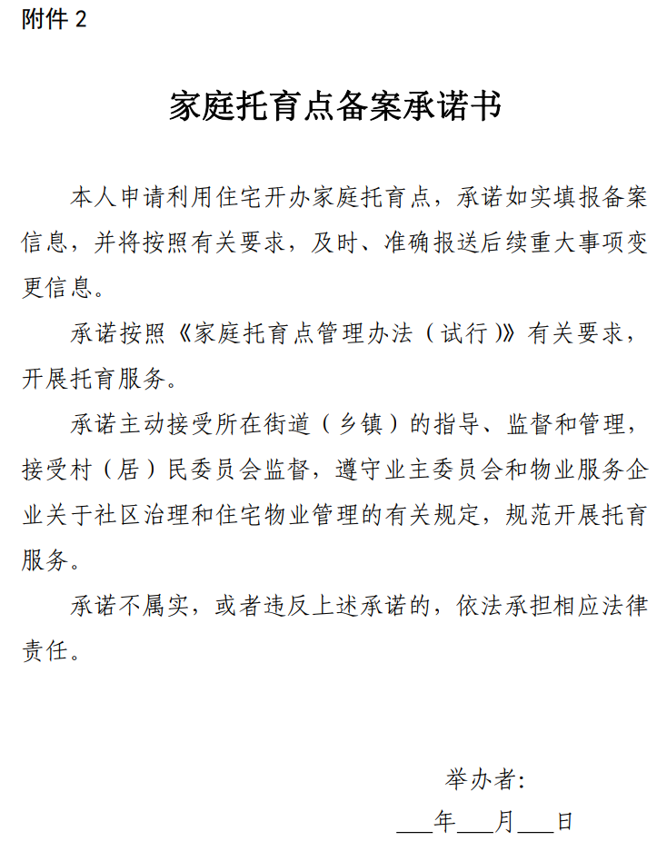
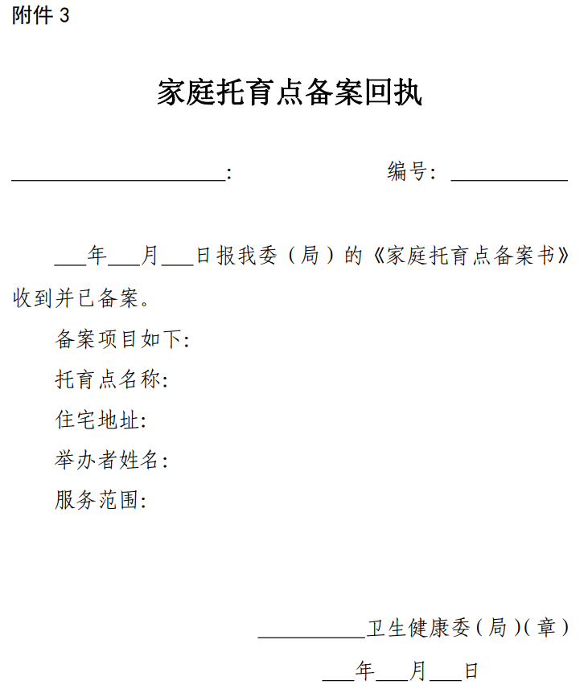

# 国家卫健委拟规范家庭托育点：面向3岁以下婴幼儿，收托不超5人

3月15日，据国家卫健委网站消息，国家卫生健康委人口家庭司近日就《家庭托育点管理办法（试行）（征求意见稿）》公开征求意见。

“征求意见稿”中提到：

家庭托育点是指利用住宅，为3岁以下婴幼儿提供全日托、半日托、计时托、临时托等托育服务的场所，且收托人数不应超过5人。

举办家庭托育点，应符合地方政府关于住宅登记为经营场所的有关规定，并向所在地市场监管部门依法申请注册登记。

家庭托育点应为婴幼儿提供生活照料、安全看护、平衡膳食和早期学习机会，促进婴幼儿身心健康发展。

家庭托育点每一名照护人员最多看护3名婴幼儿。

家庭托育点婴幼儿人均建筑面积不应小于9㎡。

家庭托育点应设置视频安防监控系统，监控录像资料保存期不少于90日。

**国家卫生健康委人口家庭司关于《家庭托育点管理办法（试行）（征求意见稿）》公开征求意见的通知**

根据《中共中央国务院关于优化生育政策促进人口长期均衡发展的决定》和《国务院办公厅关于促进养老托育服务健康发展的意见》（国办发〔2020〕52号），我司组织起草了《家庭托育点管理办法（试行）（征求意见稿）》（见附件）。现向社会公开征求意见。有关单位和公众可通过以下方式反馈意见：

一、电子邮箱：rkjtsjtc@nhc.gov.cn。

二、传真：（010）62030790。

三、通讯地址：北京市西城区北礼士路甲38号国家卫生健康委人口家庭司，邮编100032。

意见反馈截止时间为2023年4月14日。

附件：《家庭托育点管理办法（试行）（征求意见稿）》

国家卫生健康委人口家庭司

2023年2月9日

**《家庭托育点管理办法（试行）（征求意见稿）》**

来源 国家卫健委网站

编辑 高珊珊

流程编辑 刘伟利

