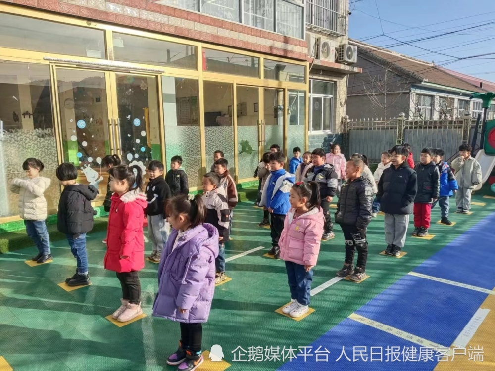

# 多数师生在校不再强制戴口罩，专家：甲流处于高发期，但传播风险可控

**人民日报健康客户端 记者张爽 杨晓露**

教育部办公厅、国家卫生健康委办公厅、国家疾病预防控制局综合司3月13日联合发布《关于印发高等学校、
中小学校和托幼机构新型冠状病毒感染防控技术方案（第七版）的通知》，明确高校、中小学、托幼机构开学后不强制要求师生佩戴口罩后，人民日报健康客户端记者发现，北京、河北、辽宁、广东等多地学生和幼儿在校内、园内已不再长时间佩戴口罩。

_河北省唐山市某幼儿园，孩子们在室外活动时已无人佩戴口罩。受访者供图_

**学生根据自己意愿选择是否佩戴口罩**

“孩子们早上会戴着口罩来上学，但是两节课过后基本也全都摘下来了。除了有一些特殊活动或者重要场合，基本全天都不会再戴上了。”北京市朝阳区某小学班主任告诉人民日报健康客户端记者，“而且教室、楼道中关于新冠的标语现在也都撤了。”

广东省佛山市某高中语文教师也向记者表示：“学校现在不会强制要求戴口罩，孩子们看个人意愿，偶尔能看到几个戴的，比如有感冒等症状的时候可能会戴一下。”

除了中小学，多地的高校、托幼机构情况也大致相似。在辽宁省大连市某高校任职的林刚（化名）也对记者说：“之前戴着口罩给学生上课总感觉不舒服，《通知》出来后就干脆不戴了，学生们里戴和不戴的都有。”

南方医科大学公共卫生学院生物安全研究中心主任赵卫表示，中小学、高校以及托幼机构的人群感染新冠病毒后，出现重症的概率都非常低。因此让中小学、高校的学生可以根据自己的意愿选择是否佩戴口罩，是非常人性化的规定。

_幼儿园的孩子们在室内上课时也不再佩戴口罩。受访者供图_

**甲流处于高发期，但传播风险可控**

不过也有些家长向记者表示，现在还是会让孩子在校内尽量佩戴口罩。“一方面是已经习惯了，另一方面则是现在甲流比较严重，所以就没想着那么早让孩子摘口罩。”河北省唐山市一位小学生家长对记者说。

针对这一点，赵卫解释：“虽然目前新冠依旧存在，并且是甲流的高发期，但新冠病毒感染已属于乙类乙管传染病，甲流则属于丙类传染病，因此疾病的传播其实是在可控范围内的。此外，由于长期佩戴口罩还会给呼吸系统带来一定影响，因此仅就新冠来说，幼儿不佩戴口罩是安全的。我想也正是考虑到了幼儿的特殊性，《通知》中才区别于中小学和高校学生的‘不强制要求佩戴口罩’，明确幼儿在园期间‘不佩戴口罩’。”

辽宁省大连市某幼儿园园长陈红也认为，戴与不戴口罩对园内的幼儿都不会有太大影响。“因为我们的老师每天都会给孩子们做三次检查。此外，如果发现孩子有流鼻涕等相关症状，也会建议家长带孩子在家休息观察一下，不带病入园。”

“不过当学生和幼儿上下学乘坐公共交通工具或者去到一些公共场合时，戴上口罩还是有利于防范呼吸道传染病的感染。”赵卫最后补充。

