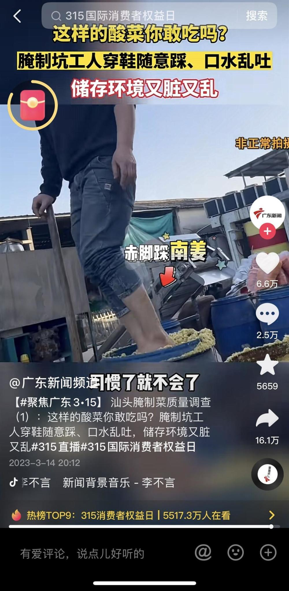

# 广东汕头再现脚踩腌菜：苍蝇乱飞污水横流，工人称“全天下都这么做”

去年央视315晚会，5家企业生产的“土坑酸菜”被曝卫生状况堪忧，脚踩酸菜、乱扔烟头等场景更是令网友心惊。一年过去了，这一幕又在广东汕头再现。

人们常说“潮汕有三宝，鱼露、菜脯和咸菜”。其中，潮汕咸菜是一道美味可口的名菜，属于潮菜系，以大芥菜为原料加盐腌渍而成，是潮汕人民居家生活常见的小菜。

然而，“315”到来之际，多家媒体记者暗访发现，潮汕当地个别腌制菜厂的生产环境脏乱差，由于缺乏相应的行业标准和监管，多年来以生产企业的产品标准作为质量控制依据，导致产品质量参差不齐，几家企业生产橄榄菜的过程更是令人触目惊心。

**工人边抽烟边干活，赤脚踩在南姜上**

“315”来临前，广东电视台播出一期节目，曝光了汕头市一些腌菜厂的生产过程和生产环境：汕头一腌菜厂工人边抽烟边切酸菜，掉在地上的咸菜也直接被扔进箱子。在南社村的汕头沐彤园食品有限公司，工人直接赤脚踩在南姜上。被问到会不会辣脚时，工人称“习惯了就不辣了”。

此外，视频还曝光腌制坑里的工人穿着未经清洗和消毒的水鞋来回踩踏，有工人甚至直接朝着里面吐口水。记者走访发现，这些腌制菜厂的生产、储存环境脏乱设备简陋，新鲜的芥菜和被腌制过的芥菜被随意堆放在地上，并未做任何卫生处理。无论是五香溪村、蓬中村所谓的“家庭作坊”还是富砂村工业园成规模的腌制菜厂，普遍都没有办理食品经营许可证，很多厂家生产的产品，在流入市场前也没有做过质量检测。对于无证生产的问题他们有的称“无需办理”，有的称“没人管”，更有的称“因为来查的时候，村里的人也会告诉我们的。”

**苍蝇乱飞、污水横流，腐菜变“美味”**

苍蝇乱飞、污水横流、腐臭弥漫……近日，南方日报、南方+记者在暗访调查时发现，在汕头市龙湖区龙华街道南社工业园路边，有一堆用红布半掩的绿叶菜。由于刚下过雨，不平整的路面积着雨水，混着泥土，蔓延到菜的底部。走近可以发现，这些菜叶中，混杂着一次性饭盒、烟头和塑料袋，不少菜叶已经发黑，散发着阵阵腐臭，一只只苍蝇在空中打转。

“隔壁玉蕾厂的，不是垃圾。”周边有村民告诉记者，这些看起来已经发黑腐烂的菜叶“大有用处”，是潮汕美味“橄榄菜”的原料——芥菜叶。村民口中的“玉蕾厂”指的是工业园区的一家腌菜厂——汕头市玉蕾食品实业有限公司（以下简称“玉蕾”）。

为了验证村民的说法，记者进行连续数天的蹲点暗访。1月31日下午，已经过去了三天，堆积在地上的菜叶依旧“无人问津”。直到3天后，村民的说法得到了证实。2月3日下午，两辆铲车出现在仓库门口，有工作人员操作挖掘机，将地上的芥菜搬运到铲车上，再运至仓库中。一名在现场指挥转运的男子告诉记者，他是玉蕾的员工，地上的芥菜是做橄榄菜的原料。“全天下都这么做啦，放这里是沥干水分。”他这样说道。

随后，记者在仓库看到，仓库中有数个大大小小的水泥腌制池，一些池子已经密封，顶部铺满了厚厚的盐，这些芥菜运进仓库后，被倒进了附近的空池中。现场人员的说法也得到了玉蕾厂区办公室内工作人员的证实。当天下午，记者来到了玉蕾厂区的办公室，当记者询问起仓库门口堆积蔬菜的用途时，现场接待的负责人称：“那些是芥菜，做橄榄菜用的。”

接下来如无意外，它们将经过盐渍、封存发酵、洗盐退淡、切碎、脱水、橄榄油煮等工序，摇身一变成为包装精美的“橄榄菜”，流入市场。

**被曝光企业系行业龙头，参与起草橄榄菜地方标准**

公开资料显示，汕头市玉蕾食品实业有限公司前身是创办于1978年的澄海县外砂副食品厂，2001年改为现名，其在潮汕地区率先实现潮汕杂咸生产标准化。2003年，该公司的“潮汕贡菜”“潮汕橄榄菜”被国家质检总局列为“国家地理标志保护产品”。

记者了解到，作为当地的骨干龙头食品加工企业，玉蕾开发生产的包括橄榄菜在内的“玉蕾牌”潮汕风味菜系列食品畅销市场，也是很多潮汕人的童年味道。“我们从小吃到大。”汕头市龙湖区陈先生告诉记者，潮汕橄榄菜主要品牌就几家，玉蕾橄榄菜是大品牌，口碑很好，是很多人早餐必备的杂咸。

记者在京东、淘宝等电商平台搜索“玉蕾橄榄菜”，发现其销量十分可观。例如，在其京东自营旗舰店里，一款450g的瓶装橄榄菜售后评价条数超过了20万，在京东好物榜“下饭菜”类榜单中排名第八。

据了解，橄榄菜生产目前还没有相应食品安全国家标准，多年来以橄榄菜生产企业的产品标准作为质量控制依据。2019年10月，广东省卫生健康委公布了《广东省食品安全地方标准－橄榄菜（征求意见稿）》（以下简称《意见稿》）。

《意见稿》指出，橄榄菜是广东省具有几百年食用历史的特色传统副食品，人们常作为佐餐小菜和烹调调味时使用。因为橄榄菜的地方性特色较浓，在原辅料来源以及加工制作方面有着不同于其他属性食品的地方，目前还没有相应食品安全国家标准，多年来以《橄榄菜》企业的产品标准作为质量控制依据。而橄榄菜的生产销售规模已远远超过企业质量控制标准的要求。制定《广东省地方性标准－橄榄菜》将能更好保证食品安全和消费者健康，弘扬广东地方性产品特色。

然而，记者注意到，该标准的牵头起草单位为广东省食品安全学会，主要起草单位，汕头市玉蕾食品实业有限公司也在列。

**市场监督管理局连夜执法，电商平台正下架“玉蕾”橄榄菜**

食品安全问题一直是国家重点关注的民生问题之一，我国法律明文规定，食品生产经营过程中应符合相应的卫生标准。同样，在《征求意见稿》中，也对橄榄菜制作的原辅料提出了要求：“应新鲜、无霉变腐烂现象，并符合相应的食品安全国家标准。”

3月14日晚9时许，南方+记者了解到，汕头市市场监督管理局执法人员正对涉事企业进行现场执法。数十名汕头市及汕头市龙湖区市场监督管理局工作人员赶到涉事企业，在现场进行取证调查。

“今晚不管多晚，都会对媒体曝光的所有环节规范、监管、查封，按照食品安全法的规定实施执法监管，会在初步了解情况的基础上邀请第三方进行抽检，接下来调查、立案、查封、扣押都按照程序执行。”龙湖区市场监督管理局一级主办陈统征表示，该事件发生后，也说明市场监管部门存在监管不到位的情况，接下来会加大监管执法力度，规范企业的生产，确保餐桌上的安全。

当天晚上10时40分，执法人员在涉事企业清点货物，随后将贴上封条。3月14日晚11时许，记者从淘宝、拼多多、京东等多家电商平台处获悉，目前，已关注到媒体报道，正研究对涉事品牌相关产品进行下架。

（极目新闻综合广东电视台、南方日报、“南方+”新闻）

（来源：极目新闻综合）

