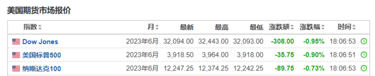
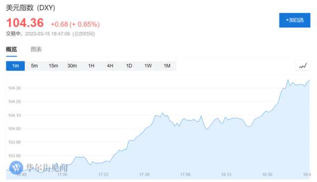
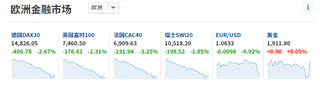
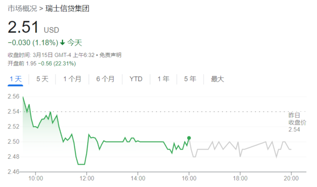
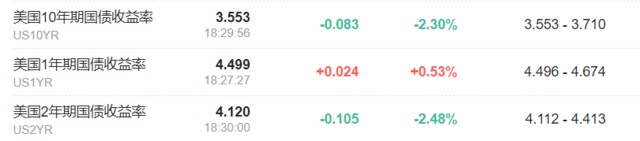
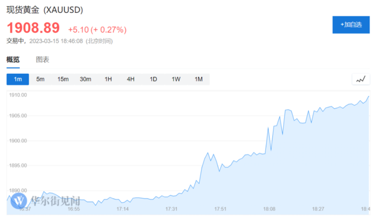

# 欧美股重挫，瑞士信贷美股盘前跌30%，美债、美元、黄金等避险资产齐涨

欧股跌幅扩大，英国富时100指数、法国CAC40、欧洲斯托克50指数均跌逾3%。

瑞士信贷(CS.N)美股盘前触及跌30%，此前瑞信2026年到期的美元债券暴跌至不良债水平。

受瑞士信贷危机影响，欧洲股市下挫，整个银行板块也受到拖累，债市波动性继续加剧。

3月15日周三，美股期货走低，美股三大股指期货均跌约1%。

美元指数短线走高约30点，日内涨幅扩大至0.65%，现报104.36。

投资者也在等待今晚的美国零售销售和PPI经济数据，以获取有关美联储货币政策路径的线索。昨日发布的CPI通胀报告显示，美国2月CPI增速放缓，使市场增加了对美联储在下周议息会议上只会小幅加息的押注。

欧洲股市普跌，德国DAX指数跌幅扩大至3%，欧洲斯托克50指数跌超2%，意大利富时MIB指数跌2.5%。

银行股普遍下挫，欧洲斯托克600银行股指数跌逾4％，法国巴黎银行股价一度下挫8％，法国兴业银行股价下跌7.3％。

美国银行股盘前也多数转跌，花旗银行跌超3%，美国银行跌超2%，PacWest Bancorp跌近4%。

瑞士信贷美股盘前跌超20%，续创历史新低，欧股跌逾17%。此前瑞信一年期CDS报价接近1000个基点，且最大股东排除向该行提供更多援助。

在三家银行在过去几天接连倒闭后，评级公司穆迪下调了对银行业的展望。标普全球也将第一共和银行列入了负面观察名单。这反映出，市场情绪可能仍很脆弱。

Hargreaves Lansdown 货币和市场主管 Susannah Streeter
表示，许多银行股的股价仍明显低于本月初的水平，这表明紧张情绪仍然存在。令人担忧的是，如果储户迅速撤资，那些小型银行可能没有足够的资本缓冲。

嘉信理财股价盘前一度攀升4.5%。此前该公司首席执行官表示，该银行和经纪公司拥有足够的流动性，并没有寻求资本或交易。

债市方面，对政策变动最为敏感的2年期美债收益率下跌10个基点至4.12%，10年期美债收益率下跌8个基点，表明交易员正在为加息和经济增长放缓做准备。

掉期交易定价显示，投资者又恢复了对美联储下周加息25个基点的押注，预计6月份利率将达到略低于5%的峰值。

Pictet Wealth Management 宏观经济研究主管 Frederik Ducrozet 表示：

各国央行可能会更加谨慎，因为他们在监测信贷环境收紧的情况。

然而，与以往银行业危机的一个主要不同之处在于，宏观背景更具韧性，包括持续的通胀压力。这将导致通胀和金融稳定风险之间的权衡变得更困难，各国央行将试图尽可能长时间地抵制降息。

在大宗商品市场，现货黄金短线走高，现报1908.89美元/盎司。

