# 直播间的“儿子们”专坑咱爹妈！卖99元产品主播能挣80元

山西平遥李先生的母亲一直在手机上看一种直播，并且被深深地迷住了。

**李先生：** 我妈经常关注的这几个主播，人比较好，帮人解决问题。

这些主播主要是在直播时帮人解决纠纷、调解家庭矛盾，主播看起来都非常热心。

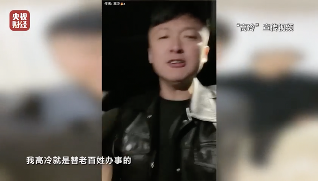

让李先生非常困惑的是，母亲不但给主播点赞刷好评，同时还买了不少直播间里推荐的号称有神奇疗效的产品，可李先生却发现这些产品都是固体饮料、压片糖果等普通食品，这些怎么能治病呢？

**李先生：**
我极力地去给我妈解释这些东西实质的性质，然后她跟我喊，你不懂。给我的感觉就是，在她眼里，我这个亲儿子说的话还不如主播那些“儿子”说的话可信。

大连杨女士的母亲也迷上了这样的直播。

**杨女士：** 喜欢看一些情感类的直播，大概就是调解家长里短、婆媳关系。

杨女士的母亲在看直播的同时，也买了不少产品，也都是号称能治病的普通食品。

**杨女士：** 那个压片糖果她又买回来了，但是她血糖高，她吃了之后，她第二天的血糖升得特别多。

小张说事，就是老人经常关注的一个直播间。

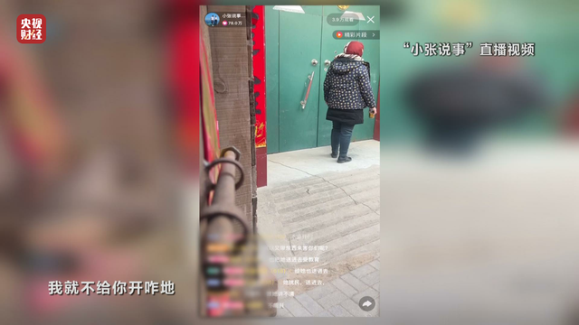

小张说事2023年2月的一期直播中，主播小张称自己的亲姐姐、姐夫做了大坏事，小张表现出大义灭亲的样子，将姐姐、姐夫送进监狱，姐姐的婆婆不服气，跑到小张家门口来闹事。

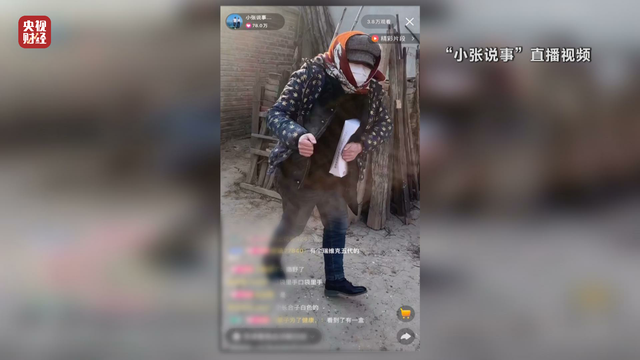

接下来的情节越来越让人不可思议，姐姐的婆婆乔装打扮成收废品的，混进主播小张家里，从小张爷爷手里骗取了一盒产品，小张发现后，极力想要回产品。

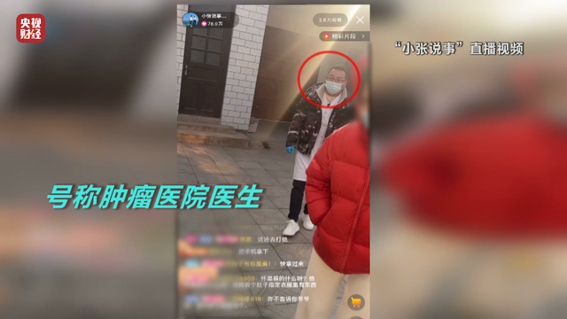

这时荒诞的一幕出现了，一位肿瘤医院的医生好似“从天而降”，过来帮助小张，其实这都是事先设计好的。

戏演得越来越荒诞，这一盒产品只是一个引子，更多的产品被小张从坏人手里抢了过来。此时，刚才埋下伏笔的，所谓肿瘤医院的医生在关键时刻发声了。

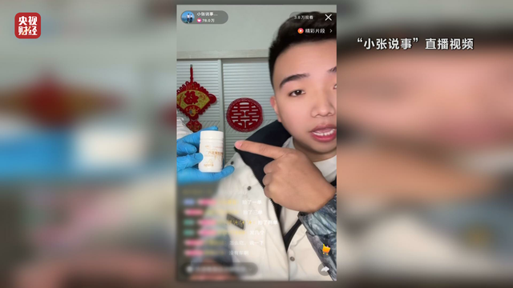

**小张说事直播视频：** 它就是肺的“特效药”，知道吗？它关键时刻它能够把我们的肺给我们保护起来。

接着，主播小张开始向直播间的粉丝们售卖这个所谓的“特效药”。

记者查看发现，这款产品类型是：压片糖果，只是一款普通食品。

食品安全法明确规定食品广告不得涉及疾病预防、治疗功能。然而小张说事却以荒诞的故事情节，采用植入的方式，把一款普通食品宣传成特效药。

那么，小张说事直播间里所说的事究竟几成真、几成假，又是什么让老人对此深信不疑呢？

无论是从购物的收款方，还是小店名称，记者都无法找到主播小张。在“小张说事”这期直播中，记者偶然发现“利哥供应链”的招牌。

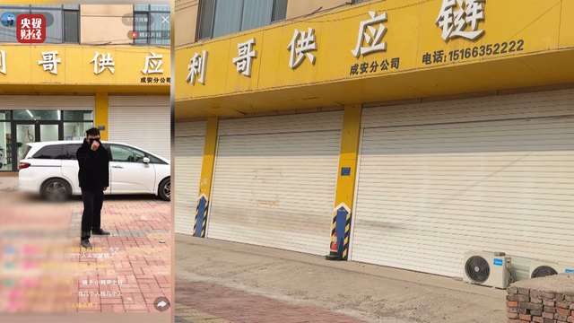

记者设法找到了利哥供应链，公司负责人尹经理告诉记者，利哥供应链主要为主播寻找合适的产品并提供场地，主播小张和其师傅辉哥都经常在这里直播。

**利哥供应链 尹经理：** 辉哥来了，我们老客户，徒弟（小张）他只要我有新品，他徒弟带我新品，都合作一年多、两年了。

记者发现，公司货架上摆放着几百种产品，大多都是压片糖果、固体饮料等普通食品。

**利哥供应链 尹经理：** 这些品牌所有的他全都带货过，只要是我家的（产）品他都带。

尹经理坦言，直播间所讲的故事都是编造出来的。

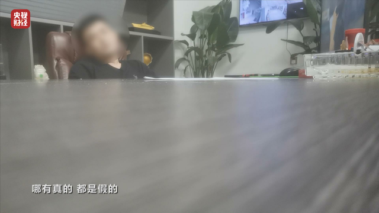

**利哥供应链 尹经理：** 都是假的，演员都是花钱雇的，有编导写剧本，哪有真的，都是假的。

利哥供应链王经理告诉记者，很多打着调解矛盾、纠纷旗号的直播，目的就是为了骗老人买产品，主播获利非常大。

**利哥供应链 王经理：**
这个东西到我这拿的话是1.2元，这个（产）品卖了大约一两千万盒了。我们是卖99元10盒，给主播开佣金开80元，就说99元钱主播要挣80元。

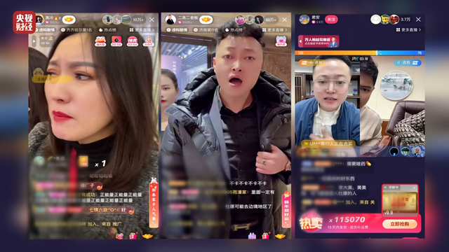

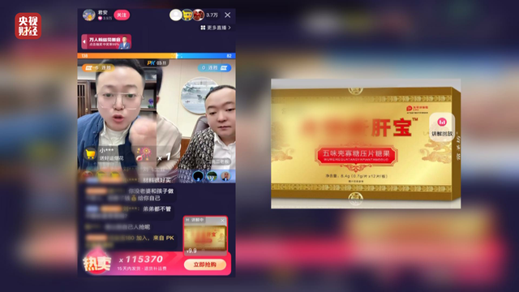

3·15晚会收到很多投诉，不少主播都装出一副正气凛然的样子帮助解决纠纷，无一例外都能机缘巧合，得到号称能治疗疾病的产品，并且卖给观看直播的老人们，其实都是普通食品而已。

这是马洪亮2022年11月的一期直播，有人为某公司上山采集天山雪莲，意外身亡，公司为将功补过，用自家研发的天山雪莲子产品给死者母亲治好了疾病。

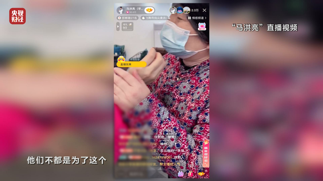

**马洪亮直播视频：**
他给阿姨真的吃的是这个，阿姨，你吃，这个是可以治好你那个小瘤瘤的。因为这个比黄疙瘩还要贵重，你知道吗？最关键是它9年才能采摘一次，9年才开一次花，才结一次籽。

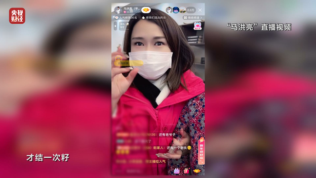

马洪亮要销毁该公司产品，设计好的剧情又出现了，在一位自称中科院胡主任的极力劝说下，马洪亮决定把这些货卖给观看直播的老人们。

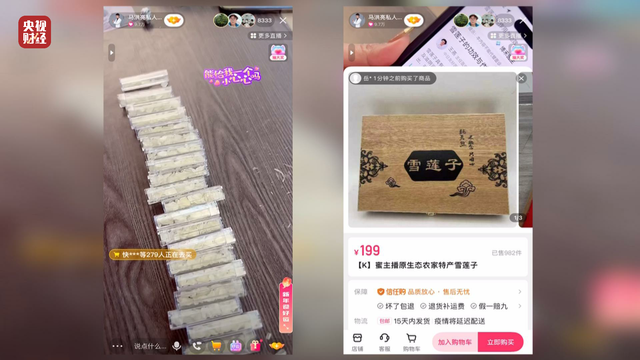

记者仔细查看该产品信息，品名：雪莲子，成分：皂角米，又名雪莲子，产地贵州。同样只是一款普通食品，主播马洪亮却利用编造的故事情节，宣称该产品能治好瘤子。

在方明快相亲2022年11月的一期直播，主播在调解一起绑架所谓名医后代，夺取秘方的离奇故事，最终又演变成向老人们兜售产品的闹剧。

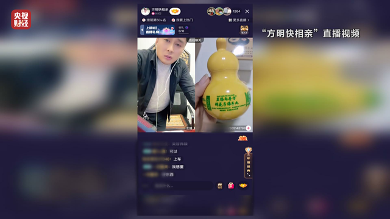

记者调查发现，不少解决家庭纠纷，调解家庭矛盾的直播，从情节到产品，从演员到场景，实际都是为了利用老人的同情心，兜售产品。

和和工作室也是一家专门运营此类直播的公司，该公司员工坦承，主播说的事都是假的，按剧本演出来的，她本人就多次客串过。

**记者：** 你也参与吗？

**和和工作室员工：** 我是助播，就是有那个有剧本的，基本上都是提前编好，然后跟着主播讲的你去走就行了，让你骂人你就骂人，让你装可怜你就装可怜呗。

这位员工介绍，直播的关键一环就是要把合适的产品放到合适的剧情里。

**和和工作室员工：**
产品基本上都是套到剧情里面的，想卖哪一个（产）品，想把它卖爆，就给它铺到剧里面，有的就提前一场就铺了，让粉丝觉得你不是在卖货，你在做好事、做善事。

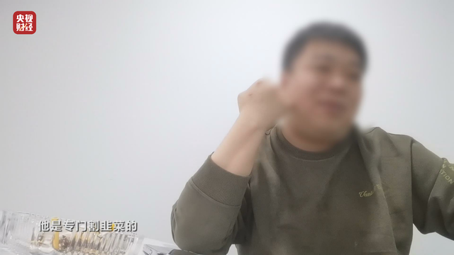

为了让编造的剧情演起来更加真实，该公司甚至搭建了一个与医院病房一样的场景，病床、氧气瓶一应俱全，这样的场景使用率非常高，编造的故事里有了病房里的病人，就可以博取老人的信任与同情。

**和和工作室员工：**
老头老太太看我觉得看苦情的，就是这个人很可怜，然后最后被这个主播救了，这个主播是正能量的人，到哪里去都会帮助别人的人，年龄大的人喜欢看这一类的。

来源：央视财经

