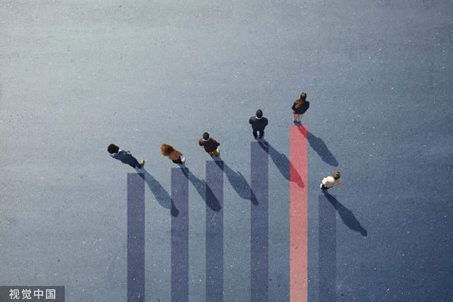

# 进不了大三甲，回不去小县城，985医学毕业生“被出局”

考上复旦大学医学院，并没让王河（化名）开心。

学临床医学的王河是上海本地人，今年考研二战成绩不理想，正等待调剂或转行。

咖啡馆里，他拿着一根还未拆封的吸管比划：临床医学是一条封闭而漫长的道路，每一步都按部就班——读完五年本科考研，考完研考博，考完博“规培”（注：住院医师规范化培训的简称），最后进医院当医生。

“这是一座独木桥”，他说，“谁都能看到终点，但并不知道自己能不能走到终点。”

在疫情掀起千层浪的动荡年代，各行各业兴衰交替，唯独医生这份职业看起来依旧稳固、体面，是人们眼中除了考公外的“铁饭碗”。

而疫情放开后的2023年，90多万医学生面临的就业竞争比往年更加残酷。医直聘联合创始人练军良告诉八点健闻，今年很多效益一般的医院的在职医师开始蠢蠢欲动，想去好城市的大医院，跟应届毕业生抢工作，导致学历内卷和科研内卷越来越严重。

众人过窄桥，学历通胀，医院门槛水涨船高。复旦大学医学院临床专业学生在刚入学的时就被老师告知，每届200人的学生里，最后只有约70人能成为医生。

考研和考博，是筛选掉这些独木桥上的医学生的两个节点。

而和王河一样的985医学生，起步已超过了半数独木桥上的人。他们更不愿意
“向下兼容”，离开北上广，到县城做基层医生。越精英，掉队后的失落感越强。在一些985医学生的观念里，要是沦落到去社区卫生院，就是“对不起学校”。

困在学历里的医学生们，早已过了“有好多奢望”的二十一岁，成了《黄金时代》里“挨了锤的牛。”

越来越窄化的世界观、越来越受限的选择中，有人在独木桥上死磕，挣扎几次，成功“上岸”；而有的人在一次次的碰壁后心灰意冷，选择出国、转行或考公。八年制临床医学博士考公务员，在当下也并非新鲜事。

临床本科生走进“考研时代”

王河没有料到自己会跌落独木桥。

2020年，无缘保研的他在上海的医院里找不到工作，决定报考本校研究生——华山医院的神经外科。

就算是顶尖医学院校毕业，以王河的本科学历，在上海仍然连社区中心的规培都进不去——三甲医院只收顶尖博士，社区中心只收硕士，这是上海医学生们心知肚明的共识。

那段时间正值医学生的实习期，王河每天在医院里从早上8点工作到下午5点，下班才有空回家学习到深夜。最晚的一次，带教老师在临下班前突然要做一台解决下巴囊肿的手术，需要王河留下来，帮忙打下手，手术持续到10点。王河半夜从医院回家，又打开台灯，开始复习考研。

王河非常不情愿。打杂性质的医院实习，相较于积攒“临床经验”，不如说更像是在“浪费时间”。比起穿上白大褂上手术台，考研才是近在眼前的火拼前线。他们似乎宁愿拿这些时间多做几套题，多看几页考研的教科书。

雪上加霜的是，研究生录取分数线并没有因为疫情而停止上涨的脚步。河北某医院的年轻医生李新，2017年以340多分的成绩顺利被北京协和医学院专硕录取。如今，他惊讶地发现，一位师妹考了370多，竟然只是“压线”拿到了学校的复试资格。

而王河考研的2021年，复旦大学医学院的分数线是370多分，且一反常态地划了一条220分的超高“单科线”，比以往高了近20分。“就算考过学校线，单科过不了单科线，照样没书读”，王河说。

不出意外地，王河考研失败。他当即决定“二战”——作为上海人，王河觉得自己反而更没有退路：“外地同学说不定还能回家，边规培边考研。但二十年土生土长在上海，必须留下来，没有别的出路。”

“反正做医生的周期已经够长了，再多一年又算什么？”抱着这样的想法，王河开始“二战”。为求稳，这次他调整了目标。对精神科感兴趣的他，报考了另一所985大学的精神科。

但王河的二战，注定是一场更为艰难的挣扎。

在李新考研的2017年，考研人数才刚刚突破200万。而五年后的2022年，轮到王河考研时，考研人数飙升至457万，是当年的2倍多。过去6年间，我国每年的考研人数增长都在30万以上，去年最为离谱——相较于2021年，2022年的考研人数增长了80万人。

王河没有详细说二战的情况，只说考得不好，看调剂。“调剂不上，也许会和我爸一样，转行卖保险。”王河苦笑。他还是会有些失望，做医生很有安全感，每个阶段都清楚地知道自己该干什么。他不想像别人一样，拿着一张本科文凭，就直接跳进求职的大海。

王河一些外地同学们，有的会选择回到家乡的二三线城市里，找个医院规培，结束后直接就业，或者边规培，边二战，甚至三战。

但现在，给学生们的第二次机会正在慢慢消失，规培的大门也在慢慢关闭——有消息称，河南和湖北今年不允许非应届毕业生参加规培。也就是说，如果边规培边考研，考专硕的机会只有三次。而那些全脱产准备二战考研的学生，将直接无法报考专硕。

上海交通大学医学院内部人士委婉地告诉八点健闻，受疫情影响，这两三年就业率都不好。“上海教委跟在屁股后面要我们提高就业率。”他最后表示，2023届可能也没有好的结果。

根据2020年7月8日发布的《丁香人才2020应届生就业流向报告》，文章发表时，超6成毕业生还处于找工作的状态，仅有23%的应届生已经签约就业；谈到疫情对找工作的影响，34%的人表示单位招聘信息延迟或取消，27%的人认为是线下招聘会延后或取消，另有17%的人，由于封控而错失了笔试或面试机会。

卷到底的学历，卷不完的科研

考上研究生的幸运者，并非万事大吉。

医学生职业道路的独木桥上有两个“筛选”点：一次在考研，另一次在考博。每个节点，独木桥上都会“掉下去”一批人。

2023年年初，上海某顶级医学院硕士研究生温雅意识到自己今年考不上博了。

往前推半年，她还在毕业论文中挣扎。2022年10月，她开始投论文，同时准备博士申请材料。

她采取的是“广撒网”策略。投遍上海、北京、杭州的医学院校，她唯独没有投本校——因为打听一圈后发现“没戏”。本校大多数博导都有自己的研究生，而这些研究生也大多有读博意愿。这种情况下，博导都会优先招收自己带的硕士，温雅基本不可能硬挤到别人的“师门”下。“就算投了，也大概率会成为炮灰。”

真正开始申请博士，她切身感受到了“卷”，“每个人手上都有十几篇文章”。而科研能力是博士申请评价体系中的大头，占比足足60%，包括文章数量、文章所在分区、影响因子、是否是一作，等等。

靠着包括十几篇一区顶刊论文在内的丰硕科研成果，即将进入国内顶级医院的某985高校博士宋超，成为了所有受访者中在独木桥上走得最远的人。作为科研领域的“老油条”，他也观察到了近些年医学生科研的愈发内卷。

“时代早就不同了。”他斩钉截铁地说。据他观察，十年前，有一篇影响因子为十分的论文就能留在上海顶级医院，但现在还要再追加一个国家自然基金项目；从前本科生不需要做科研，跟着学习就行，现在连本科生都需要原创性成果，“不然不可能进顶级单位。”

科研内卷，学历贬值——独木桥上的“拦路虎”正愈发强大，走下去变得愈发困难。

读研三年，温雅只发了一篇论文。这其中有课题组的因素，也有疫情耽误半年实验的因素。毕业时，看着自己唯一的成果，她感到难过，因为“一切靠自己摸索，读研读得其实蛮辛苦”。

但一切已成定局，能做的只有向前看。在得知所有博士申请落空后，她立马调转船头，开始找工作。

和其他人相比，温雅是幸运的。在上海解封前后的几个月内，她所在学校举办了多场互选会，帮助学生就业，温雅最终成功进入了上海某三甲医院的检验科。作为最基层的小医生，她要出门诊、值夜班；下班回家后，还会在晚上七点半准时坐在电脑前，开始“打第二份工”——写标书，申请国家自然基金项目。

因为她依然想读博，想做研究，“相比门诊窗口，我更喜欢实验室”。她希望能在工作中积累一些成果，几年后继续申请博士。在她身边，如此曲线救国的人不在少数。

但这个过程同样艰难。作为年轻医生，她没有资金，没有数据，只能靠硕士期间的研究中剩下的一点问题申请项目和经费。

“掉队的人”，另寻他路

相比于执着考博的温雅，上海某顶级医学院在读学硕刘可的脚步慢了下来。看着漫漫前路，他感到疲惫。

和王河不同的是，刘可并不喜欢医学生这种一眼望得到头的感觉——虽然在之前的七年中，他没想这么多，“顺顺利利地总能当个副主任。”靠着多年读书的惯性，他读完5年本科，本着继续读博的想法考取上海顶级医学院的学硕，如果一切顺利，他会继续走下去。

但如今的他卷不动了。“一想到后面还有主治、副主任、主任……要卷这么多年，我着实有点乏了。”说这话时，刘可刚办完复学手续。去年4月左右，他患上了抑郁症，只能休学回家休养。

他为申博而“揽下”的大课题，进度完全被打乱。记不清多少次，刘可因被封控而错过了回收标本的期限，甚至“一停就是半年”，只能反复重做。这使他没能完成原本有信心在两年内完成的课题。

刘可撑不下去了。

刚进医院做科研时，刘可对周围的一切好奇又兴奋，做什么都很有动力，“感觉对自己的期望更高了”。那年，他所在科室的独立研究所刚落成，“很大，估计有两三百个平方”。看着越来越多的设备和器械逐渐把空旷的实验室填得满满当当，他觉得很有“成就感”，像是受到了嘉奖一般。

他能见到来自五湖四海的病人，与导师一起研究各种各样的疑难杂症，偶尔还能跟以前的同学吹牛，“我碰到的这些病人，他们见都没见过。”

留在上海，是他休学之前的想法。

现在，刘可累了。曾经，觉得毕业不做医生对不起这八年的努力，但如今，听得多了、看得多了，他慢慢发现好像去企业工作也挺不错。“企业也招医学生，人家都去了，我去也很正常。”

同时，刘可发现，疫情期间医院收入堪忧，一些科室不怎么看病人，甚至都发不出工资。“我们科的工资没受太多影响，但一些科主任自己疫情期间的奖金也就一两千块，真的发不出钱来。”

因为疫情而改变人生轨迹的医学生们，不止刘可一人。这场瘟疫在彻底打乱人们生活节奏的同时，也让许多医学生意识到，原来眼前不止一种选择。

也许走上岔路也是可以的？也许不卷学历、不卷科研也是能接受的？“跌落”独木桥的人，真的是所谓的“掉队”吗？除了考试之外，真的只有永远无法“上岸”的求职汪洋吗？

除了回二线城市“躺平”，越来越多的985医学生们也将目光放在了考公上。

即将毕业于上海某医学院的八年制临床医学博士陆鸣（化名）发现，曾经的学长学姐里，很少听到有去考公的，“偶尔有一两个”。但去年，至少他知道的想要考公的同学，就有两三个。“从去年的情况来看，我感觉身边读完八年制博士出来不做医生的人，是比以前要多的，”他说。

刘可也考虑出国。在国外的大部分国家，他虽然不能继续学医，但可以读一些生命科学类的学科，比如生物或公共卫生。在国外读博，刘可不仅能争取全额奖学金，还能赚一笔工资。

上海某985大学医学院的小缪也走上了出国的路。读了五年临床医学本科，他发现自己完全适应不了医院的工作节奏和体系。加之保研无望、考研失败，小缪决定放下这掂了五年的重担，出国读商科。

在他一战失败，被迫休息的一年里，小缪申请到了两所院校的商科和健康管理交叉项目，还获得了学校提供的20%学费减免。

“我对成功的定义很狭隘，就是赚到钱。”小缪说。“但我知道，医生在很长一段时间内都是没办法真正经济独立的，所以我想转行了。”

张雨箫、张晓艺｜撰稿

史晨瑾丨责编

**本文首发于微信公众号「八点健闻」，未经授权不得转载**

