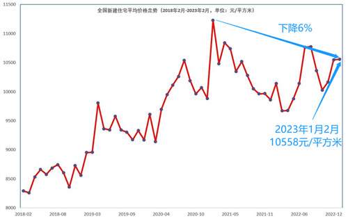

# 56城房价比1年前还低，东北多地新房二手房全下降

中国经济周刊-经济网讯 (记者 孙庭阳) 56个城市的新房价格和63个城市的二手房价格，低于2022年2月。

近期，国家统计局公布了70个大中城市2023年2月商品住宅销售价格变动情况。

全国新建住宅2023年1月和2月平均价格为10558元/平方米，与2022年12月基本持平，比2022年同期上涨4%，比2021年同期下降6%。

_(数据来源：国家统计局)_

全国新建住宅2023年1月和2月共销售1.4万亿元，比2022年同期增长3.5%。自2021年7月份以来，销售额首次出现同比增长。

此前已经连续18个月下降。2021年7月，全国新建住宅月销售额比前一年同月下降7%，就此开始了持续的下降。2021年8月份至12月份、2022年12个月，各月降幅均在20%左右。

全国新建住宅2022年销售额只有11.67万亿元，降到了2017年的水平。2018年至2021年，全国新建住宅各年销售额都在12万亿元以上，2021年达到了16.3万亿元。

具体到70个大中城市，有56个城市的新房、53个城市的二手房，今年2月份的价格低于2022年2月。1年之间，新房和二手房价格都下跌了。

省会城市中，2022年2月至2023年2月，新建住宅价格下降前五名中，有3个是东北城市。哈尔滨降幅最大，下降6%；长春次之，下降5%；沈阳是第五名，下降4.6%。兰州和武汉，分列第三名和第四名，分别下降4.8%和4.7%。

与前面5个城市形成对比的是，在长三角的杭州、上海和合肥，这3个城市近一年新房价格分别上涨6.2%、3.9%和3.3%。

东北其它城市房价怎样变化？

除了省会城市，纳入统计的东北城市中，如大连、吉林、丹东、锦州和牡丹江，2022年2月至2023年2月，新建住宅价格分别下降4.7%、4.5%、4%、3.5%和2.6%。

东北城市二手房降幅更大。在70个大中城市中，二手房降幅前3名都是东北城市，分别是牡丹江、吉林和哈尔滨，分别下降10%、8.7%和8.5%。锦州、丹东、沈阳和长春，降幅在5.7%至6.7%之间；大连二手房价相对比较扛跌，下降4.7%，降幅在63个城市中处于中游位置。

一审：郑扬波 二审：王新景 三审：周琦

