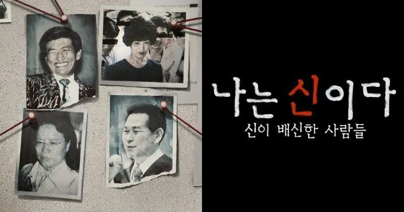

# “不建议在吃饭和睡前观看”，韩国邪教纪录片“太真实”引发争议

【环球时报驻韩国特约记者 韩枫】一部揭露韩国邪教恶行的纪录片《以神之名：信仰的背叛》日前在韩国国内引发激烈争论。

该片于本月初在网飞上线，讲述了4名以“神”自居的韩国邪教头目及信徒们的真实故事。这部纪录片向外界披露了韩国邪教的罪恶，却也因过于“真实”，有很多暴力和色情内容遭到质疑。

**“底气十足的作品”**

“该视频包含针对未成年人的真实性虐待描述，会给部分观众带来不适。”《以神之名》在影片一开始就打出这样一段字幕。《韩民族日报》报道称，纪录片分为8部分，揭露了韩国“摄理教”教主郑明析、“五大洋”教派核心人物朴顺子、“婴儿花园”创办人金己顺和“万民中央教会”创办人李载禄等4人的罪行及其邪教受害者的痛苦经历。

郑明析和他的“摄理教”以大学为中心，伪装成正常宗教进行传教。在上世纪90年代，郑明析前往马来西亚、中国台湾等地以大学生为目标进行传教，台湾媒体曾揭露超100名大学生被他强奸；1987年，“五大洋”教派核心人物朴顺子与31名信徒被发现惨死于工厂阁楼，死因至今成谜。2014年发生的“世越号”沉船事故，据称所属公司的社长也是“五大洋”教派高层之一。

“婴儿花园”的创办人金己顺要求信徒交出全部财产，每天工作18小时。其信徒7岁的儿子因为不顺从管教，被关进猪圈、喂食排泄物虐待致死，他的亲生母亲甚至参与其中；“万民中央教会”创办人李载禄曾宣扬禁欲，却被爆涉嫌长期性侵女信徒……片中的信徒同时扮演着受害者和加害者的角色，被邪教洗脑后伤害其他信徒或拉人入教。

“《以神之名》是一部底气十足的作品。”《韩民族日报》称其痛斥了包括性暴力在内的各种犯罪和法律漏洞，披露韩国社会在面对邪教时的脆弱性。

**揭示现实，还是过于暴露**

但韩国《亚洲日报》质疑该片“是揭露现实，还是过于暴露”，称其是否“越界”引发争论。《韩国每日星报》甚至表示，不建议在吃饭时和睡前观看此片，因为吃饭的时候看可能会想吐，睡觉前看则有可能会作恶梦。

《韩民族日报》报道说，《以神之名》以郑明析实施性暴力时说的话开头，纪录片原封不动地记录了他真实的声音，震惊了观众。女性“摄理教”信徒裸体在澡堂的影像也仅遮住脸部，同样的影像反复播放多次。《亚洲日报》称，由于专注于揭露邪教教主的罪行，该纪录片有时会详细描述性犯罪场面。这种直接展示和再现相关场景的方法被指违反韩国性犯罪报道规定，而且过于情色化。

《韩民族日报》也认为这样的描述容易给受害者带来二次伤害。同时，纪录片在对邪教的深入分析方面也不尽人意，并未全面解答对信徒拥有广泛影响力又具备雄厚财力的邪教团体对政治有多大渗透能力等问题。

**韩国为何邪教盛行**

虽然存在争议，这部纪录片还是再次掀起韩国国内对邪教盛行问题的关注和讨论。为什么韩国邪教盛行？韩国亚洲大学心理学教授金京日（音译）认为，越是孤独的社会、感到孤独的人越多，就越有利于邪教的发展。《朝鲜日报》旗下媒体称，前途迷茫、人际关系混乱的青年群体是邪教的主攻对象。

在纪录片播出后，韩国一名律师在韩国《中央日报》上撰文称，不强制干涉个人选择宗教自由的政策，导致很难对所有邪教团体的成员进行惩罚。在所谓“宗教自由”的韩国，批评甚至评论宗教都是很危险的事情。在纪录片提到的邪教团体中，已有两家向韩国法院提出终止该片播出的请求。

纪录片的制片人曹圣铉在采访中向韩国媒体表示，错误的不是信仰宗教的人，而是让别人走上错误道路的邪教头目。然而韩国邪教问题难道真的只是坏人骗了弱小的人吗？《韩民族日报》评论称，在这部纪录片中，金己顺聘请了韩国最好的律师、被无罪释放，郑明析被定罪后仍可以轻易出狱且再次犯罪，这都体现了“有钱无罪”“未开化的发达国家”韩国的真实情况。

该纪录片披露，韩国的邪教信徒中不乏检察官、教授、建筑家、制作人等所谓“社会精英”，他们甚至帮助邪教绑架、监听他人。片中提到韩国KBS电视台内也有“摄理教”信徒。对此，KBS电视台紧张地发布公告称，经过调查未发现内部有相关教会信徒。

