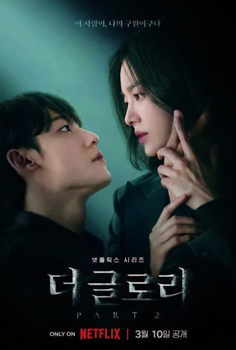
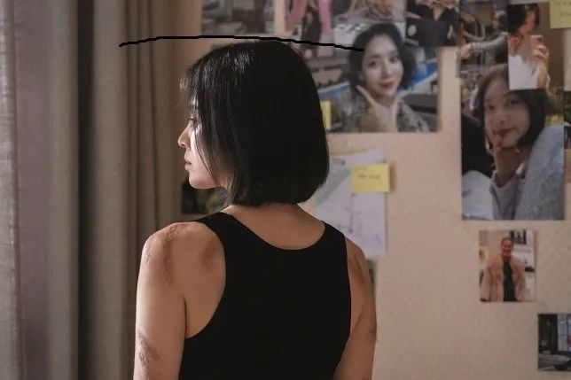
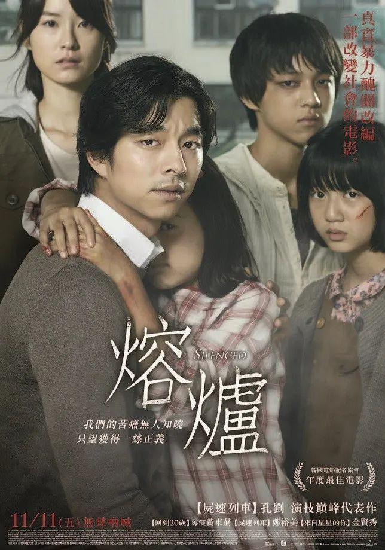

# 《黑暗荣耀》完结，但“霸凌剧”能改变韩国校园吗？

“敢拍”的韩剧改变不了真实存在的校园暴力，实在令人唏嘘。

**记者｜周 洁**

3月10日，宋慧乔主演的《黑暗荣耀》第二季回归，再度掀起网络热议，一开播就拿下豆瓣9.4分的高分。这部剧中，乔妹一改往日温柔可爱的荧屏形象，塑造了因校园霸凌后精心策划，步步为营的复仇女神文东恩，整个故事紧密又悬疑。

校园霸凌电影早已成为韩国电影的重要亚类型。曾经大火的韩剧如《继承者们》《顶楼》等，都刻画了不少典型的校园霸凌行为，比如孤立排挤、动手殴打等。在韩国一众“霸凌”题材的作品中，《黑暗荣耀》将故事时间线设置在主人公成年后的复仇情节上，无疑是有其新意的。

不过从另一个角度来讲，韩国影视作品虽以社会题材为抓手，拍出不少佳作，但现实社会中“校园暴力”层出不穷，这些作品似乎并没有改变这个社会的顽疾。“敢拍”的韩剧改变不了真实存在的校园暴力，实在令人唏嘘。

**开挂的文东恩**

不再是《蓝色生死恋》里软妹的爱情，宋慧乔换上了一身清冷的黑衣，决心向高中时期对她进行校园霸凌的朴妍珍团体发起报复。

2022年年尾，宋慧乔带着自己的Netflix新剧《黑暗荣耀》杀回来了，第一季播出后口碑相当不错，目前豆瓣评分达到8.9。网友戏谑点评：双宋对决，宋慧乔今年略胜一筹。原来，宋慧乔前夫的新剧《财阀家的小儿子》也在同一档期播出，而且也是复仇剧，不过，在题材深度方面，稍逊了一筹。

在《黑暗荣耀》中，宋慧乔扮演的主角文东恩，曾在高中时期惨遭霸凌而退学，在多年的蛰伏后，她着手实行精心规划的复仇，要让当年的霸凌加害者为恶行付出代价。

_《黑暗荣耀》女主角文东恩身上的烫伤触目惊心。_

霸凌团体的首犯是财阀千金朴妍珍，5人中有富二代、有教会家庭的千金、有普通人家的孩子和小混混。而文东恩生于单亲家庭，贫穷美丽，这是她被霸凌团体选择成为施暴对象的重要原因。剧中的霸凌，也不是简单争吵或打闹。文东恩被卷发棒弄出满身的烫伤，皮肤上狰狞的伤疤不仅没有得到霸凌者的怜悯，反而成为他们日常的消遣；文东恩不得不在寒冷的冬日穿着背心短裤，将灼热的四肢埋在雪中以求片刻安宁……日积月累的霸凌行为带给女主严重的心理创伤，以至于多年后她再次见到这群施暴者，已经结疤的伤口依然隐隐发痒。

或许你会好奇，文东恩为什么不寻求老师的帮助。因为霸凌团队背后深厚的家族关系，本就是弱势一方的文东恩，得不到任何人的保护——她的班主任和校长包庇了施暴者，还给了她一个耳光；警察也充当了保护伞；甚至她的母亲也拿了和解金选择不予追究。而唯一给过她温暖并且想为她讨回公道的医务室老师，却被黑暗势力调走他方。文东恩自己，最终也不得不退学收场。

但这并不是结束。退学的文东恩，在室内篮球场聆听了霸凌团体5人的梦想：贤妻良母、高尔夫球场老板、画家、空姐、百万富翁。而当霸凌的首犯朴妍珍询问文东恩的梦想时，曾梦想成为建筑师的文东恩回答：我的梦想是你啊，妍珍。

是的，她的梦想已经变成了向朴妍珍复仇。

一个贫穷的孤女想要发起复仇，谈何容易？这也是剧本逻辑中非常重要的一环，否则，整个故事就无法成立了。

文东恩先是在餐厅打工，解决温饱和住宿问题；再去染布厂工作，在别人休息的时间学习，完成了成人高考的内容，考上了大学，争取教师编制，兼职家教也让她拥有了一个小金库，能够实施她的复仇计划。

“轻易”解决了班主任的文东恩，开启了复仇的第一步。十多年来，文东恩无时无刻不在关注霸凌者的“脸书”，记录下他们每个人的人生轨迹。霸凌团体的其他人，文东恩选择了个个击破，一路下来非常顺利。看点来到了霸凌团体的首犯朴妍珍，当年在学校里为所欲为的大姐头，如今不仅是电视台的气象女主播，还嫁入豪门，拥有了前途光明的丈夫，过上了梦想中“贤妻良母”的生活。文东恩要如何做，才能扳倒拥有强大势力的朴妍珍？

文东恩天天翻找学校校长的垃圾桶，终于拿到了校长的把柄，并通过威胁的方式成为了朴妍珍的女儿河艺率的班主任，这是她复仇的第一步；“围猎”朴妍珍的丈夫，则是她复仇的第二步；后续，她又发现了河艺率的真实身份——原来，河艺率并非朴妍珍和丈夫的女儿，而是她与霸凌团体的另一人的私生女，就这样，朴妍珍固若金汤的防御层似乎也被撕开了一个口子。

第一季在此处戛然而止，朴妍珍将如何反扑成为第二季的看点。不过，这部剧的反派并没有什么反转，霸凌团体的所有人都得到了应有的结局，可以说是以牙还牙的复仇爽剧了。不少观众戏言，为了看妍珍完蛋，熬夜看完大结局。

**“敢拍”的韩国影视**

如前文所说，《黑暗荣耀》是众多韩国“霸凌”题材中一部最新作品，且没有烂尾。另一部校园暴力题材的《弱小英雄》同样是以牙还牙、以暴制暴的经典之作，只不过这部剧的结尾没有《黑暗荣耀》那么美好，看完后唯有扼腕叹息。

《弱小英雄》的主角是十七八岁的青少年，主场景是高中校园，讲述了体格弱小、脑力超群的男孩，利用心理、工具等辅助手段，反抗暴力者的故事。在这部剧中，学生常用物品：笔、桌椅、扳手、哑铃、灭火器、鞋带、腰带……都可以成为武器加入战斗，画面血肉横飞，看得人心惊胆战。

延施恩体型弱小，成绩优异，独来独往，面对同班的霸凌者不断挑衅，毫不理会，惹怒了霸凌者全永彬。全永彬唆使刚刚转学来的吴范石，在考试时将违禁品芬太尼贴在施恩的脖颈上，导致他考试失利，愤怒的他发起了自己的第一次反抗。延施恩冷静分析敌我优势，因地制宜，攻其不备，笔戳手背，窗帘罩脸，猛击要害，打得全永彬毫无招架之力，这也成为延施恩的“成名之战”。

直到搏击运动员出身的安秀浩出面制止，全永彬才不至于毁容。倒不是因为他是全永彬的同党，事实上，安秀浩是本剧中最具侠义精神的角色，路见不平拔刀相助是他的准则，最初延施恩遭遇挑衅，也是安秀浩出面替施恩教训这群霸凌者。不过他家境贫寒，夜里还要送外卖挣生活费，后半夜则直接睡在学校。

心怀正义却无半点背景，也为安秀浩之后的悲剧结局作了铺垫。

转学而来的吴范石虽然出身权势家庭，但作为养子经常被国会议员的养父打骂出气，他只是养父打造自己亲民、善良的人设的工具人罢了。缺乏家庭之爱的他对于安秀浩形成了一种天然的依赖，这三人成为了对抗霸凌者的小团体。

然而三个人的关系其实并不对等，当外人加入这个团体后，偏执的吴范石感觉三人组的平衡被打破。他竟然从被保护的对象转变为施暴者，重金买凶让人伤害安秀浩，使得安秀浩成为了卧床的植物人。延施恩得知后，以血还血报复了每一个事件的参与者，但他也在吴范石养父的势力下不得不转学到一所都是混混的学校。吴范石则被送出国留学，养父让他自生自灭并扬言要派人灭口。

8集的体量，让《弱小英雄》看上去短小精悍，但它的余波却悠长。在这部剧中，观众几乎看不到家长和老师的身影，即便出现，也都是消极形象，以暴制暴虽然过程爽快，但最终无法结束暴力，而成年人的缺位，更让结局变得无法挽回。

这种对于校园暴力的无力感似乎充斥在韩国的影视作品中。

**阳光为何照不进现实**

《黑暗荣耀》这段故事的原型，是韩国2006年清州女中学生暴力事件。一名年仅14岁的女学生被同学因“不守信用”“说谎”等理由校园霸凌。加害者以别针刺胸部、用书及球棍等物殴打被害者外，还在教室内用电棒卷烫伤被害者的手臂，如果伤口结痂，加害者会再次撕开并烧烫同个部位。最终，这名女学生严重烧伤、尾椎突出，手臂、大小腿及胸部皆伤痕累累，主要加害者被判拘留，而未能正确因应校园暴力的学校及老师则受到了行政处分。

_以真实事件为原型的《熔炉》，曾引发了韩国国内剧烈轰动。_

同样以真实事件为原型的《熔炉》，曾引发了韩国国内剧烈轰动，2005年，韩国曝光了光州一所聋哑障碍人学校中，从校长、总务主任到多数普通老师都曾经直接参与对校中的听障学生的施暴或性侵，受害学生年龄范围7到20岁。电影上映后，有上百万人联署旧案重提，随后案件调查被重新启动，经过重新的判决，这一案件中的相关罪犯被判刑12年，学校被关闭。上映的同年，韩国的国会有208名出席会议的议员以207票赞成，1票弃权的结果通过了《性暴力犯罪处罚特别法部分修订法律案》，又名“熔炉法”。

“敢拍”一直是韩国影视给我们的印象，然而，即便如此揭露校园黑暗，韩国社会中“校园暴力”依然层出不穷，阳光似乎难以照进现实。

改编自2017年仁川国小女童分尸案的《少年法庭》，讲述一个13岁少年用电线勒毙男童，并肢解分尸，把器官丢到厨余桶、剁下来的尸块丢进顶楼水塔。剧情已经血腥残忍，但真实案件更加骇人听闻，真实案件的两名少女诱骗女童回家，作案手法与剧中相同，而其中一名少女更把女童手指当作礼物送给网友。

法庭后来根据精神病法和少年法等，分别将主犯和从犯判了20年和13年有期徒刑。韩国社会对此反映强烈，大众更要求修改少年法，但至今尚未修法。

据韩联社3月3日报道，去年经历校园暴力的学生中90.8%的人向学校、家长或咨询机构报告。学生报告比例随年龄增长有所增加，在小学生、初中生和高中生中分别为89.9%、93%和95%。但只有41.1%的受访者表示向成年人或校方报告后问题得到解决。超过1万名遭受语言暴力的学生表示，在试图解决问题时没有得到任何帮助。

就连曝光度超高的公众人物都被频繁曝出有过校园霸凌行为。据不完全统计，自2021年2月伊始，韩国娱乐圈超过10位偶像和演员陷入“校园暴力”风波中。比如女团组合LESSERAFIM的金佳蓝，选秀艺人金贤宰等。

最为讽刺的是，在《黑暗荣耀》播出后，该剧导演安吉镐也卷入了校园暴力风波，一位自称是安吉镐学弟的网友爆料，因为他和其他同学取笑了安吉镐当时的女友，安吉镐情绪激动叫来十几个人对他们进行了殴打和威胁，这起暴行持续了2个多小时。第二季播出前，安吉镐一直对此持否认态度，但第二季播出当日，安吉镐公开承认自己曾校园暴力他人，并表达歉意：“我在内心深深地向因为这件事受伤的人请求原谅，如果给我机会我会亲自去见面或者是通过电话传达我的谢罪之心。”

为什么韩国社会“校园暴力”屡禁不止？其实不论从《黑暗荣耀》《弱小英雄》还是《熔炉》，我们都可以管中窥豹。长幼尊卑的阶级制度是韩国社会长久以来默认的传统，学长学姐建立内部社交规则，后辈必须无条件服从。

2010年，韩国一名女大学生因为饮酒过量死亡，其死亡原因竟是一场和前辈的酒局。如果记不住具体的学长名字，就必须罚酒，死者在半小时内就被灌下了3瓶以上的烧酒。

换句话说，韩国社会已经默认了这种由阶级带来的暴力行为，这是韩国特色的社会气氛，没有人认为霸凌和暴力是不对的。当施暴者觉得伤害他人不用承担任何后果，通过金钱和特权能够摆平受害者的时候，也就产生了校园暴力的温床。

尽管韩国也对此做出了很多努力，从2020年开始，韩国教育部在全国教育厅下属的教育支援厅，设立了“学校暴力对策委员会”，同时废除以学校为单位的“学暴委”。不过，只要这种等级森严的社会秩序没有改变，想要杜绝校园霸凌的现象，靠几部电视剧，显然是做不到的。

