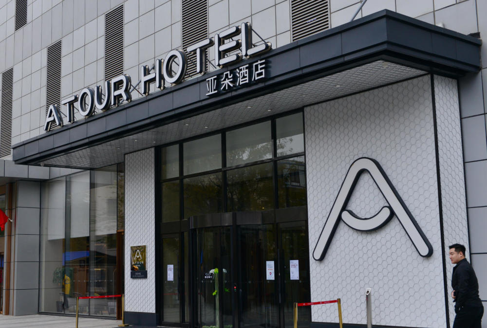
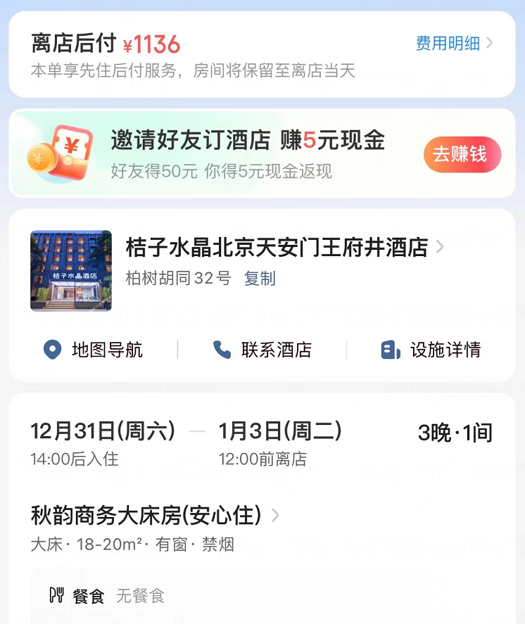
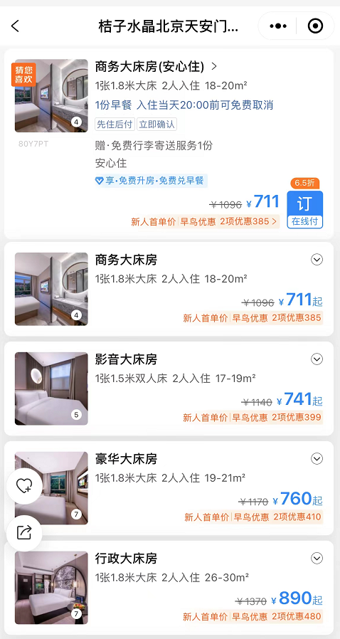
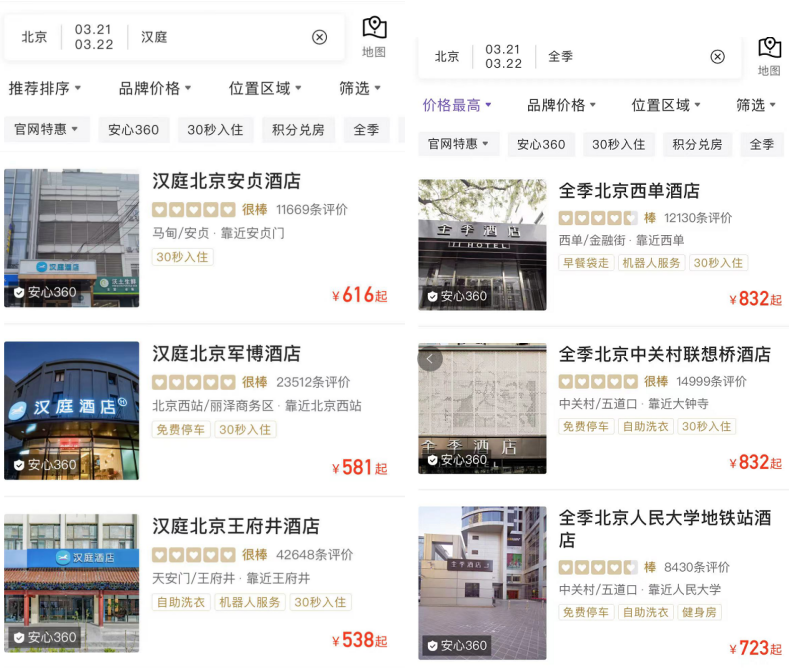

# 一线城市亚朵、全季、如家排队涨价，消费者：价格在广州能住四星级了

最近几天，准备去北京出差的曹先生发现，如家、汉庭、速8等快捷酒店价格普涨，地段较好的已经涨到600元以上。他感叹：“这个价格在广州都能住到四星级了。”

感受到北京快捷酒店价格上涨的，还有计划旅行出游的王女士。3月15日，她告诉红星资本局，她和家人计划下周去北京旅游，想预定天坛附近的一家汉庭酒店，本以为300多元就能订到，结果已经涨到了500多元，住4晚就得花超2000元。

2023年春节已经过去，距离五一假期还有一个多月。在酒店行业业内人士看来，这段时间应该是春节旺季的价格回落期，但目前的酒店价格却在不断走高。

_↑资料配图
图据IC Photo_

**如家、汉庭、桔子、亚朵变贵了**

**快捷型、经济型酒店价格集体上涨**

距离五一假期还有1个多月，酒店的价格已经在不断上涨，北上深等城市尤为明显。

对于北京酒店价格的变化，李女士深有体会。
**3月15日，李女士向红星资本局展示此前的酒店订单，去年元旦节住的桔子水晶酒店（北京天安门王府井店）是378元/晚。到了今年3月，价格翻倍，涨到711元/晚，五一节预订价更是涨到了1500元/晚。**

_↑李女士展示酒店订单价格变化_

经历酒店价格上涨的不仅是李女士一人。红星资本局搜索发现，在微博、小红书等社交平台，有不少网友发文称，最近一个月，北京的快捷型、经济型酒店价格集体上涨。

部分热门地段的如家、汉庭突破500元，全季、桔子酒店基本600元以上，亚朵等更是普遍涨到700元以上。

_↑汉庭、全季3月21日价格，截图来自华住会_

快捷、经济型酒店价格上涨，让商旅出差人士烦恼不已。半个月前，安徽的林先生到北京出差，为了方便见客户，他预定了中关村附近的一间如家酒店。不含早餐、设施简单的房间，此前价格在300元/晚左右，林先生预定时价格已经涨到了459元/晚，超出公司出差住宿标准不少。

在酒店从业人士看来，如今价格上涨已是行业共识。3月15日，北京朝阳门一家全季酒店相关负责人告诉红星资本局，周边的酒店都涨了，不光其一家涨价。

“从2月开始，来北京出差、旅游的人就多了起来，市区四环内酒店的价格都涨了。”上述相关负责人介绍，该酒店一共有180间房，之前每天就住50-60间，现在客人多了起来，差不多每天能住满120间。

客流增多，价格也翻倍。红星资本局了解到，3月中旬，这家全季酒店的门市标价超过700元/晚。上述相关负责人表示，去年11月，酒店最低价格只要300元左右。

除了北京，上海、深圳、成都等城市的快捷、经济型酒店价格均有不同程度的上涨。携程方面向红星资本局提供的数据显示，最近一个月（2.14-3.13），成都三星及以下酒店订单量同比增长90%，预订均价同比增长29%

**酒店价格会越来越贵？**

**旅游热度不减、商务出行频繁**

旅游出行叠加商务活动，是北京、上海等城市的经济型酒店集体涨价的主要原因。

一方面，随着旅游市场的恢复，人们的出游热情持续高涨。红星资本局注意到，今年春节过后，旅游市场的传统淡季并没有到来。
**从携程平台获得的一份数据显示，截至2月20日，在平台上预订2至3月国内自由行产品的订单量同比增长446%，跟团游预订量同比增长188%。**

另一方面，商旅出行需求也在快速回暖。3月初，有关“报复性出差”的话题在社交平台引起热议，据媒体报道，随着出行限制取消，各大企业的差旅需求急速增长，员工与公司老板都在“报复性出差”。一位上海投行业人士告诉红星资本局，春节后至今，除了周末几乎都在出差。

酒店行业的数据变化，也可以印证这一点。据新华财经，首旅如家酒店集团最新数据显示，旗下中高端事业部2月8号RevPAR（平均每间可供出租客房收入）同比2019年恢复至142%，出租率90%以上的有72店。集团旗下商旅事业部出租率90%以上的有582店，其中北京、成都、上海等多地“如家系”酒店RevPAR达420元以上。

财通证券也在研报中提到，近期商旅需求超预期修复，京沪等城市满房数量、RevPAR超2019年同期。此外，成都、杭州等也表现亮眼，主要因今年经济活动回暖、大型会议会展需求大幅释放且排期有所提前。中高端占比提升、行业供不应求下推动酒店量价齐升，带来业绩向上弹性。

酒店行业内人士也有着相同的预期。“今年上半年可能都是这个（上涨）的价格了，到五一还会更高。”3月15日，北京朝阳门一家全季酒店相关负责人对红星资本局说。

红星资本局注意到，3月14日，工人日报发文《酒店业“再出发”，先别急着“涨房价”》，其中提到，面对今年春节和3月份的经营数据，有业内声音认为，酒店业有必要专注于提高已售客房平均房价，既然市场热度已经超过了2019年，平均房价也应当对标2019年恢复。但是要认识到，酒店的消费群体较3年前已经发生较大变化，酒店业要做的是及时调整产品和服务，对标消费群体的新需求，而不是先急着“涨房价”。

红星新闻记者 强亚铣

编辑 杨程

