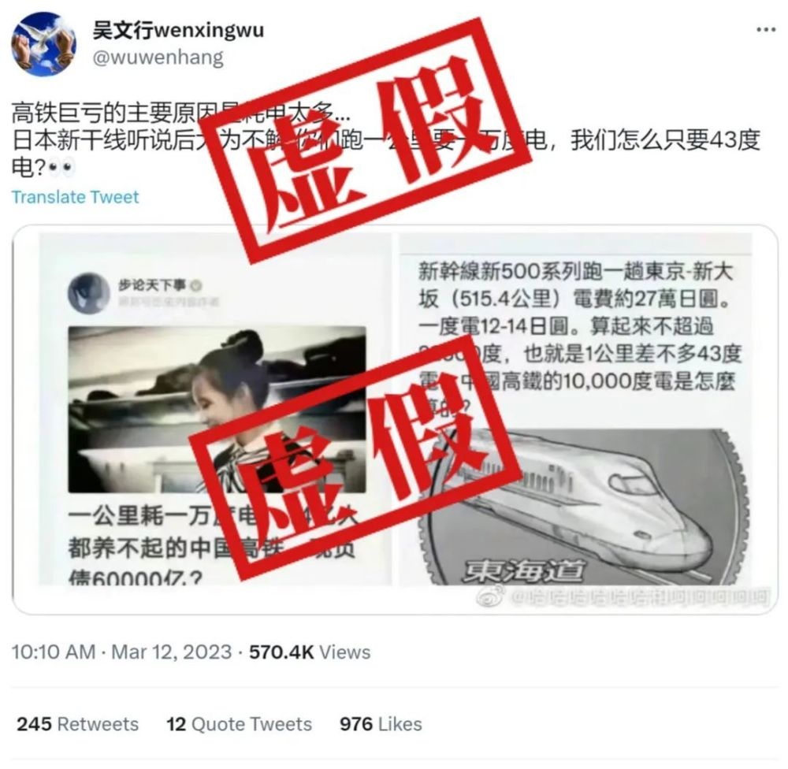
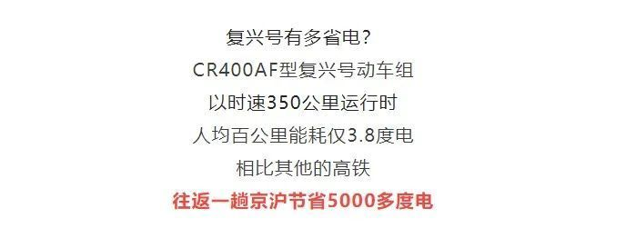

# 中国高铁“一公里耗电一万度”？太假了！

**速览**

有关中国高铁的官方资料显示，时速350公里的高铁每小时耗电9600度，时速250公里的高铁每小时耗电4800度，照此推算，每公里耗电分别为27度和19度。网传说法很可能对时间和里程单位偷换了概念，毫无事实依据。

**事件背景**

近日，中外社交平台上均流传一则消息表示，“高铁巨亏的原因是耗电太多……一公里耗一万度电。”该消息还对比了日本新干线，称其“只要43度电”。然而，这个数字真的经得起推敲吗？

**明查**

根据推特谣传的图片查找出处，网传说法最初来自一个名为“硬核科技迷”的微博用户，不过其目前已将原文删除。

中央纪委国家监委网站2022年7月发布的文章指出，“列车运行速度越高，对线路基础设施质量和外部环境要求越高。实现常态化按设计的高限标准时速高标运营，列车运行的阻力、能耗、车内噪声都会大大增加。”目前，在京沪高铁、京津城际、京张高铁、成渝高铁、京广高铁京武段近3200公里的线路上，“复兴号”常态化按时速350公里运营，我国也是世界上唯一实现高铁时速350公里商业运营的国家。

**那么如果以此速度为准衡量高铁耗电量，网传说法可靠吗？**

根据中国国家铁路集团的统计，在节能方面，中国高铁人均百公里能耗为飞机的18%和大客车的50%左右。而以“复兴号”高铁为例，CR400AF型复兴号动车组以时速350公里运行时，人均百公里能耗仅3.8度电。

结合国铁集团在2021年公布的CR400AF-
A型长编组复兴号定员数1193人，粗算该组动车以时速350公里运行时的百公里能耗也只有4533度电，远没有网传说法夸张。而较新的CR400AF-
Z型复兴号智能动车组，在节能环保上优势更加明显，以时速350公里运行时，人均百公里能耗要略低于3.5度。

_“中国铁路”2021年8月28日发布的文章截图_

另一方面，“南宁铁路”2021年8月的数据指出，以南广高铁“蓝暖男”复兴号动车组时速250公里运行为例，在满载的情况下，列车从南宁直达广州，全程约562公里，根据车辆人机接口显示屏数据，大约需要消耗7200度电，人均百公里能耗仅为2度电。而对比目前新能源汽车的百公里耗电量，来自国家新能源网的数据显示，平均为14.7度。

此外，上海科协2021年9月发布的文章援引了全国能源信息平台的数据，指出，“时速350公里的高铁每小时耗电9600度，时速250公里的高铁每小时耗电4800度。”照此粗算，时速350公里的高铁每公里耗电约为27度，时速250公里的高铁每公里耗电仅约为19度。网传所谓“一万度电”有可能是模糊了时间单位刻意为之。

_图源：“上海科协”公众号_

对网传日本新干线图片进行反搜，该图是东海道新干线东京-
新大阪“超级特快”开通50周年的100元纪念硬币，发行于2014年。按照2010年运营新干线的司机中津英二的说法，日本新干线500系列在当年以200公里左右的时速运行2小时17分钟，耗电量就要达到两万度。因此，不论是从时效、耗电量还是运行速度来看，网传这个所谓的比对结果并不成立。

_东海道新干线运营司机2010年发布的文章截图_

综上所述，网传说法罔顾事实，有关中国高铁耗电量的公开数据显示，“时速350公里的高铁每小时耗电9600度，时速250公里的高铁每小时耗电4800度。”网传日本新干线图片实为2014年日本东海道新干线开通50周年纪念币，相关数据也不完全准确，所谓的数据比对结论并不成立。

