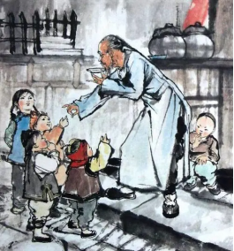
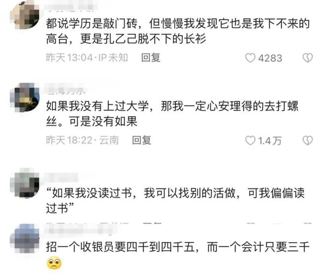
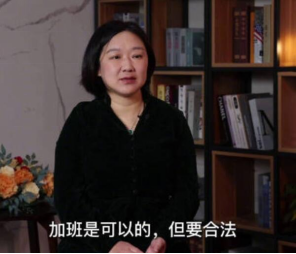
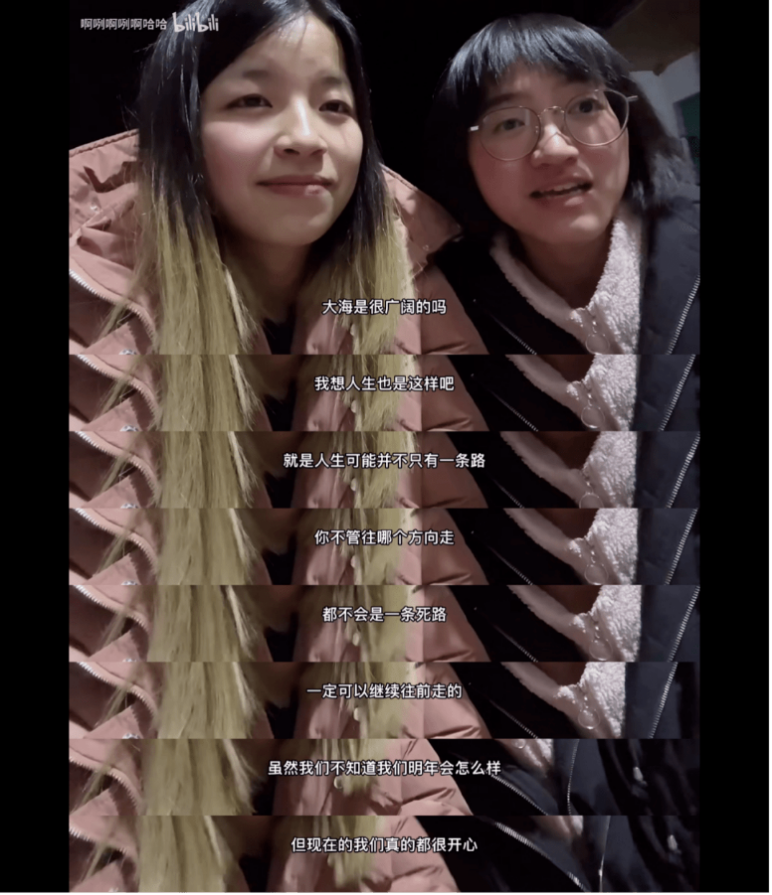

# 央视网：正视“孔乙己文学”背后的焦虑

“学历不但是敲门砖，也是我下不来的高台，更是孔乙己脱不下的长衫”。

近日，一句“失意书生”的独白登上热搜，引来大量年轻人的共情。他们说：少年不懂孔乙己，读懂已是书中人。

说的是念了大学，却找不到心仪工作的困顿和苦闷。

**年轻人为何与孔乙己共情？**

孔乙己是鲁迅小说中的经典人物形象。同名小说《孔乙己》创作于1918年，发表在1919年4月的《新青年》第六卷上，是鲁迅先生最喜欢的作品。

在小说中，孔乙己的形象是善良、迂腐、穷酸、爱面子。鲁迅先生曾说，孔乙己是酒馆里唯一一个站着喝酒还穿长衫的人。

站着喝酒，说明没钱，没地位，穷困潦倒；穿长衫，代表维护着自己体面的身份，甚至宁愿去偷，也不愿意去做他以为的低贱的赚钱的事。

如今的一些刚走上社会的年轻人，用“孔乙己文学”映衬自己当下的处境。

最近三年，我国高校毕业生规模持续攀升。2022年高校毕业生人数达到了1076万，创出历史新高。同时，由于经济下行压力加大，就业情况受到冲击，找一份专业匹配且待遇尚可的工作，肉眼可见变得越来越难。即使找到工作，也要为收入下降等不确定性焦虑。

在一些人看来，学历没有兑现利好，而是成了身上难以脱下的“孔乙己长衫”：自己受过高等教育，曾经意气风发，步入社会后发现如此“内卷”，象牙塔的知识无法满足工作所需，骨感的现实已经支撑不起丰满的理想。

巨大的反差，让一些人情绪消沉，不愿意从事比自己预期低的工作，尽管这个工作可能是自己喜欢的。这种不上不下的“悬浮”状态，让他们感觉自己像极了鲁迅笔下的“孔乙己”。

**互联网文学背后的焦虑**

近年来，互联网上颇为流行“XX文学”，比如之前的“废话文学”“林黛玉文学”“鼠鼠文学”，都属于网络时代的新玩法。

网友们用带有调侃意味的文字展示个性，寻求点赞，识别圈层。这种玩法互动性强，手法略显夸张，有时候显得非常“丧”。

**但自我调侃只是自娱自乐，情绪宣泄，不是洪水猛兽，不必过于大惊小怪，上纲上线，更不要一味地站在高处批判。**

如今初入社会的年轻人，在求职和生活中面临较大的压力，很不容易。“孔乙己文学”背后的焦虑，是生活状态一种正常的情绪性反映。

如今早已不是“咸亨酒店”的天下，全社会不会对年轻人的困境袖手旁观。在今年的全国两会上，代表委员们为破解年轻人的难题纷纷建言献策。

建立公平的就业环境，是解决就业问题的重要一步。全国人大代表刘希娅提出建议，各级政府部门、企事业单位不得随意拔高用人学历要求，在用人上不唯学历，不拔高学历，不得设置对同等职业教育学历的歧视性门槛。

保障包括年轻人在内的劳动者的休息权也刻不容缓。全国政协委员蒋胜男在提案中表示，近年来互联网、金融、制造业等行业因特殊岗位临时赶任务存在的“996”情况，很多企业非临时的过度加班。“996”成为常态不仅对劳动者的身体健康和家庭生活造成了极大的影响，且严重违背了劳动法规的规定。类似的提案和议案还有很多，很接地气，也很有针对性，推动着问题一步步解决。

_政协委员蒋胜男_

当代青年正处于人生中最丰富、最具活力、最有冲劲的阶段，是社会发展的中坚力量。
**在情绪图谱中，“焦虑—羞耻—绝望”是一个闭环。全社会应该协同发力，协助他们走出暂时的困境，走上“焦虑—勇气—希望”的正循环道路。**

**长衫困不住当代青年**

话又说回来，“孔乙己的长衫”就是现代青年的学历吗？也未必。

长衫是古代社会知识分子进入士绅阶层的常服。久而久之，长衫被当作知识分子的标志性符号，用来区别身份。

落魄的孔乙己穿着又脏又破的长衫被人嘲笑，固执地将读书人的身份进行到底。长衫很好地展示了这位50多岁的落第文人的迂腐。这和当代年轻人的整体形象相去甚远。

根据信号理论，学历是个体能力和潜力的识别信号。获得学历者只能表明个体在某一阶段完成某项能力测试，和身份并无明显关联。

学历的价值，只有在创造性的实践活动中，充分发掘自身潜力的情况下才能得以体现。孔乙己之所以陷入生活的困境，不是因为读过书，而是放不下读书人的架子，不愿意靠劳动改变自身的处境。长衫是衣服，更是心头枷锁。

**读书获取学历，可以丰富我们的灵魂，提升我们的能力，扩充我们的格局，让我们以书本知识为起点，看到更广阔的世界，而不是把人分为三六九等，给自己设置条条框框，让学历成为束缚手脚的“长衫”。**

不久前，一则标题为“我：毕业5年，存款5000 她：中传硕士，火锅店保洁”的视频登上热搜。

视频中的两位主人公均为双一流大学的毕业生，面对镜头自我调侃着各自毕业后的“高开低走”。她们并不是没有机会取得别人眼中的成功，而是辗转之后，选择理想与现实二者之间的平衡。

哲学泰斗伏尔泰曾说：“人生布满了荆棘，我们想的唯一办法是从那些荆棘上迅速跨过。”自嘲一下是为了舒缓压力，为了更好地前进，但不要沉溺其中。管理好自己的心态，正确面对逆境，才能厚积薄发。

一年之计在于春，春天是万物复苏的季节，也代表着生机勃勃的开始。经济正在复苏，就业形势正在逐渐改善，青年一代将会有更广阔的平台、更多样的机会和选择。

一时的困难不等于一生的失败。未来属于青年，希望寄予青年。 **孔乙己的时代一去不复返了，当代有志青年绝不会被困在长衫中。**

