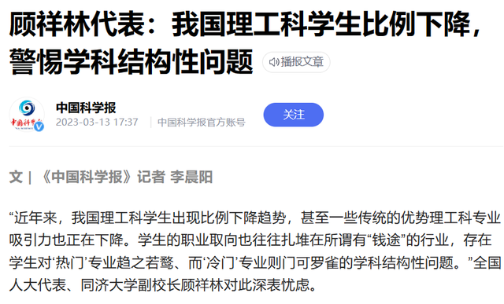
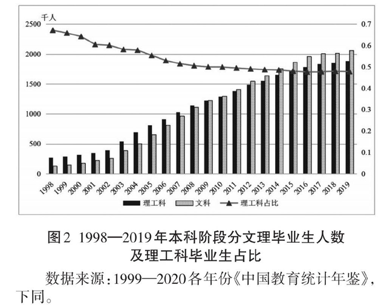
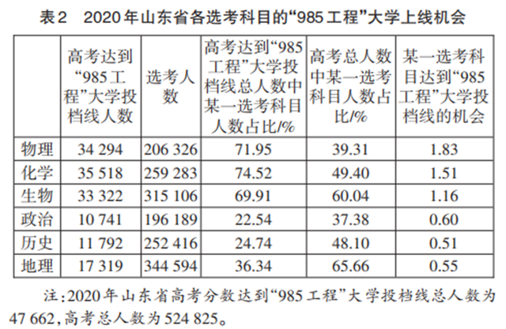
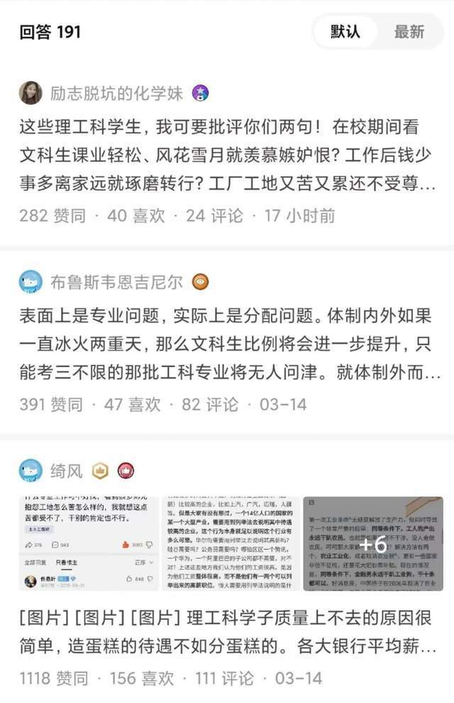
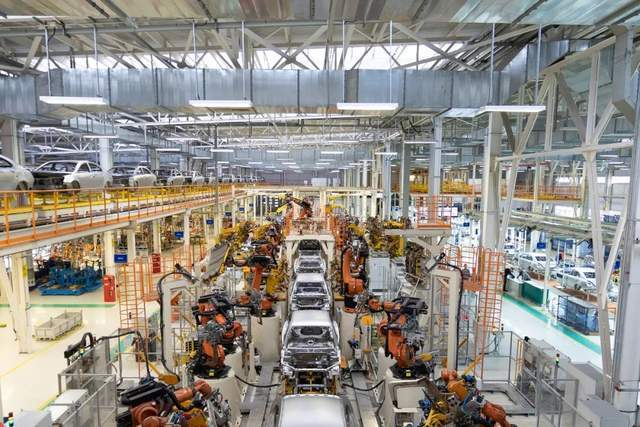

# 学理工科的人少了：文科的旗舰型岗位，给年轻人选择专业造成了误导

**文科理科，更像是一个双螺旋结构，相互扶持，没有理科，缺乏技术创新，社会的生产力很难提高；但缺乏文科，社会的发展会失去方向，社会为了发展而发展。**

**冰川思想库特约研究员丨刘远举**

近日，同济大学副校长顾祥林指出，近年来，我国理工科学生出现比例下降，引发热议。

_图/图虫创意_

在顾祥林看来，当前，支撑我国实现科技引领的拔尖创新人才的自主培养体系尚有不足，我国人才自主培养质量有待提高。其原因主要是：高等教育存在数理基础不牢、交叉基础不实的问题；对学生解决未知问题能力的培养存在模式滞后，手段不全的不足。
**我国理工科学生比例下降，存在学生对“热门”专业趋之若鹜、而“冷门”专业则门可罗雀的学科结构性问题。**

对此，顾祥林建议，仍需强化我国STEM教育，培养拔尖创新人才。(注:STEM是科学(Science)、技术(Technologv)、工程(Engineering)、数学(Mathematics)的缩写。)一是丰富学科专业内涵、强化数理基础训练、促进学科交叉融合；二是深化教育教学改革，提升人才培养内涵；三是以兴趣驱动助学生成才，以理想情怀促终身发展。

理工科学生比例下降怎么办？如何破解上述难题？不过在我看来，在解决问题之前，先要搞清楚这个问题，到底是不是一个问题。

01

第一个原因，中国的理工科比例本来就比其他国家高很多。

在上世纪中后期，中国社会有这样一个共识：学好数理化，走遍天下都不怕”，学生选专业，都偏重理工科。而且，文科本来就很少，像经济学、社会学这样的学科，根本就没有。

这个现象是受苏联的影响。1947年，中国文科生比例为47.6%，新中国成立后，理工科比例上升，达到了70%左右，一直在改革开放后，才逐渐降低，到了2019年，理科生比例为47.8%。

_图/网络_

文理科发生了巨大的变化，但从全球看，中国理工科人才数量大，比例高。

**在过去20年里，中国还培养了6000万工程师，是全世界拥有工程师最多的国家，仅工程师数量就接近法国总人口了。**

2014年的时候，科技部公布过一组统计数据，当年中国科技人力资源总量达到7512万人，比上年增长5.7%。其中大学本科及以上学历的科技人力资源总量为3170万人，比上年增长7.7%。

根据美国《科学与工程指标2016》，2013年美国科学家工程师总量为2110万人。也就是说，中国本科及以上学历科技人力资源相当于美国的科学家工程师，投入研发活动的人力规模都已经成为全球最高的国家。

从文理科比例看，中国理工科占比高于美国、德国、英国的39%-40%，高于法国的35%。所以，中国理工科学生比例下降，本身未必就是一个问题，而是回归常态。

02

第二个原因，扩招。

学好数理化，需要的是抽象思维，这是人类智能的顶级组成部分。实际上，的确没有那么多人适合学物理、化学、数学。

**能学好理工科的，更容易考上大学。**
有人收集39所“985工程”大学在山东省招生投档分数线等数据，来计算不同选考科目的重点大学上线机会。发现达到投档线的人，71.95%都选了物理。这就是说，能学好理工科的，往往都能上好大学。

_图/网络_

反过来说，考不上好大学的，往往是学不好理工科的。以前考大学的比例不高，能上大学的都是人群中的前10%，随着大学的扩招，更多的人能上大学了，上大学的人变为了人群的前30%、40%。

毋庸讳言，原本学不好理工科人，也可以参加高考了，自然就会有更多的人选择避开物理、化学。到了研究生阶段，为了上研究生，很多人为了避免考数学、线性代数、概率，会避开经济学、金融，选择更“文”的文科。

**所以，理科比例下降，这是扩招带来的一个必然现象。**

现在，公务员已经成为大学生期望的重要出路之一，但公务员毕竟属于社会管理领域，更多的需要文科生，理工科专业的大学毕业生，只能考“三不限”的岗位。这也会降低学生选择理工科的意愿。

有人抱怨说，体制内外如果一直冰火两重天，那么文科生比例将会进一步提升。但这个是改变不了的现实，也不该改变，因为公务员毕竟不需要进工厂拧螺丝，他们需要懂边际成本、沉没成本、公地悲剧、能区分权利与权力，才能更好地制定政策，提供公共服务，管理社会。

如果一定要穷究，问题也不是公务员为何偏爱文科生，而是公务员竟然成为了就业乃至专业分科的导向。

03

第三个原因，文科的旗舰型岗位，给年轻人选择专业造成了误导。

有人把顾祥林的这个提问，拿到了知乎上，参加讨论的人很多，有人说：有人说各大银行平均薪资55w-60w。国内几个制造业企业能给得了这个薪资？比亚迪的d3级总工一年也就是50-60w。你爬到总工水准，也就是金融业的平均线而已。爬到d2的总工的难度几乎相当于院士，一年90w-110w，而且，总工是没有其他灰色收入的。

_图/网络_

这个话既不对，也对。

**说它不对，是因为受到了文科“旗舰岗位”的误导。**
所谓旗舰岗位，就是一个领域中最耀眼的岗位，是舆论放大镜与聚光灯下的岗位，但这对行业来说其实是少数。比如，学金融，能进入各大银行、投行的是同辈人中顶尖的佼佼者。

你以为学金融都能进银行，其实大多在做中介、做文员。但这个误导还是会让很多人认为，绝大多数理科生终其一生就是在一项技术中扎根，升迁的概率远远低于文科类同期毕业的学生。这就会降低年轻人学理工科的意愿。

说这句话对，是因为理工科给人的感觉，的确工资较低。但这也是符合规律的。

04

这就是第四个原因：经济发展的必然。

制造业的效率提升，最终依靠的是机器，机器是依靠钱去买的。在经济学的经济增长公式中，机器会被分解为两个因素：资本和技术。

这就进入下一环逻辑。

一方面，发明技术的人，技术的专利权所有人，是可以靠专利获得巨大的报酬的。但另一方面，现代化大生产之下，爱迪生单打独斗的时代已经过去了，
**大多数时候，人是依靠合作，在企业、在研究机构中才能发明出东西。**

而且，技术研发有风险，这个风险又是资本承担的，往往资本是技术专利的所有人。换言之，制造业的大规模生产效率提升，最终的驱动因素其实是资本。创新的利润大多归了企业，归了承担风险的资本，工程师只占一小部分。所以，工资自然会较低。

_图/图虫创意_

而第三产业，更多的是人的活动，直接由人的活动产生，自然人会得到更高的报酬。而且，我们所看到的高薪的文科，其实是文科的顶层。这些岗位的活动，直接由人产生，与人的行为息息相关。日常生活中所能接触的是中介，中介在谈房价的时候，上下一个点，就是几万元，再抽成个50%，就显得赚钱容易。

不要以为这是不对的。欧美能取得创新上的成就，正是一直尊重了这个规律，而不是出于直觉要去改变这个规律。这违反人的朴素直觉，但却符合经济学的道理，
**而经济学的道理其实是人性的必然，是不可撼动的。**

文科理科，更像是一个双螺旋结构，相互扶持，没有理科，缺乏技术创新，社会的生产力很难提高；但缺乏文科，社会的发展会失去方向，社会为了发展而发展。

“给岁月以文明，而不是给文明以岁月”，《三体》中的这句话，是一个很好的总结。而这句话出自帕斯卡的：给时光以生命，而不是给生命以时光。(To the time
to life, rather than to life in time) 是说要让活着的每时每刻都要精彩，而不是让生命虚度，随着时光衰老。

换言之，不以人为目标的发展，是不可持续的，而人文学科，则能保障发展的目标，保障人为目标。毕竟，“人民对美好生活的向往，就是我们的奋斗目标”。

