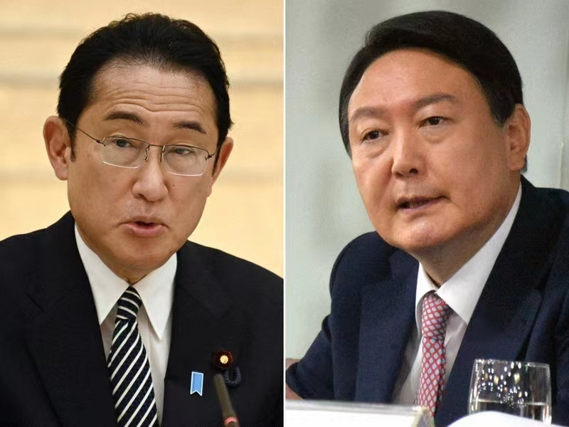

# 尹锡悦访日前突然提中国，传递什么信号？中国学者：是说给日美听的

【环球时报驻日本特派记者 岳林炜 环球时报特约记者 韩
雯】韩国总统尹锡悦将于16日至17日访问日本。在出发前一天接受美联社等外媒采访时，尹锡悦特意强调此行的迫切性，“我们不能浪费时间，对紧张的韩日关系置之不理。”彭博社15日称，尹锡悦认为，与日本达成协议可以结束两国间的不和，为改善商业关系开辟道路。对于尹锡悦此行，韩国国内声音复杂。韩国共同民主党党首李在明15日在国会召开的共同民主党最高委员会会议上抨击尹锡悦政府的对日外交，称“韩国国格已经跌入谷底，仿佛听到了日本的嘲笑声”。

**韩日走近有利于对华合作**

“如果作为全球贸易强国和制造业领导者的韩国与日本在技术层面达成合作，我预计这将产生巨大的协同效应。”尹锡悦15日在接受采访时表示，期待韩日两国通过技术合作建立互信关系，为稳定国际经济秩序作出贡献。

尹锡悦在采访中还特别提到中国，“韩国和日本也分别与中国有着密切的经济联系，”尹锡悦称
，“我相信加强韩日合作将有助于我们两国稳定地推进与中国的经济关系。”尹锡悦还称，韩国、日本和中国将在经济领域就共同关心的部分开展合作，包括稳定供应链，以及应对健康和气候危机问题。

对于尹锡悦访日之前突然提到中国，中国学者吕超在接受《环球时报》记者采访时表示，一方面，尹锡悦在对日和解的道路上，决心一条道走到黑。但另一方面，他也担心与日本、美国的靠近会影响韩国与中国之间的关系。与其说他这话是说给中国听的，还不如说他这话是说给日本和美国听的，意思是，你们不要逼我太紧，不能因为与你们的走近导致与中国的关系有所隔离和疏远。

**在野党痛斥“屈辱外交”**

“尹锡悦总统应该停止对日本的屈辱外交！”《韩国日报》称，韩国最大在野党共同民主党议员们15日在首尔总统府前举行阻止尹锡悦政府展开对日屈辱外交的记者会。出席活动的该党党鞭朴洪根痛批政府的赔偿方案称，加害国真正的道歉、反省，以及“战犯企业”最低限度的赔偿全都缺失。共同民主党“对日屈辱外交”对策委员长金相熙（音）表示，歪曲历史正义、否定大法院判决是反宪法的国基紊乱。

共同民主党党首李在明15日也警告尹锡悦政府的对日外交称，如果把强征劳工受害者当作祭品，来筹备韩美日军事同盟的开端，那就是打开了国民反对的潘多拉魔盒，“韩国国格已经跌入谷底。我仿佛听到了日本的嘲笑声。”另一边，执政党国民力量党当天也发起反击。韩联社称，国民力量党批评共同民主党“不负责任的反日煽动”，要求共同民主党立即道歉。

**日本准备了“蛋包饭”**

据共同社援引韩国总统府发布的尹锡悦访日行程安排，在16日下午与日本首相岸田文雄的会谈中，双方将就落实原被征劳工诉讼问题的解决措施，以及强化包括应对朝鲜问题在内的日美韩安保合作进行磋商，双方力争在经济和文化等众多领域实现关系正常化。尹锡悦16日还将出席在日韩国人举办的午餐会，17日他将会见日本政治和经济界人士，其中包括即将担任日韩议员联盟会长的日本前首相菅义伟和自民党副总裁麻生太郎等。

《日本经济新闻》报道称，16日会谈后，日本政府将为尹锡悦举办晚宴——让他回味“记忆中的味道”。据称，晚宴首站是位于东京银座的日式牛肉火锅（寿喜烧）店。第二家则是根据韩国方面意向确定的一家西餐厅，因为尹锡悦曾在访问东京时吃过蛋包饭，这成为他“记忆中的味道”。

《读卖新闻》15日刊登了对尹锡悦的采访，包括头版头条在内的9个版面对此进行了详细报道。尹锡悦在采访中称，自己访问日本本身就意味着两国关系取得了巨大进展。韩日两国关系正常化，符合两国共同利益。共同社15日发表评论称，将日韩间的课题推进到何种程度，是本次会谈成败的关键。

