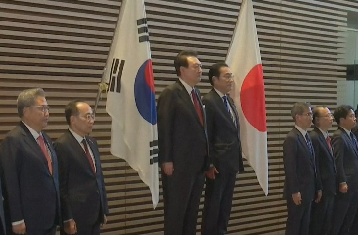
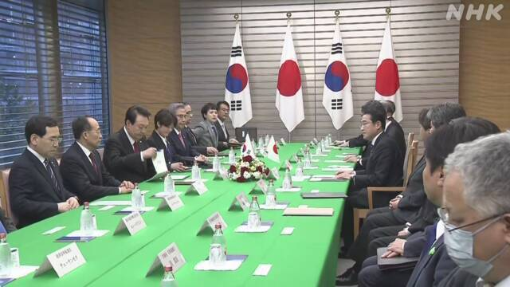

# 尹锡悦：日本是共享普世价值的全球议程伙伴

【编译/观察者网
李焕宇】3月16日，韩国总统尹锡悦抵达日本并开启为期两天的访问。尽管在“二战强征劳工受害者”这一历史问题上的处理使得韩国总统此行备受争议，但尹锡悦坚持认为，两国不应再为历史恩怨对抗，国民应“共同迈向未来”。

抵日当天，尹锡悦同日本首相岸田文雄举行会谈，在致开场白时尹锡悦表示，日本与韩国共享自由、人权、法治的普世价值，是在全球议程上要合作的伙伴。

_尹锡悦同岸田文雄会面 视频截图_

据韩联社3月16日报道，尹锡悦当天下午在东京的首相官邸同岸田文雄举行会谈，两人在举行23分钟的小范围会谈后随即举行扩大会谈。尹锡悦在扩大会谈致开场白上表示，两国关系因悬而未决的诸多问题遇到困难，在此向两国国民宣告韩日关系崭新的开始，有着特别的意义。

尹锡悦宣称，“一直以来支撑国际和平与繁荣的自由民主主义面临重大挑战”，韩日合作的必要性进一步凸显；朝鲜与日俱增的核武不仅对东亚，也对国际社会的和平稳定构成重大威胁。

他认为，日本与韩国共享自由、人权、法治的普世价值，是在全球议程上要合作的伙伴。两国应当紧密团结齐心协力，明智地对付朝鲜的核威胁和国际难题，相信能在此次会谈上进行有益的讨论，争取将陷入停顿的韩日关系引向合作和互惠发展的轨道。

据日本广播协会（NHK）报道，岸田文雄在会谈中对尹锡悦表示热烈欢迎，他说：“在迎春之日能够有机会共同开启日韩关系的新篇章，我感到非常高兴。”两人还就重启中断10年以上的互访“穿梭外交”达成了一致。

_尹锡悦访日期间的争议一幕：面对本国国旗行抚胸礼，面对日本国旗和岸田一同鞠躬
NHK视频截图_

会谈结束后，尹锡悦在记者招待会上表示，两国领导人会谈让韩日关系从“历史不幸”中走出，开启“韩日合作新时代”迈出了第一步，两国将加紧讨论加强安全、经济、人文交流等多领域合作，并建立“韩日经济安全对话”机制。

岸田也表示：“双方就加强政府间在政治、经济、文化等多个领域的沟通等问题交换意见。”

此后，两国元首在东京银座的餐厅共进晚餐。NHK称，基于尹锡悦的个人喜好，两人吃了寿喜烧和蛋包饭。

_两国首脑会谈现场
图片来源：日本广播协会_

由于在关键的“二战强征劳工受害者”这一历史问题上让韩方基金会代为赔偿，尹锡悦近期成了韩舆论风暴的中心。他辩称：“相信能早日治愈受害者的伤痛，另一方面也能让韩国国民理解政府为建立面向未来的日韩关系所作的努力。”

尹锡悦在访日前夕接受采访时宣称，日本已经“通过历届政府，就过去的殖民统治表达了深刻的悔恨和衷心的道歉”，两国关系不应再为历史恩怨对抗。他还敦促两国“防范双边关系被国内政治利用”，认为现在“重要的是确保这种立场和行为坚定不移地继续下去”。

日本和美国则对此表示赞赏，美国驻日大使还在上周称赞韩日领导人“通过了测试”，称“两位领导人都表现出了面向21世纪并充分利用21世纪的勇气和魄力”，将未来放到比历史更重要的位置上。

日本还在16日解除对三种半导体制造原材料出口韩国的限制，对此韩国也决定撤回因此向世界贸易组织（WTO）提起的争端诉讼。

对于日韩近期的互动，中国外交部在今天的记者会上表示，日本军国主义对外侵略和殖民统治，曾给包括中韩在内的亚洲国家造成深重灾难。前事不忘后事之师，我们一贯要求日本深刻反省侵略历史，以诚实和负责任的态度妥善处理历史问题。在此基础上，同亚洲邻国发展正常国家关系。

中日韩互为重要经贸合作伙伴，共同维护地区和全球产供链稳定畅通符合三方及地区共同利益。中方反对个别国家搞封闭排他的小圈子，希望日韩关系能够朝着有利于地区和平稳定与繁荣的方向发展。

**本文系观察者网独家稿件，未经授权，不得转载。**

