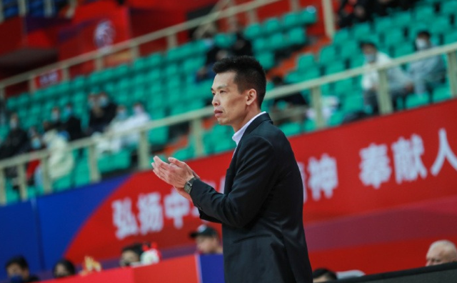

# 正式下课！解立彬离开北京主教练岗位 内讧＋5战4败恐是导火线

北京时间3月16日，根据北京首钢的官方社交媒体透露，解立彬因为身体原因暂时离开北京首钢主教练职务，接下来将会由助理教练埃内斯特-
莱登担任球队代理主教练，指挥球队本赛季余下比赛。

对于解立彬下课，不少球迷没有感到太多的意外，毕竟这名年轻主教练缺乏足够带队成绩，像第三阶段连续不敌上海+深圳就很说明问题，解立彬并没有完全掌控这支球队的个人能力。特别是第二阶段中期，有媒体爆料，解立彬的权威被老队员挑战，对于他的战术和用人保持质疑的状态，按照北京部分老队员在更衣室的话语权，丝毫不会比解立彬差多少，当成绩无法达到预期，他又想去大幅度调整战术体系和阵容，解立彬下课或许就是情理之中的事情。

当然，解立彬也不是首次中途下课，此前雅尼斯回归到球队执教前，解立彬闹出“险些”罢赛的操作，遭到CBA公司的重罚，而当时的媒体报道，首钢管理层涉及到解立彬是否有能力出任主教练职务，同样是曝出质疑的状态。

后续雅尼斯正式回归到球队执教，解立彬则是退居二线，成为助理教练员，如今莱登出任主教练的角色，是否也意味着解立彬愿意接受助理教练的位置，显然也是外界关注的焦点。

这一支北京首钢目前的战绩是19胜15负，排在积分榜第八的位置，整体来说应该是可以接受的范围，但是过去5场比赛输了4场，不排除又有老队员质疑解立彬的战术用人。小外援吉布森和约翰逊个人能力低于联盟平均水平，利夫也在第三阶段状态悬崖式下滑，而老队员方面，方硕，翟晓川，朱彦西，田宇翔，李慕豪状态不稳定，他们又占据大量的战术地位和球权，与一些00后球员相比，大量的老将在队肯定是影响年轻主教练的权威，甚至会爆发观点不一样的内讧。而莱登上任后，北京首钢的情况是否会大幅度好转，值得球迷和媒体去关注。

