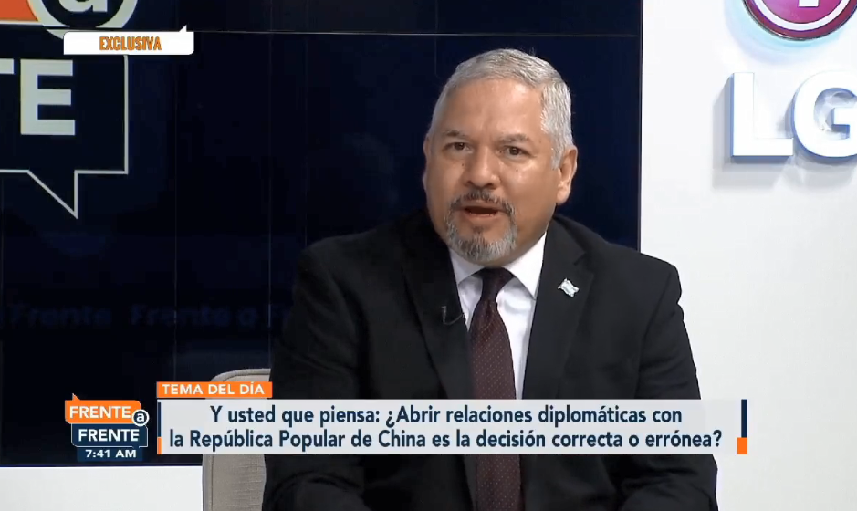
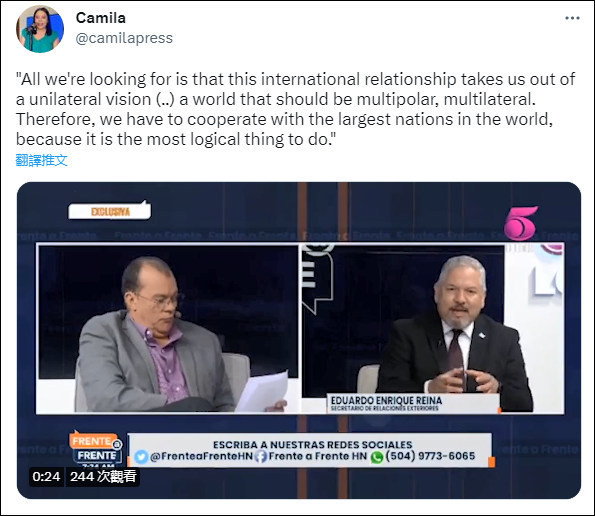

# 洪都拉斯外长解释为何与中国建交：出于“实用主义”而非“意识形态”

（观察者网讯）综合洪都拉斯《先驱报》、路透社等媒体报道，洪都拉斯外交部长爱德华多·雷纳（Eduardo
Reina）当地时间3月15日接受洪都拉斯电视节目“Frente a Frente”采访，详细介绍了洪都拉斯为何寻求与中国建交。

雷纳表示，洪都拉斯总统希奥玛拉·卡斯特罗（Xiomara
Castro）的决定，是为了促进洪都拉斯与一个世界主要大国的经贸关系。“政府的计划中提到了这个意图，我们正在追随一个我们迟迟没有加入的全球趋势，我们正寻求更多的投资与贸易，几乎所有国家都与中国有联系。”

“我们需要投资，我们需要合作。”雷纳表示，洪都拉斯寻求与中国正式建交是出于“实用主义”，而非“意识形态”。

_洪都拉斯外交部长爱德华多·雷纳
视频截图_

当地时间3月14日，卡斯特罗在其个人推特上发文透露，她已指示雷纳处理与中国正式建立外交关系的相关事宜。

卡斯特罗出身洪都拉斯左翼政党“自由和重建党”，当选总统前就表示将与台当局“断交”，并与中国建立外交关系。其表态受到美国政府“关切”。

去年11月，美国务院不具名高官在一次电话吹风会上称，美国务院西半球事务助卿尼科尔斯率团访问洪都拉斯，向洪两名总统候选人说明洪与台湾关系重要性，称美国希洪都拉斯保持现状，并警告中美洲国家注意中方做法给该地区带来的“风险”。

据伊朗PressTV拉美记者卡米拉推特，雷纳3月15日在节目中表示：“我们不是在寻求与美国决裂。恰恰相反，我们正在为一个主权国家寻求最大的利益，使它能够从与中国、美国、巴西、古巴、委内瑞拉、墨西哥的关系中获益……在一种互相支持、有尊严和独立自主的关系中。”

“……这个世界应该是多极的、多边的。因此，我们必须和世界上最大的国家合作，这是最合乎逻辑的事。”雷纳表示。

_推特截图_

据新华社介绍，中洪尚无外交关系。据中国海关统计，2022年中洪贸易额为15.89亿美元，其中中方出口额15.6亿美元，进口2923.9万美元，同比分别增长-1.6%、-1.3%和-14.3%。

自2021年12月10日中美洲国家尼加拉瓜和台当局“断交”后，目前台当局仅剩14个所谓的“邦交国”，除了洪都拉斯之外，分别为瑙鲁、帕劳、图瓦卢、马绍尔群岛、伯利兹、圣文森特和格林纳丁斯、危地马拉、海地、巴拉圭、圣卢西亚、圣基茨和尼维斯、斯威士兰、梵蒂冈。

路透社称，台湾的另一个“邦交国”巴拉圭将于今年4月举行总统大选，届时若反对派胜选，台当局可能会再失去一个拉美“盟友”。

中国外交部发言人汪文斌15日表示，世界上181个国家在一个中国原则基础上同中国建交的事实充分证明，同中国建交是顺应历史发展大势和时代进步潮流的正确选择。中方愿在一个中国原则基础上，同包括洪都拉斯在内的世界各国发展友好合作关系。

**本文系观察者网独家稿件，未经授权，不得转载。**

