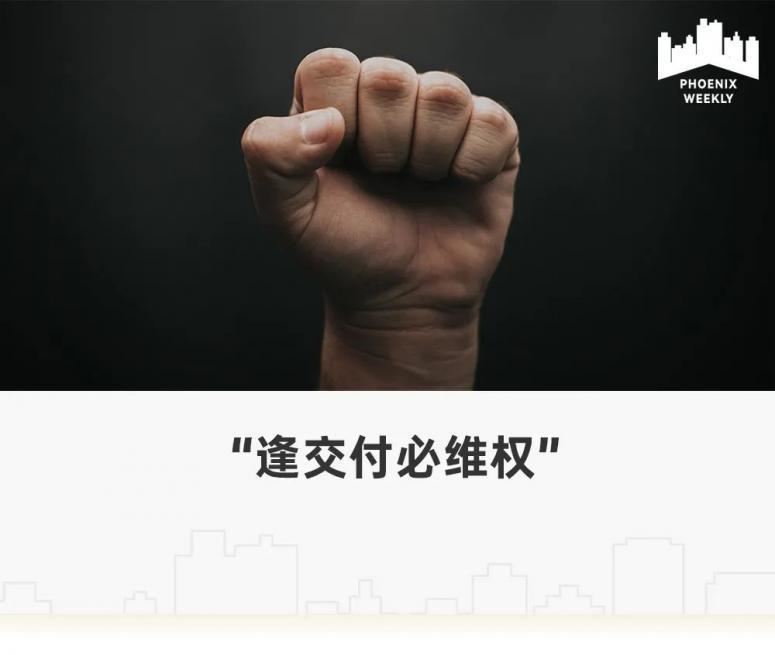
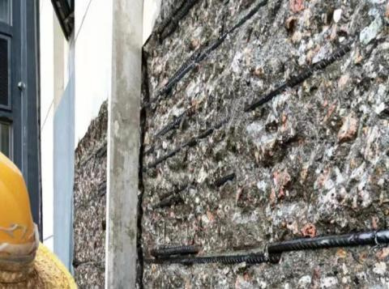
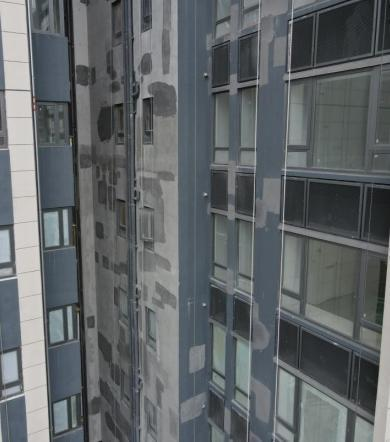

# 深圳多个网红盘交房即遭维权：房企利润压缩扣成本，有房企贴钱保交付

在深圳，想收到一套满意的新房，成了一个小概率事件。

自新房限价以来，深圳楼盘几乎是“逢交付必维权”。多个曾经日光的网红盘，到了交房的时候，漏洞百出。除了漏水、外墙鼓包、承重墙钢筋外露等一些传统质量问题，还新增了一系列因精装交付带来的各自货不对板，比如园林绿化面积、地板、墙面材料，与宣传不一致。

这段时间，已持续一年多的深圳“中海汇德理”房屋维权又掀起一个小高潮，因楼盘外立面升级问题迟迟无法解决，业主怨声载道。沟通无果之下，有业主透露，项目所在区域的有关部门称可以考虑将中海整个区的项目停工。目前，业主方给出的最新消息是，中海方面已承诺提供品质提升资金，3000万元。

截止发稿，中海方面并未对此给出回复。

“业主就是想通过维权来退房。”一名中海地产的内部员工对《凤凰WEEKLY地产》说。

“中海汇德理”并不是个案，全国多个城市在2019-2021年这几年楼市高峰期的楼盘，在房屋维权问题上，舆论场出现了几乎一致的转换。

过去弱势一方是购房者，开发商的形象多是资金雄厚、霸道无理。限价之后，购房者被被冠上了“职业房闹”的标签，许多外界观点认为维权业主因房价下滑，为退房而不择手段，开发商反而成为弱势一方。

新房和二手房价下滑是引发房屋维权的一大诱因，但这并不能掩盖开发商在薄利时代降低建造成本、装修减配的事实。

“新房限价之后，开发商为了省成本，项目的设计是一降再降，甚至出现不可逆的安全问题。”中建八局的一名高级工程师对《凤凰WEEKLY地产》说。

“网红盘”翻车

“汇德理”是深圳楼市高光时刻名副其实的“网红盘”。

楼盘位于深圳市龙华区上塘地铁口，2020年8月开盘，开盘均价7.53万元/平方米，与当时周边的二手房小区形成1万—2万元/平方米的倒挂。开盘当天，1179套住宅在短短的五分钟内被秒光。2021年底，楼盘竣工备案。

事件的开端在2022年初，业主发现楼体外墙出现鼓包。从当年4月开发商开始对外墙进行施工，一直到2022年10月，外立面的修缮一直未完成，甚至出现了钢筋外露的问题。12月，当地有关部门敦促外墙整改。到了今年2月，施工方仍然在粉刷外墙，外墙维修长达8个月。

_由中海汇德理业主代表提供_

一名参与和开发商沟通的汇德理业主对《凤凰WEEKLY地产》透露，当地部门在沟通时表示，如果外墙问题无法解决，可以考虑暂停中海在当地整个区的项目施工。

上述汇德理业主介绍，除了外墙问题，楼盘装修交付的最终成果也和最初公开的装修标准不符，比如将网上报价6000多元的入户门，定价到25000元，10000元的智能马桶定价为16000元，电视背景墙将1400元/平米“定制木作”换成140元/平米“PVC+冷敷木纹纸”。

《凤凰WEEKLY地产》于近日走访中海位于龙华区的另一个楼盘“明德里”时，看见它的外立面挂着的广告条幅上写着“央企精装房”。中海过去以建筑质量闻名业内，如今因为新房维权走下神坛，多少有些令人唏嘘。

“汇德理这个事出了之后，很多人说央企怎样怎样，伤害的是整个国资开发商的品牌形象。”在谈起此事时，深圳一家国企开发商的中层感叹。

深圳翻车的“网红盘”还有位于深圳沙井的万丰海岸城。这个楼盘2021年开盘时正好撞上“打新热”，但交付后出现了通道过窄、实际尺寸与图纸不符等硬伤。

单价超10万的豪宅也难以幸免，曾遭“万人抢”的润玺一期，楼梯间的材料从润府三期的石材降成瓷砖，地板色泽上存在明显差异。

降本增效的后遗症

造成普遍性的质量问题，一大原因就是限价带来开发商的利润压缩，不得不在单个项目上抠成本。

还是以汇德理为例，通过最新的现场照片可以看到，直到目前，汇德理的外墙还是有明显的色差。

_由中海汇德理业主代表提供_

“涂料有好有坏，最次的30元/平方米，普通的还有50元和80元的，档次最高的200元—300元，出现明显色差应该用的是比较次的涂料。”一家总部在上海的大型开发商的工程口员工介绍道。

汇德理业主维权的主要诉求是升级成铝板外墙。《凤凰WEEKLY地产》了解到，市面上的铝板最低也要400元/平米，涂料和铝板的成本差价最高能超过10倍，中等水平相差3—4倍。铝板以前应用在写字楼比较多，住宅不多，但这几年豪宅也开始流行使用看起来高大上的铝板。

“我们有一个盘，玻璃和栏杆之间应该留2公分的缝比较合理，为了省成本，留了10公分。这个10公分擦着规范的边，但确实风险很大，孩子很容易往下面扔东西。业主因为这个缝维权，不合理，但合情。我们最后没办法，还是花了几百万去填这个缝。”一家TOP5开发商深圳公司的员工介绍道。

“按理说，施工新工艺在2018年普及后，房屋质量应该会更好。但现在开发商为了降低成本，项目的设计是一降再降，设计标准就是减配：比如楼板钢筋原来用直径12的现在用直径6的，原来厚度120现在80。外墙原来是真石漆，现在是普通涂料。”上述中建八局的工程师说，“现在的趋势是，商品房质量越来越差，保障房的质量反而越来越好。”

值得注意的是，市面上还有一些新楼盘，因为拿地时间早，利润空间本来就大，所以并没有受到限价太大的影响，但依然出现了质量问题。

“前几年市场不好，集团整体都在降本增效，各城市公司都在减配，造成产品不好成为常态。”一家央企开发商北方城市公司的中层说。

价格差带来心理差

事实上，放眼过去几十年的商品房历史，新房质量一直是个老生常谈的问题，只不过，它可大可小。在不同的时期，它的存在感是不同的。

广东省城乡规划院住房政策研究中心首席研究员李宇嘉认为，开发商在建楼的时候会看购房者关注什么。

“如果购房者关注房价的涨跌情况，开发商在营销和开发的过程中也会更注重项目的规划概念、区位价值、交通、配套优势等，不太注重房屋居住的舒适性。在房价上涨的过程中，房屋的增值价值对购房者更有吸引力，而购房者对房屋的质量瑕疵也有一定的容忍度，房屋存在的一些瑕疵会被掩盖；而当房价下跌，包括漏水、裂缝、物业、绿化、学校等前期开发商不太重视的问题就会暴露出来，业主就会以这些瑕疵为理由来维权，这也是深圳楼市以及其他重点城市楼市存在的普遍现象。”

“房子不是iPhone那样工业流水线生产，房子现在还是人工品，你说一点问题没有，是不可能的。等住宅工业化、全部走装配式的话，问题会少很多。比如空鼓裂缝、漏水这些常见病，都是先修好，然后再去维修，入伙前几个月都是专门搞维修的。”一名央企开发商的客服部门员工说。

他认为，新时期的房屋维权有故意扩大化的现象，“业主找到某个触发点，扩大问题面，边谈边提更多要求，要求加配。”

据了解，深圳就有一豪宅楼盘，因为业主要求升级外立面，最终开发商办理了退房。“我们轻易是不加配的，原定的涂料外墙就是涂料。如果这个小区升级铝板，其他小区也要升级。”上述中海地产的员工说。

造成诉求扩大的一大原因是价格的心理落差。

还是以汇德理为例，开盘时其和周边楼盘形成倒挂。就在2022年初，与汇德理仅一路之隔的卓越柏奕府精装修交付，价格相当，享受95折优惠，从总价来看，能优惠30万—50万左右，首次开盘637套住宅，仅229批客户选房。中海在同区的明德里，至今未销售完。

要求退房的业主，主要关注的也是价格差，这些业主里，确实有不少是投资客。“我当时在开盘现场，投资客的比例是不小的。”一名参加了汇德理开盘的深圳业内人士说。

中海汇德理业主2020年1月10日致雷区长函

但投资客目前并不是维权的主流。“我们现在主要的诉求是上铝板，不是退房，想退房的是少数。”上述汇德理业主表示。他介绍，在最新的一次沟通后，中海公布了提供品质提升资金3000万，由业主自行投票决定用途。

“绝大多数维权者并不是想退房，业主更多的还是对质量的不满，老百姓觉得花这么多钱买的房子，这个破样子，心里接受不了。”上述央企开发商的客服部门员工说。

目前，新房市场还未完全回暖，深圳新盘普遍都有折扣，新的迹象正在显现。据了解，去年深圳有豪宅业主将新房以低于开盘价的价格“甩卖”，引起一片哗然，购房者不禁担心新房保值的问题。

“我们今年决定贴钱升级装修，一定要保交付，不止关心新房价格，还要关心我们项目的二手房价格。”深圳另一家央企开发商的一名中层对《凤凰WEEKLY地产》透露，“现在是房住不炒嘛，业主里有越来越多自住客，会更关注房屋的质量，而不是短期的炒作价值。”

新房销售的疲软，或在倒逼开发商主动升级质量，以提高市场竞争力。持续多年的新房维权的胶着局面，有望找到解决的突破口。

