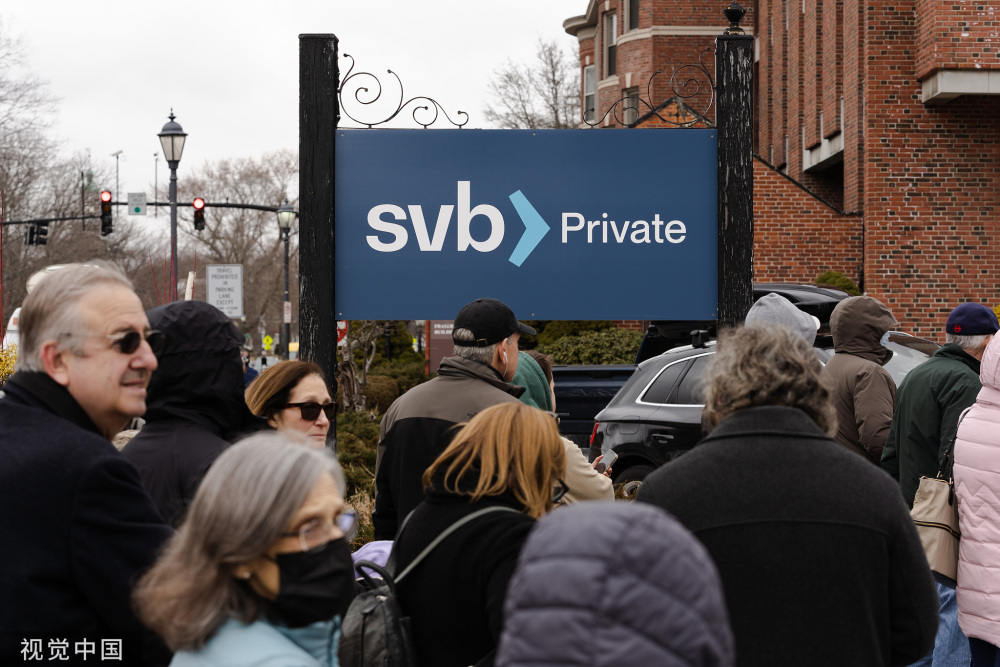
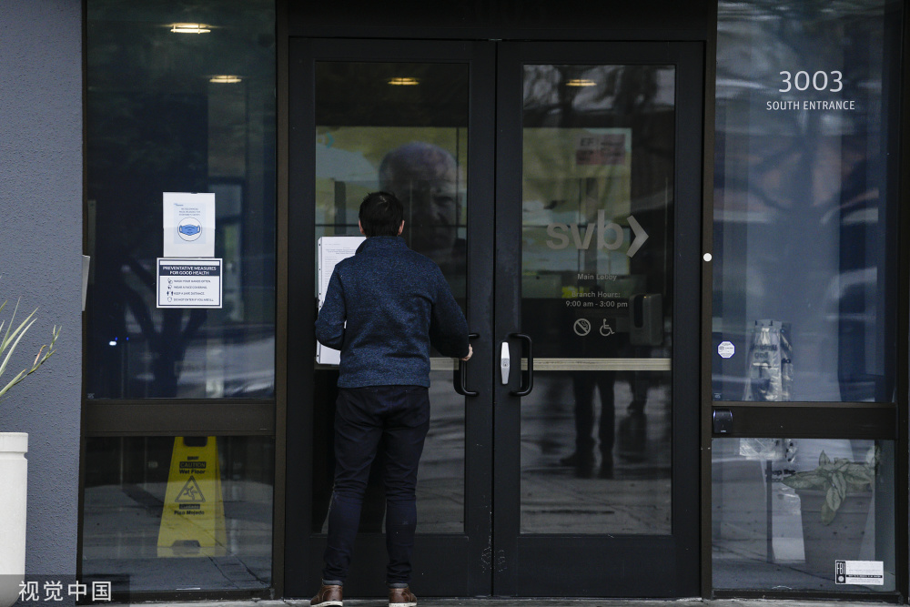

# 潜望｜硅谷银行惊魂72小时启示：美第二大银行倒闭案是怎样演变的

腾讯新闻《潜望》 作者 纪振宇 罗飞 厉海

总资产2090亿美元、存款超1750亿美元、位列美国第16位的硅谷银行，从危机导火索发生，到轰然倒下，仅仅用了不到48小时。

全球金融市场也惊魂不定，尽管多家银行纷纷表示自身财务稳健，但投资者更倾向于相信，“房间里远不止这一只蟑螂”，大批银行股股价暴跌。很快，签名银行成为第二家倒下的银行，两者联手创下美国历史上第二和第三大银行破产纪录记录。

市场似乎再一次走到峭壁边缘，金融危机是否要卷土重来的担忧，开始萦绕在每一位参与者脑中。

恐慌情绪蔓延之下，监管迅速出手。危机出现的48小时内，美联储、联邦财政部和联邦存款保险联合接管了硅谷银行，以求稳定人心，规避大量存款脱离中小银行，进而造成后者爆发系统性风险。

尽管危机整体在72小时后风波渐息，但留给市场需要思考的是，为何所有银行都可能遇到的极端问题，都被这家连续5年被福布斯评为最佳的银行赶上？当美联储从量化宽松中猛回头，开启四十年未有的激进加息进程时，金融机构又该如何敏捷反应，优化自身的资产负债表？

不要浪费任何一次危机。以此为鉴，不忽略草原上的灰犀牛，正视房间中的大象，或许才是硅谷银行轰然倒塌的历史性事件，能够留给我们最好的启示。

**风暴缘起：一份蹊跷的融资公告**

美国当地时间3月89日，硅谷银行的高管们挤在一间小小的办公室里内，他们面前是一份即将要在当天盘后对外公布的声明，这份声明要告诉外界：我们缺钱了，需要融资。

作为上市公司，硅谷银行必须要充分披露重大公司信息，但这份声明却是要告诉市场一个坏消息。

谁也不知道声明发出后，市场会如何反应，为了尽量将投资者的担心降到最低，由硅谷银行投资者关系部门所准备的这份声明中，除了说明需要融资之外，用更大的篇幅阐述了自己资本金状况如何健康稳健。

然而，这份声明发出后，就像投向市场上的一枚深水炸弹，敏锐的投资者立即捕捉到了这样的信息：硅谷银行流动性出现了严重的问题。

投资者的判断完全有理有据。硅谷银行的这份融资方案，十分蹊跷。出售210亿美元债券资产，尽管这部分安全性极强的以美国国债和抵押贷款债券，不久后就将到期获得全额支付，但此时出售就要将税后18亿美元的浮亏变成实亏，要知道，硅谷银行2022去年全年的利润才不过16亿美元。

为了弥补这一亏损，硅谷银行还宣布计划通过普通股、优先股等方式，募集22.5亿美元。

唯一的解释是：硅谷银行至少短期流动性出现了严重的问题，不得不通过这样的紧急手段来应对。

卖出持有的股票，是投资者面对坏消息时的本能，在通常交易清淡的盘后，当天硅谷银行的股价重挫超过30%。

3月9日开盘后，硅谷银行股价直接奔着腰斩而去，卖单汹涌而来，投资者已经无暇顾及价格，出逃是唯一目的。当天，硅谷银行股价以下跌超过60%收盘。

**踩踏出逃：最大的危机是恐慌**

更多的人，开始担心自己的资金安全。3月9日下午，在硅谷风投圈内有着极强影响力的Founder’s Fund创始人Peter
Thiel呼吁大家赶紧把资金从硅谷银行撤出的消息，占据了各家财经、科技媒体的动态头条位置。

一位硅谷地区创业者对腾讯新闻《潜望》表示，自己公司的资金并没有存在硅谷银行。“我听说大多数Peter
Thiel和A16Z系的初创公司会在硅谷银行开户，他们还挺挑的。” A16Z是硅谷地区另一家知名和活跃的风投。

许多创业者发现，自己在手机上登陆硅谷银行的账户，发现已经无法进行存款转出操作，系统提示正在维护中。

位于圣克拉拉的硅谷银行总部门口，开始出现了排队的人群，在位于“硅谷风投一条街”的沙丘路上的另一个硅谷银行营业网点，排队的人群更多。

难熬的一夜过去，3月10日，开盘后硅谷银行继续深跌，毫无反弹迹象，跌幅依然是惊人的60%以上幅度。随后市场中传出消息，硅谷银行此前公布的融资方案宣告失败，他们无法在公开市场中融到的资金，开始寻求出售方案。

市场中消息满天飞，恐慌情绪进一步蔓延，硅谷风投们进一步催促旗下的被投公司迅速转出资金，以保障资金安全，但此时，几乎所有的转账请求都被系统识别为“待定”。

随后，硅谷银行股票交易被中止，盘中即将有重大消息公布。许多人猜测，一家大型金融机构将收购困境中的硅谷银行，这家机构也许是美国资产最大的银行摩根大通，或者规模相当的另一家大行美国银行。

然而最终没有人收购硅谷银行，接手的是美国政府机构—美国联邦存款保险公司（FDIC）。这家机构在当天发布声明，称加州金融保护局已经关闭硅谷银行，接下来FDIC成立一家新的银行，以接手所有硅谷银行的存量存款。

这则消息成为了当天的头条新闻，这意味着在不到两天的时间内，美国历史上规模第二大的银行倒闭案正式诞生。

硅谷银行的股价停留在每股106美元，两天前，这家资产超过2000亿美元的银行，股价还高达268美元，市值也在两天内从近200亿美元，滑落至不到65亿美元。

**何以至此：房间里的大象被漠视了**

一切都早有征兆，正如这家银行的名字所反映的，硅谷银行与“硅谷”存在着深度绑定的关系，大多数业务与硅谷的创投活动息息相关。

硅谷银行最早于1982年在硅谷的腹地圣何塞创办，创办之初的主要策略，就是吸收获得风险投资的初创企业的存款。

伴随着硅谷创投的兴起，硅谷银行的业务也逐步深入到硅谷创投活动本身，向风险投资机构、初创公司、私募股权机构、高净值人群等提供相应的金融服务。

除了传统的存贷款金融业务以外，硅谷银行还通过旗下风投和私募股权投资部门，直接投资于该银行服务的客户所创办的初创公司。

由于深度绑定硅谷创投活动，硅谷银行的兴衰几乎与整个硅谷创投大环境同步。从2018年至2021年，硅谷银行的股价翻倍，市值最高曾达到440亿美元。按照总资产排名，硅谷银行位居美国第16大银行。

根据PitchBook数据显示，美国风投支持的科技和生命科学公司近一半与硅谷银行有业务，44%在2022年由风投支持的科技和医疗公司IPO与硅谷银行有业务往来。

_硅谷银行与创投活动深度绑定_

但2022年3月至2023年1月，美联储在不到一年时间内加息8次，累计加息幅度达到425个基点。

中国社科院世经政所国际投资室主任张明指出，如此陡峭的加息幅度是过去四十年前所未有的，这必然对低利率时期美国各类金融机构的加杠杆套利行为造成显著冲击，从而引发新的金融风险。

加息周期内，没有一家金融机构能够高枕无忧。但本应提高警惕的硅谷银行，却漠视了“房间里的大象”。在资产端依旧延续此前的配置逻辑，把大量科技企业的短期存款配置到长期的债券和MBS中。

加息周期中资金全面收紧，也直接冲击到硅谷的创投活动，风险投资活动减少，许多还未实现盈利的初创公司依靠之前融的的资金勉强维持业务，现金流在不断消耗，债务风险不断累积。

在不久前的一场公开活动上，硅谷银行首席执行官Greg Becker被问及最大的贷款损失来自于哪里时，他回答是互联网金融和消费者领域。

根据摩根士丹利的一份研究报告显示，2022去年全年，硅谷银行面临的客户资金净流出额达到570亿美元，其中第二季度和第三季度净流出额分别高达182亿和255亿美元。

_硅谷银行2022年净资金流出高达570亿美元_

根据硅谷银行截至2022年12月31日的年度财报显示，总资产2118亿美元，其中证券投资为1201亿美元，贷款743亿美元，负债端存款为1731亿美元。硅谷银行的大部分存款，需要由其投资的期限较长的美国国债等固定收益产品来覆盖。

与其他商业银行相比，硅谷银行的资产结构也显得非常与众不同，例如美国银行有8630亿美元证券资产，其中6330亿美元为“持有到期”债券，低于其1万亿美元的贷款资产。总部位于旧金山的第一共和银行，是在规模上与硅谷银行最为相似的地方性银行，有550亿美元可投资证券，其中持有到期证券为280亿美元，也远低于其1670亿美元的贷款资产。

根据2022年硅谷银行财报显示，2022年全年实现利润16亿美元，从1993年以来，硅谷银行从未发生全年亏损的情况，这段时期累计净利润为111亿美元。

但仅仅200亿美元国债的出售，就造成了18亿美元的税后亏损，比硅谷银行去年全年的利润还要多，如果再考虑硅谷银行资产负债表中剩余900多亿美元的“持有到期”债券资产的账面损失，亏损将更加可观。

**政府出手：峭壁边缘的果断拯救**

当硅谷银行一天股价下跌超过60%时，敏锐的投资者，已经开始排查自己的仓位，除了对硅谷银行的风险敞口外，还有哪些潜在风险。与硅谷银行类似的其他中小银行成为了首当其冲的对象，第一共和银行（First
Republic Bank），这家规模和业务与硅谷银行最为接近的中小银行，成为了投资者下一个抛售的对象。

3月10日当天标普500银行指数下跌超6%，地区性银行指数下跌超8%，目前市场中恐慌情绪已经蔓延至银行股之外，美股当天三大股指均全面重挫，纳斯达克综合指数下跌超2%，标普500指数下跌近2%。

FDIC的接管，并没有让风险止步在硅谷银行。

“我们一直尝试将资金从硅谷银行转出，计划转入美国银行，但是系统冻结了，”
一位创业者在3月10日下午告诉腾讯新闻《潜望》，“我们通过电话也找不到任何人，还没有跟我们的主要账户经理通上话。”

他表示，尽管他个人认为资金并没有什么安全问题，但是来自董事会的压力，使得他不得不这样做，当天早上，他接到了来自投资人的电话，要求他尽快将公司的资金分散放到其他银行去。

3月10日下午，硅谷的路上出现了由警车开道的黑色车队，这样的景象很不寻常，当天传出的最新消息是：美国联邦官员，包括美联储和财政部，已经入驻硅谷银行，实地调研这家银行的经营状况，同时也有消息称，第一共和银行也有联邦官员入驻。

对冲基金大佬Bill Ackman在当天晚间发布了一则长达2000多字的推文，称留给美国政府的时间只有48小时来解决很快就“无法挽回的错误”。

3月11日是个周六，硅谷银行位于圣克拉拉的总部大门紧闭，玻璃门上贴着一张FDIC于前一日发布的声明，许多人前来拍照，银行门口的保安对着正在自拍的两位年轻人说：
“你们在庆祝别人的痛苦吗？”

一份硅谷数百家风投联合签署的声明流出，大致表达的意思是：如果硅谷银行被收购，我们继续力挺硅谷银行。

在创业者圈子里，风投这样的举动却被看做是“虚伪”。

“好多奇怪的事情发生，”一位创业者私下里与朋友聊天时说，“VC告诉他们的被投公司赶快抛弃硅谷银行，然后发布声明说与硅谷银行站在一起，典型的虚伪。”

“他们永远与硅谷银行站在一起，只要它被收购。”另一位创业者说。

根据硅谷银行当天提交的美国证交会披露文件显示，仅10日一天，流出存款金额高达近500亿美元。

3月12日下午，美国财政部联合美联储、FDIC发布了一份声明，称硅谷银行储户的所有资金，无论是受保范围内还是受保范围外，都是安全的，政府将动用“存款保险基金”（Deposit
Insurance Fund）来覆盖这部分资金，并强调这部分资金并不是纳税人的钱。

同时，美联储也发布了一份独立声明，称设立银行定期融资项目（Bank Term Funding Program），向符合条件的存款机构提供短期流动性支持。

美国政府多部门的联合声明，目的只有一个，那就是缓解目前市场的恐慌情绪，将风险控制在有限范围内，避免形成系统性风险。

**风波渐息：压力留给美联储**

美国政府没有食言，存款在硅谷银行的储户，陆陆续续已经能够打开账户，顺利将资金转出。

“周末我已经将大部分资金从第一共和银行转到摩根大通银行了，”在硅谷的创业者Eric对腾讯新闻《潜望》表示，“投资人建议都觉得第一共和银行还行。”

当天市场继续在忐忑中进行，由于硅谷银行危机事件，令市场对于接下来美联储的加息预期又出现了明显变化。在上周美联储主席鲍威尔十分鹰派的讲话后，市场预期美联储在下周的议息会议上，将会重启50个基点的加息幅度，但是银行危机的突然出现，让市场预期美联储要重新评估利率决定。

投行纷纷发出报告，高盛直接表示，美联储3月份将不再加息，随后花旗、野村证券也跟进了同样的观点，市场中最乐观的估计是，今年内，美联储就将重回降息周期。

但消费价格指数即将在第二天公布，市场在多重不确定性因素的叠加下，不敢轻举妄动，但这一天除了股价大跌外，没有新的银行宣布倒闭，也没有挤兑的消息传出。

3月14日一早，美国2月份消费价格指数公布，与预期持平，美股开盘大涨。第一共和银行股价跳涨60%，其他中小银行也全部暴涨，触发交易所熔断，市场中过度乐观情绪立即替代了前一日的过度恐慌。

危机似乎已经解除，秋后算账开始。美国证监会、美国司法部开始调查硅谷银行高管在事发前不久大举出售股票的事，美联储宣布将在5月1日公布对硅谷银行事件的调查结果。

硅谷风投们开始欢庆胜利，不仅自己的资金保住了，所投初创公司的资金也没有损失，还为自己进一步挣得了声誉，仿佛正是在自己的声援力挺下，美国政府才果断出手，拯救了硅谷银行和硅谷创投行业。

大银行开始被如潮水般涌入的存款挤得不堪重负，摩根大通银行甚至不得不抽调其他部门的人员，来临时负责企业账户开户业务，花旗银行过去开立私人银行账户需要耗时1-2周时间，但在门口被挤爆的情况下，迅速将这一时间窗口缩短为一天。

就在几天前倒闭的硅谷银行仿佛早已成为历史，人们继续朝前看，不再前往银行门口排队取款。新任命的硅谷银行首席执行官发布了一封公开信，呼吁人们重新将存款放回硅谷银行。

“我们所有的存量和新增存款都由FDIC全额保护，这意味着放在硅谷银行的存款是这个国家所有银行和机构中最安全的。”

**周期启示：距我们离下一次危机还有多远？**

惊涛骇浪后的风平浪静，可能仅仅是假象，新一轮的风波又开始酝酿。

硅谷银行的倒闭，代表着美国中小银行所面临的共同窘境：它们都存在典型的资产负债期限错配，资产端大量投资长期债券和MBS，在美联储多轮激进加息后，这些投资产生大量浮亏，同时在负债端存款资金来源不稳定，面对未来美联储持续缩表，流动性可能将进一步恶化。

中国社科院世经政所国际投资室主任张明认为，从目前美国通胀走势与鲍威尔表态来看，2023年加息的节奏与幅度依然可能再度超出市场预期。这就意味着，以美国股市与债市为代表的资产价格调整可能仍未结束，美国与其他国家的投资者可能继续遭遇较大规模亏损。由此引发的资本金损失与流动性压力可能再度引发金融机构破产清算风险。新兴市场与发展中国家也可能再度爆发货币金融危机。

全球对冲基金巨头桥水创始人达利欧评价称，硅谷银行倒闭是典型的债务周期泡沫破灭的景象，并且这只是一个开端。

“未来一两年美国的经济金融情况将非常严峻，再加上美国的内外部冲突，投资风险非常高。”这位资本市场教父级人物如此警示。

