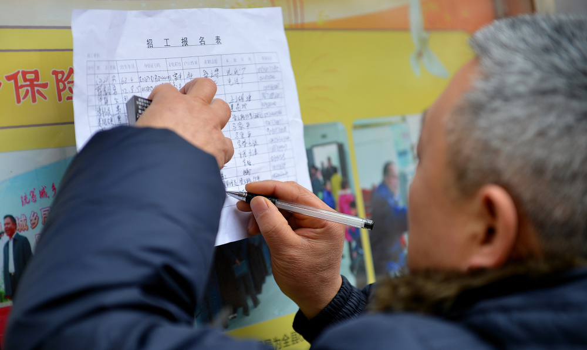
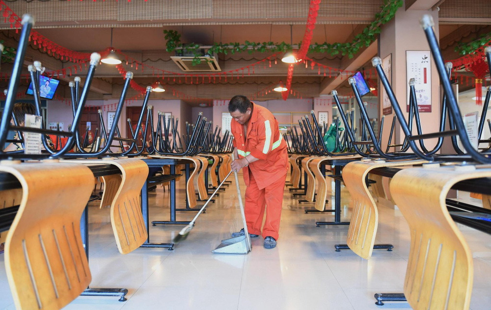

# 超龄农民工迫于“家计”继续务工，如何保障其权益？媒体：需调整政策

近日，中央“一号文件”明确提出要“维护超龄农民工就业权益”，超龄农民工的就业权益保护问题正式进入了全社会的视野。
实际上，超龄农民工继续务工在基层社会中是一个极为普遍的现象，且其背后有着较为复杂的社会成因，保护超龄农民工的就业权益需要深入了解他们处境和需求。

_一名老人填写应聘登记表_

**一、超龄农民工主要在哪里务工**

我国法定退休年龄是男性满60周岁、女性满50周岁，超过退休年龄还继续务工的，便被称为“超龄农民工”，意思是超过了工作年龄的务工者。在当下城乡基层社会中，超龄农民工继续务工是一个极为普遍的现象。

总体上来看，我们可以将当下我国的就业市场分为两个部分，一个部分是正规就业市场，包括体制内的公务人员、正规企业的正式工、劳务派遣的工人、正规的个体户和各种新兴职业群体等；另一个部分是非正规就业市场，包括工厂、工地、农场、个体工商户雇佣的临时工以及非法经营场所中的用工等，这两种用工市场的主要区别在于前者是受到相关部门有效监管的，而后者则是不受监管或者监管无效的，我们所看到的超龄农民工大多都集中在后一个就业市场中。因此，我们只要去县乡地区的工地、工厂、农场和城市地区的小作坊、小工地等地方，就很容易看到一些正在劳动的超龄农民工，当然，随着我国社会的法制化进程日益推进，后一个就业市场正在日渐萎缩，尤其是去年多个省市陆续发文对建筑企业招录和使用超龄农民工做出了限制之后，超龄农民工的就业空间变得更为狭窄了。

**二、超龄农民工务工的现象缘何发生**

一般而言，退休便意味着失去了继续工作的能力和权利（无法再签订劳动合同），那么超龄农民工继续务工的现象又是如何发生的呢？

从客观上来看，超龄农民工之所以能够继续务工，是因为他们虽然已经达到了退休年龄，但是他们中大多数并未失去劳动能力。我国现行关于劳动年龄的规定最早是来源于1978年出台的《国务院关于安置老弱病残干部的暂行办法》和《国务院关于工人退休、退职的暂行办法》两个文件，这两个文件规定我国职工现行退休年龄是男性60周岁，女干部55周岁，女工人50周岁。这一时间限定是根据当时我国的经济社会发展条件来确定的，1978年，我国人均寿命仅为68.2岁，在这一背景下，将退休年龄定为这个期限是合适的，但此后，随着我们医疗卫生事业和社会经济水平的快速发展，我国人民群众的身体素质不断提高，人均寿命也不断得到延长，截至2022年，我国人均寿命已经达到了77.93岁，与1978年相比已经延长了接近10年。基于社会福利方面的考虑，我国目前并没有延长退休年龄（但“十四五”规划《建议》已经提出，将实施渐进式延迟法定退休年龄），而只是在社会保障方面增加了“以无雇工的个体工商户及灵活就业人员身份参加企业职工基本养老保险的女性参保人员，退休年龄为55周岁”的规定；但是从劳动能力的角度上来讲，对现代人而言，达到退休年龄并不意味着失去了劳动能力。因此，笔者在县乡地区调研的时候经常能看到超龄农民工在工地和农田中劳动，并且他们技术娴熟、体力也还不错，老板都对他们都非常放心，有一次笔者询问一位62岁还在开旋耕机的老年农机手是否还能干的动的时候，那位老人直言“现在60岁还是小伙儿呢！”。

从超龄农民工自身的角度上来看，他们之所以选择继续务工，是因为受“家计”所迫。首先，需要认识到的是，当下的超龄农民工虽然大多没有社保，但是并不存在生存问题，新农保和新农合虽然还无法解决农村老人“吃好”和生大病的问题，但是已经基本解决了他们的温饱和看小病的问题（包括慢性病）。实际上，当前农村老年人最大的经济支出往往并不是用于他们自己的消费，而是用于支持子代，对此，笔者近期在湖北宜昌调研时遇到的一个案例非常典型，该案例家庭的户主姓杨，一家共有6口人，其中父辈老两口的年龄分别是63岁和59岁，他们的儿子和儿媳分别是38岁和35岁，儿子育有两个小孩，大的是女儿，已经有12岁，小的是儿子，才4岁。杨叔一家已经在当地县城按揭买了房，但是一直都空着，一家人平时都在广东惠州一家小工厂务工，其中杨大爷和儿子在厂里上班，两人每月收入在5000元左右，大婶在厂里做饭，一个月2000多元，儿媳则是照顾孩子上学，在收入安排上，大爷的收入用于偿还房贷和在当地租房，大婶的收入主要用于日常开支，儿子的收入则是存起来，留作小孩上学之用。显然，杨叔老两口都算是超龄农民工，已经到了应该“安享晚年”的年龄，但是在目前的情况下，仅仅依靠他的儿子没办法供养整个家庭，更不用说积累财富、培养子女了，因此老两口才必须要继续务工。杨叔家的情况在当前的县乡社会中是常态，在近十年的时间里，由于多方面因素的共同作用，我国农村家庭的各种开支均出现了大幅度的上涨（尤其是住房、教育），而年轻人的收入却并未出现相同程度的上升，这使得绝大多数的农村老人不仅无法从子女那里得到赡养，反而还要被迫卷入到了子女的家庭再生产活动当中，因而在老了也要努力工作，以帮助子女减轻经济压力。因此，在县乡社会中，即使是那些有着较高退休金的老人，如果子女的收入不高而他们自己又有继续务工的机会时，他们也会选择继续务工。

_一位工作人员在清扫地面。_

从用人单位的角度上来看，雇佣超龄农民工是在我国劳动力结构发生变迁背景下的无奈选择。在近十年的时间里，我国劳动力市场发生了巨大改变。这种改变主要表现在三个方面，一是在年龄结构上，我国的适龄劳动人口数量开始减少。随着我国人口逐渐老龄化，适龄人口的数量也在逐渐减少，第七次全国人口普查数据显示，当前我国人口平均年龄已经达到38.8岁，其中15-59岁的适龄劳动人口数量为8.94亿人，与第六次全国人口普查数据相比下降了接近7%。二是在空间结构上，适龄劳动人口在城乡的分布严重失衡。由于城乡发展水平上的不平衡，当下农村的年轻人依然更倾向于进城发展，虽然政府和社会一直在号召农村青年返乡创业，但是实际上真正返乡的往往都是那些在城市中已经不好就业的超龄农民工，这使得在当前县乡社会中很难聘用到年轻人。笔者近年来在全国各地的乡村调研发现，那些在农村投资兴业的老板都面临着不同程度的用工问题，许多老板费尽心思流转了大连土地，实现了规模经营，但是却找不到人干活，例如去年笔者在安徽芜湖调研时，一位承包了800亩地的老板告诉我，他雇佣的7个工人平均年龄已经达到了70岁。三是就业偏好上，当下年轻人的就业偏好已经出现了很大的改变。一代农民工务工主要是为了积累财富，他们为家庭牺牲的意愿强烈，因而只要报酬高，他们便不会挑工作；而当下的年轻人则不同，他们大都接受过良好的文化教育，且长期受到消费主义价值观的熏陶，因此他们在务工时不仅要求工资高，往往还要求工作能够带给他们真正的城市生活体验，于是那些脏活儿累活儿便只能由那些已经超龄的一代农民工来干。以上这些因素使得县乡地区的工厂、农场和城市地区的工地、作坊等用人单位都很难聘用到适龄劳动者，只能安排超龄农民工上岗。

**三、保障超龄农民工的就业权益**

可以看到，在我国当前的社会发展水平下，让超龄农民工继续务工并非是坏事，反而具有多方面的社会经济效益，因此“十四五”规划《建议》提出，要“积极开发老龄人力资源，发展银发经济”，今年的“一号文件”也明确要求“维护超龄农民工就业权益”。但要保障超龄农民工的就业权益，当下还有很多工作需要完成。

一是需要调整相关政策，为超龄农民工留下就业空间。当前许多就业政策都是限制超龄农民工就业的，比如限制用工单位为超龄农民工购买保险，这使得用工单位在雇佣超龄农民工时需要面临巨大的风险，进而阻碍其雇佣超龄农民工，因此，要保障超龄农民工的就业权益，首先需要调整相关政策，实际上，超龄人员就业在高等教育等许多领域都并不罕见，其中的关键在于将就业的选择权交给用工单位、就业人员和相关管理部门，而非是完全“一刀切”，这非常值得与农民工就业的相关政策加以借鉴；二是各地方政府需要做好产业规划，发展一些适宜超龄农民工的产业。超龄农民工有就业需求，但是目前市场上绝大多数的工作都是针对中青年群体的，这使得超龄农民工想要就业只能去一些不太适合他们的岗位，进而造成了严重的安全隐患，正是由于这一原因面，去年一些地方出台了针对超龄建筑工人的“清退令”，实际上，如果适当发展一些适合超龄农民工的产业，那么便能够在保障超龄农民工就业权益的同时解决安全问题，例如笔者在浙江上虞调研时发现，当地的制伞工厂会将许多的手工环节外包给当地的妇女和老人，从而使得续期超龄农民工也能获得一定经济收入。三是为超龄农民工提供更好的就业服务。虽然超龄农民工依然具有劳动意愿和劳动能力，但是他们毕竟和适龄劳动者不同，这会使得他们在就业市场上处于劣势且面临更大的安全风险，因此需要相关部门在帮找工作、技能培训、就业指导和权益保障等方面给予他们一些的特殊帮助，并对他们的身体健康、劳动能力加强管理，从而在帮助他们正常就业的基础上保障安全。

