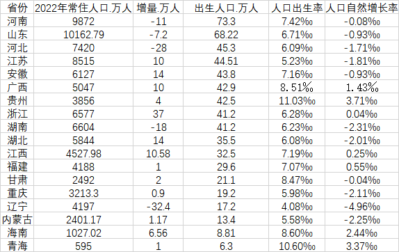

# 18省份去年出生人口全部下降，其中11省份降幅超一成

2022年各地的出生人口如何？

根据第一财经记者统计，目前，已经有18个省份公布了2022年的出生人口数据，从数据来看，这些省份的出生人口数量和出生率均出现下降。

3月17日，湖北省统计局发布的《2022年湖北省国民经济和社会发展统计公报》显示，2022年末全省常住人口5844万人，其中，城镇3779万人，乡村2065万人。城镇化率达到64.67%。全年出生人口35.5万人,出生率为6.08‰；死亡人口47.2万人，死亡率为8.09‰，人口自然增长率为-2.01‰。

数据显示，2021年湖北出生人口为40.4万人，出生率为6.98‰，据此计算，2022年湖北出生人口比上一年减少4.9万人，人口出生率下降0.9个千分点。

辽宁省统计局3月16日发布的《二〇二二年辽宁省国民经济和社会发展统计公报》显示，根据1‰人口抽样调查推算，年末常住人口4197万人。其中全年出生人口为17.2万人，出生率为4.08‰；死亡人口38.1万人，死亡率9.04‰；人口自然增长率为-4.96‰。

与2021年相比，2022年辽宁出生人口减少约2.8万人，人口出生率下降0.63个千分点。

内蒙古统计局发布的《内蒙古自治区2022年国民经济和社会发展统计公报》显示，全区年末常住人口2401.17万人，比上年末增长1.17万人。全年出生人口13.40万人，出生率为5.58‰；死亡人口18.80万人，死亡率为7.83‰。

根据第一财经记者统计，截至目前，已有18个省份公布了2022年的出生人口相关数据。从出生人口数据来看，18个省份中，出生人口超过50万省份有河南和山东，其中，河南去年出生人口为73.3万人。山东位居第二，为68.22万人。其他省份中，河北、江苏、安徽、广西、贵州、湖南和浙江出生人口位于40~50万之间。

相比上一年，已公布出生人口数据的18个省份2022年人口出生率全部下滑，其中，江西、甘肃、广西、海南、贵州、河北、福建人口出生率降幅均超过1个千分点。18个省份的出生人口数量均出现下降，根据第一财经记者统计，18个省份中，包括河北、安徽、广西、湖南、湖北、江西、福建、甘肃、辽宁、内蒙古、海南共11个省份去年出生人口降幅超过一成。

此外，山东去年出生人口近几十年来首次低于70万，河北出生人口也是几十年来首次低于50万，福建出生人口是几十年来首次低于30万大关，重庆自1997年直辖市以来出生人口首次低于20万，湖北出生人口近几十年来首次低于40万。

**表：18个省份2022年常住人口及出生人口数据**

_（数据来源：第一财经记者根据给点统计局数据整理）_

整体来看，近年来，受育龄妇女持续减少、生育观念变化、婚育推迟以及疫情等因素影响，我国出生人口持续下滑。

人口专家、广东省人口发展研究院院长董玉整分析，当前年轻人的婚育观念发生了很大变化，婚育的社会价值出现了多元化理解的倾向；结婚生育对于人们社会存在和社会价值的意义，出现了弱化、淡化的现象。单身、不婚、不育，有逐渐增多的趋势。同时，在城镇化推进过程中，随着结婚、生育、养育、教育以及个人生活的成本上升，住房等价格高企，就业及工作压力增大，出现“生不起”“养不起”“不敢生”“不想生”等问题。

**今年全国“两会”期间，鼓励生育成为不少代表、委员关注的话题。**
全国政协委员、中国人口与发展研究中心主任贺丹认为，生育水平下降是微观家庭根据外部经济社会环境的变化，以及自身条件做出的合理反应。贺丹提出，应以促进青年群体职业发展和家庭职责平衡为出发点，加快相关配套制度建设。扩大生育保险覆盖率、拓展生育保险筹资渠道，建立个人、企业和政府之间生育成本的合理分担机制。

全国人大代表、江苏综艺集团董事长昝圣达建议要在多方面形成共识、综合施策，推动我国人口科学合理增长。他提出，各地要综合施策打消适龄人员的生育疑虑，如做好多子女家庭住房、医疗托育等保障，增加更多生育奖励、育儿津贴、托育补助、夫妻共同产假等配套福利；加快发展公办和民办公助托幼机构，并以民办公补的方式鼓励企业开办托幼机构；设立奖学金及其他经济援助，帮助低收入家庭顺利完成高中到接受高等教育阶段的学业；督促企业严格执行劳动法，严加查处违反职工休息权的行为。

