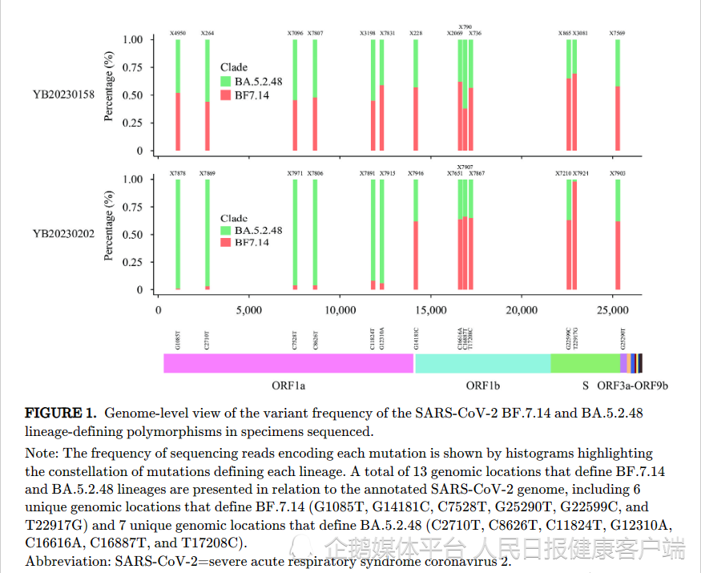

# 中疾控：首次发现奥密克戎BA.5.2.48和BF.7.14亚型共同感染病例

3月17日，中国疾控中心网站发布最新《中国疾病预防控制中心周报（China CDC
weekly）》，2月14日，在重庆医科大学附属第三医院采集并送检的样本中检测到奥密克戎毒株的共同感染。

2022年12月23日，这位患者报告食欲不佳，12月29日，出现疲劳、咳嗽，新冠感染检测呈阳性。2023年1月4日，患者出现寒战和发烧（体温38.9℃），并伴有咳嗽症状，住进云阳县中医医院但未明显好转，1月5日出院。1月6日，该患者住进重庆医科大学第三附属医院传染病科。从1月6日到2月12日，8次核酸检测呈阳性。

研究人员于2023年1月28日和2月7日从患者身上采集上呼吸道样本，分别命名为YB20230158和YB20230202，这两个样本形成了一个独立的分支，不同于奥密克戎亚变体BA.5.2.48和BF.7.14。突变位点分析显示，两个样本都含有奥密克戎亚变体BA.5.2.48和BF.7.14的特异性定义位点，患者同时感染了奥密克戎亚变体BA.5.2.48和BF.7.14。

文章称，目前在重庆流行的主要严重急性呼吸系综合征病毒2型毒株为BA.5.2.48（>90%），其次为BF.7.14（约3.8%）。到目前为止，中国还没有关于BA.5.2.48和BF.7.14共同感染的报告，特别是在重庆，BF.7.14比例相对较低。研究人员提醒，监测严重急性呼吸系统综合征冠状病毒2型变异株应作为识别合并感染和重组病例的重要策略加以推广。随着各种变种在一个地区共同传播的风险不断增加，对严重急性呼吸系统综合征冠状病毒2型变种的监测，特别是对免疫缺陷的关键人群的监测，变得越来越重要。

