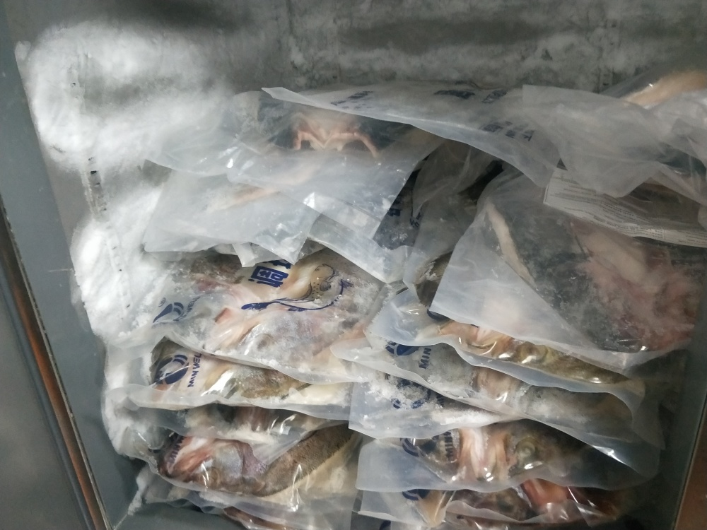
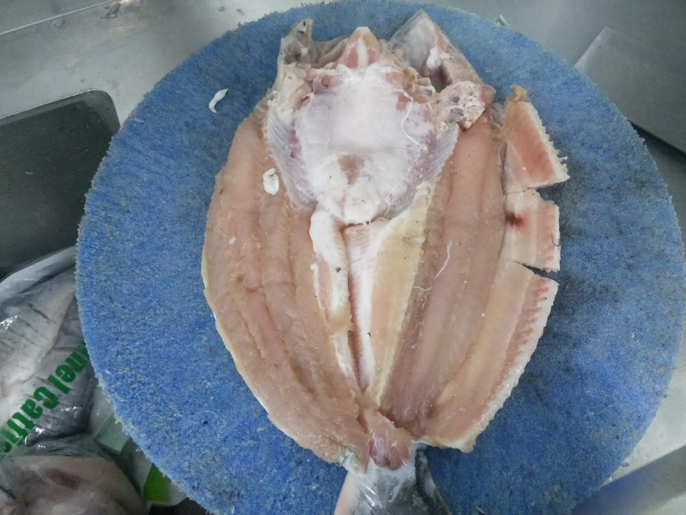
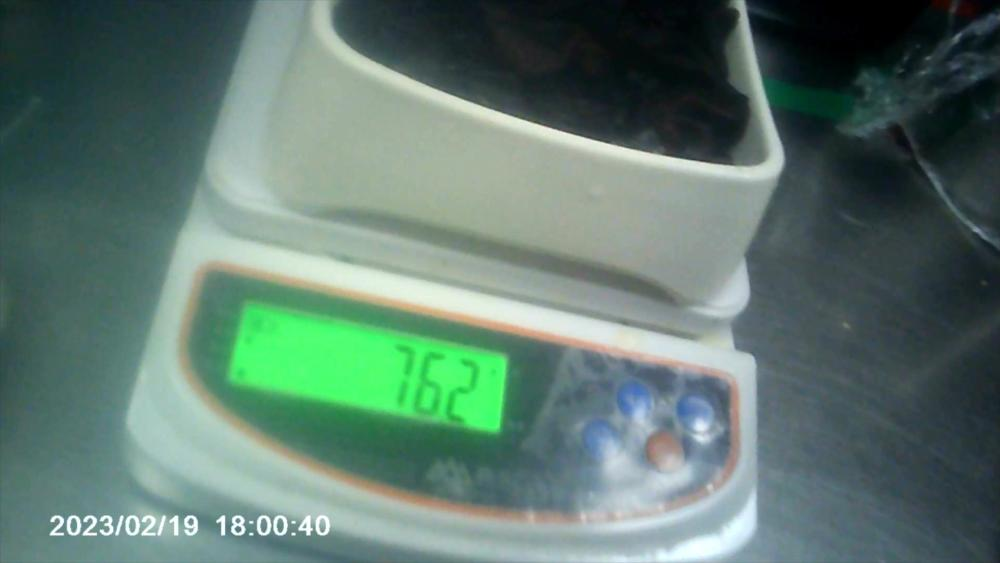

# 卧底两家半天妖烤鱼：垃圾桶捞回食材上桌，“只要不臭都能用”

《视频｜半天妖烤鱼后厨乱象调查》 新京报社会新闻部 出品

“烤鱼不用挑，就吃半天妖！”这则广告语被人熟知的背后，是“半天妖烤鱼”这家网红餐饮品牌的快速崛起：成立于2015年的半天妖，只用了八年时间就开了超过1000家门店。

被称作“烤鱼界头牌”的半天妖，除了邀请明星的站台加持，对食材安全也非常重视，甚至将“重食安”挂到了官网首页，宣称“严格甄选新鲜食材”。但今年2月下旬至3月上旬，新京报记者先后进入安徽合肥两家半天妖烤鱼门店卧底暗访，发现后厨使用的鱼类食材都是冷冻产品，很多鱼解冻后存放过期，仍被端上餐桌，甚至有门店负责人要求“只要不臭，都能继续用”。

_半天妖烤鱼使用的鱼均是冻鱼，采购价在每条30元左右，国内一些网络购物平台上也有这样的冻鱼在售。
图源：新京报暗访调查组_

半天妖的涮菜也存在明显的缺斤短两现象，标重120克的木耳实际只有76克，标重160克的金针菇，仅125克。

但在卧底暗访中，最让新京报记者震惊的一幕，是门店工作人员将已经倒入垃圾桶的涮肚捡回重新加工，再次端上顾客餐桌。

除了食材安全问题，两家店面卫生问题也比较明显，一条毛巾擦完地板，又被拿去擦餐桌。记者查询发现，3月8日，河南省市场监管局发布了2023年第9期食品安全抽检通告，其中郑州市半天妖烤鱼印象汇店，餐具上检出“阴离子合成洗涤剂”，不符合食品安全国家标准规定。

**“鲜浓味美”的烤鱼，冷冻了一年**

半天妖烤鱼，在安徽合肥共有34家门店，覆盖了合肥市几乎所有的大型商场。很多门店经常会排起长队，一名门店负责人提供的安徽营业额统计表显示，有的店月营业额超百万，足见其火爆。

与传统的直营或者加盟模式不同，半天妖烤鱼采用的是一种被称为“联营”的经营模式，门店的股权比较分散，其中包括厨师长、店长、前厅经理在内门店管理人员，都会被要求投资入股，他们大约持有门店四分之一的股份，其余的股份分散在拓店团队、公司管理层和供应商手里，普通的员工极少持股。

这种模式下，门店、管理人员和公司之间实现了深度利益绑定，结成了一个“利益共同体”。

半天妖合肥唯品奥莱店位于合肥市蜀山区唯品会城市奥莱商场六楼，也是一家联营门店，开业已有两年多。门店约两百平米左右，店内摆有二十多张餐桌，记者在门店工作期间观察发现，旺季时这家店每天营业额有两三万，淡季每天营业额也有七八千元。

2月下旬，新京报记者应聘进入这家门店，从事杀鱼、烤鱼等工作。

半天妖目前售卖的有四种鱼：鮰鱼、黑鱼、海鲈鱼和凌波鱼（巴沙鱼），其中最受欢迎的是鮰鱼。在应聘前，记者曾以普通顾客的身份咨询半天妖全国多家门店，有门店服务人员表示都是用的活鱼现杀烤制，也有门店服务员在追问之下承认是冻鱼。入职后，新京报记者发现半天妖这家门店使用的均为冻鱼，它们已经在工厂内除去内脏，按条分装冷冻。

记者从事的所谓“杀鱼”岗位，只需要拆开包装袋，将解冻好的鱼简单改刀即可。

工作中，新京报记者发现半天妖鱼类冷冻的时间普遍偏长，时间短的数月，时间长的有一年，与半天妖“鲜活食材”的宣传不搭边。

在这家门店工作的第四天，记者就发现其中有一批产自越南的凌波鱼（冷冻巴沙鱼）外包装信息显示，生产日期是2022年2月24日，正好是一年之前。有半天妖的门店工作人员曾特意嘱咐记者，往后厨搬运冻鱼的时候要注意遮挡，避免被顾客看到，“搬的时候要用东西挡一下，不然顾客看到都是冻鱼，心里肯定不舒服。”

2月20日，在半天妖烤鱼合肥唯品奥莱店，一批产自越南的凌波鱼（冷冻巴沙鱼）外包装信息显示，生产日期是2022年2月24日，为一年之前。
图源：新京报暗访调查组

**“只要不臭都能继续用”**

经过长时间冷冻的鱼，没办法直接送入烤箱，还需要提前解冻，经过二次处理才能使用。半天妖后厨有明确规定，这些鱼解冻后的保质期是24小时。

新京报记者在半天妖唯品奥莱店的后厨工作多日观察发现，解冻后的鱼即便存放时间已经超过保质期，后厨的工作人员并不会废弃，而是会继续使用。

2月19日上午，记者发现冰箱里有十几条已经拆袋的鱼，这些鮰鱼和凌波鱼在头一天改刀处理过，已开始散发异味。根据规定，这十几条鱼已经超过保质期。记者将情况告知厨师长，厨师长却表示“洗一洗，赶紧先卖了它”。

第二天，记者发现一些尚未拆袋的凌波鱼，它们解冻后已经存放了两三天，鱼肉表面出现了一些暗沉的斑块，厨师长依然交代第二天继续使用。

_解冻后的鱼保质期只有一天，而这条凌波鱼解冻后已经放了三天，鱼肉表面出现一些暗沉斑块。 图源：新京报暗访调查组_

被使用的过期食材并非只有解冻的鱼，一些涮菜和烧烤食材超过保质期也是常态。

更让记者意外的是，在半天妖合肥唯品奥莱店，负责备菜的后厨阿姨，根本不知道每种食材具体的保质期，“现在没有保质期，就是先进先出，不能浪费。”

随后几天，记者观察到，年糕、鱼豆腐、鸡腿等一些在保质期内没有卖完的食材，后厨的阿姨都会继续留着，“有时候就只能通过肉眼看看有没有坏。”

在半天妖烤鱼家天下店，情况也是如此。这家门店位于合肥市瑶海区，规模与唯品奥莱店相当。在这家门店的后厨，记者被分配到烧烤岗。

与烤鱼一样，烧烤的食材也全是冷冻产品，需要提前解冻。以羊肉串和五花肉串为例，解冻后保质期为24小时。但记者发现，他们一般会放三四天甚至更久，厨师长对此也心知肚明：“保质期是24小时，但我们24小时之后又不能把它丢了，这个照常卖，有人来查的时候你要知道。”

在半天妖家天下店，后厨的冰柜上还贴了各种食材的保质期限。但记者发现，负责备菜的阿姨并不会照此执行，年糕、脆皮肠、千张等各种过期的食材依旧会被端上餐桌。她曾向后厨的其他同事转述门店负责人的要求：“只要不臭，都能继续用。”

_3月2日，半天妖合肥家天下店，后厨使用的烧烤食材也全是冻品，这些羊肉串解冻后的保质期也是一天，但已经使用了三天，还剩下不少，厨师长吩咐继续使用。
图源：新京报暗访调查组_

**垃圾桶里回收食材端给客人**

使用过期食材已是比较严重的食品安全问题，更让暗访记者震惊的，是唯品奥莱店将已经倒进垃圾桶的涮肚，重新捡回来加工，再端给顾客的一幕。

2月20日上午，有顾客点了一份涮肚全家福，因加工时间耽搁了一会儿，已经快煮好的涮肚全家福被顾客退了单，后来这份涮肚全家福一直到下午都没有卖出去。

当晚8点多，又有顾客点了一份，但之前那份剩下的涮肚全家福已经被扔进了垃圾桶。“放这一天了，也没人点，以为卖不出去了。”工作人员觉得有点可惜。

记者以为他们会重新拿出一份涮肚进行加工。但让人震惊的是，工作人员居然从垃圾桶里把倒掉的涮肚全家福捡了回来，还说“不干不净，吃了没病”。

_2月20日晚，半天妖烤鱼合肥唯品奥莱店，后厨员工正在加工的涮肚全家福，正是从旁边的垃圾桶里捡回来的，稍做加工便会端给顾客食用。
图源：新京报暗访调查组_

随后，这份刚从垃圾桶里捞回来的涮肚全家福，经过简单清洗加工后，真就被端给了那位点单的顾客。

此外，半天妖的卫生问题也不容乐观。在这两家门店工作期间，记者发现，后厨的阿姨不止一次不戴手套直接徒手接触已经加工好的烤鱼，经常直接用手抠烤糊的鱼皮。

在半天妖家天下店，记者看到一位负责烤鱼的阿姨，几乎每天她都会用同一条毛巾既擦地板又擦操作台。

这些问题之外，记者卧底的两家半天妖烤鱼门店都不约而同地刻意“缺斤短两”。

木耳是半天妖比较畅销的涮菜，根据半天妖的出品标准，一份木耳的标准重量是120克。2月19日，在半天妖唯品奥莱店，记者随意挑选了一份木耳称重，发现仅有76克，只有标重的六成左右。记者又挑选了金针菇、面藕和娃娃菜进行称重，发现均存在缺斤短两的情况。

_记者卧底的两家半天妖烤鱼门店，食材经常“缺斤短两”，一份标重120克的木耳，实际上只有76克。
图源：新京报暗访调查组_

在半天妖家天下店，情况也是如此。3月2日，记者随意挑选了一份金针菇和娃娃菜进行称重，结果发现标准重量应为160克的金针菇，实际重量只有125克，标重150克的娃娃菜实际也只有131克。就连烤鱼里原本囊括的鸡蛋豆腐丝，也会被克扣分量。

有后厨工作人员对此也偶有抱怨，“人家要80克你连30克都不给人家，这两个加在一起差不多。”

在随后的调查中，新京报记者发现缺斤短两并非后厨工作人员擅自做主，而是在门店领导的要求下实施的，“为了毛利，不让放太多，厨师长店长他俩都投了股份的”，在半天妖唯品奥莱店一名负责给涮菜装盘的阿姨告诉记者，根据门店的进货量销售量等数据，很容易计算出每份菜品的大概的分量，如果平时她按标准放多一些，月底的时候便会招致领导的数落，“要是有检查的要来了，他就提前讲，按标准放。”

**店长经手办“假”健康证**

应聘半天妖唯品奥莱店的过程中，记者通过正规途径办理了健康证，但为了验证店面招聘流程是否合规，记者谎称没有健康证，店长表示可以先上班后补办。

《食品安全法》规定，从事餐饮等相关职业的人员，每年必须依法接受预防性健康检查，筛查是否患有妨碍公众健康的传染性疾病。检查合格才会颁发健康证，餐饮从业人员都需要持健康证上岗。

2月16日，按照之前约定的时间，暗访记者来到了半天妖唯品奥莱店工作，店方并没有让记者出示健康证，在这家门店，记者发现还有其他员工也没有健康证。直到工作第三天，店长才通知没有健康证的同事尽快去办，“快到‘3·15’了，公司刚传达的要求，没有健康证的员工要尽快去办理。”

让记者意外的是，店长为员工提供了两种办理途径：“一种是你们自己去社区卫生服务站免费办，另外也可以花50块钱，通过我来办，这样你本人就不用去体检了。”

本人不用体检，也能办下来健康证，如果真是如此，那健康证也就失去了存在的意义。

为了验证这一情况是否属实，记者找到了一名同事求证，他之前正是通过店长办理的健康证，“不用自己去抽血体检，直接交钱领证。”

在半天妖家天下店，记者应聘时同样谎称没有健康证，也顺利上岗。直到上班第四天，店长通知记者，尽快去办理健康证，恰在此时，一名同事告诉记者，“如果你的健康证办不下来，我们给你推个渠道，那种不用体检的。”当记者询问这样办下来的健康证能否在店里使用，这名同事回复说：“店长也是在那办的。”

_半天妖烤鱼后厨实行的是“快餐化”的加工流程，看不到明火，也不需要专业的厨师，一般员工入职三天就能上手。
图源：新京报暗访调查组_

**“盲目扩张势必增加食品安全隐患”**

在这两家门店工作期间，记者多次被劝说投资入股。

半天妖家天下店的厨师长向记者透露了这家门店经营情况，“这个店投了152万，八个月就回本了。”为了让记者相信他所言非虚，他给记者算了一笔账，“一条鱼的成本30块钱，加上料包10块钱，成本总共三四十块钱，对外卖119，毛利点也不低了。”与此同时，两家门店有关负责人透露，半天妖在2023年依旧打算大举扩张，“全年计划开820家，现在也不过千家，那等于再翻一倍。”

中国法学会消费者权益保护法研究会副秘书长陈音江介绍说，餐饮企业追求扩张速度的时候，必然会放低门槛。“场地、卫生、食材和管理等各方面，如果要求高的话，那发展的速度就会慢，所以它要追求速度的时候，必然放低门槛。”陈音江认为，餐饮管理企业通过与门店合作的机制，实际上把一些责任转嫁给了门店承担，“即使出了问题，关了一家门店，也不影响企业总部，它也不来承担更多责任，导致更多餐饮品牌盲目受经济利益驱使，一味追求发展速度，降低服务和品质要求，影响食品安全责任的落实，或者说增加食品安全的隐患。”

陈音江给出建议，品牌方或者企业总部，应该对门店承担更多的责任，或者说承担食品安全的主体责任，将来应该探索这样的机制，否则这个品牌建立起来只有注重收割利益，不会注重食品安全，以及其他方面的品质。

新京报暗访调查组

编辑 甘浩

校对 陈荻雁

