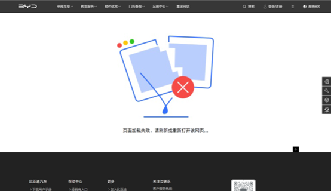
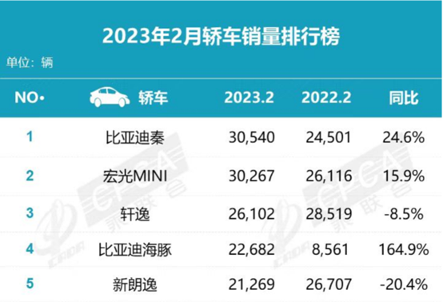

# 卷出新高度，20.98万起，比亚迪新车发布，官网被挤崩

刚发布完新车，比亚迪的官网就“崩了”，有网友表示：“这是热度太高了吗？”

_3月16日21点比亚迪官网崩溃，截至发稿已经恢复正常_

3月16日晚8点，比亚迪召开“汉唐双旗舰超级发布会”，发布了汉EV冠军版、唐DM-i冠军版两款车型，起步价均为20.98万元，实现了“加量不加价”。

此前曾有传言称，比亚迪两款新车的起售价将低于20万元，而比亚迪官方则对此进行了辟谣。除了新车发布外，比亚迪还针对汉DM-i、汉DM-
p推出“限时购车礼”活动，4月30日前购车可享受1万元现金补贴。

**起步价降低，比亚迪“卷起来”了**

具体来看，比亚迪汉EV冠军版的起步价相比老款车型大幅降低，售价为20.98万元到29.98万元，而比亚迪唐DM-
i冠军版售价为20.98万元到23.38万元。

在汽车行业掀起价格大战的背景下，比亚迪上述车型的起售价备受关注。此前市场上曾有谣言称：“19.98冠军版汉，18.98冠军版唐即将屠杀。”意指比亚迪两款新车入门价将低于20万元。

对此，“比亚迪网络举报中心”官方微信号发文表示：“网传汉EV冠军版、唐DM-
i冠军版上市售价低于20万元？经办办核实，为不实信息！请大家关注3月16日20点汉唐双旗舰超级发布会及后续官方渠道发布的价格信息。”

而市场对比亚迪新车售价关注的背后，也是由于此前比亚迪秦PlusDM-i2023冠军版的上市开启了“油电同价”的时代，取得了良好的销售成绩。

2023年2月10日，比亚迪秦PlusDM-i2023冠军版正式上市，该版本有5款细分车型（含55KM和120KM两种续航版本），官方指导价9.98万元-14.58万元，该产品的上市，让DM-
i车型首次价格下探至10万元以内。据了解，2023款均价为12.34万元，较2021款均价降低了1.64万元，而功能、硬件都进行了增加。

也正因为“加量降价”的性价比，让比亚迪秦系列实现了销量大增。据乘联会数据，今年2月比亚迪秦销量为30540辆，同比增长24.6%，在全国轿车销量排行榜中排名第一。据“比亚迪汽车”官方微博，秦PlusDM-i2023冠军版上市7天就拿下了32058辆的订单。

_来源：乘联会_

信达证券研报表示，比亚迪秦PlusDM-i2023冠军版以较优的性价比降维打击合资油车市场。合资品牌在10万元-15万元的A级轿车市场布局中主要以燃油车为主，对比发现：无论从价格、油耗、系统功能、硬件配件来看，秦PlusDM-i2023冠军版都有着明显的领先性。通过降维打击，秦PlusDM-i2023冠军版将颠覆燃油进行到底，油电同价或击穿合资车防线。

为了配合汉EV冠军版新车的推出，比亚迪经销商也曾针对旧款车型进行优惠。今年2月，北京、上海、深圳等多地的比亚迪展厅王朝系列产品启动优惠方案，老款车型优惠幅度在万元上下，交车周期也进行了缩短。当时记者以投资者身份致电比亚迪证券部，工作人员回应称：“比亚迪汉要推新款，因此要对2021款比亚迪汉进行去库存，经销商会有部分优惠政策。”

而在比亚迪汉EV冠军版发布的同时，比亚迪还针对比亚迪汉DM-i和汉DM-p推出“限时购车礼”活动：4月30日前购车享受1万元现金补贴（以购车开票时间为准）。

**成本降低，汽车行业掀起价格战**

近期，汽车行业掀起了降价潮，东风雪铁龙、别克、比亚迪等超过30个汽车品牌都推出了限时降价活动。

3月9日，比亚迪汽车官方微博发文称，比亚迪海洋网两大主力车型宋PLUS和海豹开启专项限时营销活动。据了解，比亚迪宋PLUS车系下订可享88元抵扣6888元购车款，海豹下订可享88元抵扣8888元购车款，活动时间持续到3月31日。

平安证券认为，表面上看，排放法规切换、2023年年初汽车市场需求不足是造成此次价格战的直接诱因，但更深层次的原因在于合资车企在新能源车时代失去了市场主导地位，其价格体系正受到以特斯拉、比亚迪为首的新能源车型的巨大冲击。

上述研报认为，部分主流车企很大程度上属于被迫应战，而车企实现良性的持续经营需要正常的盈利水平，价格战显然不是任何一家希望可持续经营的车企用以维生的途径，预计价格战并不会是长期现象。

单从新能源汽车行业来看，上游锂矿等原材料的价格下滑也成为车企降价的重要底气。据Wind数据，截至3月16日，国产电池级碳酸锂均价为32.05万元/吨，较2022年11月高点56.75万元/吨下滑了43.5%。

据GGII预测，2023年锂价将迅速回归至30万元/吨以下，远期将向成本方向靠拢。

如果碳酸锂的价格进一步下滑，对新能源车企来说，就意味着造车成本的降低，这将给部分车企提供一定降价的空间。

**进击海外，比亚迪动作频频**

对车企来说，降价的核心目的在于提振销量，但提振销量并不仅仅有降价这一种手段。近期，比亚迪出海动作频频，在海外多个国家或地区打开了市场。

2023年3月2日至12日，比亚迪与哥伦比亚经销商Motorysa在哥伦比亚首都波哥大举办“ElCuboMotorysa”展会，展会汇聚了比亚迪全系列新能源乘用车车型。

据了解，自2020年起，比亚迪就与Motorysa进行了合作，为当地消费者提供新能源乘用车产品。目前，比亚迪已向哥伦比亚市场交付超3100辆新能源乘用车，足迹已覆盖波哥大、麦德林、卡里、佩雷拉4大城市，成为当地市场主要的新能源乘用车品牌之一。

3月10日，比亚迪与英国电动汽车公司Octopus Electric
Vehicles达成合作，对方未来3年内将向比亚迪购买5000辆电动车用于服务英国市场。

今年2月，比亚迪还获得了瑞典最大公共交通运营商之一TransdevAB电动大巴订单，这是比亚迪与TransdevAB合作以来的最大订单，共52台电动巴士，将在瑞典东部Gästrikland省投入运营。

国金证券研报认为，比亚迪正兑现出海潜能，出海增长确定性大。2月比亚迪出口15002辆，同比增长1187%，环比增长44.1%，1到2月累计同比增长1607%，已接近传统出海车企上汽集团，实现了爆发式增长。比亚迪在国内电车市场的竞争力已得到充分证实，在海外多地布局生产基地和销售网络，海外出口增长确定性大。

责编：叶舒筠

校对：祝甜婷

**版权声明**

证券时报各平台所有原创内容，未经书面授权，任何单位及个人不得转载。我社保留追究相关行为主体法律责任的权利。

