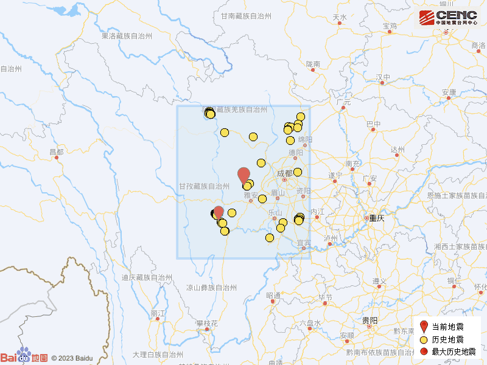

# 四川雅安市宝兴县发生3.2级地震，震源深度8公里

据中国地震台网正式测定，3月17日9时4分在四川雅安市宝兴县发生3.2级地震，震源深度8公里，震中位于北纬30.52度，东经102.83度。

震中5公里范围内平均海拔约2833米。

根据中国地震台网速报目录，震中周边200公里内近5年来发生3级以上地震共172次，最大地震是2022年9月5日在四川甘孜州泸定县发生的6.8级地震（距离本次震中126公里），按震级大小前50次历史地震分布如图。

