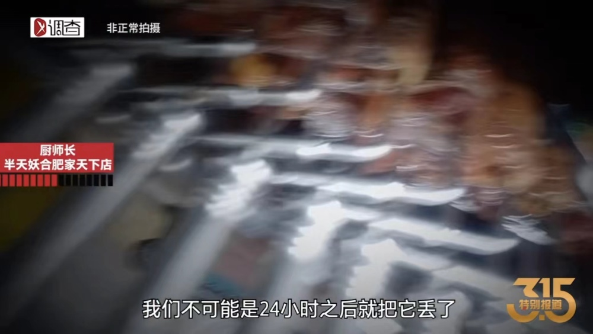
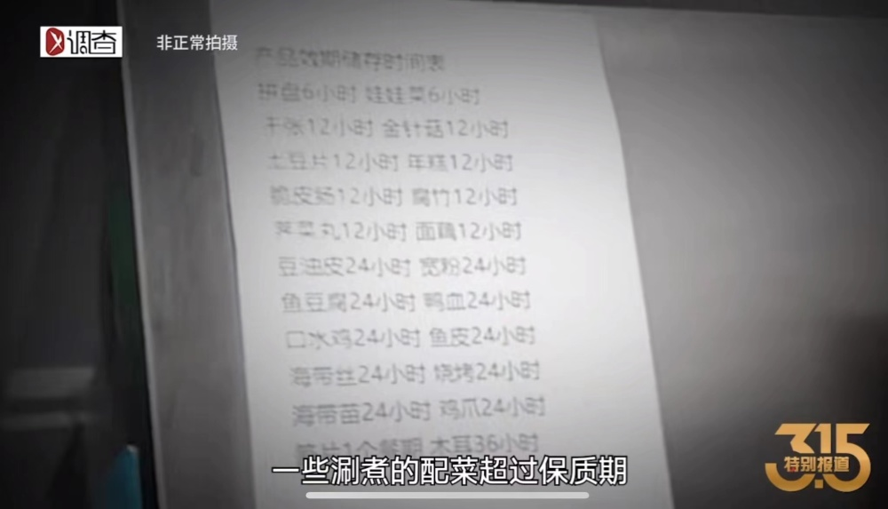

# 垃圾桶回收食材的烤鱼店停业，工作人员：产品把控严格，媒体夸大其词

近日，安徽合肥2家半天妖烤鱼门店被曝后厨使用食材多是冷冻产品，解冻后存放过期仍被端上餐桌，甚至发出“只要不臭，都能继续用”的言论。

更令人震惊的是，门店工作人员还曾将已经倒入垃圾桶的涮肚捡回重新加工，再次端上顾客餐桌。

_半天妖烤鱼继续使用过期食材。图/新京报视频截图_

此外，其工作人员办理的健康证实际上并未通过体检等正规手续获得，而是通过店长“找关系”，甚至本人都不需到场。

被曝光的两家门店关联企业分别为合肥炎沃餐饮管理有限公司、合肥市新站区自胜烤鱼店。九派新闻通过企查查APP发现，两家烤鱼店有一个相同的注册电话号码。

3月17日，九派新闻记者以消费者身份联系涉事门店关联企业—安徽合肥新站区自胜烤鱼店，该门店工作人员表示，他们的鱼都是冰鲜鱼，请客人放心。

提及315报道中合肥半天妖门店使用冷冻鱼，甚至将过期冷冻鱼端上餐桌一事，该工作人员称，是媒体为了吸引眼球而夸大其词，他们一直对产品把控较为严格。

17日下午，涉事门店工作人员表示现在已经暂停营业，恢复营业时间未定。

对此，河南泽槿律师事务所主任付建认为，餐厅使用过期食材、垃圾桶里捡回的食材等违法行为，侵犯消费者的知情权、公平交易权、生命健康权等多项权益，并且是行政违法行为，严重的可能涉嫌犯罪。

根据《食品安全法》第三十四条第一百二十四条的规定，餐厅禁止使用超过保质期等劣质食品原料。对于餐厅的这种违法行为，食品安全监督管理部门应当依法做出行政处罚。

另外，餐厅使用过期食材，从垃圾桶捡回来的食材，如果情节严重，足以造成食物中毒或其他疾病，还会涉嫌《刑法》第一百四十三条规定的生产、销售不符合安全标准的食品罪。

餐厅宣传自己使用新鲜食材，却背地里使用冷冻甚至过期食材，是虚假宣传，是对消费者进行欺诈。根据我国《消费者权益保护法》第五十五条规定，消费者可以主张退一赔三。

_半天妖烤鱼食材超过保质期仍继续使用。图/新京报视频截图_

根据《食品安全法》的规定，从事食品生产经营行业的相关人员必须拥有健康证。如果通过“关系”不体检也能拿到证，相关人员可能存在利用职务便利谋取非法利益的行为，如果是办理的是假证，可能涉嫌伪造事业单位印章罪。

餐饮行业员工健康证造假是违法行为，违反了《治安管理处罚法》第五十二条，属于伪造、变造国家机关、人民团体、企业、事业单位或者其他组织的公文、证件、证明文件的行为，处10日以上15日以下拘留，可以并处1000元以下罚款。

**九派新闻315报道组实习记者曹梦璇翟坤**

【来源：九派新闻】

版权归原作者所有，向原创致敬

