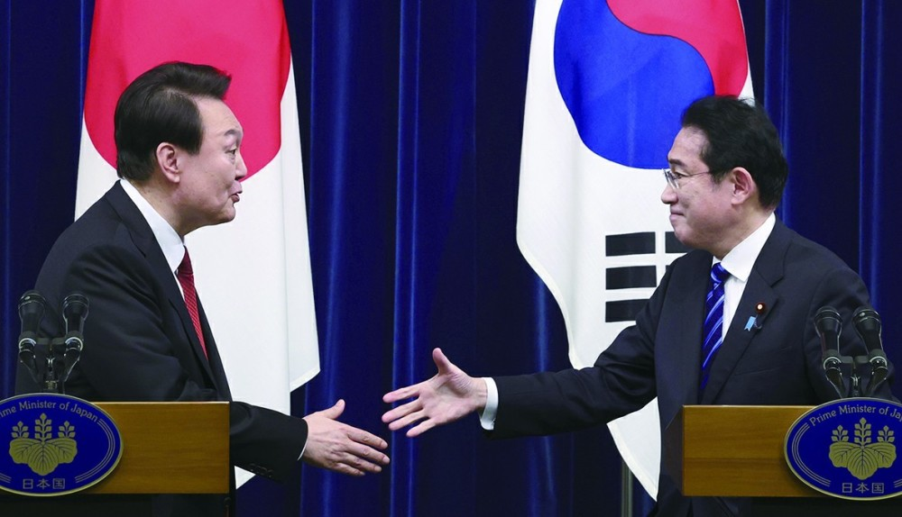

# 尹锡悦在巨大争议声中访日！韩媒：日本招待他的级别仅列第4级

【环球时报综合报道】韩国总统尹锡悦16日飞抵东京，开始对日本进行为期两天的访问。这是自2011年来，两国之间首次有领导人进行国事访问。在当天的会谈中，韩日领导人就重启“穿梭外交”、恢复《韩日军事情报保护协定》等问题达成一致。虽然尹锡悦在会谈后宣称韩日迈向“合作新时代”，但其此次访问在韩国引发巨大争议，舆论指责其为讨好日本而推动的强征劳工“第三方代赔”方案是“卖国”。与此同时，日本有声音认为，尹锡悦政府口中的“让步”并不是真正意义上的妥协。有学者分析称，“第三方代赔”方案不太可能长期掩盖韩日分歧，只会再次播下相互指责的种子，增加令人失望的几率。

**“不考虑对日企行使索赔权”**

尹锡悦从16日下午4时50分起在东京首相官邸同日本首相岸田文雄举行会谈。两国领导人举行23分钟的小范围会谈后，随即举行约60分钟的扩大会谈。岸田文雄在扩大会谈致开场白表示，很高兴看到两国迎来共同开创日韩关系新篇章的机会，两国领导人已就“不拘泥于形式重启定期互访的穿梭外交”达成一致。在会谈后的联合记者会上，尹锡悦表示，当天举行的韩日领导人会谈为从历史不幸中走出来开启“韩日合作新时代”迈出第一步。他说，韩日商定将加紧讨论加强安全、经济、人文交流等多领域合作，并建立“韩日经济安全对话”机制。尹锡悦称，在刚刚结束的会谈中，两国宣布《韩日军事情报保护协定》完全恢复正常，他宣称，两国有必要共享朝鲜核导航迹相关情报，以更好地应付“威胁”。岸田文雄表示，日韩领导人就尽早重启日韩安全保障对话和副部长级战略对话、并新设有关经济安全保障的磋商机制达成一致。他还提到，将探讨在恰当的时候访问韩国。

值得一提的是，针对日本记者关于在韩国引起轩然大波的二战强征劳工赔偿方案的提问，尹锡悦表示，韩方不考虑对涉案日企行使索赔权，“若行使索赔权，一切将重归原点。出于这样的考量，韩政府确定由第三方代赔的解法”。据韩媒此前报道，韩国政府本月6日正式宣布，拟由韩方设立公共赔偿基金，向韩国私人企业筹措资金，赔偿给被日本强征为劳工的韩国受害者，以此了结索赔案。

据日本共同社16日报道，日本政府当天宣布解除2019年发动的针对向韩出口高纯度氟化氢、氟聚酰亚胺、光致抗蚀剂三种关键半导体材料的限制措施。韩国产业通商资源部同日表示，韩国据此撤回之前向世贸组织（WTO）提出的申诉。

16日会谈结束后，尹锡悦与岸田共进晚餐。值得注意的是，岸田特别准备两顿晚宴，第一顿是在东京银座的一家寿喜烧店，第二顿是在一家创立于1895年的西餐馆，尹锡悦以前访问东京时曾在此吃过蛋包饭，令其印象深刻。韩国总统夫人金建希、三星集团“掌门人”李在镕和SK集团会长崔泰源等韩国经济界巨头陪同尹锡悦出访。

**“屈辱外交”两边不讨好**

“尹锡悦总统侮辱二战日本强征劳工受害者后，像完成作业一样奔赴日本”，《韩民族日报》16日以此为题报道称，反对党共同民主党党首李在明和议员们当天下午在国会会议上手挥太极旗，敦促尹锡悦停止对日本的“屈辱外交”。韩国民间团体当天在首尔市中心多地举行抗议活动，反对韩国政府的强征劳工受害者赔偿方案。有示威者表示：“尹锡悦总统与举着日本军国主义象征旭日旗的日本首相岸田共进晚餐，还胡诌找到解决强征劳工问题的解决方法。此外，韩国还准备进口福岛海产品、强化韩美日同盟，我们谴责这种屈从外交。”还有市民表示，如果在会谈中没有看到日本在历史问题上的态度转变，就应该宣布会谈破裂，“毫无收获的让步只会让韩日关系产生更深的裂痕”。对于日方解除对韩半导体材料出口管制措施，韩国《国民日报》称，韩国产业界普遍认为，韩国此前通过材料、零部件、装备国产化、进口线多元化等方式克服了半导体生产危机，因此即使日本解除出口限制，也不会立刻给韩国企业带来利益。

有韩媒注意到，日本政府招待外国贵宾，规格分为四个级别：国宾、公宾、正式工作访问宾客、工作访问宾客。尹锡悦这趟的待遇是列在第四级的实务访问宾客。有韩国网友调侃道：“即便以‘单方面下跪’的屈辱外交为代价换来这趟来之不易的访问，尹锡悦也没获得日本方面的‘国宾’待遇。”

另一方面，日本国内也有不少人对韩国政府在此次“破冰”中的表现不买账。日本明星大学教授细川昌彦15日在《产经新闻》刊文称，“从大局出发”不能成为“不合情理的让步”。细川昌彦认为，本来日本对韩出口管制问题与强征劳工问题无关，而韩国政府认为是日方的“报复措施”，因此在WTO框架内向日本提起诉讼，并宣布终止《韩日军事情报保护协定》。之后，韩国先是废除终止《韩日军事情报保护协定》的决定，又宣布中止在WTO的诉讼。细川昌彦称，这些都是韩国的“独角戏”，绝对称不上是韩方的让步。

**“再次播下相互指责的种子”**

尽管尹锡悦宣称韩日迈向合作新时代，但大部分韩国民众对于韩日关系的前景不甚乐观。民调机构韩国盖洛普日前公布的一项调查结果显示，有64%的受访者表示，“日方态度如不改变就无需急于改善双边关系”。韩国四家民调机构16日发布的一项联合民调结果显示，就政府提出的强征劳工“第三方代赔”方案，33%的受访者表示“赞成”，60%的受访者表示“反对”。此外，韩国民众对总统尹锡悦施政表现的好评率为35%，差评率达到57%。

有分析称，尽管尹锡悦的举措得到美日两国政府的积极响应，但他会否付出国内政治代价，所推动的韩日和解又会否在下一次龙山总统府换主人后改弦易辙，仍存变数。卡塔尔半岛电视台16日援引日本天普大学教授杰弗里·金斯顿的话称，尹锡悦推动的强征劳工问题“第三方代偿”方案在两国几乎都没有民意基础，因此不太可能长期掩盖分歧，只会再次播下相互指责的种子，增加令人失望的几率。

路透社称，调查显示，尽管许多韩国人喜欢日本电影和食物，但随着韩国在国际上的地位不断提升，年轻一代不太愿意以加强关系的名义掩盖历史争端。“虽然我喜欢日本文化，但这并不意味着我们要在外交上顺从日本。”30岁的首尔上班族金柱熙（音）说。

