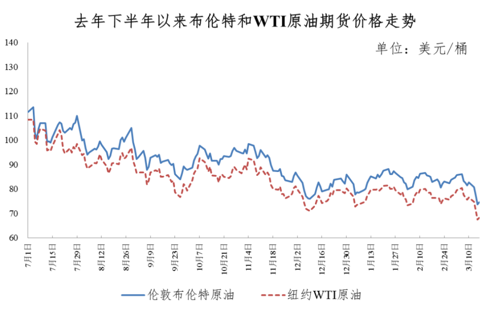
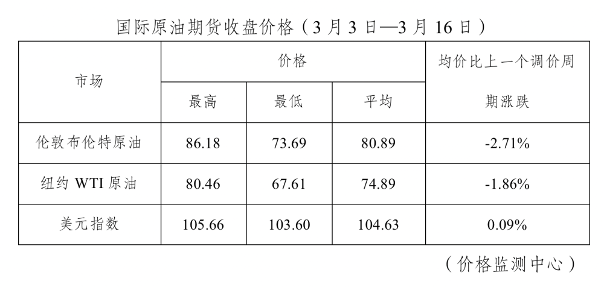

# 重要通知！今晚油价下调！加满一箱油将少花4元

央视财经（记者 平凡
孙永慧）根据国家发改委消息，新一轮成品油调价窗口将于今天（3月17日）24时开启。据国家发改委价格监测中心监测，本轮成品油调价周期内（3月3日—3月16日）国际油价震荡下降。平均来看，伦敦布伦特、纽约WTI油价比上轮调价周期下降2.29%。

央视财经记者从国家发改委获悉，本次油价调整具体情况如下：国内汽、柴油价格每吨分别下调100元和95元。

全国平均来看：

92号汽油每升下调 **0.08元；**

95号汽油每升下调 **0.08元；**

0号柴油每升下调 **0.08元。**

央视财经记者给您算了一笔账， **按一般家用汽车油箱50L容量估测，加满一箱92号汽油，将少花4元。**

**美欧银行爆雷事件演变**

**油价仍有继续下降的压力**

调价周期内，沙特上调4月销往亚洲的原油官方售价，美元指数一度降至近一个月低点，均给油价带来一定支撑。但美国硅谷银行倒闭引发连锁反应，市场出现恐慌，影响油价大幅下降。3月11日，美国硅谷银行宣布倒闭，此后危机蔓延，美国签名银行关闭，瑞士信贷银行出现流动性风险，市场恐慌情绪加剧进而抛售原油期货，油价连续3个交易日大幅下跌，美国原油库存继续增长也加大了油价跌幅，伦敦布伦特、纽约WTI油价累计下跌均超过每桶9美元。平均来看，本轮调价周期伦敦布伦特、纽约WTI油价分别比上个调价周期下降2.71%、1.86%。

国家发改委价格监测中心预计，短期来看，在全球原油供需基本面没有发生较大变化的情况下，美欧银行爆雷事件的演变是影响油价走势的主要因素，油价仍有继续下降的压力。后期需密切关注美欧对银行的支持政策，以及事件演变对油价的影响。

