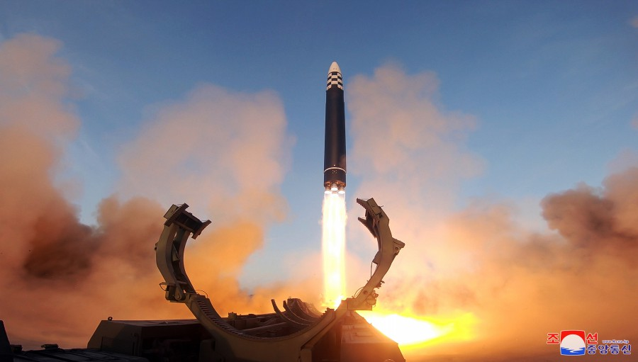
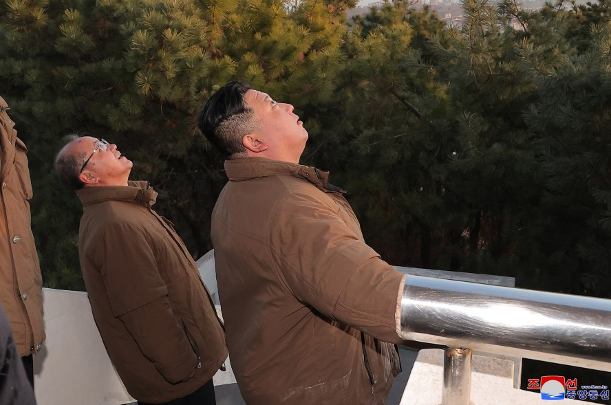
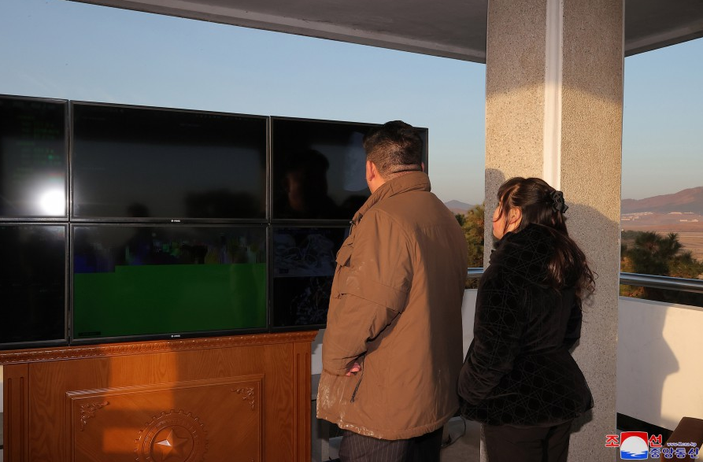
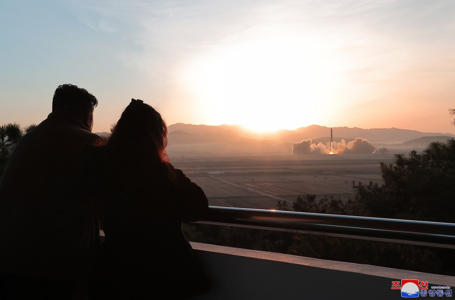
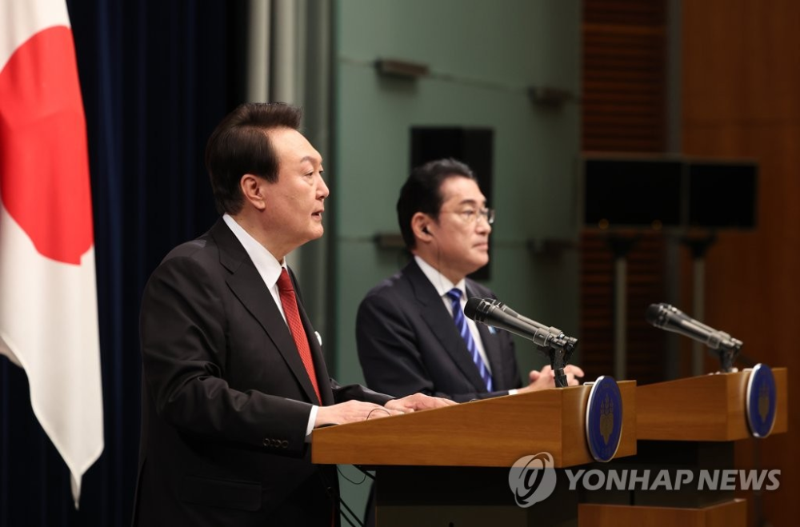

# 金正恩现场指导导弹试射，女儿金主爱再次亮相

据朝中社3月17日报道，朝鲜于16日试射了洲际弹道导弹“火星-17”。朝鲜劳动党总书记、朝鲜国务委员长金正恩指导试射。朝中社发放的相片显示，金正恩与女儿一同观看导弹发射过程。

_图源：朝中社_

_金正恩与女儿金主爱一同观看导弹发射过程。（图源：朝中社）_

报道称，“火星-17”型洲际弹道导弹在平壤国际机场发射，上升高度为6045公里，飞行距离达1000.2公里，飞行时间为4151秒，最后准确落在朝鲜东部公海的目标水域。

路透社称，“火星-17”是朝鲜迄今为止最大的导弹，也是世界上最大的公路机动液体燃料洲际导弹。

朝中社报道中提到，“战略武器射击演习向无视我们严正警告、固守不负责任、鲁莽军事威胁、蓄意加剧朝鲜半岛紧张局势、随时认识到武装冲突威胁的敌人发出更强烈的警告。更加明确地表明我们党和政府以压倒性进攻措施付诸行动的实际行动意愿。”

韩联社称，这是朝鲜今年以来第六次发射弹道导弹，或针对韩国总统尹锡悦和日本首相岸田文雄当天将在东京举行的会谈。日本共同社也认为，朝方此次试射或意在牵制“加强团结的日韩”。

另外，韩国和美国13日开始举行五年来最大规模的“自由之盾”联合军演。韩联社认为，这次导弹试射也意在反制韩美军演。

来源丨央视新闻、朝中社

