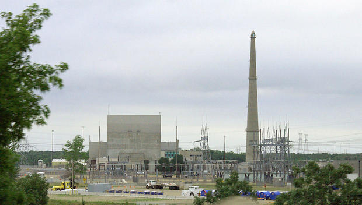

# 隐瞒数月后，美国一核电站承认泄漏150万升放射性污水

（观察者网讯）美国密西西比河上游一座核电站在去年发生泄漏事故，然而，涉事能源公司和美国监管部门直到近日才将这一消息告知公众。

据美国哥伦比亚广播公司（CBS）3月16日报道，美国明尼苏达州污染控制部门在当地时间16日表示，该州位于密西西比河畔的蒙蒂塞洛核电站在去年11月21日发生放射性水泄漏事故，造成150万升含氚的污水泄漏。当地监管机构正在监测涉事能源公司的污水清理工作。

_CBS报道截图_

明尼苏达州政府官员称，发生泄漏的位置是核电站两座建筑之间一处管道，“这是一次局部泄漏，没有扩散到其他地方，对公众健康或公共安全没有造成风险。”目前，核电站的所有者Xcel
Energy公司已经阻止了泄漏，正在努力清理泄漏的污水。

该州污染控制部门表示，事故共造成40万加仑（约151万升）含氚的放射性污水泄漏，目前没有证据表明周边的饮用水或密西西比河受到污染。污染控制部门官员柯克·寇德尔卡（Kirk
Koudelka）称，Xcel公司和州政府正采取措施，确保污染不会通过地下水扩散。

“我们的首要任务是保护居民和环境，正在与其他州机构密切合作，以监督Xcel
Energy的监测数据和清理工作。”寇德尔卡说，“我们正在努力确保完成清理工作，将饮用水供应的风险降至最低。”

然而美联社提到，Xcel公司在去年11月下旬就将事故通知了明尼苏达州政府和美国核能管理委员会，这一消息却直到今年3月16日才对外公开。对此，Xcel公司辩解称，虽然泄漏污水含氚量远高于美国环境保护署的标准，但并未影响到周边的地下水和饮用水，因此没有将此事公之于众。

Xcel公司在声明中称，他们没有在核电站设施以外或周边任何饮用水中检测到污染，“我们理解，如果情况对健康和安全构成直接威胁，迅速通知周边社区是非常重要的。不过在此次事件中，没有出现这样的威胁。”

美国核能管理委员会也宣称，氚泄漏是“常见的核电站事故”，该机构一再确定，核电站设施之外的泄漏水平“远低于安全阈值”， “不会影响公众安全或健康”。

明尼阿波利斯地方媒体《明星论坛报》则提到，核电站所在的蒙蒂塞洛市政府发表声明称，当地的饮用水没有受到影响，泄漏发生地点不在市政部门抽取地下水的范围之内。

_美国明尼苏达州的蒙蒂塞洛核电站
图自法新社_

根据Xcel公司的说法，截至当前，对泄漏污水的处理工作已经完成了25%。该公司正在考虑建造储水罐以储存污水，并研究处理放射性污水的方案。明尼苏达州污染控制部门称，监管机构将会审查该公司的处理方案。

CBS提到，Xcel公司计划在下个月关闭发电站，检查管道破损的具体原因。

发生泄漏的蒙蒂塞洛核电站位于美国明尼苏达州最大城市明尼阿波利斯西北约55公里处，处于密西西比河的上游，于1971年开始运营。1981年，这座核电站就曾发生过泄漏事故，大约7500升放射性污水流入河道。该州政府官员当时宣称，泄漏不会对野生动物或公众健康造成威胁。

**本文系观察者网独家稿件，未经授权，不得转载。**

