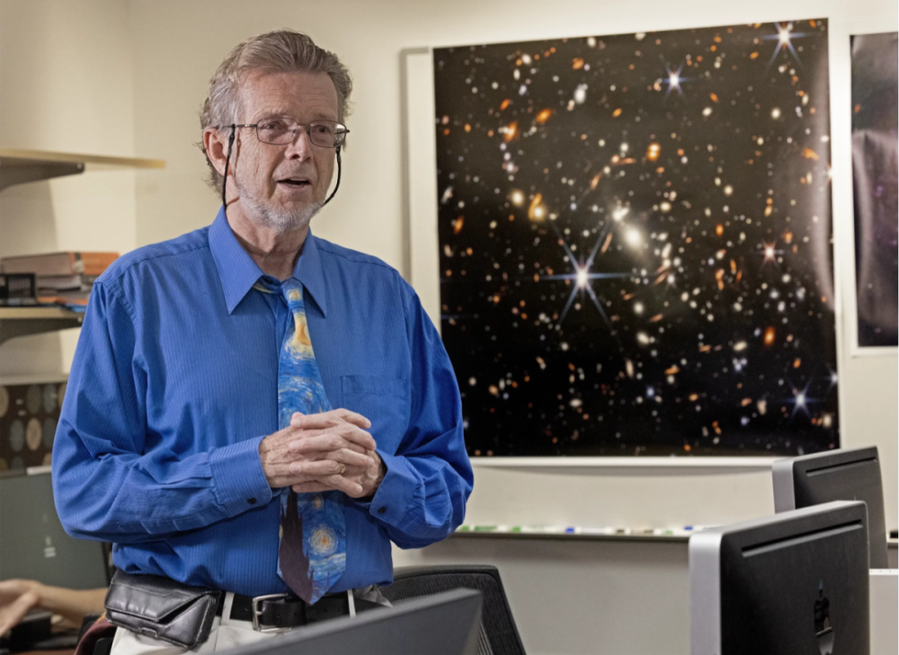

# 100亿美元花得值！宇宙中诞生的第一批恒星，可能被人类找到了

**作者：Jonathan O'Callaghan**

**机器之心编译**

**编辑：王楷、泽南**

宇宙大爆炸后不久，第一代恒星（第三星族星）开始诞生，它们为宇宙带来了光明和希望。詹姆斯・韦伯太空望远镜（The James Webb Space
Telescope，JWST）可能隐约观测到了它们。韦伯是人类发射到太空的最昂贵的望远镜，耗资约100亿美元。

_当今宇宙中最大的恒星比我们的太阳大几百倍。而宇宙最早的恒星质量可能是太阳的十万倍。_

一群天文学家正在仔细研究詹姆斯韦伯太空望远镜观测到的数据，它隐约捕捉到了遥远银河系中电离氦发出的光，这可能表明宇宙中存在的第一代恒星已被发现。

这些寻找已久、命名随意的「第三星族星恒星」（Population III stars）可能是由宇宙原始气体形成的巨大氢氦球。理论家们在 20 世纪 70
年代便开始对这些首批大火球进行设想。假设它们在短暂的生命周期后会爆炸成超新星，形成更重的元素并将其喷入宇宙。这些恒星物质后来形成了重元素更丰富的第二星族恒星（
Population II stars），而后甚至形成了更丰富的第一星族恒星（Population I
stars），如我们的太阳，以及行星、小行星、彗星，最终产生了生命本身。

「因为我们人类的存在，所以我们知道一定有第一代恒星，」英国曼彻斯特大学的天文学家 Rebecca Bowler 如是说。

现在，北京中科院的天文学家王鑫和他的同事认为他们已经找到了这些恒星，不过这个观点仍需确认。「这真的恍若梦幻，」王鑫提到。该团队的论文已于 12 月 8
日发布在预印版网站 arXiv 上，正在等待 《自然》杂志的同行评审。

即使这次研究人员观点有误，但对第一批恒星更有说服力的探测可能也不远了。JWST
正在大幅改变天文学探索，且被认为能够在足够遥远的空间和久远的时间中看到这些恒星。此外，巨大的浮动望远镜也早已可观测到遥远的星系，这些星系不寻常的亮度表明它们可能包含第三星族恒星。现在使用
JWST 观测恒星的其他科研小组也正争先恐后分析自己的数据。「这绝对是最热门的问题之一，” 加州大学圣地亚哥分校的物理学家 Mike Norman
说，他正通过计算机仿真模拟来研究恒星。

一项权威可靠的发现将会使天文学家得以开始探索恒星的大小和外观、它们存在的时间，以及它们如何在原始的黑暗宇宙中突然亮起。

「这确实是在宇宙历史上最根本的变化之一，」Bowler 表示。

**第三星族恒星（Population III）**

德国天文学家沃尔特・巴德 (Walter Baade) 于 1944 年将我们银河系中的恒星分为 I 型和 II
型。后者包含由较轻元素组成的较老恒星。数十年后，第三星族恒星的观点也被写入了文献。英国天体物理学家伯纳德・卡尔（Bernard Carr）在 1984
年发表的一篇提高了他们知名度的论文中描述了这种原始恒星在早期宇宙中可能发挥的重要作用。「它们的热量或爆炸可能使宇宙再电离，」卡尔和他的同事写道，「……
产生的重元素可能加速了前银河系的元素富集，」从而形成了后来更富含重元素的恒星。

卡尔和他的合著者推测，由于早期宇宙中存在大量的氢气和氦气，形成的恒星可能已经拥有浩瀚无际的尺寸，因而应该随处都可以测量到太阳大几百乃至十万倍的恒星。

_北京中科院的天文学家王鑫在早期宇宙中检测到氦
II，这可能表明宇宙中存在第三星族恒星。_

那些属于较重范畴那类的恒星，即所谓的超大质量恒星，它们表面温度会相对较低、表现为红色和膨胀的状态，其大小几乎可以等同于我们整个太阳系。密度更大、大小更适中的第三星族星变体会发出滚烫的蓝光，表面温度约为
5 万摄氏度，而相较而言，我们的太阳表面只有 5500 摄氏度。

2001 年，Norman
通过计算机仿真解释了如此大的恒星是如何形成的。在目前的宇宙中，气体云分裂成许多小恒星。但仿真模拟表明，早期宇宙中的气体云比现代的气体云热得多，不能像如今这样容易凝结，因此在恒星形成时效率较低。相反，整个气体云会坍塌形成一颗单独的巨星。

这些恒星巨大的质量意味着其生命周期是短暂的，最多只能持续几百万年（更大质量的恒星总能更快地燃烧掉可用的燃料）。因此，第三星族星在宇宙历史上将不会存续太长时间
—— 或许只会存在数亿年，直至最后一批原始气体的消散殆尽为止。

其实还有很多问题存在大量的不确定性。这些恒星的质量究竟有多大？它们在宇宙中存在的时间最晚是何时？在早期的宇宙中，它们有多丰富？Bowler
说：“它们与我们银河系中的恒星完全不同，真是太有趣了。”

_英国曼彻斯特大学天文学家
Rebecca Bowler 研究了早期宇宙中银河系的形成和演化。图片来自 Anthony Holloway / 曼彻斯特大学_

因为它们距离太远，存在时间太短，所以寻找与它们相关的证据一直是一个挑战。然而在 1999
年，科罗拉多大学博尔德分校的天文学家预测，恒星应该会产生一个会泄露存在迹象的信号：当每个原子的剩余电子在能级之间跃迁时，氦 II
或缺少电子的氦原子发出的光会具有特定的频率。曼彻斯特大学的天文学家 James Trussler
解释说：氦发出的光实际上并非来自恒星本身，相反，它是恒星热表面的高能光子冲入恒星周围的气体时产生的。

日内瓦大学的 Daniel Schaerer 在 2002 年对这一观点进行了扩展，他说：「这是一个相对简单的预测」，对这些证据的搜寻正式开始了。

**寻找第一代恒星**

2015 年，Schaerer 和他的同事们认为他们可能寻找到了什么。他们在一个遥远的原始星系中发现了一个氦 II
信号的可能线索，而这个星系可能与一群第三星族星有关。从大爆炸 8 亿年后的样子来看，这个星系似乎包含了宇宙中第一代恒星的第一个证据。

Bowler
后来主导的研究对这些发现提出了质疑。她说：「我们从源头上发现了有氧元素的证据。这排除了纯粹的第三星族星预测的可能性。」随后，一个独立的小组未能探测到最早的团队发现的氦
II 线索。「它不在那里，」Bowler 说。

**其他人的探寻境况会好一些吗？**

天文学家将他们的希望寄托在 2021 年 12
月装载好的詹姆斯韦伯太空望远镜（JWST）上。这架望远镜拥有巨大的镜体和对红外光前所未有的灵敏度，可以比之前的任何望远镜都更容易地观察早期宇宙。因为光传播需要时间，所以尽管它们出现在很久以前，望远镜仍然可以看到遥远的微弱物体。此外，望远镜还可以进行光谱分析，将光分解成其组成波长，这使它能够寻找第三星族星的氦
II 标志。

王鑫的团队分析了 JWST 2000 多个观测目标的光谱数据。其中一个是大爆炸后 6.2
亿年才出现的遥远星系。根据研究人员的说法，这个星系被分成两部分。他们的分析表明，其中一半星系似乎含有氦 II
的关键信号，其中还混合着其它元素发出的光，这可能意味着它们是数千颗第三星族星和其他恒星的混合星族。此外，对星系另一半部分的光谱分析尚未完成，但它的亮度暗示着这是一个更富第三星族星的环境。

「我们正在努力申请使用 JWST 下一个周期的观测时间来覆盖观测整个星系，以便有机会来确认这些天体，」王鑫如是说。

根据 Norman 的说法，这个星系是一个「令人头疼的地方」。他说，如果氦 II 的结果经得起推敲，“那么一种可能就是这个星系就是第三星族星群。”
然而，他不确定第三星族星和后来的恒星是否能如此轻易地混合在一起。

_亚利桑那州立大学的 Rogier
Windhorst 正在使用引力透镜来试图放大早期宇宙中第三星族星的图像。_

英国朴次茅斯大学的天体物理学 Daniel Whalen
也同样谨慎。他说：「这确实可能是一个星系中混合了第三星族星和第二星族星的证据。尽管这将可能是宇宙中第一代恒星的『第一个直接证据』，然而这却并非确凿证据。」其它滚烫的宇宙天体也可以产生类似的氦
II 信号，包括旋绕在黑洞周围的灼热物质吸积盘。

王鑫认为，他的团队可以排除黑洞为该氦 II
信号的来源的可能性，因为他们没有检测到特定的氧、氮或电离碳信号，而这些是这种可能的预期条件。然而，这项工作仍有待同行审查，而且即便如此，后续观察也需要确认其潜在发现。

