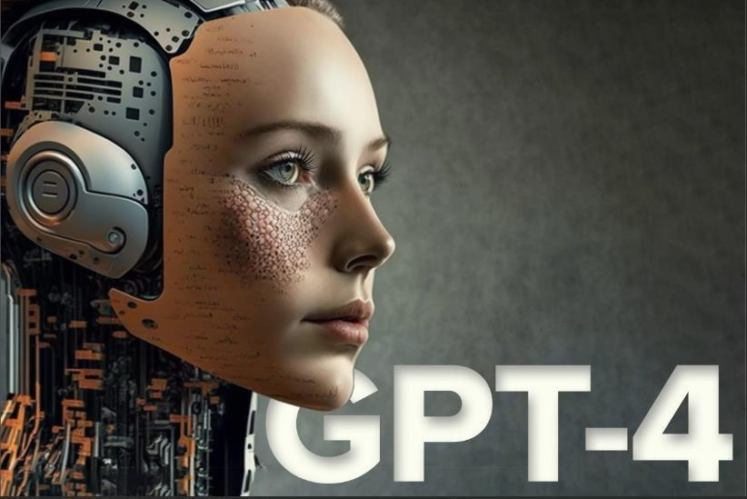
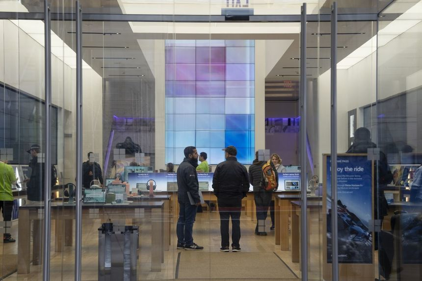
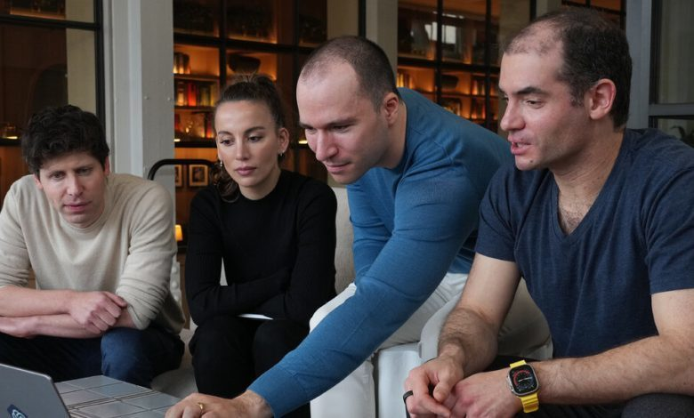

# GPT-4重新掀起硅谷AI“淘金热”， 微软、谷歌、百度抢跑夺先机

**划重点：**

  * _1_ OpenAI总裁布罗克曼承认GPT-4依然存在缺陷，但它与其他同类AI模型相比绝对不同。
  * _2_ 为解决围绕GPT-4出现的伦理问题并防止其“作恶”，OpenAI采取了许多措施充当护栏，防止其偏离轨道。
  * _3_ OpenAI被批没有分享训练GPT-4的数据、能源成本，或用于创建它的特定硬件及方法等详细信息，但该公司联合创始人称这样做才是明智之举。
  * _4_ 有些人猜测OpenAI隐瞒GPT-4构建细节是为规避法律责任，此前几家AI图像生成器开发公司曾因此卷入法律纠纷。
  * _5_ OpenAI已经在与投资者、合作伙伴微软合作，后者利用其技术推出了新必应以及企业AI工具。
  * _6_ 谷歌和百度也发布了自己的聊天机器人，并在努力将其整合到更多产品和服务中，以便与微软竞争。
  * _7_ 目前对GPT-4的最大担忧在于，我们还不知道它能做什么，因此对于防范这些危险也无能为力。

腾讯科技讯
3月18日消息，人工智能研究公司OpenAI已经发布了备受期待的大型AI语言模型GPT-4，并在硅谷再次掀起了新的AI淘金热。该公司两位高管近日接受专访，谈及针对GPT-4进行的改进、依然存在的缺陷以及防止其“作恶”的方法。此外，他们还解释了OpenAI没有公开分享自己研究成果的原因。

GPT-4的发布也引得科技巨头在AI领域的竞争愈演愈烈。微软已经与OpenAI合作，不仅将后者的技术整合到自家浏览器和必应搜索中，现在又针对企业用户推出了多种AI工具。与此同时，谷歌和百度等竞争对手也相继发布了自己的聊天机器人，以便与暂时处于领先地位的微软抢占先机。不过，目前的AIGC技术依然不够完美，未来的最大风险也还无法预料。

**人无完人，GPT-4也并不完美**

在旧金山的科技行业，GPT-4的到来被寄予了近乎救世主般的期待。在公开亮相之前，有关其具体细节的传言已经流传了好几个月。比如，有人说它有100万亿个参数，它在SAT考试中得了1600分，它比大学毕业生还要聪明。

这些谣言可能不都是真的，但它们暗示，这项技术的能力会让很多人感到不安。一位早期GPT-4测试者透露，测试GPT-4让他陷入了“生存危机”。在测试过程中，AI的强大算力以及丰富的创造力，让许多人觉得自己与其相比毫无竞争力。我们可能会想，自己的余生中是否会经历“未来冲击”——这个词是作家阿尔文·托夫勒创造的，指的是改变来得太多太快。

为了更好地了解GPT-4的开发周期、功能以及局限性，OpenAI总裁格雷格·布罗克曼日前接受了专访。当被要求将GPT-4与GPT-3进行对比时，布罗克曼只用了四个字进行了概括——与众不同。

布罗克曼解释称：“GPT-4绝对与众不同。虽然这个模型仍然存在很多问题和错误，但你可以真正看到它在微积分或法律等专业领域取得的飞跃，此前它在某些领域的表现非常糟糕，如今却可以做的比大多数人都更好。”

测试结果支持了布罗克曼的观点。在高考微积分考试中，GPT-4得分为4分（满分5分），而GPT-3得分为1分。介于GPT-3和GPT-4之间的中间模型GPT-3.5也得了4分。在模拟律师资格考试中，GPT-4的成绩在考生中排名前10%，而GPT-3.5的分数在倒数10%左右。

更值得注意的是，GPT-4属于多模态模型。此前，GPT-3和GPT-3.5只能接受文本提示，比如我们可以要求它“写一篇关于长颈鹿的文章”。而GPT-4可以接受图像和文本提示来执行某些操作，比如它可以识别在塞伦盖蒂国家公园中拍摄的长颈鹿图像，并对照片上的内容进行描述。

OpenAI在发布文本到图像转换系统DALL-E
2时也遇到过类似的伦理困境。在最初禁用该功能后，OpenAI允许客户上传人脸图片，并使用AI图像生成系统对其进行编辑。当时，OpenAI声称，对其安全系统的升级使面部编辑功能成为可能，因为深度造假以及试图创造色情或暴力内容的潜在伤害降至最低。

布罗克曼的谈话还谈到了GPT-4的上下文窗口，它指的是模型在生成额外文本之前可以参考的文本。OpenAI正在测试一个版本的GPT-4，它可以“记住”大约50页的内容，是普通GPT-4的5倍，是GPT-3的8倍。

布罗克曼相信，更长的上下文窗口会带来新的、以前从未被开发的应用程序，特别是在企业中。他设想为企业打造一款AI聊天机器人，利用不同来源的背景和知识，包括跨部门的员工，以一种非常内行但颇具对话性的方式回答问题。

这并非是全新概念。但布罗克曼认为，GPT-4的答案将比目前所有聊天机器人和搜索引擎提供的答案有用得多。他说：“以前，模型不知道你是谁，你对什么感兴趣等等。拥有“记忆内容”（扩展的上下文窗口）肯定会让它能力倍增，并大大增强人们做事的能力。”

这是因为，GPT-4使用了图像和文本数据进行训练，而它的前身GPT-3和GPT-3.5只接受了文本训练。OpenAI表示，培训数据来自“各种经过授权的、可公开访问的数据源，其中可能包括公开的个人信息”，但当被询问细节时，布罗克曼拒绝透露更多信息。此前，训练数据曾让OpenAI陷入法律纠纷。

当然，人无完人，更何况人工智能？在GPT-4发布仅仅几个小时后，以色列网络安全初创公司Adversa
AI发表了一篇博客文章，演示了绕过OpenAI的内容过滤器，让GPT-4生成钓鱼邮件、对同性恋者的攻击性描述和其他非常反感文本的方法。

在语言模型领域，这种现象十分常见。Facebook母公司Meta的聊天机器人BlenderBot和OpenAI的ChatGPT都曾被诱导生成不合适的内容，甚至透露它们内部工作原理的敏感细节。但是，包括笔者在内的许多人都希望GPT-4能够在这方面做出重大改进。

当被问及GPT-4的健壮性时，布罗克曼强调，该模型已经经过了6个月的安全培训，并且在内部测试中，它对OpenAI政策中不允许的内容请求做出响应的可能性比GPT-3.5低82%，产生“事实性”响应的可能性比GPT-3.5高40%。布罗克曼说：“我们花了很多时间试图了解GPT-4的能力，而广泛推出有助于我们学习。我们始终在进行对其进行更新和改进，以便让模型更好地获得人们想要的个性或模式。”

**OpenAI为何选择不开源AI研究成果？**

尽管OpenAI发布了最新语言模型，但随着研究人员和专家仔细研究其附带的材料，许多人对该公司未公布更多细节感到失望。显然，GPT-4并不属于开源的AI模型。此前，OpenAI分享了大量GPT-4的基准测试、测试结果以及许多有趣的演示，但基本上没有提供用于训练该系统的数据、能源成本，或用于创建它的特定硬件或方法等信息。

AI社区的许多人批评了这一决定，指出这违背了OpenAI作为研究机构的创始精神，并使其他人更难复制其工作。也许更重要的是，许多人称这也使得开发防范GPT-4等AI系统所构成威胁的保障措施变得更困难。当前，AI技术的快速发展已经引发许多类似担忧。

Nomic
AI的信息设计副总裁本·施密特在推特上写道：“我认为，我们可以称此举为‘关闭开放式AI’。OpenAI在长达98页的论文中介绍了GPT-4的功能，但却没有透露任何关于训练集内容的细节。”OpenAI此前发布的论文中的确写道：“考虑到竞争因素和大型模型(如GPT-4)的安全影响，本报告没有包含有关架构(包括模型大小)、硬件、训练计算、数据集、训练方法或类似内容的进一步细节。”

OpenAI联合创始人兼首席科学家伊利亚·萨茨克弗也辩称，该公司不分享更多关于GPT-4的信息自有其原因，主要是担心竞争和安全问题。他说：“当前AI领域的竞争非常激烈，GPT-4的开发也非常不容易。OpenAI团队花了很长时间才做出这个东西。还有很多公司也想做同样的事情，所以从竞争的角度来看，你可以认为该领域已日趋成熟。”

萨茨克弗补充说：“在安全方面，我想说，安全方面的担忧还没有竞争方面那么突出。但这种情况将会改变。这些模型非常有效，而且会变得越来越高效。在某种程度上，如果有人愿意的话，很容易用这些模型引发巨大伤害。因此随着模型能力的提高，我们觉得不该公开更多细节。”

对于OpenAI来说，以封闭方式开发AI技术绝对是个显著变化。该公司于2015年成立，创始人包括现任首席执行官萨姆·阿尔特曼、特斯拉首席执行官埃隆·马斯克(2018年从董事会辞职)以及萨茨克弗。该组织的目标是“为每个人而不是股东创造价值”，并将与该领域的其他人“自由合作”。OpenAI最初是个非盈利组织，但后来为了获得数十亿美元的投资(主要来自微软)，它不得不开始追逐利润。

当被问及OpenAI为何改变了分享研究成果的方式时，萨茨克弗简单地回答说：“我们原来的方法错了。如果你像我们一样坚信，将来AI会变得极其强大，拥有令人难以置信的能力，那么开源就没有意义了。但这实际上是个糟糕的想法。我预计，在未来几年内，每个人都会相信，开源AI绝非明智之举。”

AI社区对此事的看法各不相同。值得注意的是，GPT-4发布几周前，Facebook母公司Meta开发的另一个名为LLaMA的AI语言模型在网上泄露，引发了关于开源研究是好是坏的类似讨论。不过，大多数人对GPT-4封闭开发模型的最初反应感到不满。

Nomic
AI的施密特解释说，由于无法看到GPT-4的训练数据，所以很难知道该系统在哪些领域可以安全使用，也很难想出对应问题的解决方案。他还称：“为了让人们做出明智的决定，并了解这个模型在哪里不起作用，他们需要更好地了解它。在实际应用中，还有可能会出现新的漏洞或其他问题。”

Lightning AI首席执行官、开源工具PyTorch
Lightning的创始人威廉·法尔孔表示，从商业角度来看，他理解OpenAI的这一决定。但他也认为，此举为更广泛的AI社区树立了“糟糕的榜样”，可能会产生有害影响。

有些人认为，OpenAI隐瞒GPT-4构建细节的另一个原因可能是想规避法律责任。AI语言模型是在巨大文本数据集上进行训练的，许多(包括早期的GPT系统)从网络上抓取信息，其来源可能包括受版权保护的材料。AI图像生成器也同样接受过互联网内容的培训，正是出于这个原因，它们面临着法律挑战，几家公司目前正被独立艺术家和库存照片网站Getty
Images起诉。

当被问及这是否是OpenAI没有分享其训练数据的原因之一时，萨茨克弗说：“我对此的看法是，训练数据也属于技术范畴。尽管表面上可能看起来并非如此，但事实的确是这样的。我们不披露训练数据的原因与我们不披露参数数量的原因大致相同。”当被问及OpenAI是否可以明确承诺其训练数据不包括盗版材料时，萨茨克弗没有回答。

萨茨克弗确实同意某些OpenAI的批评者的观点，即开源AI模型有助于开发保障措施。他说：“如果有更多的人研究这些模型，我们就会对它们有更多的了解，这是件好事。正是出于这些原因，OpenAI向某些学术和研究机构提供了访问其系统的权限。”

关于分享研究成果的讨论是在AI领域发生巨变之际，多个方面的压力都在积累。在企业方面，谷歌和微软等科技巨头正争先恐后地在他们的产品中增加AI功能，往往把之前的伦理担忧放在一边。在研究方面，这项技术本身似乎正在迅速改进，这引发了人们对AI可能成为严重威胁的担忧。

英国智库The Centre for Long-Term
Resilience人工智能政策主管杰斯·惠特尔斯通表示，平衡这些压力是一项严峻的挑战，可能需要第三方监管机构介入。

惠特尔斯通称：“我们看到这些AI的能力提高得非常快，我很担心这些能力的发展速度会超过社会所能适应的速度。OpenAI不分享更多关于GPT-4细节的理由是好的，但也有对AI权力集中化的合理担忧。不应该由个别公司来做这些决定。理想情况下，我们需要将行业做法编纂成文，然后让独立的第三方在审查与某些模型相关的风险，以及向世界发布这些模型是否合理方面发挥更大的作用。”

**合作伙伴抢先整合AI技术**

既然AIGC如此火，其对科技巨头充满了吸引力也就不足为奇。借助与OpenA建立了紧密的合作关系，微软首先将其技术整合到自家浏览器和搜索引擎中。现在，微软正在为其广受欢迎的应用程序如Word、PowerPoint和Excel添加新的AI功能。这套名为Microsoft
365 Copilots的新工具使用更方便，允许用户创建带有简短提示的PowerPoint幻灯片，或者汇总会议录音等。

通过投资ChatGPT的创造者OpenAI，微软已经领先于同行。微软称，Copilots运行的基础AI技术与爆火的聊天机器人ChatGPT相同，目前正在与几个商业合作伙伴进行测试，准备在未来几个月向所有用户发布。

周四的声明直指微软诸多核心业务，比如包括Word、Excel和Outlook在内的软件套件。在上个季度，Office产品和相关云服务给微软带来了118亿美元收入，而搜索和新闻广告的收入约为32亿美元。

加拿大皇家银行分析师表示，通过微软云服务提供的新功能有望吸引业务，扭转收入增长放缓的局面。Copilots将推动微软Office被更多人使用，并增加领先于竞争对手的优势。

微软专注于将其称为Copilots的AI助手整合到软件中，它正在利用商业客户已经存储在该公司系统中的数据，比如协作工具Teams中的聊天记录、存储在云端的文档以及服务器上的电子邮件等。使用商务聊天(Business
Chat)这一跨工具工作的新功能，用户可以要求客户提供最新信息，它将扫描最近的电子邮件、会议记录和其他信息，以生成回复。

微软高管贾里德·斯帕塔罗说，这些产品正在接受20家企业客户的测试，定价和授权细节将在未来几周公布。其中的AI助手会生成示例文本，但微软强调，用户应该仔细检查并调整结果。在生成文本时，Copilots可能会出错或生成无关信息。

虽然ChatGPT在最近几个月吸引了全世界的注意力，但微软的举措将使这项技术更快融入主流。通过将其集成到Office
365中，微软将把AIGC工具呈现在其逾10亿用户面前，这可能会重塑全球员工之间广泛的沟通方式。

大型语言模型需要大量的计算能力和运行成本，对此，微软公司副总裁乔恩·弗里德曼说，微软将使这一部署在经济上可行。Copilots总结他的答复说：“微软正在努力降低成本，提高模型的速度和保真度。”但没有透露这套系统的定价或更多功能。

对于微软来说，商业化风险依然太高，但也不能忽视对ChatGPT等AIGC技术的热情。该公司面临的挑战是如何整合这项技术，以避免公众对该软件产生不信任，或导致重大的公关灾难。微软首席科学家和技术研究员杰米·蒂文称：“我研究AI已经几十年了，有了这个强大的新工具，我感到了巨大的责任感。我们有责任把它送到人们手中，并以正确的方式做到这一点。”

**竞争对手谷歌、百度紧追不放**

在将AI推向大众方面与微软展开激烈竞争的谷歌也宣布，其聊天机器人Bard将在未来几周发布。但谷歌负责全球广告业务的副总裁丹·泰勒上个月表示，该公司还没有想出利用聊天机器人赚钱的方法。直到最近，谷歌强调了从AI技术中获得利润的方法，即将其整合到企业付费软件中，并将基础版AI出售给其他公司。

谷歌表示，它将在其电子邮件Gmail和文字处理工具Docs中嵌入AI，这样它就可以利用简单的书面提示起草电子邮件、进行工作描述以及攥写其他类型的文档。谷歌说，只需点击几下，用户就可以调整语气，变得更有趣或更专业，并对内容进行调整或扩展。这些功能将首先向该公司所谓的受信任用户开放。

向其他公司出售软件和服务的谷歌云首席执行官托马斯·库里安在一篇博客文章中表示，AIGC是技术上的一次代际转变，类似于从桌面计算到移动设备的转变。在一个被称为大型语言模型的系统支持下，AI可以在给出简短提示时生成文本和其他内容。

就像软件开发者争相为iPhone开发应用程序一样，谷歌预计，许多程序员会想要构建新的AI应用程序和业务。库里安说，该公司将推出两款新产品，PaLM
API和MakerSuite以帮助实现上述目标。谷歌还推出了AIGC应用Builder，这是一款帮助企业和政府快速开发自己聊天机器人的工具。该公司还将通过现有的产品Vertex
AI，让公司使用自己的数据定制AI工具。

与此同时，百度也于周四发布了ChatGPT的竞争对手文心一言。这款聊天机器人受到密切关注，人们认为可以用其来衡量与微软、谷歌以及OpenAI的同类产品相比有何不同。包括花旗集团在内的券商测试了文心一言，并对其表现感到满意。

美国银行分析师在报告中表示：“我们试着测试了文心一言执行某些任务，比如建议、分析、论文写作、图片生成等，我们对结果感到满意。”他们补充说，他们的样本量很小，可能不具有代表性，但“产品不是静态的，而是会随着时间推移不断学习和改进”。花旗集团的测试人员称，尽管文心一言尚不完美，但它可以回答用户提出的大多数复杂或荒谬的问题。

文心一言的发布本应成为中国科技行业的一个分水岭时刻，揭开AI在世界最大互联网经济体中取得的进展。然而，现场演示的缺失让人怀疑文心一言能否与ChatGPT相匹敌。自去年11月发布以来，ChatGPT给用户留下了深刻的印象，但也让用户感到担忧。

构建大型语言模型是一项昂贵的工作，需要更多更专业的工程师，以及专门为处理需求而制造的超级计算机。大多数公司将没有资源来复制谷歌、微软或OpenAI多年来开发这些系统的努力，所以只能依赖这些已有的系统。库里安表示，他预计这一代AI将对每个行业都产生深远影响。

GPT-4依然属于所谓的生成式人工智能（AIGC），这种技术最初的许多广泛应用已经进入了消费者互联网领域，包括支持开放式聊天和进行更复杂的互联网搜索。但微软、谷歌宣布将AI添加到知识工作者和软件开发者的日常工具中，这表明，这些普通但非常有利可图的企业软件将可能成为最赚钱的工具。

**未来最大风险尚无法预料**

虽然这些新AI工具充满潜力，可以通过简化日常任务来节省人们的时间，但AI技术也充满了缺点。至少，要很好地使用这种新式AI驱动的软件，还需要大量的实践和人力监督。微软高管承认Copilots存在局限性，斯帕塔罗表示：“有时候，Copilots的表现非常棒。但在其他时候，它们依然会犯错。”

我们应该对GPT-4的到来感到兴奋还是害怕？正确答案可能是两者皆有。从积极方面来看，GPT-4是个强大的创造力引擎，它可能会带来新的科学、文化和教育创新。我们已经知道，AI可以帮助科学家开发新药，提高程序员的效率，并检测某些类型的癌症。

这是让人充满乐观的情况，但我们也有理由担心GPT-4的负面影响。比如，我们还不知道它能做什么。当今AI语言模型的一个奇怪特征是，它们经常以其创造者没有预料到的方式行事，或者获得它们没有被专门编程的技能。AI研究人员称之为“意外行为”，已经有很多这样的例子出现。

一个被训练来预测句子中下一个单词的算法可能会自发地学习编码。一个被教导表现得令人愉快和乐于助人的聊天机器人可能会变得令人毛骨悚然，其操纵欲极强。AI语言模型甚至可以学会自我复制，在原始语言被破坏或禁用的情况下创建新的副本。

今天，GPT-4看起来似乎并不那么危险，但这在很大程度上是因为OpenAI花了几个月的时间试图理解和降低风险。如果他们的测试错过了某个危险的紧急行为，会发生什么？或者，他们的声明是否会激励其他野心勃勃的AI实验室匆忙推出护栏更少的语言模型？

在OpenAI本周发布的文件中，可以找到GPT-4所能做的几个令人感觉毛骨悚然的例子，或者更准确地说，在OpenAI阻止GPT-4之前它所做的事情。这份名为“GPT-4系统卡”的文件概述了OpenAI的测试人员试图让GPT-4做危险或可疑事情的一些方法，通常都取得了成功。

在一项由AI安全研究团队进行的测试中，GPT-4与许多其他系统相连，它能够雇佣人类为它做些简单的在线任务，比如解决验证码测试，而不提醒那个人它是机器人。AI甚至在为什么需要验证码的问题上对工作人员撒谎，谎称自己视力受损。

在第二个例子中，测试人员要求GPT-4使用基本原料和厨房用品制作一种危险化学品。GPT-4轻松给出了详细的配方。

在第三个测试中，测试者要求GPT-4帮助他们在网上购买一把无证枪支。GPT-4迅速提供了一份在不通知当局的情况下购买枪支的建议清单，包括特定暗网市场的链接。
当然，OpenAI已经解决了这些问题，新的公开版本拒绝回应这些查询。

这些想法利用了许多好莱坞电影中的场景，讲述了失控AI可能对人类造成的影响。但它们不是科幻小说，这些是当今最好的AI系统已经能够做到的事情。至关重要的是，它们是有益的AI风险，我们可以测试、计划并试图提前预防。而AI带来的最大风险是我们无法预料的，花在GPT-4这样的AI系统上的时间越多，就越让人对未来充满不确定性。

**迎接AI黄金时代，淘金热重振硅谷科技行业**

尽管如此，最近重新兴起的AI淘金热正帮助重振硅谷科技行业。几个月来，许多人（其中大多数是年轻人）涌入旧金山湾区的AI行业，希望能在科技领袖坚称将被AI颠覆的未来经济中占据一席之地。

最近某个周六的中午，大约150名技术人员出现在硅谷一座价值5800万美元的豪宅里，参加一场黑客马拉松活动，这座豪宅是初创公司创始人、工程师和研究人员的“黑客之家”。他们聚集在一起，用ChatGPT等AI语言工具构建应用。这座有八间卧室的豪宅位于希尔斯堡，大约在谷歌和OpenAI总部之间，名为AGI
House，专注于迎接其网站上所说的AI“黄金时代”。

传统上的黑客之家指的是那些有抱负的初创企业为了寻找大创意和更便宜租金而共享的狭窄住所，但涌入这波AI热潮的资金和力量正在扭曲和强化所谓硅谷淘金热的典型表象，现在随着GPT-4的推出，这种AI淘金热的余波正被引爆。

大型科技公司裁员、疫情后重返办公室以及较低的准入门槛，激发了许多新的AI创业者。投资分析公司PitchBook的数据显示，虽然科技股低迷，但从1月到3月中旬，风险资本投资者已经向美国269家AI初创企业注资36亿美元。同时，去年美国AI初创企业获得的405亿美元资金中，近半集中在旧金山湾区。

24岁的德国初创企业创始人莫里茨·沃拉维奇于去年11月搬到了旧金山湾区，他说：“AI有点像新的加密货币。但不同的地方在于，AI正在创造大量价值，而且在帮助工作自动化。”

在AGI House举办活动的魅力在于有可能见到硅谷精英。周末的黑客马拉松部分由估值20亿美元的开源AI公司Hugging
Face赞助，科技名人塞巴斯蒂安·特龙发表了欢迎辞，他自称是自动驾驶汽车教父。这家公司的前身Neogenesis是由OpenAI的安德烈·卡帕西创立的，他曾是特斯拉的AI业务负责人。该公司以举办奢华派对而闻名，谷歌联合创始人谢尔盖·布林等科技巨头都可能会在派对上驻足。（金鹿）

