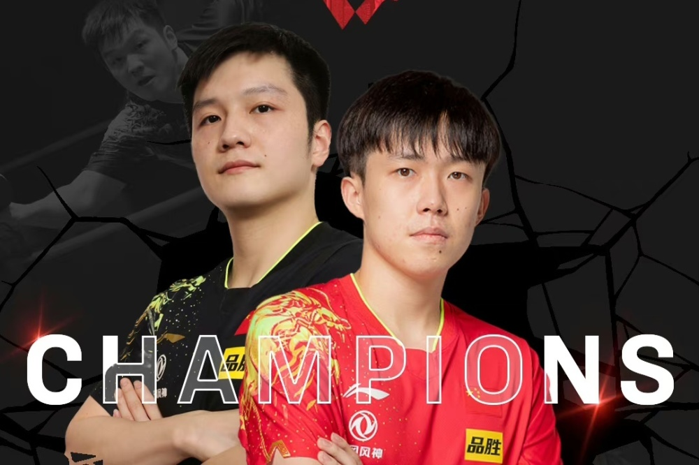
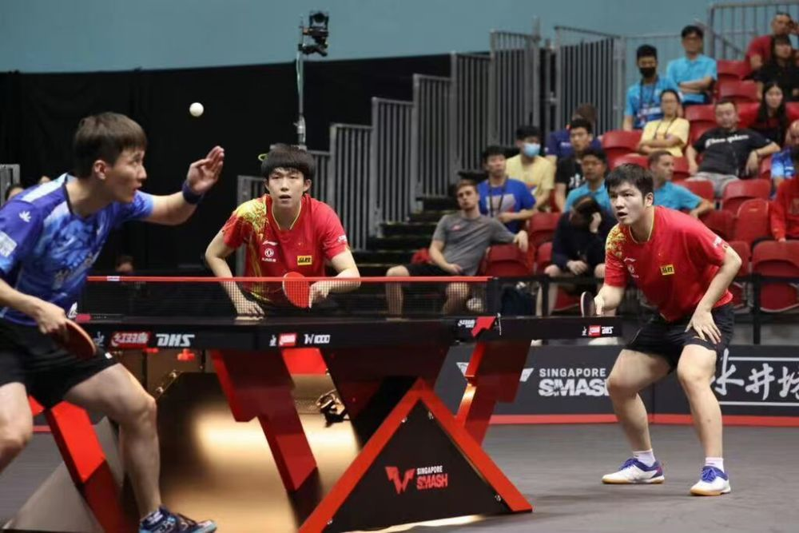
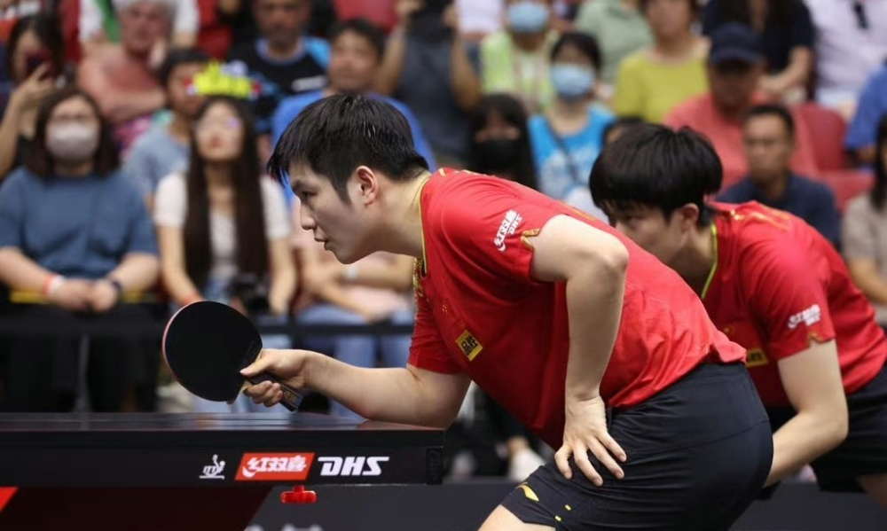
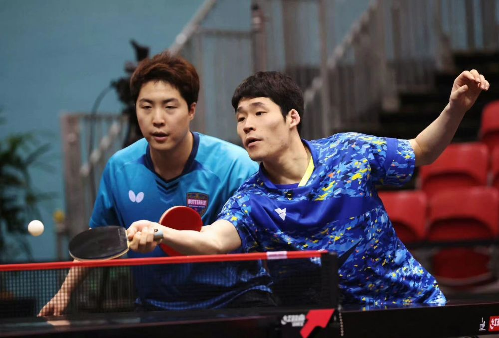
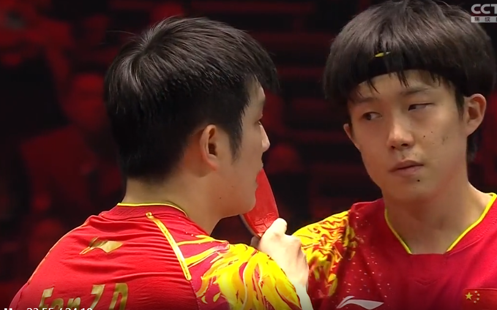
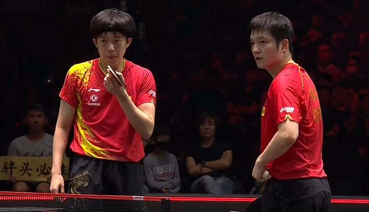
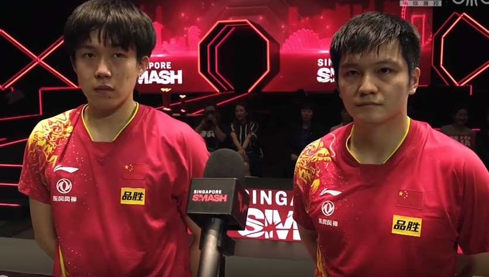
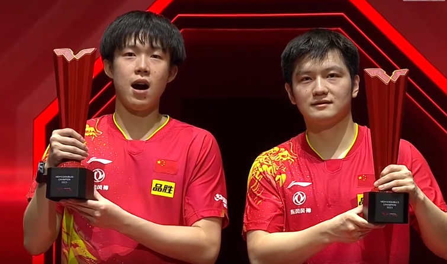
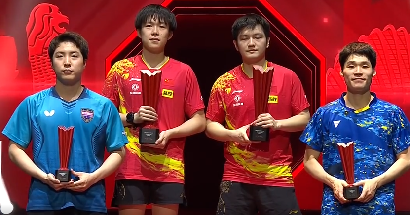

# 不容易！恭喜樊振东王楚钦大满贯男双夺冠，一天多赛极度考验体能

北京时间3月18日，2023新加坡大满贯男双决赛揭开战幕。国乒樊振东王楚钦与韩国的张禹珍林仲勋争夺冠军。樊振东和王楚钦是2022年大满贯男双冠军，再次参加比赛二人的目标就是卫冕。这场决赛国乒组合与对手激战四局，最终以3-1逆转对手获胜。为国乒拿到第二座冠军奖杯。恭喜樊振东，恭喜王楚钦！

**樊振东王楚钦晋级之路**

樊振东和王楚钦是大满贯比赛的四号男双组合，两个人技术实力强大，配合也非常默契，在世界乒坛双打领域占据第一。这次参加大满贯比赛，双方会继续以赛代练，进一步提高技术和增加默契度。他们在首轮比赛3-1击败了新加坡的郭勇和冯耀恩组合晋级八强。

在次轮比赛中，樊振东王楚钦3-0击败跨国组合李尚洙和卡尔伯格晋级四强。第三轮比赛，樊振东王楚钦3-1击败日乒的户上隼辅和宇田幸矢。晋级决赛之后，就要和韩国名将张禹珍和林仲勋争夺冠军。

双方比赛开始之后就进行了白热化的争夺模式，韩国组合利用发球抢攻妄图占据主动权，同时在进攻的角度和落点上做文章。第一局比赛确实给樊振东和王楚钦一定的压力。双方的比分非常胶着，一直激战到8-8平。局末阶段张禹珍和林仲勋更加强势，最终以11-9拿下第一局的胜利。

第二局樊振东王楚钦强势上手进攻，取得了3-1的领先。不过张禹珍和林仲勋利用发球轮追分，双方战成3-3平。此后国乒组合发起攻势取得了8-5的领先，但是韩国组合顽强追分，一度把比分追到9-9平。之后韩国组合甚至反超1分。国乒主帅王皓为樊振东和王楚钦布置了战术，二人坚决执行，在局末打出超级精彩的进攻。最终国乒组合以13-11拿下第二局。

大比分扳成1-1平之后，樊振东和王楚钦士气大涨，在比赛中更加注重质量，同时注意交流，打出了非常精彩的配合。比分一直处于领先，局末阶段王楚钦发球，樊振东反攻，以一记幸运球得分终结比赛。国乒组合以11-8拿下第三局的胜利。

第四局比赛，国乒组合气势如虹，韩国组合则无心恋战。樊振东和王楚钦很快就以11-4获得第四局的胜利。从而以总比分3-1逆转击败对手，获得了本次新加坡大满贯的男双冠军。赛后王楚钦盛赞樊振东，认为能和世界第一球员做搭档，不是每个国家的球员都能享有的。大头太会说话了！

恭喜樊振东，恭喜王楚钦！王楚钦目前已经完成了卫冕男双和混双冠军的任务。樊振东也完成了卫冕男双冠军的任务。而对于分量最重的男单冠军，两人也会全力以赴去争夺。圆满完成男双任务之后，樊振东和王楚钦从搭档变成对手，两人将争夺一张单打决赛门票。两个人一定会为球迷奉献一场精彩的比赛。不管谁晋级决赛，都是国乒的骄傲。球迷也会为两人点赞。加油！

原创文章，欢迎关注评论。

