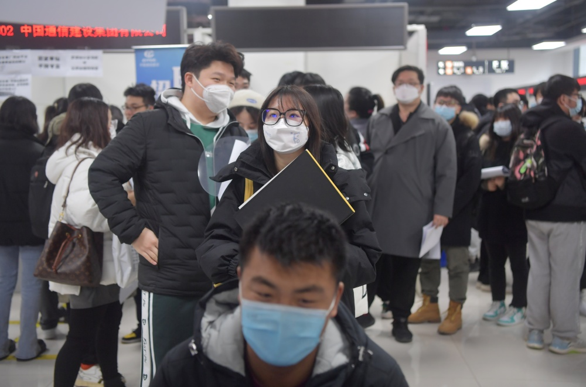

# 今年北京硕博毕业生人数首超本科生，就业形势仍然比较严峻

春招正当时。根据今年3月初人力资源和社会保障部公布的数据，2023届高校毕业生人数将达到1158万，同比增加82万人。随着疫情管控政策的调整，目前，各相关部门、全国各院校陆续举办形式多样的毕业生就业双选会，毕业生们的求职渠道从“云端”拓展至线下。

有毕业生表示，毕业人数增长加剧就业竞争压力；也有声音认为，春招时企业会根据秋招情况对岗位进行调整和补充，同样存在不错的机会。

针对北京2023届毕业生的就业形势、企业招聘需求、学生求职表现等方面，3月17日，新京报记者专访了北京高校大学生就业创业指导中心（以下简称中心）副主任苏秀丽。

**就业形势：**

**总量压力依然严峻，北京高校硕博毕业生数量首次超过本科毕业生**

“我们都知道今年全国的毕业生预计达1158万人，北京高校的毕业生数量约28.5万人，这个增量还是挺大的，都创了历史新高。”苏秀丽介绍，受疫情影响，从2020年到2022年，北京高校毕业生的出国比例明显下降，留学生回国就业人数增加，加上一部分往届毕业的未就业人员，今年毕业季的就业形势仍然比较严峻。

此外，北京高校毕业生呈现出一个新的变化：研究生（硕士和博士）的毕业人数首次超过本科生。苏秀丽认为，这一变化有利有弊，一方面体现出北京高校的人才培养层次高，毕业生人力资源价值大；另一方面由于研究生相对来说具有较强竞争力、其选择空间更大，就业进度也相对放缓。

“就业的基础是经济，在疫情好转的当下，各行各业都在复工复产，经济复苏呈现企稳回暖的良好态势。但政策的调整、经济的复苏和岗位供给的提升不是绝对同步的。”苏秀丽谈到，从中心4月份之后举办毕业生就业双选会的招展（指招揽企业参与招聘活动）情况来看，受国内外多种不确定因素影响，经济的恢复可能还需要一段时间，但企业表现积极、也有不少外地的机关及企事业单位到京招才引智，中心有信心继续做好北京高校毕业生的就业服务工作。

**促就业举措：**

**举办约265场招聘会，融入组团式访企拓岗等创新形式**

2022年9月1日至2023年3月16日，中心已为2023届毕业生举办约265场招聘会，其中线上约201场、线下约64场。苏秀丽表示，2022年底北京市疫情防控政策“新十条”出台后，中心抢抓窗口期，于2022年12月29日举办了针对2023届毕业生的第一场线下招聘活动，“我们要起到示范引领和鼓舞士气的作用，全力助力企业复工复产并为广大毕业生创造求职就业的机会。那场活动效果也非常好，吸引了400多名毕业生，相关的新闻宣传冲到了北京热搜榜榜首。”

今年春天，中心的首场招聘会在2月8日举行，“这也是历年来最早的一次。”苏秀丽说到，彼时还未到北京高校开学季，之所以提前，是考虑到京籍学生、着急找工作提前返校学生的需求；自此，中心的招聘会由线上转到线下。苏秀丽补充说，疫情三年来，线上求职似乎已经成为大家习惯的一种方式，但经用人单位、毕业生及各高校反馈，线下直接的面对面依然是供需双方觉得管用且有效率的方式。

_2023年2月8日下午，北京高校大学生就业创业指导中心举办春季首场线下双选会，毕业生在排队投递简历。图/IC
PHOTO_

关于招聘会的形式和内容，中心也做了一些新的尝试。

一是在线下招聘中加入现场直播（通过微信公众号“成功就业”观看），为不能到场的学生提供了解和参与的机会，这些学生可以不受地域和时间的限制登录线上平台（北京高校大学生就业创业信息网）投递简历。

二是将访企拓岗组团化，在北京市教委的指导下，组织各高校集体访企拓岗，把校企的“点对点”对接扩大为“面对面”。以中心在3月8日举办的高职高专专场招聘会为例，当天吸引了80多家企业和近500名毕业生参加，中心精选了十余家优质的代表性企业、邀请了北京14所高职高专院校展开对接交流。交流会上，学校介绍毕业生数量、培养情况，企业表达用人需求，“这样提升了效率，有利于促进供需的精准对接。”苏秀丽回忆，当天，一家从未招聘过高职高专学生的国有企业表示，今年想要一些技术型岗位的新生力量，但找不到门路、不清楚该联系哪些学校，“中心就发挥了牵线搭桥的作用。我们的工作不是独角戏，要跟各院校的就业工作及市场建设紧密结合，比如，举办教育、金融、建筑等行业类专场，就会尽可能辐射到北京所有开办这些专业的学校学生。”

**企业需求：**

**七大行业招聘需求旺盛，企业爱招“好用”的毕业生**

就企业招聘而言，苏秀丽表示，可通过中心的调查问卷统计数据做分享，但她也强调“它不是市场的全貌反馈，仅供参考。”

根据中心举办的200多场招聘会情况，来自以下七类行业的企业参会揽才较为积极，分别为教育行业、信息传输软件和技术服务行业、制造业、科学研究和技术服务行业、建筑行业、批发和零售行业、金融行业。

从用人喜好来看，企业愿意招“好用”的毕业生。什么样的毕业生是“好用”的？问卷调查结果显示，企业首先关注的是学生的专业知识和技能水平，专业学习的培养和积累十分重要；第二大方面是学习能力，专业积累是基础，如何转化和应用，在工作实践中怎么提升，也是企业特别看重的素质；第三是沟通和表达能力，苏秀丽强调，不单指经济类、法律类学生，各行各业对毕业生这方面的要求都比较高，特别是与同事的交往、人际关系能否处理得很和谐。

她还指出，“我查看了近5年的问卷反馈，企业的用人偏好基本没有大的变化，可能有时候有的企业会对创新能力提出高一点的要求，但具备以上三种能力的毕业生一定是受欢迎的。”

**毕业生心态：**

**求职预期降低，求稳心态突出，“慢就业”比例上升，灵活就业增多**

那么，作为2023年毕业求职季的主角，应届毕业生们呈现出哪些就业倾向？与往届生相比，是否有新变化？苏秀丽根据其所了解的情况，总结了四点变化。

其一，毕业生的整体求职预期有所降低。与疫情前相比，如今大家对薪酬、单位性质等方面的要求都在下降，“疫情这几年确实给很多人带来一种职业的不安全感，对毕业生也是有影响的。”

其二，更多的毕业生希望通过稳定的工作给自己带来安全感和可靠性，考公、考编、考证意愿愈发强烈，“也就是求稳心态更加突出。”

其三，求稳心态也就导致了“慢就业”现象的凸显。苏秀丽解释说，2022年的考研和考公人数均创历年新高，这和体制内的就业偏好相互关联；若第一次考试没能“上岸”、或不满意岗位等，倾向于寻找“更稳定、更好机会”的毕业生们会利用“应届生”的身份再考一年，所以“慢就业”的比例还在增加。

其四，灵活就业形势逐渐走热。“这是新的经济形态，以前一说灵活就业，大家觉得不是正经工作，现在社会和家长都需要转变观念，它是社会发展的一种新变化，我们都要去理解和适应。”苏秀丽表示，现在许多共享平台、在线工作的形式，其实为毕业生们提供了多元的选择。作为就业服务部门，中心在呼吁给灵活就业的毕业生更多政策与制度保障。

最后，苏秀丽还谈到，尽管国家和地方一直在推进双创教育，但近两三年来，受疫情影响，大学生创新创业也受到了很大挑战，很多创业学生遇到比较大的困难。“鼓励年轻人创新创业有特别重要的意义，在创业者本人实现高质量就业的同时，还可以带动就业。”她表示，后续，中心将加强引导，持续深化北京高校大学生“一街四园多点”创业孵化体系建设，调动毕业生创业积极性，支持和帮助大学生创新创业。

**就业建议：**

**促进毕业生就业，关键要做好人岗匹配**

“即使国企和事业单位是毕业生青睐的去向，但在实际的双选活动中，民营企业依然是招聘主力群，因为“盘子大”，吸纳能力还是最强的。”苏秀丽认为，促进毕业生就业，关键要做好人岗匹配，现在最需要关注的，是将学生引导至适合他们的岗位。

结合工作见闻，她告诉新京报，毕业生们普遍的问题在于还不能对自身有客观平实的认识，求职时往往想找一个无限接近于理想状态的工作，“人都有美好的愿望，但职场不是这样的。”另外，应届毕业生也缺乏对外部世界的清晰了解，再加上供需信息的不精准，容易眼高手低、择业目标不明确。苏秀丽建议，这需要学校加强职业规划和职业引导，学生们不宜都想着去做“高大上”的工作，应选择适合自己的，才能既发挥个人价值、又成就职业梦想。

“还要营造良好的社会氛围。”以用人单位招聘要求为例，专科生可以做的工作不一定非要求本科及以上，本科生能做的事情不一定非招收硕士及以上。“学生就业难、企业招人难的问题不可能立竿见影得到解决，需要一个慢慢推进的过程。”

苏秀丽坦言，近期的调查问卷结果显示，40%左右的毕业生对就业形势持不太乐观的态度，“学生们还是觉得压力大，不过这项数据在春节前的统计中是超过了50%的。”她表示，适当的压力也是好事，从今春的线下招聘来看，不论是中心举办的活动，还是校园场地的双选会，毕业生的参与动力和活力都体现出比以往更强的积极性。

新京报记者 罗艳

编辑 缪晨霞 校对 赵琳

