# 俞敏洪：宁愿当没钱的流浪汉，周围的企业家都没有高质量生活

每经编辑：杜宇

据第一财经，2023亚布力论坛年会17日晚间在黑龙江省亚布力开幕，主题为“弘扬企业家精神,聚力高质量发展——中国式现代化的机遇与挑战”。作为第二十三届亚布力论坛轮值主席，新东方创始人俞敏洪表示，过去的23年，毫无疑问一直是前进的23年，努力的23年，在艰苦中间也在寻找希望的23年。

在谈到高质量发展这部分时，俞敏洪表示：“提到高质量发展， **其实我内心在想的是认识的周围这些老朋友企业家，没有一个有着真正的高质量的生活** 。”

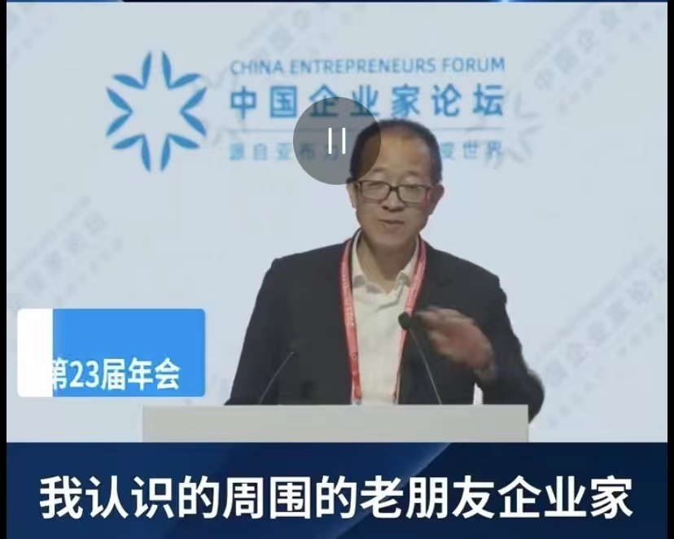

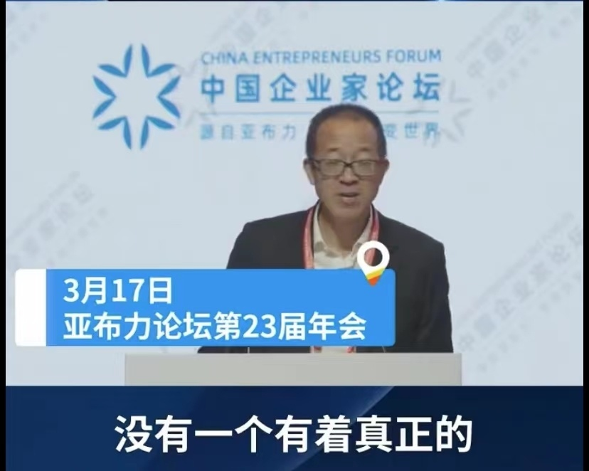

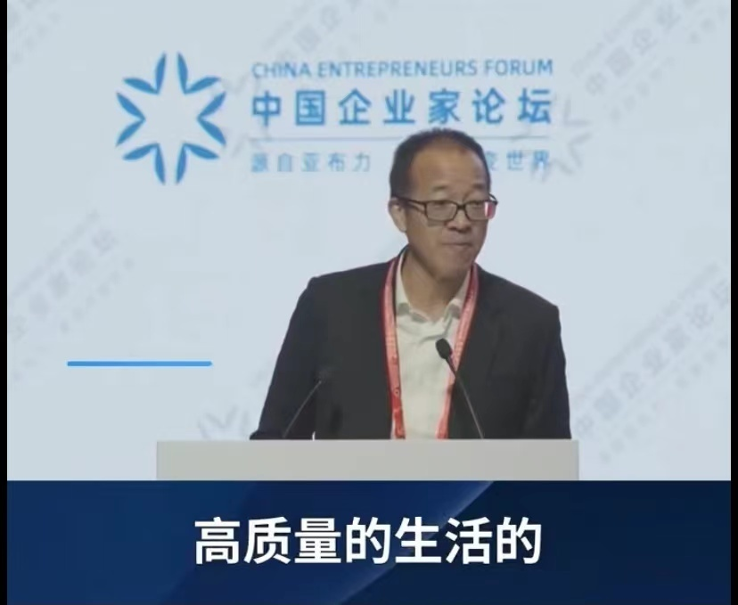

俞敏洪表示，自己周围的企业家都在没日没夜的干活：这些企业家把所有的（精力）都放在了企业发的展上面，中国经济的繁荣是跟每一个企业的发展和成长连在一起的。俞敏洪谈到：“就像去年我遇到困难时做了东方甄选后很多人问我‘你为什么不退休？为什么还有勇气重新投入去做？’我说这是一个不需要思考的问题，因为我们这些人就是生而为赢来的。”

俞敏洪表示， **这个“赢”不仅是为自己的企业而赢，要为整个的民族和国家去赢，我们的投入表面上是为了企业的生存，背后是为了整个国家的繁荣。**

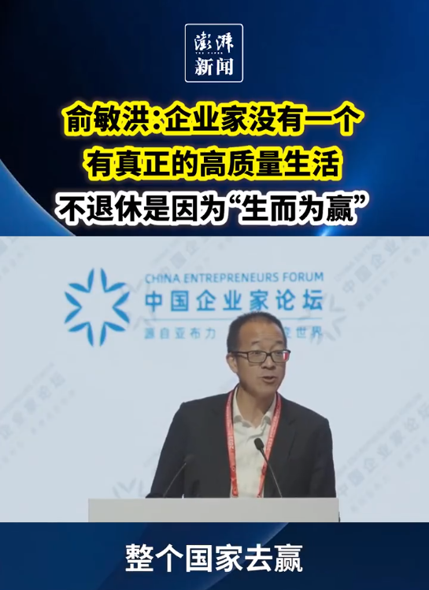

“任何个别企业的倒闭或者是遇到困难是不重要的，重要的是整个企业家群体依然愿意全心全意地去奋斗。”俞敏洪以自己投身到东方甄选的发展为例，认为最重要的核心依然是激发和弘扬企业家精神。

据澎湃新闻，俞敏洪谈及最近大热的聊天机器人ChatGPT时表示，企业家不仅要专注自己的企业，更要关注世界变化和发展。作为企业家，
**没有玩过ChatGPT，没有资格谈高科技发展** ，年龄不是问题，思想僵化、不接受新鲜事物才是问题。

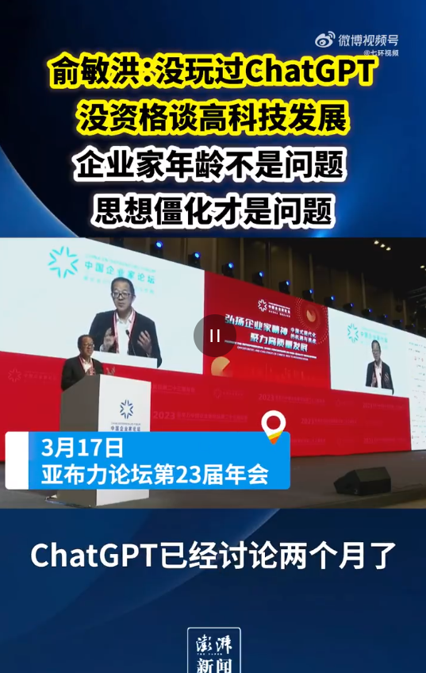

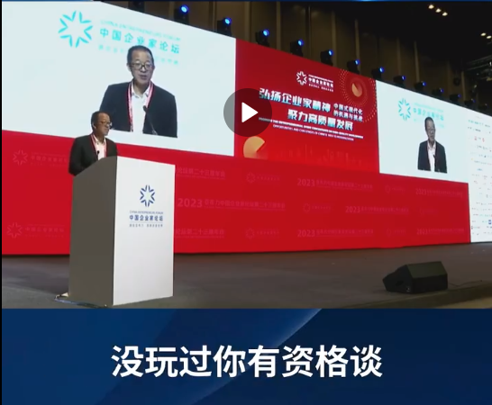

俞敏洪多次以直播平台“东方甄选”转型成功的经验举例称，东方甄选之所以能成功，很大原因是在其他人没玩抖音的时候，他很早就开始玩抖音、在抖音带货，如果没有自己提前在抖音带货的经验，就没有后来的成功转型。

**俞敏洪称如果自己再选择，会希望当个旅行者，宁愿当个没钱的流浪汉，也比当个有钱的企业家符合自己的性格。**

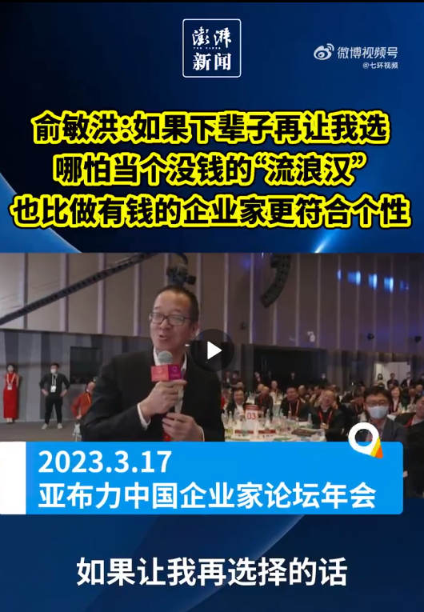

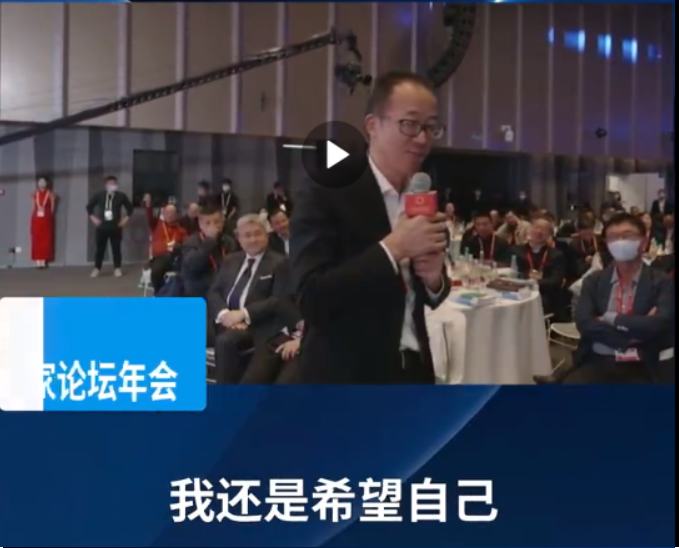

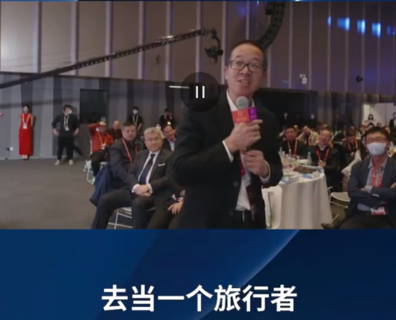

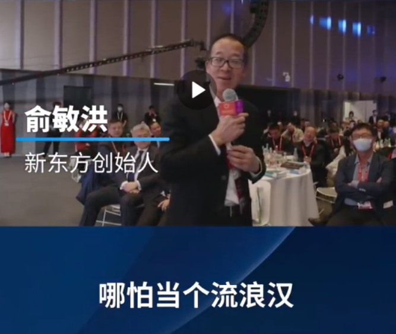

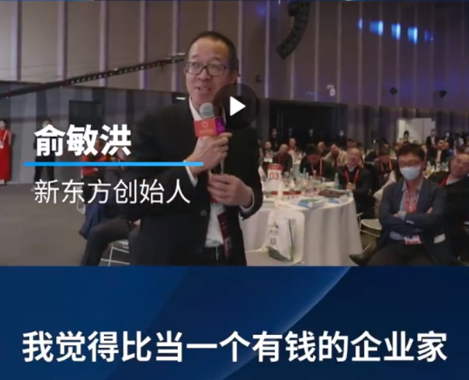

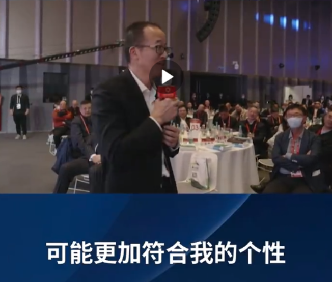

_图片来源：澎湃新闻视频截图_

每日经济新闻综合第一财经、澎湃新闻

