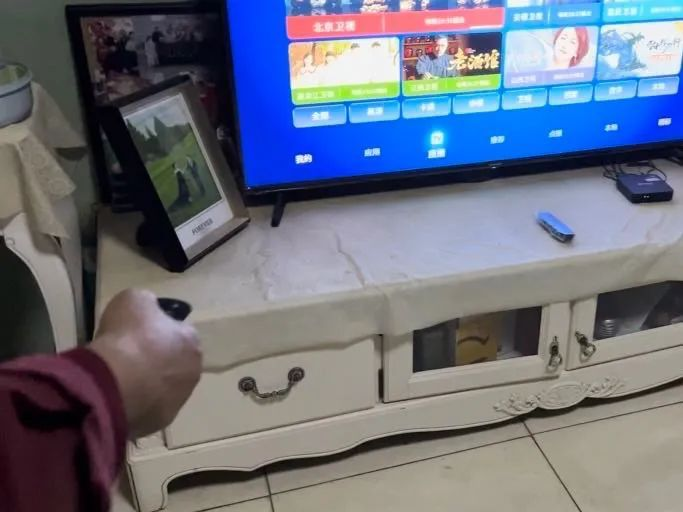
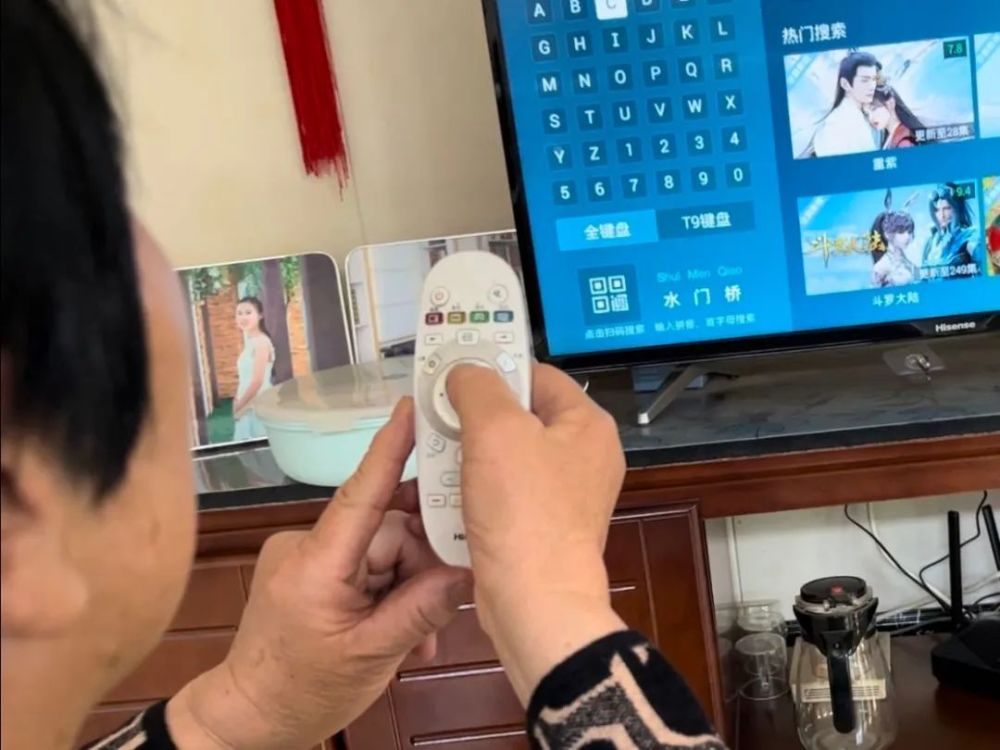
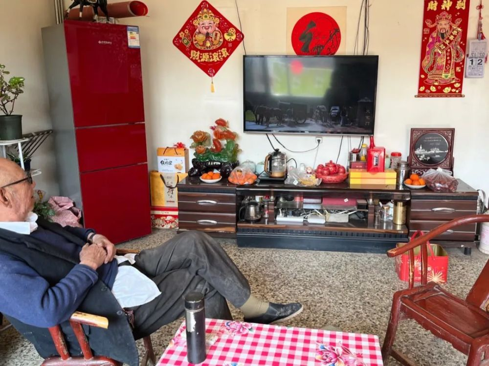
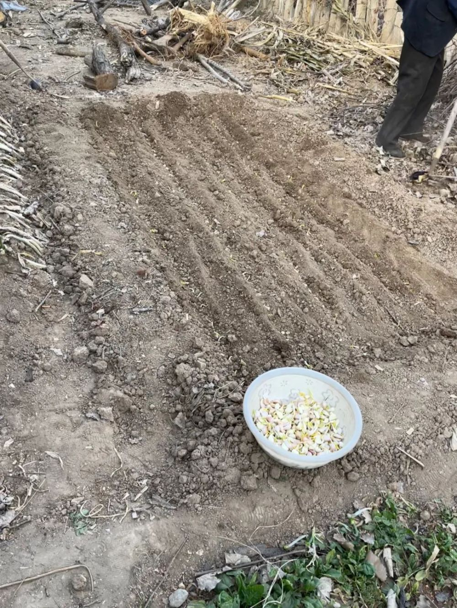
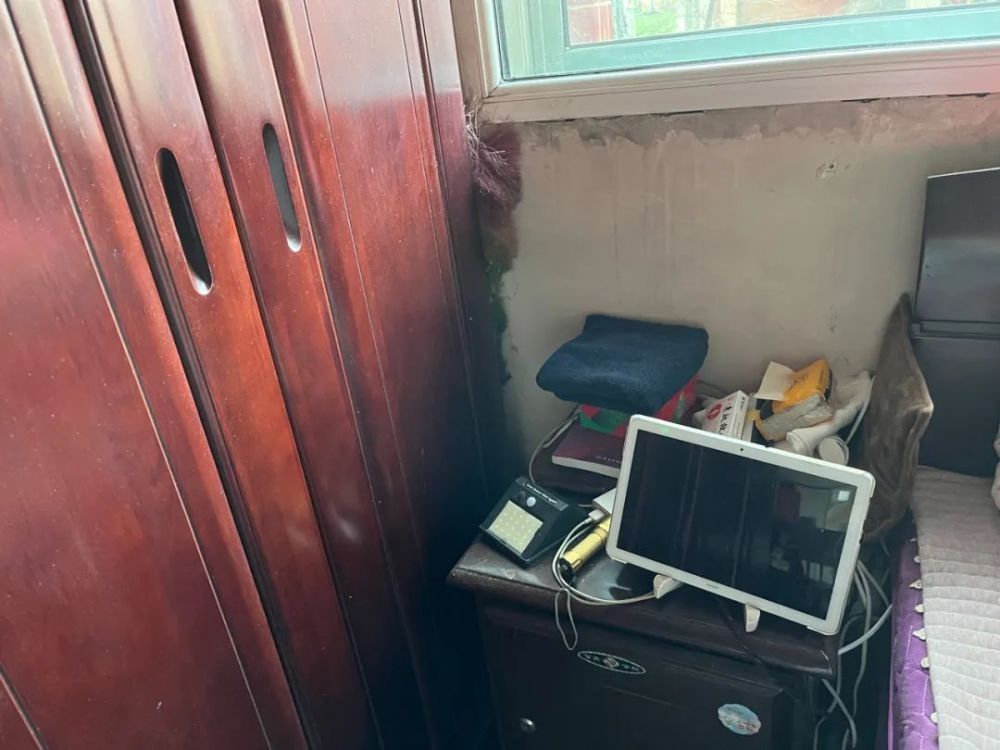

# 农村老人，搞不定智能电视

经过五十余年后，这些记忆已变得模糊。开垦后的第二年，雨水从天上汨汨地灌下来，汾河河水上涨，水流涌入滩地，塞满绿豆根茎间的所有空隙。他们失去了土地。留下的只有一台电视机。午饭前后，张东景一次又一次地重复着打开电视机。电视机里播放多次的老电视剧，帮他维护了一种时间的刻度：变化也许不可避免地发生着，但他们，也曾站在新技术奔涌而来的潮头。

**全文8868字，阅读约需15分钟**

_▲‍‍2023年3月3日夜晚，山西省临汾市襄汾县北靳村，65岁的王复穴坐在电视机前。李理荷
摄_

**新京报记者 李理荷 编辑 陈晓舒 校对 赵琳**

在晋南临汾市襄汾县的北靳村，15年间，村庄的烂泥路完成道路硬化，街巷旁架起了集中供热管网，砖土间吱呀衰朽的木门成为废墟，气派的门楼在废墟上拔地而起。村民用沉默的目光丈量着邻里门楼的高低，在几公分的参差里较量着脸面和尊严的尺度。

当然，还有电视。“大疙瘩”电视机（CRT显像管电视机）成为过去，光纤宽带网络进村，壁挂液晶智能电视变成“体面”生活的另一象征。居所改头换面，里面盛放的生活却与流经村庄的汾河河水般亘古不变。留守的人们衰老，但不停歇。他们在土地上耕种，为生计奔波，遵循二十四节气流转的规律，用晒干的玉米叶引燃灶膛里的柴火。他们重复着被年轻人抛弃的生活。

新的智能电视机里是新的世界，这个世界被功能板块区分，充斥着复杂的会员体系和广告，新世界的终点，是一个又一个以二维码面貌出现的付费弹窗。你可以想象到那种无措：一片陌生的“土地”，半辈子拿着镰刀和锄头的手，拿起遥控，踌躇地按键试图抵达最平常的休憩。

智能电视机和村庄的老年人间，横亘着一道数字之墙。数字化时代的前进和无法对抗的自然力量一样难以阻挡。
**老年人作为数字技术变革的被动接受者，被留在墙的那一边。这其中有酸涩，有无奈，有想要维护自立尊严的倔强。**
但别灰心，他们对抗过饥饿，灾害，河流的枯竭和人生的苦难，坚韧里自有昂扬和生机。

**夜晚的电视机**

农村的夜比城市深得更早，也更深。晚上八点一过，北靳村便陷入沉寂的黑暗。人们像动物缩回巢穴，只有偶尔一两声遥远的狗吠打破沉寂。3月3日，64岁的成爱爱和65岁的丈夫王复穴在这时坐在电视机前。屋内灯光晦暗，墙壁上褪色的风景挂画，万年历挂钟，绿漆剥落的床在光下显得陈旧暗淡。唯一崭新的陈设是摆放在墙正中的50英寸智能电视机，屏幕里色彩明亮，照亮王复穴土地般灰黄的脸。

这台50英寸的电视机购买于2022年10月份，是王复穴的儿子王振在市里花1600多元买的。王复穴说，对于电视他和妻子没有需求，“人家买下啥我们看啥。”虽然如此，考虑到大多数智能电视系统无法直通卫视，而父母最习惯的还是像从前一样看直播，王振便为电视配备了“盒子”——由电信提供服务的IPTV（交互式网络电视）。

外置“盒子”意味着多了一柄遥控器。为了分辨两个遥控器，王复穴把控制“盒子”的遥控器放在茶几上，打开电视后便习惯性地握在手里。他的手指长久停在环绕着ok键的圆盘上，圆盘因此被磨得发亮。使用的仅仅是上下两个按键，控制看直播时频道的加减。电视机的遥控器则放在一米外的电视柜上，套着塑料膜，几乎没有使用的痕迹。
**“只按最上面的开关，剩下的就不知道了！也从来不用。”** 王复穴无奈地笑，褶皱层层叠叠堆在眼角。

若不小心按了主页键，回到开机时的电视界面首页。王复穴和成爱爱便不知道如何返回卫视频道。首页底部是应用，直播，推荐，点播等7个功能板块，上面则是包括教育、游戏、热播剧等16个频道分区。
**“摁了吗？摁不了啊。”** 拿着遥控器，成爱爱有些焦急地从沙发走到电视机前，伸长手臂用遥控器对着电视机。她想要点进直播，电视机的页面却纹丝未变。

_▲2023年3月3日，成爱爱想要点进直播，电视页面却纹丝未变。李理荷
摄_

对待手里的遥控器，成爱爱有份郑重。她不敢连续地按键，从试错中学习是奢侈的，“之前的有线电视用了好多年头，搬动磕了一下就坏了。”提起上一个电视机，她仍心疼不已。“再往上，上头有央视，再按确定。”成爱爱的女儿在一旁提醒她。“确定是中间这个吧？”得到肯定的回复后，成爱爱才按下ok键，电视页面终于进入中央一台。

“这个是返回，圆圈中间的是确定。”女儿教成爱爱记忆遥控器上的按键。成爱爱嘴里嘟囔重复着女儿的话，按了返回，“确定要退出吗？”，窗口弹了出来，“再看一会儿”，“确定退出”，两个选择框之间，成爱爱再次陷入了静止。

一番操作花费了3分钟40秒，成爱爱有些疲惫，把遥控器递给丈夫，继续坐回沙发边。 **繁琐的操作消耗的不仅仅是时间，两位老人看电视的积极性也被磨损。**
电视机停在江苏卫视，成爱爱和王复穴并不专注于电视里的节目，他们松散地搭着话，眼睛时不时地瞟向屏幕。女儿安静地在看自己的手机，怕打扰到她，王复穴把音量调低。电视里的女声作为背景音，填补了屋内的寂静。

往年女儿只有春节时才会回家。近日成爱爱的手刚做完一场小手术，在北京工作的女儿为了照顾母亲才暂时回到村庄。如果没有孩子在，老人可能会花费比3分40秒更久的时间，为此儿子重新设置了电视，让父母打开电视后能直接进入卫视观看直播。

智能电视机里连接网络的那部分，是两位老人从未探索的荒漠。查找节目需要通过索引的方式，“有想看的就用搜索，像放大镜的那个”，女儿教过成爱爱，但拼音搜索的方式对她来说太难，便只能放弃。网络电视并没有改变王复穴的电视观看模式。热播剧《狂飙》，老人听孩子们说好看，便记下播放《狂飙》的卫视，等在电视机前追剧。王复穴坦言，“电视的网络功能，我们不是不用，实际上是用不了。”

**“技术恐惧”的老年人**

北靳村并不与任何一条省道或铁路相连。想从城市抵达村子，或沿着汾河走河滩边的路，或穿过两个村庄一路向北驶到最深处。村里约有1600人，有三分之一的人外出打工，南下深圳，广州，北上太原和北京，渐渐成为假日里村庄的“客人”。还有一部分人在襄汾县县城找到工作，或在饭店打工，或在工地上干活，好点儿的能找个班上。

村里60岁以上老人大约有260人，约占村里总人口的16.3%。在这个典型的纯农业村，西边是种植着小麦和玉米的耕地，东边流经村子的汾河时而宽阔时而枯竭。村里的老人大多务农，衰老但不停歇。他们每日向东或向西，农忙时去地里，农闲时在附近村镇打零工。直到不再能干活的那一天，他们会在午后坐在路边的石头上，就像从石头里长出的向阳植物。

他们对智能电视机的了解，并不比成爱爱和王复穴更多。2006年，村里通了宽带，2015年，智能电视机成为村庄的主流。网络进入村庄的十年，也是新农村建设的十年。大多数老人住进了后辈翻新过的院子，这些院子有相似的模样：外部是暗红色的高大门楼，内部客厅最显眼处摆放着大屏液晶智能电视。

当电视机打开的时候，横亘在老人和智能电视机间的那道数字之墙开始显现：网络并没有真正进入他们的生活。村里大多数老人与成爱爱相似，拥有智能电视机但不会使用，依然游离在网络世界的边缘。还有一小部分老人，例如村里84岁的成明珠，她一生不识字，靠着“日出而作，日落而息”的规律过活，并不拥有任何一台智能手机或智能电视。

第48次《中国互联网络发展状况统计报告》调查数据显示，截至2021年6月，我国网民规模已接近10亿，其中约有1.2亿60岁以上网民，占总网民规模的12.2%。而根据第七次全国人口普查数据显示，我国老年人口达2.64亿人，这意味着还有一半以上的老年群体并未接入互联网。

对复杂的网络世界，王复穴和成爱爱知之甚少。这份茫然不解里又滋生出畏惧：网络诡谲多变，它遍布可能的骗局和电信诈骗。网络的尽头，是一个个以二维码模样出现的付费弹窗。王复穴和成爱爱排斥网络，既是被动地无法使用、掌握网络，也是主动地因心理障碍远离网络。

热播的电视剧，“要看就得掏钱”，成爱爱说得笃定。“电视里想看啥都有，功能都要掏钱，咱不掏钱。”王复穴附和着。

打开这台电视机的电视剧分区，列表里推荐的电视剧只能免费观看两集，必须开通会员才能看整集。从第三集开始，点播放后便会弹出会员付费窗口：最大的一行字是“尊享极视听会员，大片热剧看不停。”下一行是会员包月30元，以及包季和包年的板块，左下角有一行灰色的小字，暂不订购。女儿翻找着免费的电视剧，成爱爱赶忙提醒她，“掏会员（钱）我们不看啊。”

_▲‍‍‍‍‍‍‍‍王复穴家智能电视机列表里推荐的电视剧只能免费观看两集，必须开通会员才能看全剧。从第三集开始，点播放后便会弹出会员付费窗口。李理荷
摄_

2020年，王复穴家安装了网线。宽带一个月费用是169元，同时还包含送的两张电话卡的话费费用。安装后还送一台监控器，只要下载一个App便可以让不在家的孩子们随时查看监控。王复穴和成爱爱在那之后用上了孩子们淘汰下来的智能手机。送的监控器至今仍未安装，成爱爱有些担忧，这担忧无关隐私，而是“那个东西总得开着可费电呢”。

智能手机，王复穴使用的功能也仅仅是接打电话，偶尔刷一刷短视频。与观看电视机里的直播相似，手机里的消息也是单向地“扑面而来”，他不需要做出选择，只能接受，平台推给他什么，他就看什么。

手机里儿子曾下载的软件花花绿绿占满屏幕，包括年轻人常用的约会软件。每个软件图标右上角都显示着几十条未读的通知，他从未点开过。微信他是不会用的，偶尔收下孩子们发的红包或转账，他也从没花过。“我能收了，我可不会往出花。”王复穴说。

**“好像弄不了这些，老人就没有用”**

当被询问村里熟悉智能电视机和网络的老年人，老人们提到了成素云。成素云69岁，是位“老民师”。从1972年到1992年，她在曾经的北靳村小学做了二十年数学教师，教学的后期又担任村小校长。

成素云是村里最早一批购买智能电视机的人。2013年，她花费约2000元从襄汾县古城镇买了这台电视。那时她租住在襄汾县的出租屋里，作为“陪读奶奶”每天辅导孩子功课，从孙子6岁到14岁，度过整整八年。素云喜静，不善交际，在县城的生活全部围绕着孩子。也是因为陪读生活，年逾60岁的她被拉入全然陌生的网络浪潮。

为了进孙子的班级群，线上提交作业，她买了人生中第一台智能手机。素云教学的时候，村里80%都是文盲，她是村里公认有知识的文化人，体面又能干。“有的老师是茶壶里煮扁食，有嘴倒（道）不出。我不是那样。凡是我会的，一定能把学生教会。不会的，研究一下也就会了。”提起专业，素云很自信。可面对互联网，她罕见地感觉到无措和挫败感。

使用智能手机时，她不习惯触屏，不会发消息，不懂每个符号的意义。每次批改完作业，是孙子指导她点这里，按那里，她才能顺利把照片发给老师。与“数字原住民”孙辈的差异，让她时常懊恼。教学一辈子，到老来却显得无知笨拙。她觉得失了脸面，继而又在心里下定决心，“小孩会，我也要会。”

她陪孩子学习，学习完了孩子再教她使用智能电视机和智能手机。孩子上学后，她就求助同样租房陪读的家长们，一点一点地学：上网的标志是立起来的小扇子，按住圆圈里的扇形是说话，怎么返回，怎么发送，怎么删除……“很难，一用都害怕呢。只能当学习一样硬着头皮学。住附近的好多奶奶因为不会用手机，只能回村里。好像弄不了这些，老人就没有用。”回忆时，成素云语气有些愤慨，又轻轻叹了口气。

即使使用智能电视机约10年，打开电视时，素云还是有些羞惭，仍然怕自己用得不熟练，“不过复习一下就会了。”她紧接着说。这台电视没有安装机顶盒，只能通过网络搜索看点播。开屏广告后点搜索，出现拼音搜索的界面。素云像接受考试的小学生一样走到电视前，双手交叠着托着遥控器，右手大拇指停在按键上，她想了片刻，然后茫然地问，“怎么上去按这个C呢？”

确定键周围的四个按键分别控制“上、下、左、右”，被提醒后素云恍然大悟。“好，再下去，按H。确认。U在哪呢？”素云眯起眼睛，每看屏幕几秒，找寻到字母后，便低头看一眼遥控器，在目光注视下才敢按键。打出U时，素云不小心按了两下，意识到后她按了清空，刚想打的“春”字的拼音，消失了。

时间在抵达节目前变得黏稠又缓慢。素云却不急不躁，耐心地重新来了一次，等再度用拼音拼出“春”字，已经过去了三分钟。

_▲2023年3月4日，成素云双手交叠着托着遥控器，右手大拇指停在按键上，正使用拼音搜索想看的电视剧。李理荷摄_

**电视机外的农村生活**

两年前，孙子读初中后上了寄宿学校，不再需要陪读的素云回到村子和儿子儿媳生活。她每天早起给儿子夫妻俩做饭，吃了又拾掇院子，洗衣服，做家务。中午饭后，她去儿子的牛场里帮忙干杂活，晚饭前，再做好饭等孩子们回家吃。

素云通常会在晚饭后打开电视。她并不关心电视里的故事本身。电视机提供的，是一种抚慰式的喧闹，一种把自己抛入故事任其漂流的安逸。略带杂闹的声响让成素云感到安全。她用了“哄”这个动词。她说，全靠电视机哄着睡觉呢。

晚上9点半，躺在客厅角落的单人床上，王复穴按了两个5，频道跳转到山东教育台，是他最喜欢的寻亲节目。电视里失散的亲人终于哭泣着相拥，王复穴会在这种失而复得的幸福里沉沉入睡。有好几次，在别屋睡觉的成爱爱被电视的声音扰醒，发现床上的丈夫鼾声如雷。

晚饭后看电视的时光，或许是村里老人一天中仅有的休憩时刻。走在黢黑的街巷，只能听到风声和随风声隐约流窜的电视机的声音。至于白天，成爱爱说：“白天都在干活。农村人哪有停点（停歇）的时候呢。”

成爱爱的老年生活与她辛劳的前半生并没有什么不同。成爱爱和王复穴两人每月养老金总共不到300元，儿子还未结婚，需要用钱的地方还很多。三亩地里，小麦和玉米交接着由青变黄，收割后是新一轮的播种。日复一日地跋涉其中，她的裤脚和指缝间总有泥垢，似乎永远也无法洗净。

农闲时，成爱爱就在村庄附近打零工。最近的一份工作是为生鲜平台做蔬菜包装。卡车拉着新鲜的蔬菜入村，在曾经砖厂的空地上，成爱爱和村里的妇女们分拣蔬菜，把菜择干净，称重后再用保鲜膜塑封，贴上价格。包一份菜一毛钱，像冬瓜这样需要切成一斤重再包装的则是一毛五。手里蔬菜流转，成爱爱累积着以毛为单位的报酬，每月收入1000多元。

成爱爱还种植了一亩韭菜。每年清明节前，韭菜成熟第一茬，她会在前一天傍晚割好韭菜，扎捆后齐整地摆放在三轮车里。第二天凌晨四点，成爱爱载着嫩生的韭菜赶往县城的农贸批发市场。市场5点开门，她要赶早才能遇到更多收菜的人。韭菜是上半年的蔬菜，收过三茬后便是6月，成爱爱又要准备割麦子了。

王复穴同样也是村里人口中的“能干人”。除了务农外，他当过修路工，也栽过树。3月正值农闲时段，每天早上7点，他去河东的红木厂里打工，帮忙搬运木料，拉大锯，干干杂活，一直到晚上天黑了才回家。

不能停止劳作的老年人囿于生计。那些更老的，不再能劳作的老年人，则囿于更乏味和孤独的生活。白天，人们骑着摩托车、电动车各自去干活，村里更加寂静。寂静里的细微之声是喜鹊的啾啾声，风声，风吹动树枝挤出麻雀的叽喳声，偶尔从大路传来汽车低沉的嗡呜声。

82岁的张东景已经回忆不起这些声音的形态。他耳朵里的村庄比旁人的更静。两年前，张东景被诊断为中度听力损失，开始佩戴助听器。助听器每一周要换一次电池，绿豆一样大小的电池放在用鞋盒做的药箱里，常让他怎么翻找也找不到。更让他芥蒂的是价格，18粒电池20元，每次去市里检查，买电池就要花费200元。他不舍得用。

在家时，他唯一需要佩戴助听器的时刻是看电视机时。3月4日下午1点，张东景和妻子刘淑厦坐在电视机前，边吃饭边听看《神探狄仁杰》。这部2006年的历史剧他数不清看了几遍，无论停在哪个情节，他都能看下去。插播广告时，他继续换台，换到了同样熟悉的《大宅门》。

_▲2023年3月4日，吃过午饭后，张东景坐在电视机前，电视里播放着他看了很多遍的《大宅门》。李理荷
摄_

曾经的习惯变得坚固，成为他的一部分再难改变。他爱看的电视剧，翻来覆去还是曾经的经典剧。
即使在两年前用上了智能电视，他也没有选择接入网络，而是继续使用有线电视实时观看电视节目。“不想再学新东西了，人老了，眼睛坏了，耳朵坏了，牙也坏了。没有什么想追求的，对凑着活呢。”他平静地这么说。

戴着助听器，电视机里的声音听来尖锐，人物对话又太快，他需要时间分辨和反应。费力的专注让他疲惫，张东景把椅子往电视机前挪了挪，好让字幕看得更清楚些。

因为听不清人讲话，他几乎放弃了社交，不再像以前一样骑着自行车去找朋友下象棋，打扑克。活到82岁，一起年轻又一起变老的朋友们一个接一个死亡，能和谁说话和谁玩呢？他也不知道。不戴助听器，他唯一能听见的人声是妻子刘淑厦的声音。她不用特意抬高声音，让他拾柴火，去厨房咸菜罐里捞咸菜，给菜地浇水，这些指令他听得清清楚楚。听见了他便去做。因为腿疼，张东景走得缓慢，左腿先承载着身体的重量落下，犯疼的右腿才慢慢地跟上。他慢慢地走，脚步声也拖沓着一重一轻地跟在他身后。

看电视的那一个小时，他们几乎什么都不说。吃完饭后，电视又重新归于寂静。寒冷的冬天过后，菜园的土地板结坚硬，他们得用草木灰，铁镐和耙子让土地重新松软，好进行新一轮的播种。下午，日头慢慢西斜，早上翻过的土被太阳晒暖。张东景整土，敲碎太大的土块，妻子把生芽的大蒜一个一个放进土里。他再用耙子拨动土，覆盖住蒜。

_▲2023年3月4日，北靳村张东景家后院的菜园里，张东景和妻子刘淑厦在种蒜。李理荷
摄_

他们都不再能下蹲。每每稍微弯腰，便发出拉风箱一样嘶哑沉重的喘息声。这声音是年老的重量，寂静中只有风听到。

**适老化的探索**

20岁的成聪是村里为数不多的年轻人。幼年时，他因一场车祸导致双下肢瘫痪，至今仍在村里生活。留守在村子的老人们，后辈多不在农村，他们口口相传“聪聪懂得可多了”，遇到诸如不会在手机上交电费，手机坏了，下载东西等不懂的问题，就去找聪聪。刘淑厦没有什么好给予的，每次找聪聪时，她把糖果、蜜饯、小饼干等零食装满一塑料袋，感谢他的帮忙。

“奶奶，你说想看什么？”，“奶奶，没事儿，看完了你再来找我。”对找上门的老年人，聪聪耐心又体恤。在村庄，聪聪承担着“数字反哺”的“数字原住民”角色，他给村里的老人们技术指导，让他们不至于被数字时代抛弃。

刘淑厦家里的智能电子设备并不算少。为了帮助老人融入数字时代，后辈们给两位老人每人买了一个平板电脑，每人一部智能手机。考虑到家里电视机没有接入网络，外孙还专门买了一台老年人专用的智能移动电视。

也有平台推出了电视的“适老化”改造。某影视点播软件推出长辈模式，界面由老人们感兴趣的军旅抗战、戏曲经典、生活大戏等频道组成。除了电视节目，还有名医堂和养生堂，旨在为老人科普常见的病痛问题和养生指导。

针对智能电视界面繁复，广告弹窗多的问题，某电视平台适老化改造的思路是去繁就简，降低页面内信息密度，内容呈现更简洁，同时把字体调大。另外，开启声音控制可以让老年人遥控更方便，也是“适老化”改造重要的一部分。

刘淑厦家里的老年人智能移动电视操作比智能电视机简单。首页字体很大，分为戏曲，本地视频，电视台等频道分区。屏幕右边的按键都配以“上，下，确认，音量”等文字备注。但设备在线播放不稳定，常常加载失败。她打电话告诉外孙这个问题，隔一周后，外孙拿回来一个U盘，告诉她里面下载好了包括《大宅门》，《水浒传》，《隋唐英雄传》在内的五部电视剧。

但使用时，U盘里的电视剧却无法播放。因为工作繁忙，在外地上班的外孙许久不回家，刘淑厦只能去找聪聪。她并不知道“U盘”是什么，也分不清各类储存设备。孩子们拿回来的、可以放进电子设备里的东西，她都小心地收好，装在空药瓶里。拿着药瓶去找聪聪，倒出来后，她手掌上摊放着两张电话卡，一个U盘，一个SD卡。

她问聪聪，“你看看哪个能用呢？”

成聪帮她下载好蒲剧放进U盘里，教她插在智能移动电视上，打开本地视频就可以自动播放。从那之后，这台移动电视上总插着U盘，刘淑厦不敢再乱动。其余的电话卡和SD卡，她仍收好放进药瓶。

_▲老年人智能移动电视摆放在刘淑厦的书桌上。她把孩子们拿回来的、可以放进电子设备里的东西，都小心地收好，装在空药瓶里。李理荷
摄_

刘淑厦是村民眼中“上了70岁最会用电子设备的人”。她会攒着关于电视机和手机的问题等着回家的孩子们为她解答。最近，外孙回家后教她用语音输入法输入，这样比手写更快。智能手机也确实填补了她生活的乏味。今年春节，她和许久未见的同乡见面，两个年过七十的人失散多年后重新联系起来。老乡会分享他自己作的诗句，她则会认真点评。

在刘淑厦床头柜上，架着一台平板电脑，一个安装电池的手电筒，太阳能手电筒，纸巾，以及一盒速效救心丸。两个手电筒是为了晚上起夜方便，不至于摸黑摔倒。人老了睡眠少了，入睡也变得困难。睡前她看着平板里的视频入睡，睡一两个小时便会醒来，清醒时看看视频又再次陷入混沌。有时平板会响一整晚。她说，“柜上都是离不了的东西。”

_▲刘淑厦床头柜上，架着一台平板电脑，一个安装电池的手电筒，太阳能手电筒，纸巾，以及一盒速效救心丸。李理荷
摄_

村庄老人自身，也并非只是数字技术变革的被动接受者和适应者。与土地打交道超过半个世纪，他们最不缺乏的品质就是坚韧。刘淑厦和张东景是村里最早在河滩地上种植的人，汾河边的荒地，野草在月光下疯长，孩子进去后便消失在草浪里。那可是盐碱地啊，村里没人愿意开垦。白豆和绿豆不怕盐碱地，张东景牵着骡子干活，一步一步用脚丈量完了10亩地。绿豆成熟后，刘淑厦每天带一壶开水和几个馒头，背着三个布袋坐船去河的那头采摘。

一个夏季后，丰收的豆子给他们换来了人生中的第一台电视机，11英寸的黑白电视机。那是1984年。村里的年轻人们在夜晚搬着凳子来到他们的院子，院子里的电视机播放着《射雕英雄传》，是他们人生的第一部电视剧。

经过五十余年后，这些记忆已变得模糊。开垦后的第二年，雨水从天上汨汨地灌下来，汾河河水上涨，水流涌入滩地，塞满绿豆根茎间的所有空隙。他们失去了土地。留下的只有一台电视机。午饭前后，张东景一次又一次地重复着打开电视机。电视机里播放多次的老电视剧，帮他维护了一种时间的刻度：变化也许不可避免地发生着，但他们，也曾站在新技术奔涌而来的潮头。

（应受访者要求，张东景，王振，刘淑厦为化名）

**值班编辑 康嘻嘻 古丽**

**本文部分内容首发自新京报公号“剥洋葱people”**

**未经新京报书面授权不得转载使用**

