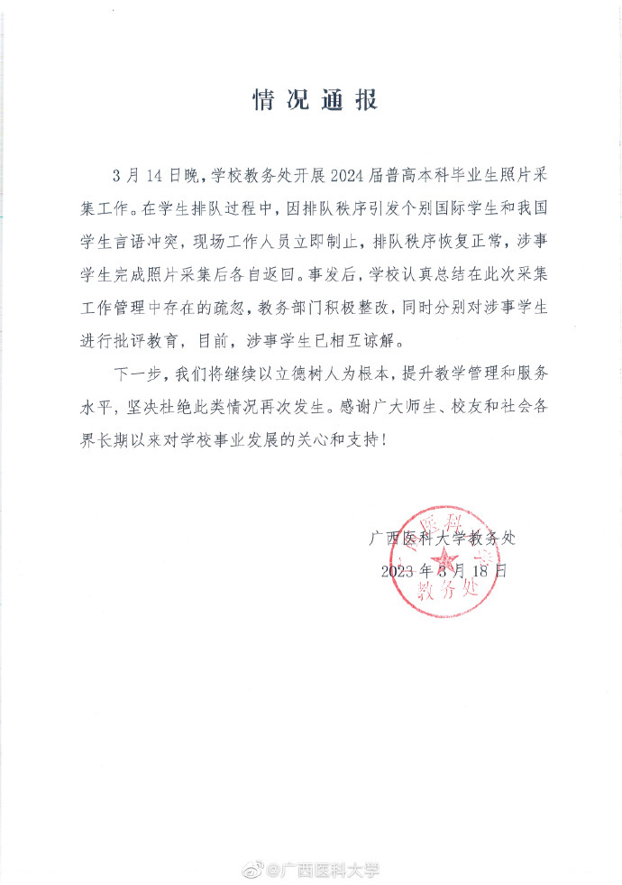
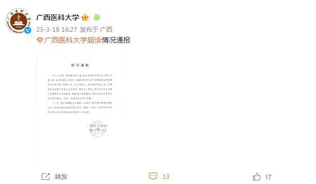

# 广西医科大学回应“个别国际学生和我国学生言语冲突”

来源：广西医科大学

情况通报

3月14日晚，学校教务处开展2024届普高本科毕业生照片采集工作。在学生排队过程中，因排队秩序引发个别国际学生和我国学生言语冲突，现场工作人员立即制止，排队秩序恢复正常，涉事学生完成照片采集后各自返回。事发后，学校认真总结在此次采集工作管理中存在的疏忽，教务部门积极整改，同时分别对涉事学生进行批评教育，目前，涉事学生已相互谅解。

下一步，我们将继续以立德树人为根本，提升教学管理和服务水平，坚决杜绝此类情况再次发生。感谢广大师生、校友和社会各界长期以来对学校事业发展的关心和支持！

