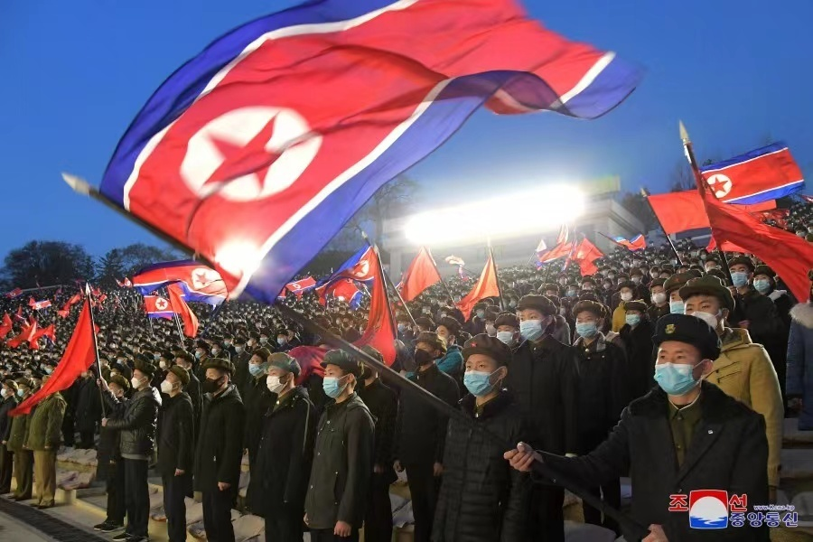

# 朝中社：为抗击美国，仅一天朝鲜80多万人踊跃报名参军或复队

【环球网报道】据朝中社18日报道，为抗击美国，朝鲜全国各地的报名参军或复队队伍在不断增加，统计资料显示，仅在17日一天，全国有80多万名青年同盟干部及青年学生踊跃报名参军或复队。

朝中社报道称，80多万名青年同盟干部及青年学生踊跃报名参加人民军或复队。

报道称，美帝国主义和傀儡逆贼的核战争挑衅活动粗暴侵犯朝鲜主权和安全利益，其侵略性质和规模达到历史之最，已濒于无法容忍的极限边缘。针对当前的严峻形势，朝方发射“火星炮－１７”型洲际弹道导弹，用火雷声显示了要靠强大的物理力量严惩执迷于冒险的军事威胁。

据朝中社17日报道，为回应美韩对朝进行“挑衅、侵略性质浓重的大规模战争演习”，朝鲜16日进行“火星炮-17”型洲际弹道导弹发射训练，以展示本国战略部队“超强力反制态势”。朝鲜最高领导人金正恩现场指导发射训练。

报道称，“火星炮-17”型洲际弹道导弹当天在平壤国际机场发射，上升高度为6045公里，飞行距离达1000.2公里，飞行时间为4151秒，最后准确落入朝鲜东部公海目标水域。

