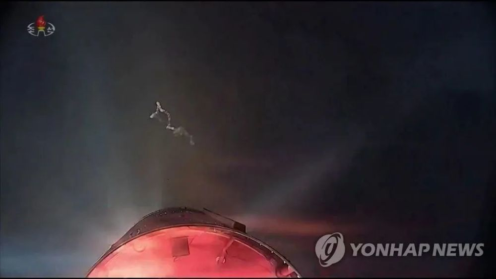
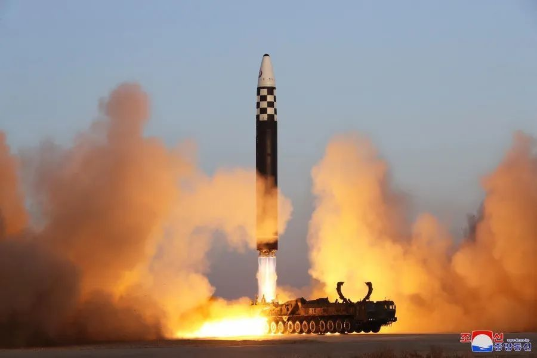

# 朝鲜首次公开“火星-17”型洲际导弹级间分离画面

朝鲜官媒17日首次公开“火星-17”型洲际弹道导弹（ICBM）的级间分离场面，引人关注。级间分离是火箭飞行中动作最复杂、也是最容易出现问题的环节之一。

_朝鲜中央电视台3月17日播出朝鲜发射“火星-17”型洲际弹道导弹（ICBM）的视频。图为“火星-17”型洲际导弹进行一级火箭分离。
图源：韩联社_

朝鲜中央电视台当天下午报道从多角度拍摄的“火星-17”型洲际导弹发射视频。从发射车上点火升空的“火星-17”型在各个视角的飞行片段短则几秒，长则十几秒。接下来播出装在第三级火箭上的镜头拍到的一二级分离场景。

“火星-17”型导弹由3级火箭发动机组成，先后进行一二级、二三级火箭分离。外界其间评价，朝鲜洲际导弹在二三级分离后还能正常飞行。

_据朝中社3月17日报道，在朝鲜国务委员会委员长金正恩的现场指导下，劳动党中央军事委员会16日在平壤国际飞行场发射“火星-17”型洲际弹道导弹（ICBM）。导弹飞行时间4151秒，射程1000.2公里，最大射高6045千米，准确落在东部海域公海靶区。图为发射现场。图源：朝中社_

俄罗斯卫星通讯社援引韩国北韩大学院大学校副教授金东叶的分析指，朝鲜在《劳动新闻》报上公布了从太空拍摄的“火星-17”洲际弹道导弹不同高度的地球影像，很显然，这也证明了“火星-17”洲际弹道导弹的发射非常成功，与公众的质疑相反。金东业认为，朝鲜通过最近的“火星-17”洲际弹道导弹试验想证明，该洲际弹道导弹研发阶段已完成，现开始进入量产阶段。

朝中社17日报道称，“火星-17”型导弹体现了朝鲜维护国家安全和自主权，是世界最强的战略武器，也是共和国战略力量的核心手段。

朝鲜央视当天公开国务委员会委员长金正恩打电话准许发射导弹的画面，并称人民军大将、国防科学院院长张昌河向第一红旗英雄连下达发射命令。金正恩前一天携女儿金主爱对“火星-17”型洲际弹道导弹试射训练进行了现场指导。

_金正恩和其女儿金主爱现场观摩发射导弹。图源：朝中社_

来源丨韩联社、俄罗斯卫星通讯社

