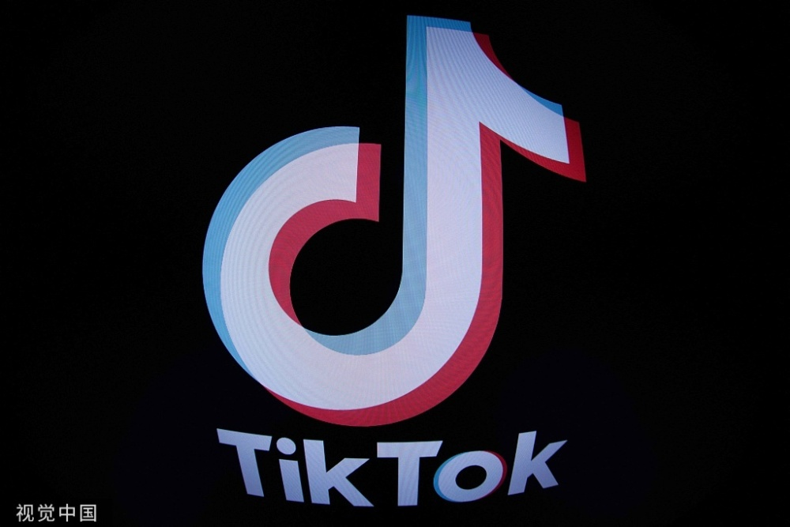

# 英国、新西兰跟风限用TikTok，中国外交部回应

【环球时报驻英国特约记者 纪双城 环球时报记者
赵觉珵】近日，英国、新西兰先后跟随美国脚步，宣布将禁止在政府或议会的设备上使用短视频社交软件TikTok。互联网专家郭涛17日对《环球时报》记者表示，美国等国打压TikTok是出于政治目的而非所谓的“数据安全”，所以TikTok无论如何整改都满足不了这些监管部门的要求。

据路透社16日报道，英国内阁办公厅大臣奥利弗·道登当日对该国议会表示，“我们将禁止在政府设备上使用TikTok”，并“立即生效”。道登宣称，禁止政府设备使用TikTok是一项“预防措施”，鉴于政府设备可能包含敏感信息，“限制某些应用程序的使用是谨慎和适当的”。法新社援引TikTok发言人的表态称，该公司对英国政府的决定感到“失望”，并认为此类禁令是“基于误解，并受到更广泛地缘政治因素的影响”。

此前，英国安全事务大臣图根哈特14日要求该国国家网络安全中心对TikTok的安全性展开调查，考虑在政府部门全面禁用。英国《泰晤士报》等媒体分析认为，和图根哈特同属保守党的首相苏纳克势必会同意这一提议。数据显示，TikTok在人口6700余万的英国，月活跃用户目前超过2300万，用户总数位列全球第12位。

除英国外，新西兰议会服务部首席执行官拉斐尔·冈萨雷斯-
蒙特罗17日宣布，在今年3月底之前，所有可以访问新西兰议会网络的设备都将被禁止使用TikTok。冈萨雷斯-
蒙特罗称，该决定是在听取了网络安全专家的建议以及经由政府内部和与其他国家的讨论后作出的。中国外交部发言人汪文斌17日表示，中方一贯主张，数据安全问题不应成为泛化国家安全概念、无理打压别国企业的工具。中方呼吁有关国家切实遵守市场经济规则和公平竞争原则，停止泛化、滥用国家安全概念，为各国企业提供公平、透明、非歧视的营商环境。

一些国家和地区近期对TikTok进行限制的背后，是美国对这款中国企业字节跳动旗下软件的反复打压。据美国《华尔街日报》透露，美国政府正要求中国所有者出售TikTok的股份。尽管美国等国将“国家安全”作为限制TikTok的理由，但多方人士均认为这只是借口。英国《卫报》援引佐治亚理工学院互联网治理项目研究员卡里姆·法哈特的话称，强制出售TikTok“与任何所谓的‘国家安全威胁’完全无关”，并且违反美国国务院在互联网领域的自由原则。TikTok首席执行官周受资日前对《华尔街日报》表示，将TikTok从中资所有者手中剥离不会缓解美国对这款软件的“国家安全”担忧。

