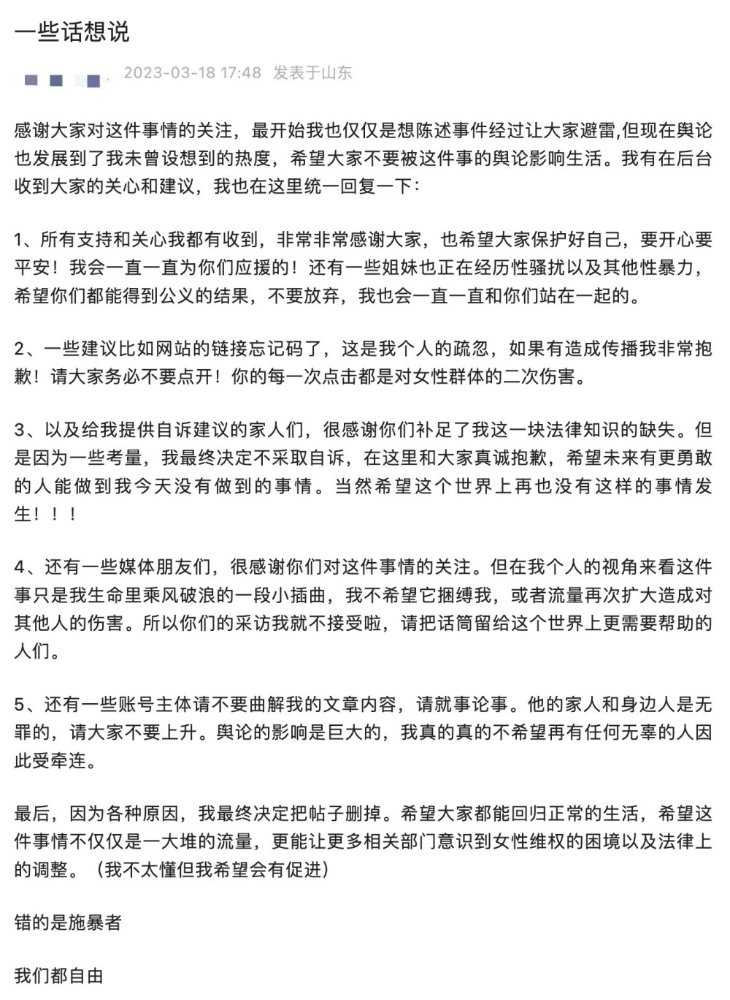

# 被造黄谣女生发文：决定不采取自诉，希望相关部门意识到女性维权困境

近日，一篇题为《被挂在黄色网站上的女孩们》的文章在网络上传播，引发关注。作者在文中称，某211大学一名男生系自己的高中同学兼曾经好友，这名男生多次将女性同学、好友发在朋友圈的照片，发到色情网站上，并恶意p图和造黄谣。

3月18日，苏州大学发文称，3月17日晚，网络平台出现我校一学生恶意P图侮辱女性的网帖，引发舆论关注。我校高度重视，已于第一时间启动调查程序，后续将根据调查情况依法依规严肃处理。
​​

随后，该女生发文表示，最终决定不采取自诉。

