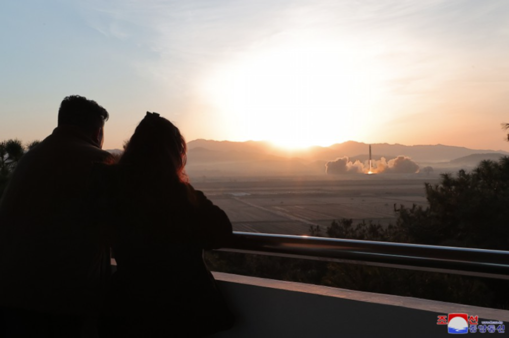

# 金正恩父女为何多次“亲临”朝鲜火星炮兵部队？

据朝中社报道，朝鲜于3月16日试射了洲际弹道导弹“火星-17”，朝鲜最高领导人金正恩再度携女儿现场观摩，并指导试射。

一周多前，金正恩父女还曾前往“承担朝鲜人民军西部前线重要作战任务的火星炮兵部队”，观摩了火力突击演习。韩国联合参谋本部当天表示，朝鲜从南浦地区向半岛西部海域发射了多枚短程弹道导弹。朝中社发布的照片显示，至少6辆朝军发射车在野外机动进入战位，随后齐射导弹。

_2023年3月16日，金正恩携女儿观看洲际弹道导弹发射。（图：朝中社）_

金正恩和女儿神情严肃地观看演练，朝鲜媒体也没有像往常一样发布两人亲密携手、交谈的照片。2022年5月，韩国尹锡悦政府上台，对朝采取强硬立场。此后，韩美联合军演恢复并升级规模，朝鲜则密集试射导弹予以回应。进入2023年，朝鲜半岛局势持续升级。3月13日，代号“自由护盾”的韩美联合军事演习举行，为期11天，号称“史上最长”，美军B-52战略轰炸机今年首度飞临朝鲜半岛。韩联社称，美军“尼米兹”号核动力航母亦可能参加演习。

在此背景下，朝鲜除密集进行弹道导弹、巡航导弹试射外，还于3月12日召开劳动党中央军事委员会扩大会议。朝鲜通常半年举行一次军委扩大会议，而本次在2月举行扩大会议后立刻再次开会，被外界视为“强烈回应”。朝中社称，会上“讨论并决定了更加有效地行使并更具威力地、进攻性地运用国家战争遏制力的一系列重大实践措施”。

无论是朝鲜官方一再提及的威慑力、遏制力，还是2022年11月“首秀”以来金正恩女儿出席的大多数活动，都与朝鲜独特的军种“战略军”及其下属火星炮兵部队、洲际导弹部队、巡航导弹部队等紧密相关。这支在金正恩执政后正式建军的部队，上一次进行大规模改革还是在2016年到2017年的朝鲜武器研发及核试验周期。如今，随着半岛再次转入紧张局势，战略军及下属部队的作战任务、指挥体系再次出现新的变化。

_3月9日，负责朝鲜人民军西线重要作战任务的炮兵部队进行火力攻击。图/视觉中国_

两大战略任务

朝鲜组建西部前线导弹部队，练习“先发制人”打击“敌方”目标，至少有10年之久。2012年4月，金正恩刚刚成为朝鲜最高领导人后不久，“战略火箭军”就在纪念金日成诞辰100周年阅兵式上首次亮相。韩国政府称，该部队系由原人民军总参谋部导弹指导局扩充而来。次年，战略火箭军更名为“战略军”。2014年7月，金正恩亲临“战略军西部前线部队”指挥导弹发射工作，亲自下达发射指令。韩国军方后来披露，这次试射于凌晨4时进行，足见金正恩对该部的重视。

2016年开始，朝鲜媒体报道战略军活动时出现“各支火星炮兵部队”的表述，“战略军西部前线部队”也成为“部署在西部前线的火星炮兵部队”。更名原因，韩国及西方分析人士众说纷纭。可以确定的是，同许多国家一样，朝鲜官方常使用日月星辰为导弹和火箭编号，如用“北极星”命名潜射导弹，以“银河”命名运载火箭，而“火星”至迟于上世纪60年代就被用于导弹命名。

一些分析认为，这些星辰并不是随意选择的。美国科学家联合会核信息项目高级研究员马特·科尔达指出，朝鲜将潜射导弹命名为“北极星”，与美国第一代潜射导弹“北极星”重名，体现了一种“幽默感”，而“火星”则在朝语中“含有强大、创新和牺牲的含义”。不过，更重要的是，2016年之后，朝鲜将不同类型的陆基弹道导弹大多纳入“火星”系列，且其编号与研发顺序并不完全吻合，让韩美军方难以准确判断其迭代更新状况。

据韩美情报机构梳理，朝鲜可能用“火星-13”代指了2012年到2017年研发的三种不同型号的导弹；2016年到2017年成功试射“火星-10”弹道导弹和“火星-13”到“火星-15”洲际弹道导弹后，朝鲜又于2021年试射全新的“火星-8”型高超音速导弹，并于2022年试射新型“火星-12”导弹。在对“火星-16”及“火星-17”研发及试射的分析中，韩美军方也出现过多次误判。迄今为止，对于是否存在“火星-2”和“火星-4”型导弹，外界仍未有定论。

同样，“火星炮兵部队”也指代不同类型的导弹部队。梳理朝鲜官方报道，这既包括部署在朝韩军事一线、负责以中近程导弹攻击南方目标的部队，也包括指向太平洋远方目标乃至搭载核武器的导弹部队。2016年9月朝鲜第五次核试验后，官方声明称这次核试验确认了标准化、规格化核弹头，以便“装载到朝鲜人民军战略军各支火星炮兵部队装备的战略弹道导弹上”。

火星炮兵部队的神秘性与其特殊的作战任务相关。今年3月9日视察火星炮兵部队时，金正恩将战略军的两大战略任务概括为“一是遏制战争、二是占据战争主动权”。遏制战争，即战略军负责运作洲际弹道导弹等核载具，是“劳动党可靠的核武装力量”。

在今年2月8日朝鲜武装力量主要部队旗帜检阅式上，作为战略军下属的关键核力量单元，“火星-17”洲际导弹部队军旗首次亮相，旗帜上的数字显示该部队于2022年11月正式建军。

也是在今年2月，朝中社报道中首次出现“洲际弹道导弹运营部队第一红旗英雄连”，这是外界能确认的该支部队的第一个具体番号。报道称，该连在2022年11月负责了“火星炮-17”新型洲际弹道导弹的试射，是“专门负责战略任务的部队中战斗力最优秀的火力连”。从当时的报道和照片看，金正恩还带着女儿亲自接见了这个连队，并合影留念，被授予功勋称号的321号洲际弹道导弹发射车也属于该连。

拥有独立军种地位的战略军

金正恩携女儿3月9日视察的西部前线火星炮兵部队，其日常训练、演习的任务多年来始终如一：用中近程弹道导弹袭击约五六百公里外的韩国南部浦项港、釜山港、金海机场等目标。3月9日负责演练的，就是针对“敌军作战机场”备战的某部第８火力袭击连。

_3月9日，朝鲜最高领导人金正恩（中）及其女儿(前左)观察负责朝鲜人民军西线重要作战任务的炮兵部队。图/视觉中国_

2022年11月由人民军总参谋部指挥的一场多军种演习，则揭示了战略军如何与其他军种配合作战。这场演习在韩美举行规模空前的空军联合演习后进行。据朝鲜媒体报道，“作战”第一天上午，战略军弹道导弹部队首先出击，向“敌人空军基地”发射携带散布弹战斗部和钻地弹战斗部的战术弹道导弹。

同一天，东西海岸沿线的空军防空导弹兵部队发射了一系列地空导弹，以“消灭不同高度和距离的空中目标”。当天下午，两枚战略巡航导弹从咸镜北道地区发射，官方宣布的射程为590公里，其目标可能指向美军根据韩美军事同盟的协定增援到达的港口与机场。此外，韩国军方分析西海岸弹道导弹部队2016年以来的同类演习后认为，攻击韩美军队装备的“萨德”反导系统部署基地，也是该部队的任务。至于更接近军事分界线的韩方目标，则是人民军陆军炮兵部队、火箭炮部队攻击的范围。

“作战”第二天，数十枚战术弹道导弹、“超大型火箭炮”及“远程火箭炮”发射，目标直指“敌人作战指挥体系”。据韩联社分析，针对韩美指挥体系的导弹打击，也包括使用中远程弹道导弹对太平洋各美军基地进行攻击。

此后的两天，人民军空军出动500多架战机进行“大规模全部战斗出动作战”，战略军部队则继续模拟打击“敌人空军基地”。

朝中社评论道，本次演习“一切应对军事作战成功达到预定的目的”，破解了韩美空军的“优势论”。韩美军事分析人士则指出，这场以人民军战略军、空军及防空军为主角的大规模演习显示出，一旦半岛“有事”，朝鲜军方的作战计划早已超出了利用“陆军优势”威胁韩国首都首尔的阶段，而是试图通过常规导弹远程打击和空中作战先发制人，洲际弹道导弹则作为对美国本土的威慑力量。

如今，战略军在公开活动中与朝鲜人民军陆军、海军、空军和防空军并列，朝鲜媒体披露的其历任司令员金洛兼、金政吉均为三星上将，且是劳动党中央军事委员会成员，与人民军其他军种司令员相当。因此，韩国政府认定，战略军虽然规模可能仅略大于一个陆军军团，却拥有独立军种的特殊地位。

自2012年至今，金正恩领导下的朝鲜人民军一共只新建过两个军种。除了战略军，就是2017年在纪念金日成诞辰105周年阅兵式上首次出现的“特殊作战军”。彼时，朝鲜半岛正陷入21世纪最严重的核危机，美国中央情报局及韩国军方制订了针对朝鲜指挥系统的特种作战计划。外界因而认为，朝鲜组建特殊作战军是对这种“斩首计划”的回应。

“以小博大”的发展逻辑

2023年2月以来，朝鲜先后对外披露新设导弹总局、新研发固体燃料弹道导弹，“火星-17”洲际弹道导弹发射车呈“几何倍”增长。2月24日，人民军“东部地区战略巡航导弹部队相关火力区分队”还进行了今年第一次巡航导弹发射演练。这也是属于战略军的“巡航导弹部队”首次出现在朝鲜官方报道中。3月12日，朝鲜再次进行巡航导弹试射。未来，洲际弹道导弹部队和巡航导弹部队是否不再被称为“火星炮兵部队”，“火星炮兵部队”是否将特指中近程弹道导弹部队，尚未可知。

卡内基国际和平基金会核计划高级研究员潘达认为，不论是新出现的固体燃料火箭还是大量增加的发射车，都展现出朝鲜导弹部队更多样化和更强的生存能力。美国国务院原防止核扩散事务代理助理国务卿范·迪彭则指出，巡航导弹与弹道导弹分别在大气层内外飞行，其运行原理不同，拦截特性不同，但都能搭载核弹头。朝鲜加速发展巡航导弹，并非为了改变“弹道导弹为主”的格局，而是为了增强导弹部队整体的多样性和灵活性。这和战略军作战目标专注于破解韩美“空中优势”一样，都展现出“以小博大”的发展逻辑。

在朝鲜，这种战略思想被称为“以一当百”，由朝鲜第一代领导人金日成于1963年提出。朝中社近日总结金正恩践行“以一当百”思想时称，金正恩以此领导战略武器开发工作，促成了国家核武力建设历史大业的成功完善，“庄严宣布我们党和共和国政府针对敌人冒险的对抗妄动，以核制核、以正面对抗回答正面对抗的绝对不变的对敌意志；向全世界显示不断提高超强力、绝对核遏制力的世界一流军事强国的实际力量”。

基于这一逻辑，近期朝鲜战略军及火星炮兵部队出现一系列改革新动向。2月18日，朝鲜进行了第一次“没有事前计划”的洲际弹道导弹发射演练。与以往的洲际弹道导弹发射均有前期准备、往往为西方卫星探知不同，据朝中社报道，18日凌晨，洲际弹道导弹部队第一红旗英雄连突然接到紧急火力备战指示。8时许，金正恩亲笔签发发射训练命令书。当天下午，该连在平壤国际机场以最大射程方式高角度发射了“火星-15”型洲际弹道导弹。

除了更加“战时化”的发射训练，外界还注意到，本次演习“由导弹总局指导”、由导弹部队执行，这意味着朝鲜导弹部队的指挥体系已发生重大变化。2016年朝鲜调整军需工业和国防科研部门架构后，导弹的研发、生产、试验、运作环节由多个部门负责，其中负责作战的战略军，并不属于主持研发、试验的国防科学院。

过去七年，从陪同金正恩视察相关演习的官员名单上看，原人民军副总参谋长兼火力指导局局长朴正天可能是战略军的直接上级；而国防科研和军需工业的主要负责官员则是李炳哲。2020年，李炳哲和朴正天同时晋升元帅军衔，成为朝鲜武装力量最重要的两位领导者。不过，2022年12月的劳动党八届六中全会上，朴正天被免去劳动党中央军事委员会副委员长职务，之后未再出现于官方报道中。

分析认为，朝鲜导弹事业长期采取军工科研与作战分开的机制，有利有弊。一方面，国防科学院也主管陆军、海军、空军与防空军的制导武器研发，有助于跨军种的技术借鉴。2016年，朝鲜研发出被视为“全新战略武器”的“北极星-2”型潜射中远程弹道导弹，并于当年8月水下发射成功。次年2月，该导弹的陆基版本成功试射，韩联社指出这显然是基于潜射版本的改进型号，未来或列装战略军部队。

但另一方面，新型导弹正式建军前的试射工作，由国防科学院而非导弹部队主导。在2022年11月的大规模演习中，部分导弹的试射就是“根据国防科学院的要求”，而没有提到由战略军完成。今年2月朝鲜对外公布组建导弹总局后，韩美分析人士多认为这必然包括原军工部所属、2016年组建的火箭工业部以及国防科学院导弹研发部门的整合，但关于导弹总局是否领导战略军，没有定论。

而2月18日的演习显示出，导弹总局似乎已成为导弹部队的上级机关。本次演练并非试射新型导弹，按之前的指挥体系，应由总参谋部直接领导战略军完成。但与此相反，朝中社不仅强调“发射训练由导弹总局指导”，在文中简写部队名称时，还使用了“导弹总局第一红旗英雄连”的说法。这是否意味着战略军将隶属导弹总局，甚至战略军各部直属于导弹总局，还有待观察。但如韩国梨花女子大学朝鲜研究系教授朴元坤所言，朝鲜已经在推进核武器载具生产、研发、运作制度化上迈出关键一步。

朝鲜核武力的发展变化，将对半岛局势产生怎样的影响？潘达分析称，韩美对朝鲜进行军事威慑，其有效程度取决于“一次性全面打击和解除朝鲜全部核能力”的可能性。但目前，韩美已经无法自信地确保对朝鲜核武库的全面打击会成功。在此背景下，“最大施压”政策对朝鲜已难奏效。但美国亚太和平研究所前所长马克·巴里认为，朝鲜发展核武器的根本需求仍是“求存”。

巴里回顾了他过去20年间同朝鲜高级官员们的对话，认为金正恩执政以来的朝鲜一直寻求建立更平衡的外交和安全战略，从而在东北亚营造更好的发展环境。“在理想的情况下，朝鲜希望通过2018年、2019年的接触与美国开启双边关系正常化，但这次尝试的失败可能增加了朝鲜对美国政府能否成为可靠伙伴的怀疑。”巴里说，“此后至今，朝鲜每天都在努力证明自己（在国家安全上的）独立能力。但其最终目标依然是追求更平衡、稳定的东北亚安全秩序，这一点并未改变。”

发于2023.3.20总第1084期《中国新闻周刊》杂志

杂志标题：“以一当百”的朝鲜火星炮兵部队

记者：曹然

