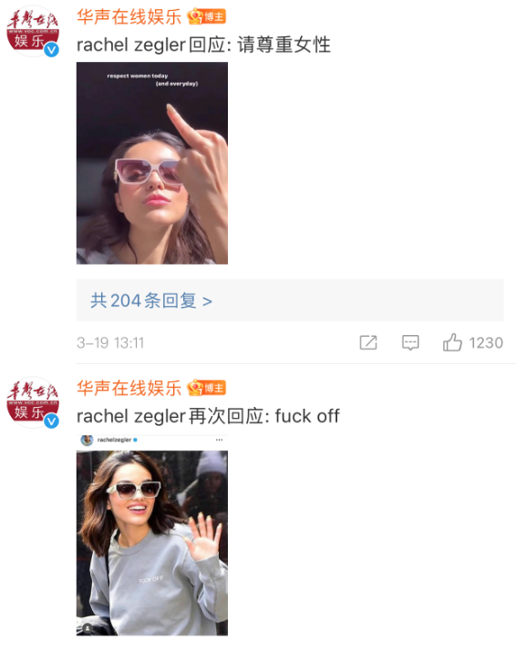
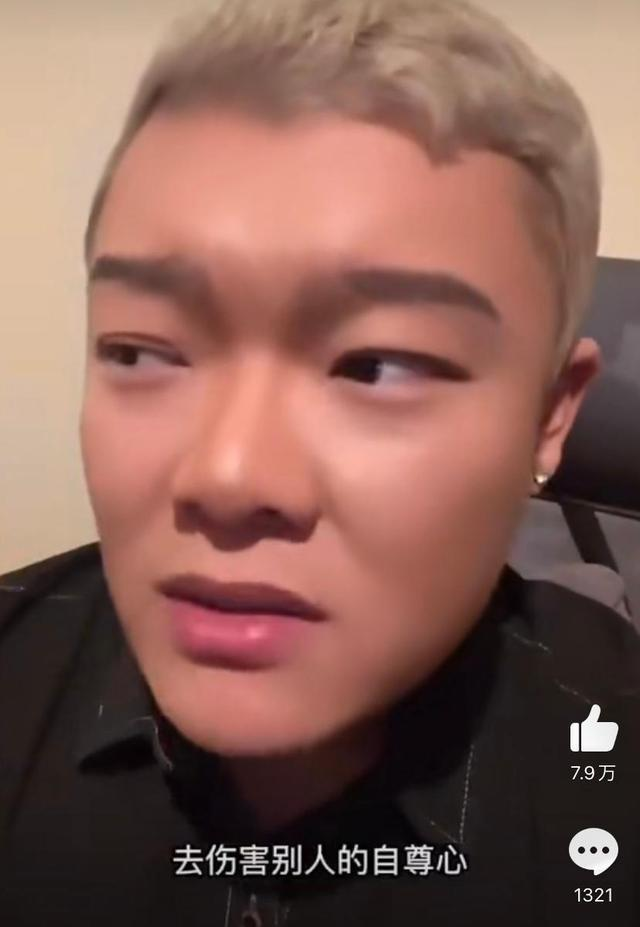
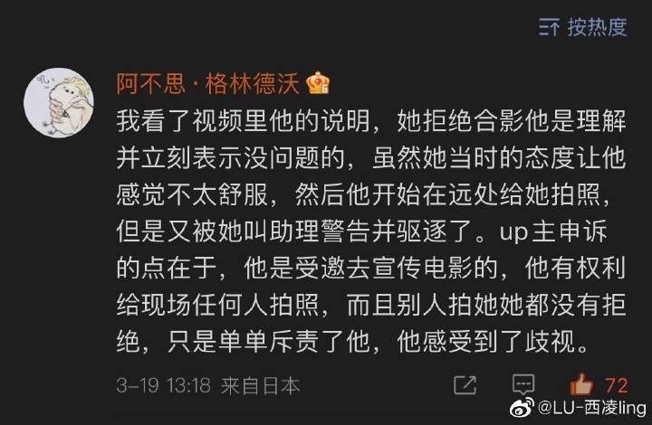
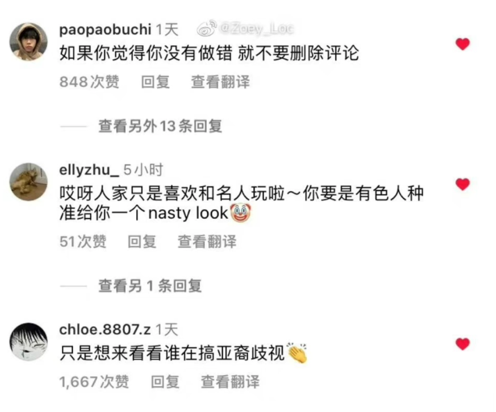

# 《白雪公主》女演员被指歧视华裔，并开始大面积删除中文评论

近日有华裔博主自曝在参加《雷霆沙赞2》宣传活动时，遭到迪士尼真人版电影《白雪公主》女演员Rachel
Zegler瑞秋的区别对待，Rachel不仅拒绝了他的合影请求，而且让助理警告威胁他不准再拍摄她。

对此，Rachel Zegler没有直接否认，而是回应称“respect women today”“fuck off” “they don’t build
the statues of critics”。

有网友表示，看了视频里华裔博主的说明，瑞秋拒绝合影他是理解并立刻表示没问题的，虽然她当时的态度让他感觉不太舒服，然后他开始在远处给她拍照，但是又被她叫助理警告并驱逐了。up主申诉的点在于，他是受邀去宣传电影的，他有权利给现场任何人拍照，而且别人拍她她都没有拒绝，只是单单斥责了他，他感受到了歧视。

此外，瑞秋的ins评论区遭沦陷后开始大面积删除中文评论，有网友反应连“你真漂亮”这种留言都会被删。

（华声在线娱乐、微博等）

编辑：赵珊珊

