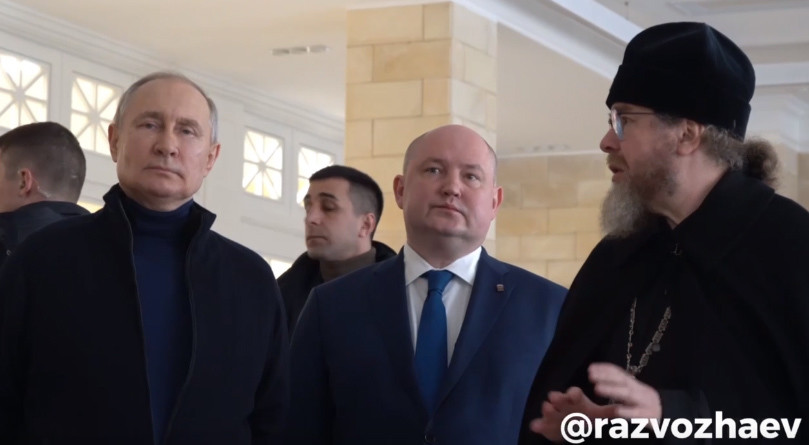
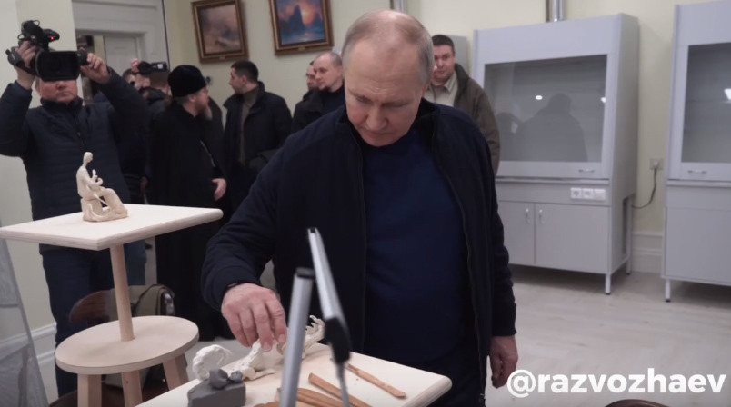

# 克里米亚“入俄”9周年之际，普京亲自驾车访问塞瓦斯托波尔

（观察者网讯）据俄罗斯塔斯社3月18日报道，在克里米亚“公投入俄”9周年之际，俄罗斯总统普京抵达克里米亚视察，并亲自驾车访问港口城市塞瓦斯托波尔，与市长米哈伊尔·拉兹沃扎耶夫一同参观当地新建的文化和教育设施。

拉兹沃扎耶夫18日在社交媒体上发文称：“我们的总统（普京）知道如何以善意的方式，给人们带来惊喜。今天我们要为一所儿童艺术学校揭幕，已经准备好通过视频会议和特殊的通信渠道向总统报告。但最后，总统亲自驾驶着汽车到来了。”

俄总统新闻秘书佩斯科夫此前曾表示，普京将会以视频连线的方式出席揭幕活动，因此普京的突然到来也出乎当地官员的意料。拉兹沃扎耶夫直言，俄罗斯拥有一位“令人惊讶”的领导人。

俄罗斯塔斯社报道截图

报道称，拉兹沃扎耶夫与俄罗斯东正教大牧首文化委员会主任、普斯科夫和波尔霍夫都主教吉洪（舍夫贡诺夫）一起，向普京展示了一所新建的儿童艺术学校和儿童中心，这是当地建设中的陶瑞克-
切森尼斯（Tauric Chersonese）历史和考古公园的第一阶段项目。

“这个想法由普斯科夫和波尔霍夫都主教吉洪提出，得到了总统的支持。在军事建设者的努力之下，项目正以令人难以置信的速度推进着。”拉兹沃扎耶夫说。

塔斯社提到，驾车来到塞瓦斯托波尔的普京并不像平日一样身着正装，而是穿着牛仔裤和深色外套。在视察的过程中，普京高度赞赏儿童艺术学校的建筑风格，称赞这一建筑群“太酷了”。

普京此次到访正值克里米亚“公投入俄”9周年。俄罗斯卫星通讯社称，克里米亚今年不会举办大规模的纪念活动，但会举行音乐会、体育比赛等活动进行庆祝。

当地时间3月18日，俄总统普京驾车到访塞瓦斯托波尔 视频截图

普京此次视察的儿童艺术学校是塞瓦斯托波尔的陶瑞克-切森尼斯历史和考古公园项目的一部分，这是当地规划的一个大型文化和教育建筑群。

报道称，该项目将在24公顷的土地上建造一座古典时代和拜占庭博物馆、一个国际考古中心、一个圆形剧场和一个重建的古城街区，该街区将包含博物馆、纪念品商店、景观公园、旅游中心和可容纳1380辆汽车的停车场等多个设施。

根据联合国教科文组织（UNESCO）网站的资料，陶瑞克-
切森尼斯古城的历史可以追溯至公元前5世纪，是古希腊的多利安人在黑海北岸建造的城市。这座古城曾是希腊、罗马和东罗马帝国与黑海北部居民之间的交流中心，至15世纪才在战争和经济衰退的影响下被废弃。

塔斯社称，切森尼斯古城是克里米亚最古老的历史遗迹之一，堪称“古典时代的纪念碑”。鉴于这一历史遗产的特殊意义，俄罗斯近年来在当地开展了大规模的考古发掘工作。

2015年，普京在参观陶瑞克-
切森尼斯博物馆保护区时就提议，在古城遗址附近建立文化和教育中心。2019年，吉洪向普京提交一份草案，要求成立工作组负责建设陶瑞克-
切森尼斯历史和考古公园，这一方案很快得到批准。俄政府预计，该项目的全部建设工作将在2024年完成。

塔斯社指出，普京上一次访问克里米亚半岛是在2020年7月，当时他参观了刻赤造船厂，出席了军舰的铺设龙骨仪式。2022年12月，普京还曾视察过克里米亚大桥的修复工作，并亲自驾车驶过桥梁修复后的部分路段。

**本文系观察者网独家稿件，未经授权，不得转载。**

