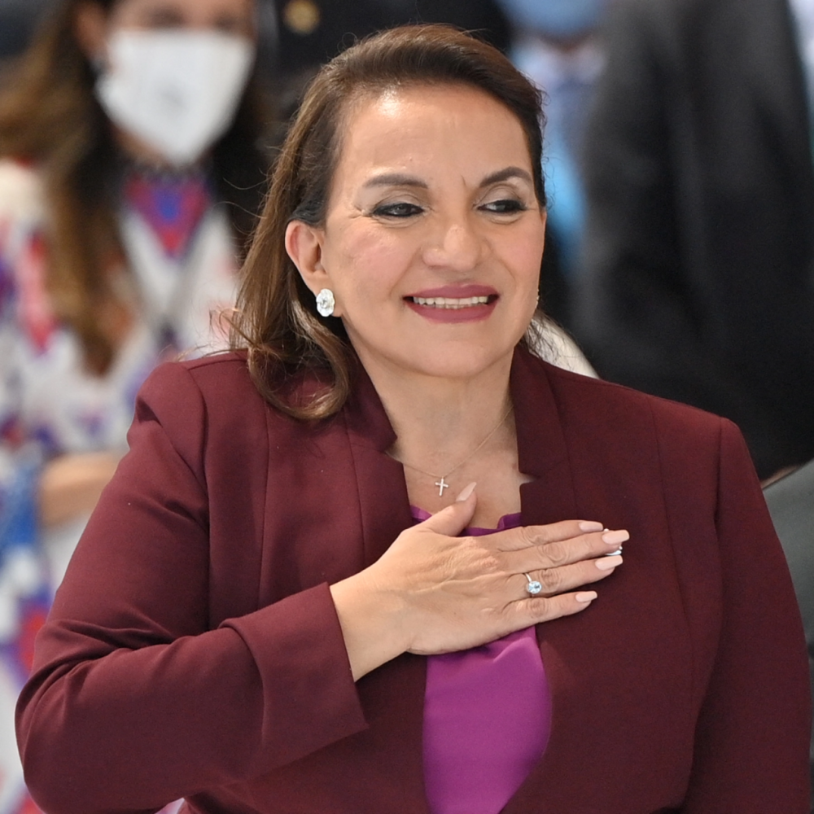

# 暗中使劲？外媒曝：美国在努力试图阻止洪都拉斯“转向北京”

【环球网报道 记者
张晓雅】洪都拉斯放风将与中华人民共和国建交引发的外交反应正在持续。路透社18日发表题为“美国指望洪都拉斯重新考虑涉华决定，希望取消”的报道说，知情人士透露，美国正试图阻止洪都拉斯落实其“转向北京”的计划，并期望暂未签署正式建交协议能为洪都拉斯回心转意保留所谓回旋的余地。

这显然是美国又一次想干预其他国家与中国的外交合作。

“我们真的不知道会是几天、几周还是几个月（内的事情），”一名美国政府官员私下对路透社声称，“这是一种谈判策略吗？我们不确定，但我们会继续表明我们的立场。”

与此同时，报道声称，另一个不同寻常的转折事件是，在洪都拉斯总统卡斯特罗宣布有关决定后，洪都拉斯驻台湾地区所谓“大使”哈罗德·布尔戈斯本周三会见了台外事部门官员，相比之下，尼加拉瓜驻台湾地区外事官员在该国2021年转向中华人民共和国时则拒绝这样做。

_洪都拉斯总统卡斯特罗 资料图_

事实上，洪都拉斯总统的举动15日已第一时间震动台湾。在时间点上，这一天是赖清德赴民进党中央党部完成台湾地区领导人初选登记的日子，外界认为远在中美洲的“邦交国”洪都拉斯给了民进党当局一记重拳。得知洪都拉斯的这一动向后，台外事部门还至少连发三条回应和澄清声明，并紧急将洪都拉斯驻台湾的所谓“大使”请了过来，面谈30分钟，据报道称气氛严肃。

美国国务院发言人普莱斯3月15日也曾就此声称，“洪都拉斯政府应该注意到，中国做过许多没有兑现的承诺”，他还宣称美方“将继续密切关注下一步行动”。美国的这一反应事实上与台湾当局震惊后抛出的所谓“大陆圈套”说法类似。这已经不是美国第一次试图在其他国家与中国合作时进行干预。去年，中国同所罗门群岛签署政府间安全合作框架协议后，美国官员组团去所罗门群岛指手画脚。中国外交部发言人此前表示，中方一贯主张国与国之间发展关系应秉持相互尊重、平等互利、互不干涉内政的基本原则。我们反对美方蛮横干涉别国内政的做法，这种行径不可理喻，也不可接受。

外交部发言人汪文斌15日在外交部例行记者会上表示，欢迎洪都拉斯方面的表态。汪文斌表示，世界上181个国家在一个中国原则的基础上同中国建交的事实充分证明，同中国建交是历史发展的大势和时代政治潮流的正确选择。中方愿在一个中国原则的基础上，同包括洪都拉斯在内的世界各国发展友好合作关系。

