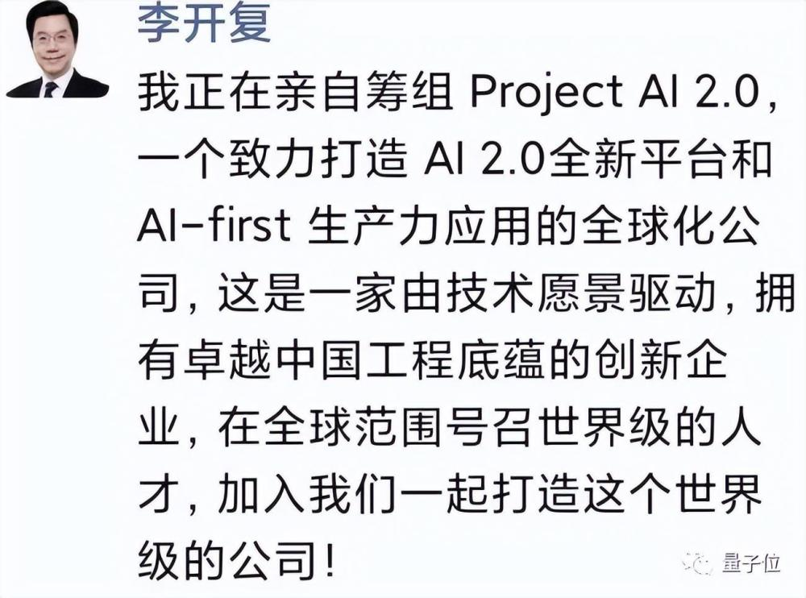
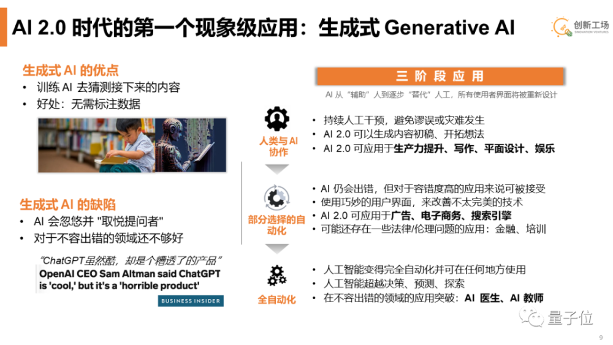

# 李开复宣布筹办新公司：不仅是中国版ChatGPT，全球招英才

丰色 萧箫 发自 凹非寺

量子位 | 公众号 QbitAI

李开复突然宣布筹办新公司，目标大模型领域。

新公司 **Project AI 2.0** ，正式开启团队组建。

要做啥？

新公司希望打造一个平台，一个生产力应用的生态。

Project AI 2.0不仅仅要做 **中文版ChatGPT** 。AI 2.0不仅仅是个高能聊天工具，也不仅仅是图文创作的AIGC生成，Co-
pilot和如今看到的应用都还只是AI 2.0能力的开端。

李开复认为，生产力工具的升级是一个巨大的机会：

很多人认为生成式AI的商业前景太小，是因为金融分析师没有考虑到AI 2.0不一样的收费模式。

有报告说，一个搜索要增加3美分，靠广告盈利模式会赔很多钱。短期可能如此，长期以往3美分的成本也会降下来。

值得关注的是，上一家李开复亲自带队、创新工场孵化的公司创新奇智，已经作为“AI+制造”第一股在港交所 **成功上市** 。

如今这家新公司的目标是什么，有何具体规划，又将如何开展下一步行动？

李开复亲自带队

Project AI 2.0，用官方的话来说，就是打造AI 2.0时代的平台及生产力应用生态，做成世界级公司。

与其他创企不同，新公司“资金和技术两手抓”。

一方面，工场正在与多个顶级投资人探讨首轮募资；另一方面，打造Project AI 2.0新平台，开启全球招人模式。

所以，公司目前筹备到哪一阶段了？

正在初期招人中，从 **大模型、NLP、多模态、算法到分布式架构/Infrastucture** 方向“全都要”。

据创新工场方面表示，目前“已有多位具有全球大厂带领大型团队的技术管理人才，确认了加入意向”。

在这一阶段，李开复会亲自带队，招揽全球人才；CEO到位后，再进行交棒。

至于公司路线规划也已经明确——十年技术蓝图已做好，而且未来还会考虑开拓全球市场。

事实上，Project AI 2.0已经是创新工场塔尖孵化的第7家公司。

塔尖孵化具体来说，就是先在策略层面设定特定技术主题，再深度挖掘该领域的专业人才、研究论文、跟踪行业最新动态。

李开复还在朋友圈中，激情回忆自己40年前提交的CMU博士申请信，表示“写了这段话的40年后，继续撸起袖子！”：

AI是人类认识并理解自己的最后一里路，我希望加入到这个全新绽放、充满前景的未来科学领域。

那么，吸引李开复再次组局AI的2.0时代，究竟是什么？

为何瞄准AI 2.0成立？

究竟什么是AI 2.0时代？

如果说AI 1.0时代是以 **深度学习** 为基础的人工智能大爆发，2.0时代就是以 **基础大模型** 为突破。

如你所见，高能聊天工具ChatGPT、基于StableDiffusion的AIGC应用等等，它们都是靠大模型“发家取胜”。

不过，创新工场表示，这些成果其实都只是AI 2.0时代能力的 **开端** 。

在新的2.0时代，会诞生 **比移动互联网大十倍** 的平台机会。

比如既有的软件、使用界面和应用都会被 **重写**
一次（如微软刚发布的Copilot功能，把Office全家桶工具变成“动嘴”就能用），也将诞生新一批AI-first的应用，并催生由AI主导的商业模式。

因此，创新工场在看到了这一缺口后，“毅然决定躬身入局”，创办Project AI 2.0。

这一举动除了决心，也有底气。

据了解，在此之前，创新工场核心团队曾参与过世界最大软件平台的构建，对平台成功的方法论有着自己的理解。

在AI 1.0时代，该机构就已投出十家独角兽，五年间则塔尖孵化出6家AI公司。

在宣布新公司创办之前，李开复已多次在演讲中强调AI 2.0是绝对不能错过的革命。

AI 2.0从“辅助人类”到“全程自动”，将会出现三个阶段：

第一阶段人机协同，生产力工具将会首先实现升级，所有使用者界面将被重新设计。在这一阶段，人类仍与 AI
保持协作，筛选和纠正AI创作的内容，避免谬误和灾难发生；

第二阶段局部自动，容错度高的应用和行业将会实现AI自动化，例如广告投放、电子商务、搜索引擎、游戏制作等；

到第三阶段全程自动，AI将变得完全自动化并可在任何地方使用，在不容出错的领域出现突破，AI医生、AI教师等应用成为可能。

